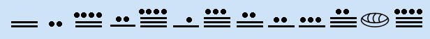
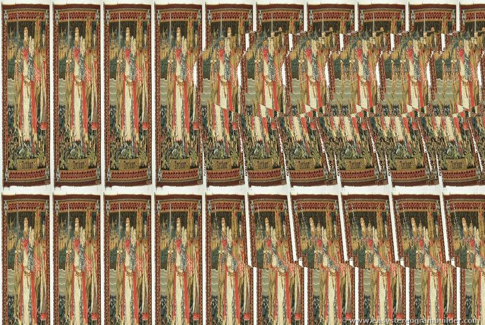
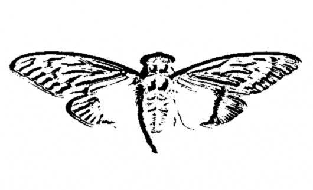
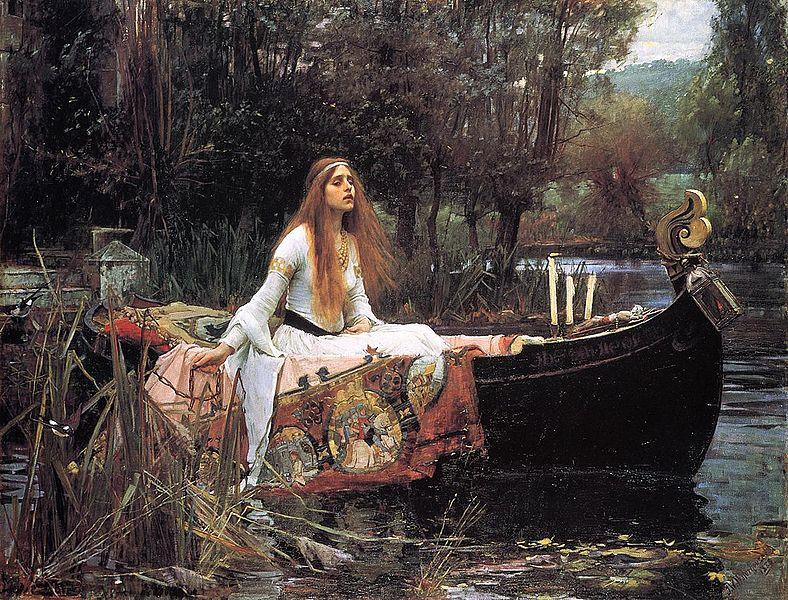
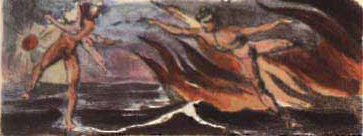

# 4-5th January 2012

# The Original Message

On the 4th or 5th January 2012, an image (http://i.imgur.com/1CcV1.jpg) was posted on 4chan's /b/ board with the message:

1CcV1.jpg:<br>
<p align="middle"></p>


      Hello.  We are looking for highly intelligent 
      individuals.  To find them we have devised 
      a test.
      
      There is a message hidden in this image.
      
      Find it and it will lead you on the road to
      finding us. We look forward to meeting the
      few who will make it all the way through.
      
      Good Luck.
      
      3301


* The dimensions are prime - 509x503.
* It is white text on a black background.
* The font is Futura.

# The Duck Decoy, The Caesar and OutGuess

When the image is opened with a text editor, the final line of text reads:

    $ tail 1CcV1.jpg
    [...]  TIBERIVS CLAVDIVS CAESAR says "lxxt>33m2mqkyv2gsq3q=w]O2ntk"

Using a Caesar cipher with a shift of 4 to the right, the text `lxxt>33m2mqkyv2gsq3q=w]O2ntk` is revealed to be a link 
to a second image (http://i.imgur.com/m9sYK.jpg).

The decoy duck on the image is an Autumn Wings Wooden Black Duck (http://autumnwings.com/store/p/26-Wooden-Black-Duck.aspx), 
the exact picture seems to come from the duck hunting shop Frost Waterfowl's 
website (http://frostwaterfowl.net/products/carved_decoys/carved_wooden_decoys.htm, [Internet Archive](https://web.archive.org/web/20220127072657/http://frostwaterfowl.net/products/carved_decoys/carved_wooden_decoys.htm)).
While the website itself looks old, it does not contain any information about the date of the picture.
Fortunately the exact same image was posted on http://christmas-89s0.blogspot.com/2011/03/carved-wood-ducks-pictures-wood-ducks.html,
at TUESDAY, MARCH 22, 2011.

The magenta spot is nothing special, it is part of the original image.


m9sYK.jpg:


The text on the image reads:

    WHOOOPS
    Just decoys this way.
    
    Looks like you can't guess how
    to get the message
    out.

There the part "**guess** how to get the message **out**" seemed to refer to the steganography software `outguess`.

Feeding `1CcV1.jpg` in `outguess` revealed a hidden message.

    $ outguess -r 1CcV1.jpg 1CcV1.jpg.out && cat 1CcV1.jpg.out
    Reading 1CcV1.jpg....
    Extracting usable bits:   29049 bits
    Steg retrieve: seed: 228, len: 535
    Here is a book code.  To find the book, and more information, go to http://www.reddit.com/r/a2e7j6ic78h0j/
    
    1:20
    2:3
    3:5
    4:20
    5:5
    6:53
    7:1
    8:8
    9:2
    10:4
    11:8
    12:4
    13:13
    14:4
    15:8
    16:4
    17:5
    18:14
    19:7
    20:31
    21:12
    22:36
    23:2
    24:3
    25:5
    26:65
    27:5
    28:1
    29:2
    30:18
    31:32
    32:10
    33:3
    34:25
    35:10
    36:7
    37:20
    38:10
    39:32
    40:4
    41:40
    42:11
    43:9
    44:13
    45:6
    46:3
    47:5
    48:43
    49:17
    50:13
    51:4
    52:2
    53:18
    54:4
    55:6
    56:4
    57:24
    58:64
    59:5
    60:37
    61:60
    62:12
    63:6
    64:8
    65:5
    66:18
    67:45
    68:10
    69:2
    70:17
    71:9
    72:20
    73:2
    74:34
    75:13
    76:21
    
    
    Good luck.
    
    3301

The message contains a Book Code and a link to a subreddit (https://www.reddit.com/r/a2e7j6ic78h0j/).


**m9sYK.jpg contains no outguess**<br>

    $ outguess -r m9sYK.jpg m9sYK.jpg.out
    Reading m9sYK.jpg....
    Extracting usable bits:   39682 bits
    Steg retrieve: seed: 16668, len: 51755
    Extracted datalen is too long: 51755 > 4961

<!--
# TODO: subreddit
-->

# The Subreddit, King Arthur and the Holy Grail
subReddit header:<br>
<br>

Welcome:<br>
<br>

Problems?:<br>
<br>

The subReddit was managed by the user `CageThrottleUs`. All posts were made by `CageThrottleUs` except for "Problems", which was made by the user `ImagoOnNib`. The post "Welcome" was made by `CageThrottleUs` but as an "official" post.<br>
The nick `CageThrottleUs` is an anagram of "**Charlotte Guest**", "*who is best known as the first publisher in modern print format of The Mabinogion which is the earliest prose literature of Britain*".<br>
The nick `ImagoOnNib` is an anagram of "**Mabinogion**".<br>
The Subreddit contains strings of text and also two images; "Welcome" (http://i.imgur.com/KXLOP.jpg) and "Problems?" (http://i.imgur.com/8D7hN.jpg).

Problems is a a [stereogram](https://en.wikipedia.org/wiki/Autostereogram) of a chalice made from images of King Arthur. Welcome and Problems each contain an OutGuess message.<br>

**Outguess of Welcome:**

    $ outguess -r KXLOP.jpg KXLOP.jpg.out && cat KXLOP.jpg.out
    Reading KXLOP.jpg....
    Extracting usable bits:   326276 bits
    Steg retrieve: seed: 58, len: 1089
    -----BEGIN PGP SIGNED MESSAGE-----
    Hash: SHA1
    
    - From here on out, we will cryptographically sign all messages with this key.
    
    It is available on the mit keyservers.  Key ID 7A35090F, as posted in a2e7j6ic78h0j.
    
    Patience is a virtue.
    
    Good luck.
    
    3301
    -----BEGIN PGP SIGNATURE-----
    Version: GnuPG v1.4.11 (GNU/Linux)
    
    iQIcBAEBAgAGBQJPBRz7AAoJEBgfAeV6NQkP1UIQALFcO8DyZkecTK5pAIcGez7k
    ewjGBoCfjfO2NlRROuQm5CteXiH3Te5G+5ebsdRmGWVcah8QzN4UjxpKcTQRPB9e
    /ehVI5BiBJq8GlOnaSRZpzsYobwKH6Jy6haAr3kPFK1lOXXyHSiNnQbydGw9BFRI
    fSr//DY86BUILE8sGJR6FA8Vzjiifcv6mmXkk3ICrT8z0qY7m/wFOYjgiSohvYpg
    x5biG6TBwxfmXQOaITdO5rO8+4mtLnP//qN7E9zjTYj4Z4gBhdf6hPSuOqjh1s+6
    /C6IehRChpx8gwpdhIlNf1coz/ZiggPiqdj75Tyqg88lEr66fVVB2d7PGObSyYSp
    HJl8llrt8Gnk1UaZUS6/eCjnBniV/BLfZPVD2VFKH2Vvvty8sL+S8hCxsuLCjydh
    skpshcjMVV9xPIEYzwSEaqBq0ZMdNFEPxJzC0XISlWSfxROm85r3NYvbrx9lwVbP
    mUpLKFn8ZcMbf7UX18frgOtujmqqUvDQ2dQhmCUywPdtsKHFLc1xIqdrnRWUS3CD
    eejUzGYDB5lSflujTjLPgGvtlCBW5ap00cfIHUZPOzmJWoEzgFgdNc9iIkcUUlke
    e2WbYwCCuwSlLsdQRMA//PJN+a1h2ZMSzzMbZsr/YXQDUWvEaYI8MckmXEkZmDoA
    RL0xkbHEFVGBmoMPVzeC
    =fRcg
    -----END PGP SIGNATURE-----
    
    $ gpg --verify KXLOP.jpg.out 
    gpg: Signature made 2012. jan.  5., csütörtök, 04.46.03 CET using RSA key ID 7A35090F
    gpg: Good signature from "Cicada 3301 (845145127)"
<br>

**Outguess of Problems:**

    $ outguess -r 8D7hN.jpg 8D7hN.jpg.out && cat 8D7hN.jpg.out
    Reading 8D7hN.jpg....
    Extracting usable bits:   256999 bits
    Steg retrieve: seed: 194, len: 1041
    -----BEGIN PGP SIGNED MESSAGE-----
    Hash: SHA1
    
    The key has always been right in front of your eyes.
    
    This isn't the quest for the Holy Grail.  Stop making 
    it more difficult than it is. 
    
    Good luck.
    
    3301
    -----BEGIN PGP SIGNATURE-----
    Version: GnuPG v1.4.11 (GNU/Linux)
    
    iQIcBAEBAgAGBQJPCBl3AAoJEBgfAeV6NQkPo6EQAKghp7ZKYxmsYM96iNQu5GZV
    fbjUHsEL164ZLctGkgZx2H1HyYFEc6FGvcfzqs43vV/IzN4mK0SMy2qFPfjuG2JJ
    tv3x2QfHMM3M2+dwX30bUD12UorMZNrLo8HjTpanYD9hL8WglbSIBJhnLE5CPlUS
    BZRSx0yh1U+wbnlTQBxQI0xLkPIz+xCMBwSKl5BaCb006z43/HJt7NwynqWXJmVV
    KScmkpFC3ISEBcYKhHHWv1IPQnFqMdW4dExXdRqWuwCshXpGXwDoOXfKVp5NW7Ix
    9kCyfC7XC4iWXymGgd+/h4ccFFVm+WWOczOq/zeME+0vJhJqvj+fN2MZtvckpZbc
    CMfLjn1z4w4d7mkbEpVjgVIU8/+KClNFPSf4asqjBKdrcCEMAl80vZorElG6OVIH
    aLV4XwqiSu0LEF1ESCqbxkEmqp7U7CHl2VW6qv0h0Gxy+/UT0W1NoLJTzLBFiOzy
    QIqqpgVg0dAFs74SlIf3oUTxt6IUpQX5+uo8kszMHTJQRP7K22/A3cc/VS/2Ydg4
    o6OfN54Wcq+8IMZxEx+vxtmRJCUROVpHTTQ5unmyG9zQATxn8byD9Us070FAg6/v
    jGjo1VVUxn6HX9HKxdx4wYGMP5grmD8k4jQdF1Z7GtbcqzDsxP65XCaOYmray1Jy
    FG5OlgFyOflmjBXHsNad
    =SqLP
    -----END PGP SIGNATURE-----
    
    $ gpg --verify 8D7hN.jpg.out 
    gpg: Signature made 2012. jan.  7., szombat, 11.07.51 CET using RSA key ID 7A35090F
    gpg: Good signature from "Cicada 3301 (845145127)"

The subReddit image header and *NOT* the title *BUT* the full name (`a2e7j6ic78h0j7eiejd0120`, which is hexadecimal) of the page are different representations of the same sequence of numbers:

    10, 2, 14, 7, 19, 6, 18, 12, 7, 8, 17, 0, 19, 7, 14, 18, 14, 19, 13, 0, 1, 2, 0

This string was the “key” that the OutGuess of “Problems?” mentioned. This key was required to unscramble the lines of text on the Reddit. Each letter of the scrambled text was meant to be shifted by the number corresponding to its location in the text. For example, you would have to shift the first letter ten steps down the alphabet, and the second letter two steps down the alphabet. This produces the "book" the book code is used with:


    King Arthur was at Caerlleon upon Usk; and one day he sat in his
    chamber; and with him were Owain the son of Urien, and Kynon the son
    of Clydno, and Kai the son of Kyner; and Gwenhwyvar and her
    handmaidens at needlework by the window.  And if it should be said
    that there was a porter at Arthur's palace, there was none.  Glewlwyd
    Gavaelvawr was there, acting as porter, to welcome guests and
    strangers, and to receive them with honour, and to inform them of the
    manners and customs of the Court; and to direct those who came to the
    Hall or to the presence-chamber, and those who came to take up their lodging.
    In the centre of the chamber King Arthur sat upon a seat of green
    rushes, over which was spread a covering of flame-coloured satin, and
    a cushion of red satin was under his elbow.
    Then Arthur spoke, "If I thought you would not disparage me," said
    he, "I would sleep while I wait for my repast; and you can entertain
    one another with relating tales, and can obtain a flagon of mead and
    some meat from Kai."  And the King went to sleep.  And Kynon the son
    of Clydno asked Kai for that which Arthur had promised them.  "I,
    too, will have the good tale which he promised to me," said Kai.
    "Nay," answered Kynon, "fairer will it be for thee to fulfill
    Arthur's behest, in the first place, and then we will tell thee the
    best tale that we know."  So Kai went to the kitchen and to the mead-
    cellar, and returned bearing a flagon of mead and a golden goblet,
    and a handful of skewers, upon which were broiled collops of meat.
    Then they ate the collops and began to drink the mead.  "Now," said
    Kai, "it is time for you to give me my story."  "Kynon," said Owain,
    "do thou pay to Kai the tale that is his due."  "Truly," said Kynon,
    "thou are older, and art a better teller of tales, and hast seen more
    marvellous things than I; do thou therefore pay Kai his tale."
    "Begin thyself," quoth Owain, "with the best that thou knowest."  "I
    will do so," answered Kynon.
    "I was the only son of my mother and father, and I was exceedingly
    aspiring, and my daring was very great.  I thought there was no
    enterprise in the world too mighty for me, and after I had achieved
    all the adventures that were in my own country, I equipped myself,
    and set forth to journey through deserts and distant regions.  And at
    length it chanced that I came to the fairest valley in the world,
    wherein were trees of equal growth; and a river ran through the
    valley, and a path was by the side of the river.  And I followed the
    path until mid-day, and continued my journey along the remainder of
    the valley until the evening; and at the extremity of a plain I came
    to a large and lustrous Castle, at the foot of which was a torrent.
    And I approached the Castle, and there I beheld two youths with
    yellow curling hair, each with a frontlet of gold upon his head, and
    clad in a garment of yellow satin, and they had gold clasps upon
    their insteps.  In the hand of each of them was an ivory bow, strung
    with the sinews of the stag; and their arrows had shafts of the bone
    of the whale, and were winged with peacock's feathers; the shafts
    also had golden heads.  And they had daggers with blades of gold, and
    with hilts of the bone of the whale.  And they were shooting their daggers.
    "And a little way from them I saw a man in the prime of life, with
    his beard newly shorn, clad in a robe and a mantle of yellow satin;
    and round the top of his mantle was a band of gold lace.  On his feet
    were shoes of variegated leather, fastened by two bosses of gold.
    When I saw him, I went towards him and saluted him, and such was his
    courtesy that he no sooner received my greeting than he returned it.
    And he went with me towards the Castle.  Now there were no dwellers
    in the Castle except those who were in one hall.  And there I saw
    four-and-twenty damsels, embroidering satin at a window.  And this I
    tell thee, Kai, that the least fair of them was fairer than the
    fairest maid thou hast ever beheld in the Island of Britain, and the
    least lovely of them was more lovely than Gwenhwyvar, the wife of
    Arthur, when she has appeared loveliest at the Offering, on the day
    of the Nativity, or at the feast of Easter.  They rose up at my
    coming, and six of them took my horse, and divested me of my armour;
    and six others took my arms, and washed them in a vessel until they
    were perfectly bright.  And the third six spread cloths upon the
    tables and prepared meat.  And the fourth six took off my soiled
    garments, and placed others upon me; namely, an under-vest and a
    doublet of fine linen, and a robe, and a surcoat, and a mantle of

The text is from The Mabinogion.<br>

When the the book code is used (the first number is the line, and the second number is the character in that line, full stops removed), a text is revealed:

    Call us at us tele phone numBer two one four three nine oh nine six oh eight


This was a telephone number: `(214) 390-9608`.<br>
<br>

# The Phone Number, The Message and The Primes

When `(214) 390-9608` is called a recording (http://www.youtube.com/watch?v=k24ZrFR2IUQ) plays which says:

    Very good.  You have done well.  There are three prime numbers associated with the original final.jpg image.  3301 is one of them. 
    You will have to find the other two.  Multiply all three of these numbers together and add a .com to find the next step.  Good 
    luck.  Goodbye.

The phone number has since been deactivated. The original image was 509x503 pixels, 509 and 503 are the other two primes. The product of 509, 503 and 3301 is 845145127.

# The Website, The Cicada and The Countdown

At the website (http://845145127.com/) there was on image of a cicada (http://845145127.com/cicada.jpg) and a countdown. 
The image of the cicada contains an OutGuess message.
The cicada is a Tosena splendida. The original image was a photo taken by the photographer Pascal Goetgheluck. 
The EXIF of the image on the photographer's website says "Date Time Original: 24. Apr. 2008 at 16:12:32".

http://www.goetgheluck.com/Tosena-splendida--Cigale_4218_51_42_RGP_2.html

http://www.goetgheluck.com/goetgheluck_imagettes/51/400_4218.jpg

https://www.sciencephoto.com/media/135640/view


    -----BEGIN PGP SIGNED MESSAGE-----
    Hash: SHA1
     
    You have done well to come this far.
     
    Patience is a virtue.
     
    Check back at 17:00 on Monday, 9 January 2012 UTC.
     
    3301
    -----BEGIN PGP SIGNATURE-----
    Version: GnuPG v1.4.11 (GNU/Linux)
     
    iQIcBAEBAgAGBQJPCKDUAAoJEBgfAeV6NQkPf9kP/19tbTFEy+ol/vaSJ97A549+
    E713DyFAuxJMh2AY2y5ksiqDRJdACBdvVNJqlaKHKTfihiYW75VHb+RuAbMhM2nN
    C78eh+xd6c4UCwpQ9vSU4i1Jzn6+T74pMKkhyssaHhQWfPs8K7eKQxOJzSjpDFCS
    FG7oHx6doPEk/xgLaJRCt/IJjNCZ9l2kYinmOm7c0QdRqJ+VbV7Px41tP1dITQIH
    /+JnETExUzWbE9fMf/eJl/zACF+gYii7d9ZdU8RHGi14jA2pRjc7SQArwqJOIyKQ
    IFrW7zuicCYYT/GDmVSyILM03VXkNyAMBhG90edm17sxliyS0pA06MeOCjhDGUIw
    QzBwsSZQJUsMJcXEUOpHPWrduP/zN5qHp/uUNNGj3vxLrnB+wcjhF8ZOiDF6zk7+
    ZVkdjk8dAYQr62EsEpfxMT2dv5bJ0YBaQGZHyjTEYnkiukZiDfExQZM2/uqhYOj3
    yK0J+kJNt7QvZQM2enMV7jbaLTfU3VZGqJ6TSPqsfeiuGyxtlGLgJvd6kmiZkBB8
    Jj0Rgx/h9Tc4m9xnVQanaPqbGQN4vZF3kOp/jAN5YjsRfCDb7iGvuEcFh4oRgpaB
    3D2/+Qo9i3+CdAq1LMeM4WgCcYj2K5mtL0QhpNoeJ/s0KzwnXA+mxBKoZ0S8dUX/
    ZXCkbOLoMWCUfqBn8QkQ
    =zn1y
    -----END PGP SIGNATURE-----
    
    Signed on 2012.01.07. 20:45 by Cicada 3301 (845145127) (Key ID: 0x7A35090F).
    The signature is valid and the certificate's validity is fully trusted.

At the designated time, the site changed to reveal a string of numbers.

# 17:00 on Monday, 9 January 2012 UTC
# The Coordinates, The Symbol and The QR Codes

<br>

On the 9th of Jan.  the website changed. (backup: http://web.archive.org/web/20150624035446/https://net-netz-blog.de/845145127.htm)<br>
The following text appeared:


    Find our symbol at the location nearest you:
    52.216802,		21.018334
    48.85057059876962,	2.406892329454422
    48.85030144151387,	2.407538741827011
    47.664196,		-122.313301
    47.637520,		-122.346277
    47.622993,		-122.312576
    37.577070,		126.813122
    37.5196666666667,	126.995
    36.0665472222222,	-94.1726416666667
    33.966808,		-117.650488
    29.909098706850486	-89.99312818050384
    25.684702,		-80.441289
    21.584069,		-158.104211
    -33.90281,		151.18421

OutGuessing the image of the cicada '''again''' produced the following result:

    $ outguess -r cicada.jpg cicada.jpg.out && cat cicada.jpg.out
    Reading cicada.jpg....
    Extracting usable bits:   19544 bits
    Steg retrieve: seed: 121, len: 1221
    -----BEGIN PGP SIGNED MESSAGE-----
    Hash: SHA1
    
    52.216802, 21.018334  
    48.85057059876962, 2.406892329454422 
    48.85030144151387,2.407538741827011  
    47.664196,  -122.313301 
    47.637520, -122.346277 
    47.622993, -122.312576 
    37.5196666666667, 126.995 
    33.966808, -117.650488 
    29.909098706850486 -89.99312818050384 
    25.684702, -80.441289 
    21.584069, -158.104211 
    - -33.90281, 151.18421 
    3301
    -----BEGIN PGP SIGNATURE-----
    Version: GnuPG v1.4.11 (GNU/Linux)
    
    iQIcBAEBAgAGBQJPChn7AAoJEBgfAeV6NQkPZxMP/05D9TkSpwRaBXPqYthuyqxx
    uo+ZDyr/yVIlAdurTBiWb3aGxKJjtWg/vlcHcatK0TGL2qaHwB/FFZQAaqOyU7Zf
    DXdpWr8PWoWhpWNYUK8IrOaYu1SmWlJnkTdUSzGrX0lbwjwMmJJoPNS7CJuO6MaA
    2GIwpv2G7lYqnH3xeX3kzGlPMsVb/wucKRjobsbdbreh1SNuQuRnhfe4s+oHTTqs
    XjtGL/VhBI0DUAdfLqW7z4C+Gvbx6okC8x5Sj2N2UTJOiyMYXz5+QyHoA6fo9g5V
    6zodNpx/RvxuZP2Ssc9TqERgTo5FjRBpON1vjDalHgg0H2Fus2LK3gh+NZfj1i5b
    Oqa4Cqd9epI2pe+glXn86j9crS+2BEAr1cguqAFepvI9sdFEornDja4VXwDtUdM8
    9hMVkU5NiTUYfvxZbL6W7rHIF7wxjGUwpe1ViuixG+cKNfv0enrt60PrtDByBOWI
    9LLIUE0cB5HDT1xrczZ/55CtuM3Zf07/l0nLFdmgR0oa8KUA9gWcPs6S1EpBa185
    VcyOTqbpIPiT8neiJEkXarbJeFk15m1P73Fr8XZxdj7EHK0aOwGYcc8e4PmW/dSh
    gcrSNXiePCbcRVRD2n9L47C0LkNyRpoBkmjvtpcRyp5ISe+0xcx/QI+gc1lkSijC
    89qV+ymCHae1RiSDxVbd
    =ZJ37
    -----END PGP SIGNATURE-----
    
    $ gpg --verify cicada.jpg.out 
    gpg: Signature made 2012. jan.  8., vasárnap, 23.34.35 CET using RSA key ID 7A35090F
    gpg: Good signature from "Cicada 3301 (845145127)"

These numbers refer to coordinates all around the world. At these locations the picture of the cicada and a QR code can be found.

Reapplying OutGuess on the cicada image produced a new message, containing co-ordinates, as well as two which were written on the website itself.<br>
Locations marked "FOUND" have had the clues recovered

    52.216802,          21.018334          --- Oleandrów 6, 01-001 Warsaw, Poland FOUND
    48.85057059876962,  2.406892329454422  --- 89-91 Rue de la Plaine, 75020 Paris, France FOUND
    48.85030144151387,  2.407538741827011  --- 36 Rue des Maraîchers, 75020 Paris, France
    47.664196,          -122.313301        --- 4739 University Way NE, Seattle, WA 98105, USA
    47.637520,          -122.346277        --- 514 Crockett St, Seattle, WA 98109, USA *
    47.622993,          -122.312576        --- 428 15th Ave E, Seattle, WA 98112, USA *
    37.577070,          126.813122         --- South Korea, Seoul, Gangseo-gu, Banghwa-dong, 830-8 *
    37.5196666666667,   126.995            --- South Korea, Seoul, Yongsan-gu, Seobinggo-dong, 287-1 *
    36.0665472222222,   -94.1726416666667  --- 853-899 W Dickson St, University of Arkansas, Fayetteville, AR 72701, USA FOUND
    33.966808,          -117.650488        --- 15717-15735 Euclid Ave, Chino, CA 91708, USA *
    29.909098706850486, -89.99312818050384 --- State Highway 407, New Orleans, LA 70131, USA *
    25.684702,          -80.441289         --- 8718-8798 SW 152nd Ave, Miami, FL 33193, USA FOUND
    21.584069,          -158.104211        --- 66-420 Kamehameha Hwy, Haleiwa, HI 96712, USA *
    -33.90281,          151.18421          --- 143 George St, Erskineville NSW 2043, Australia FOUND


# The Locations, The Links and The Poems

<br>
<br>
<br>
<br>

People checked out some of those locations and found notes attached to a lightpole with the cicada image and a QR-Code, which look like this. For some locations, no image is currently available.

* Warsaw, Poland: http://i.imgur.com/BxVYf.jpg
* Paris, France: http://i.imgur.com/XdNGo.jpg
* Miami, USA: http://i.imgur.com/cAuUz.jpg
* Either Arkansas OR Sydney: http://i.imgur.com/sppR9.jpg

The QR codes all link to unique URLs which all contain the same image of a circada, and the text “everywhere” and "3301". When decoded using OutGuess these images contain messages. Some images contain duplicate messages. Two messages have been found so far, 1 and 2.

Message 1 was was found from the Arkansas (http://845145127.com/935691396441.jpg) and Miami (http://845145127.com/876873892385.jpg) images:

    -----BEGIN PGP SIGNED MESSAGE-----
    Hash: SHA1
    
    In twenty-nine volumes, knowledge was once contained.
    How many lines of the code remained when the Mabinogion paused?
    Go that far in from the beginning and find my first name.
    
    1:29
    6:46
    the product of the first two primes
    2:37
    14:41
    17:3
    27:40
    the first prime
    2:33
    1:1
    7:45
    17:29
    21:31
    12:17
    the product of the first two primes
    22:42
    15:18
    24:33
    27:46
    12:29
    25:66
    7:47
    
    You've shared too much to this point.  We want the best,  
    not the followers.  Thus, the first few there will receive 
    the prize.
    
    Good luck.
    
    3301
    -----BEGIN PGP SIGNATURE-----
    Version: GnuPG v1.4.11 (GNU/Linux)
    
    iQIcBAEBAgAGBQJPB1luAAoJEBgfAeV6NQkP9oAP+gLu+FsRDf3aRcJtBkCOU2MX
    r/dagOTvCKWtuV+fedy0enWUZ+CbUjXOr98m9eq2z4iEGqKd3/MBXa+DM9f6YGUE
    jPum4wHtQDSJlZMazuYqJOVZGw5XmF25+9mRM6fe3H9RCiNDZpuXl3MzwdivYhcG
    B5hW14PcdHHteQf3eAUz+p+s06RDs+q1sNGa/rMQIx9QRe71EJwLMMkMfs81kfJC
    tCt21+8ud0Xup4tjUBwul7QCcH9bqKG7cnR1XWsDgdFP6a4x9Jl2/IUvp1cfeT7B
    YLS9W3lCM8thMemJr+ztQPZrpDlaLIitAT2L0B3f/k4co89v5X2I/toY8Z3Cdvoi
    hk0AdWzMy/XLDgkPnpEef/aFmnls53mqqe9xKAUQPMrI73hiJ+5UZWuJdzCpvt+F
    BjfQk15EJoUUW16K2+mBA1cSd+HJlnkslUTsjkq0E36XKChP+Cvbu/p6DLUMM2Xl
    +n3iospCkkHR9QDcHzE4Rxg9A435yHqqJ/sL2MXG/CY8X4ec6U0/+UCIF9spuv8Y
    7w66D05pI2u9M/081L7Br0i0Mpdf9fDblO/6GksskccaPkMQ3MRtsL+p9o6Dnbir
    6Z2wH2Kw1Bf0Gfx4VcpHBikoWJ5blCc6tfvT+qXjVOZjWAL7DvReavSEmW1/fubN
    C3RWcjeI4QET2oKmV2NK
    =LWeJ

    Signed on 2012.01.06. 21:28 by Cicada 3301 (845145127) (Key ID: 0x7A35090F).
    The signature is valid and the certificate's validity is fully trusted.

Message 2 was found from the Warsaw (http://845145127.com/316744223127.jpg) and Sydney (http://845145127.com/162667212858.jpg) images:

    -----BEGIN PGP SIGNED MESSAGE-----
    Hash: SHA1
    
    A poem of fading death, named for a king
    Meant to be read only once and vanish
    Alas, it could not remain unseen.
    
    1:5
    152:24
    the product of the first two primes
    14:13
    7:36
    12:10
    7:16
    24:3
    271:22
    10:7
    13:28
    12:7
    86:17
    93:14
    the product of the first two primes
    16:7
    96:4
    19:13
    47:2
    71:22
    75:9
    77:4
    
    You've shared too much to this point.  We want the best,  
    not the followers.  Thus, the first few there will receive 
    the prize.
    
    Good luck.
    
    3301
    -----BEGIN PGP SIGNATURE-----
    Version: GnuPG v1.4.11 (GNU/Linux)
    
    iQIcBAEBAgAGBQJPB/nmAAoJEBgfAeV6NQkPEnEQAKl5qtb3ZE5vs+c08KuzAi4a
    tQEE71fvb65KQcX+PP5nHKGoLd0sQrZJw1c4VpMEgg9V27LSFQQ+3jSSyan7aIIg
    SDqhmuAcliKwf5ELvHM3TQdyNb/OnL3R6UvavhfqdQwBXCDC9F0lwrPBu52MJqkA
    ns93Q3zxec7kTrwKE6Gs3TDzjlu39YklwqzYcUSEusVzD07OVzhIEimsOVY+mW/C
    X87vgXSlkQ69uN1XAZYp2ps8zl4LxoaBl5aVtIOA+T8ap439tTBToov19nOerusB
    6VHS192m5NotfQLnuVT4EITfloTWYD6X7RfqspGt1ftb1q6Ub8Wt6qCIo6eqb9xm
    q2uVzbRWu05b0izAXkHuqkHWV3vwuSfK7cZQryYA7pUnakhlpCHo3sjIkh1FPfDc
    xRjWfnou7TevkmDqkfSxwHwP5IKo3r5KB87c7i0/tOPuQTqWRwCwcWOWMNOS7ivY
    KQkoEYNmqD2Yz3Esymjt46M3rAuazxk/gGYUmgHImgcu1zzK7Aq/IozXI7EFdNdu
    3EoRJ/UL9Y0l0/PJOG5urdeeTyE0b8bwgfC2Nk/c8ebaTkFbOnzXdAvKHB03KEeU
    PtM6d6DngL/LnUPFhmSW7K0REMKv62h9KyP/sw5QHTNh7Pz+C63OO3BsFw+ZBdXL
    hGqP6XptyZBsKvz2TLoX
    =aXFt
    -----END PGP SIGNATURE-----
    
    Signed on 2012.01.07. 08:53 by Cicada 3301 (845145127) (Key ID: 0x7A35090F).
    The signature is valid and the certificate's validity is fully trusted.


# The TOR Website - sq6wmgv2zcsrix6t.onion

The poem in this (http://pastebin.com/r5L2YrXK) pastebin was found to be "Agrippa" by William Gibson (http://www.williamgibsonbooks.com/source/agrippa.asp). Applying the book code a TOR address was revealed: `sq6wmgv2zcsrix6t.onion` (sq6wmgv2zcsrix6t.onion/cgi-bin/get_email) which led us to: http://sadpanda.us/images/806863-U0BL8MJ.jpg<br>
<br>
The site contains instructions to enter an email address:

    <html> <head><title>Welcome</title><style>body{font-family:helvetica,arial,sans-serif;}</style></head> <body><pre>
    -----BEGIN PGP SIGNED MESSAGE-----
    Hash: SHA1
    
    Congratulations!
    
    Please create a new email address with a public, free, web-based service.  
    Once you've never used before, and enter it below.  We recommend you do 
    this while still using Tor, for anonymity. 
    
    We will email you a number in the next few days (in the order in which 
    you've arrived to this page).  Once you've received it, come back to this 
    site and append a slash and then the number you received to this url.  
    (For example, if you received "3894894230934209", then you would go to 
    "http://sq6wmgv2zcsrix6t.onion/3894894230934209")
    
    3301
    -----BEGIN PGP SIGNATURE-----
    Version: GnuPG v1.4.11 (GNU/Linux)
    
    iQIcBAEBAgAGBQJPCikYAAoJEBgfAeV6NQkPtCkQAIEa2HC20SduG8zWtH/0LSJ9
    dnQLfjTI/MAPsnp0KXpzcQJ4p2UbNdRb5qtqp3HZQ5qwKK3b/MT+2eB5X+h5q5v/
    bVOsPKXN7W+krTi8a2v5KA1fRj8mKcFTXkx9hdq6z6qeePVpeOGXeitU0jgO4uXu
    1N9hor4AQFQoXvuELnlqS4YX+/nNgK+Y1Vu1ekvyn9LusidMpSxS/ciiZLD5d3Tl
    TJeUOQzdw9TlUmmdeigfBRoqZDnm5UESnS8qS1vd7zg9Ulpw2GfCV8QQl0zWp0lS
    KCrArG0Qg4K4shZRQ2BopGM95oFVw2pOnzYr9pp8kpipBWQ6URRF7IEcuG1k5fBt
    sfiz7Eb7WWr4Cwk/1Ri625FMyo0Z2KDc1Wo8nkFXZ0/Xle6tyyhhJUZGRbZuHLau
    LR5+oQEKKYTRrJFNhqswcXYsCQBBYM2XS+v3nbmTDVKyGNmMpp3/yC/RR91hQ7fr
    FqMd5qHKSD0pc5tU5G29J+Ez3CDVN7E60Xy3I1I5ugGE8GP5DmqHn4k/x272lroX
    BtiIRTh4f+ghcC6DLdPBclPRAfLtRbpVR3GVTSCJ/EwBZrH4QJTEGcuXfPQryHbF
    0BO795yyXxM6lQ9QnU4dkAAQepKLHgcvDlrEJYJzMWo+BOCu7MChoOyo1Zq4eeuI
    cPx04KJd4sGtMVWolA3/
    =zGQW
    -----END PGP SIGNATURE-----
    </pre>  
    <form action="/cgi-bin/get_email" method="post"> 
    	Email Address: <input type="text" name="email" value="" /> <br />
    	<input type="submit" value="Submit" /> 
    </form> 
    </body> 
    <html>
    
"Several days passed with no word, until people started reporting email arriving. All reported it only once, before dropping out of the collective solving all together."<br>
(Continued in the section "*The Mail*".)
# 2012.01.12. - 845145127.com changed again
On January 11th, 2012, someone discovered that 845145127.com had changed. The coordinates and image of the cicada were no longer on the website, the page was blank instead. The source code of the website contained only tabs and spaces.


    <html><head><title>845145127</title></head><body><pre>
    		 	  	 		 	  	 		 	  	 		 	  	 		 	  	 	 				 		 			 	 	 			   	 		 		 	 		   			 						 	 					 			   	 	 						 						 	 		  	 		 		 	 			   	 		   		 			 	 	 			 				 						 		  	 	 			 	 	 	 		  	 	 		  	 					 	 			   	 			 	 		 	  	 		 	  	 		 	  	 		 	  	 		 	  	 
    	 		 				  				 	   		  	  	 					   	 			 						 	 		  	 		 				 					 		  			 
    
    		  			 		  	  			  		 			  	  			  	  			  	   		  		 			  			 		  		 			   					  	 	 		   					 					
    		  	 				  			 		  	 				   		 		  	   		  	 				  		 			  	 	 		  		  		   					  	  			  		  
    		  	 	 		   		 		   					   					  	 	 		  		 			  			 		  	 				  		 			  	   		  		  		  	 	 
    		   					  	   		  	  			   					  	   		  		  		   					   		 		  		 			  		  		   					  	 	 
    		   		 		  		  		  	 	 		  	  			   		 		  			 		  		  		   		 		  	  			  	 				  	 				  			 
    		  		  		  			 		  	  			  	   		  	 				  	 				  		 			  		 			  		  		  			 		  		 			  	   
    		  	 				  		 			  	   		  	 	 		  	  			  	  			   					  	 				  	 				  	  			  	  			  		  
    		  	  			  	 				  	 				  			 		  	  			   		 		  	   		  	  			   		 		  	 				   					  		 	
    		   					   					   		 		  		 			   		 		  	  			  	   		  	 	 		   		 		  		 			  	  			  		  
    		   		 		  	  			  		  		   					  	 				  	  			  		 			  	 				  	 				  		 			   					  			 
    		 	  	 		 	  	 		 	  	 		 	  	 		 	  	 	 				 		 			 	 	 			   	 		 		 	 		   			 						 	 					 			   	 	 						 						 	 		  	 		 		 	 			   	 		   		 					 	 	 	 			 	 	 	 	 	 		 		 			 	 		 	  	 		 	  	 		 	  	 		 	  	 		 	  	 
    	 	 	  		  		 	 	   		 		   		  	  	 		 	  	    	  	   			   	 			 						 			   	  	   		   	 	 	 	 					 			   		 						   	  			  			 		 	   			  	 				 	   			  			 		  			 		 							 	 				 			   	 		   		 	 	 	 		 	    	 		  			  	 		 	  	   		   	 	 	    					 	 		 
    
    	  	 		 	 	 			 	 		 		 	  			  	 				 		 					 	 			 	 	 				 		 					 	  		   	 					 	 			   	 				 		 	 			 	 		 	 		 	 					 			 			 	 		 		  	 	  	   	  		 					 	 					 	  	    	 		 	 		 			 	 	 				 		  		   	  		  		 					 	  		 	 	 	 	  			  	  		 		   		 	 			 	  	 	  	 	 					 	 	  		   	 	 	 		  	 	 	 						 	    		  		  	 	  	 		    		 	 					 	  		   	   	   	   		  	  	 	  	  	    		 	    	 				 			  		 		 	 	 				   		 	 			 	 	   	   		  			 	    		 	   			 	 					 	 		 	  	 	 	  		    		 
    	 		 	  		   		 		 	    		 	    	   	   	 		 		 	 	 	   	 				  	 	 		 		   	  		 		  	 	    		 	 	  	 			  	 			  	 	  		  	   		   		 	 					 	   					   			 	   	  		 		    	 		 	 		 					 	  	  			  		 	 	    	 		  		   	 		 				 	 	 			   		  	 					 	 		  	 		   				 	  				 			   		 	    	 		 		 		  	   		  			 	  			 		 					 	 			   		 	 	  		  		 		   	   	 		  	 	 		    	 	  				 		   		 		 	 		  		  		 	 	 			  	 	 			 	    	 	 		  	 			  		 		    	 		   		 			 	 	 			 	 	  			 		 	 		  		  	 	 
    	 				 		 		    	   						   		 	 	 	 	 	 	 						  	   	 		  			 		 				  	   			  			 	  	 	 			  		  	 		   		 		 	  	  	    	 			 	 	 	 		  	   		 		 			 			    	 		   		  	 		 	  	  		 				 	 	  	   	 	 		  		  	  	    	 		 				  	    	 		   		  	   		  	 				   		  		  	  			  		 			   				  				 	 		  			   		 		  			  		   				   	 	 	 			 			   			 	  			 		  	   			 	    		  	  		 			 			 		   		 	 	 	 	  	   		 		    	  			 		   	 	 		  	 	 	 	 	 			  	   			  		  	   	 	 	  	   		   	 	 		  				
    	    	 		 	  	 			  		  	 		   		  	 	 		 	 		  	   		  		 	    	 					 		  	 	 	 	 			 	 	 			 	 	  					   				 		    		  	 	 		  	  		 	 		 		   		  	 		 	  		   					  			 	  		 	 	 	 		  	 		 	 			  		 		  		  		  	 		 	  		  		  			 		   		 			  	 			 		   		 	  		 	  		  		 		 				 				 		  		 	 	 	 	 	 	 	 	 			  		 	 	 	 	  		  		 	 		  			 		  	   	  	   		   		  	   		 			  	 				   				 	 	   	 	 			 	 		 		 		  	   	   			 	  			  		   		 	 	 	 	 	 	 	  		 	 	   	  	  			 	 					   		  	 		  	 
    		   		 		  			 	 			  		 	 	   	   		  	   	  		  	 				 	  					 	 	  	 	 	   	  	    	  	 				 	  					   				 			 			    		 	 			  		 	 	   	 		 	 		  	  	 	   	 			    	 			  					  	  			 		  			   	  		  	  	 	  	 					  		  	  	 	 		 		   			 	 	  	  	    	 			 	 		   				 	 	   	 			  		 	 					 	 	 			 	 	  		  			 		  			  	 	 	  		 				  	 		  	 		 	 	  	  		 	 	  	 		 	 			 			   	 				  					 	 	 			   			 	  	 	  	 	 	 	 	 		   		  	  			  	  	 	   			 		 	    	  		  		    				  			 		  		 		
    	 	  					  		 		 	 		  	  			 		   		  		   				    	 		 		  	 	    				 			 			 	  				 		   		 	 			 	 	 	   	   		 		   	   		  	 	 		   				 	 	 			  			  	 	 		  	 				  		  	  		  	    	 		  			  		  		 	  				 	 		  	 	  				 	  	 		  	   		  	 	 		  	 					   				   	 	 	 	 	 			 		  	 	   	   	   		 		 	 			 		  					   	 			 		   		  		 			 	 		 		 	  				 		 				 			 			  	   		  		 			  		   	 	 					  	 		 	   	 	 	   		 		 	  				    	 			  	  			  		 		 	  				  	 	 		 	 	  		  	 	 		  		  	
    		  	 			 					 	  	 				 	 		  	 	  				 				 		  	    	 	  				 			  			   		 	 				  	 		 				 	 	 			 		    	    		 	 			   	 			   	 			 	 	   			 	   	  		  		  		 		   		   	  		 			  		 		  	 	 		 	  	    		 	    	 			   		 		  	  			   				  	 		 	 		  	 	 	  	 		 			 			 	  				 			 			 		   		 				 		   		 		 		  	 		   				   					  	 	  	    				    					  			 	    				 				 		 		 				  	 				 					 	  	   		  	    	 			 	 	    	 		  	   		 	 	  		   					  		 	 	 		  	 	  	 				 		 		 	 		 		 
    		 	 	  	 		 		 	  		  		 				 		 	 	 			  	   		 	 	  			   				    					   		 	  	  			 	 		  	 		   		  		   	 			  		  	 				  	  	 	  	 				  				 	  	  	 		  	 	 	  		 	 	 			 	 	 	  	 		  	  			 	 	   	   	  		   			 	 	 		 		  	 		 	  		 			   			 	  		 	 	   		  		   				 			 	 	 					 	   		 		  	 		 	   			 	 			   	 					 		  	  		   	 	 	 	  	 		  	    	  	 	  	 				  	   			 		  	   	 	  					  			 	 		 		 	  		 	 	 		  	 	 		 				  	    		  	 	 		  		 		 					 	 				  	 	 	   	  	  	 	 	 				
    		  		 		  			 		 		 	 		   		  	 				  	 	 	  			  	 	 	   	   	 	  	 		 			 			  			  		  	 	 		  		 		  			  		  		  	 		 	 		  	   		   	   	 		 	  	  		 	 		 	 	  	  			  	 					 	  			  	  			 		   		  	 					 		  	 			 		    	 	 	   	 				  	 		   		 			 	 	 		 					  		 			   		 	  	  			 					 	   		  	  		   	 			  		   	   		  	 	 		  						  	   		   		 	 				 		 	 						   				  	  			  	 	  	   					 	  		 		  		  	 					 	 		 					  		 			 	 	  		   				  	 	  	   			 	   		  		  					 	  			
    	 	 			 	   	  		   			 	   		  	  				 	 		  	 	   	 	 	 	 	 	 	   			 		  	 	 	 	  	 		 		 				 			 	 	  				 	 	  	 		 		  	 	  		   	  		 			 			 				  					 	 	  		 		 	  	 	  		 	  	  			 	 		 		   		 		 		 	  	  		 			  	 				 		    	  	 		 	 			 			  	 	 		   	 			 		 	 		 	 	  		    				  	    	 	  				  	 	  		  			 	  			 			  	   	 	  		 	 				 		 		    	 	 	  			   				  		 			 	  	 		 	  	 		 				 		 	  				 		 	 		  			 		 			 	 	 		 		 	  			 		 	 	 			   	  		  				 	  	    	  		  			  	 		
    	    		 	  	 				  		   	 	 	 	 	 		    	  			 		  	    	   	  		    					 	    	 	 	  		 			  		 			   	  	  	 	   		  	  		 	 	  	   		   						 	 	  	  	 	 			  		  	  	   		 				 		 				  	    				  		   	 			 	 	 		    		  		 			  		 		 	 		  	  		   	 		   		 	 	   		  		  	 				 			  		  	   					 		   			  					    		 	   	 	 	 		 		 	 		  	 	 				  	   			 	  			  	  			  	 	 	   	 			 	 	 	  	 			  			 	  	   		 		  	 	 			 	 		 	    	 	 			 	 		    	   	   	 		  			  				 		   					  	 	 	  	   	
    	 		 				 		    	  	  	 	 			 	 	  	  			 		 		 	 	  				   	  		 		 	  		  			 		  		  	 	 			 		   		 	  	  	 		  	 	 		  	 				  	 	 	 	 		 		   	 			 	 				
    		    	 	 	 			 		  			 	 			  		    		 
    		 	  	 		 	  	 		 	  	 		 	  	 		 	  	 	 			 	 	 		   		 			 				 						 	 					 			   	 	 						 						 	 		  	 		 		 	 			   	 		   		 					 	 	 	 			 	 	 	 	 	 		 		 			 	 		 	  	 		 	  	 		 	  	 		 	  	 		 	  	 
    </pre></body></html>


These can be treated as binary and decipher it to find another message:

    -----BEGIN PGP SIGNED MESSAGE-----
    Hash: SHA1
     
    162667212858
    414974253863
    598852142735
    876873892385
    935691396441
    316744223127
    427566844663
    644169769482
    889296759263
    963846244281
    -----BEGIN PGP SIGNATURE-----
    Version: GnuPG v1.4.11 (GNU/Linux)
     
    iQIcBAEBAgAGBQJPDRkvAAoJEBgfAeV6NQkPVuMP/3ZyAgwsko/B2T9Ew1yqAKVy
    K9//wIWCRvMyZ4k79ApqvOJAlezgHTsAM8XG/I71bAG+2wMOXNJfTj/SFONEEbS5
    BOp9UP7LHn1j3NKoESrDzsKd+u3oHoNnhs628aLrc8uDqbn/6DNUnObu5Tn3unu0
    zZ3NjSs/A5QQX8O56RsK81eSJ2fifbr4NYfHBeUTeVe17nsr48WQI7qc9UVWlPsM
    91FWsvhX+WohX8DyFWJmtz0lLvmh3jN+oE8WFPTVbcVCM+eiDt0TqkUNlmq/fxbd
    X2Sbs8zMxDXNQWrw58TcSC6oLfXSXZnjh8uTMwrQ0tNdRXHDndgPiurXz62XjVjf
    4AhSXBoXF9CHTOyGGEqvfNvFMKyz968iMZDXDNBrM8pkxx1xBHhAnoEznVpeMhII
    +IfBTnV8x9lSNgFhmham5eEZlWvqRidqes8EAriqGA6uZokCq7X1IeMHo52ACWmP
    2bJsCV5wZDc52c3JnwKe+cAcbsA4OWCNEH29lAsgFw5079BP8lkpY3AH2+8kqs0X
    QvqsaMuUq5ZHEaZMgdD0VKYlRrKdhOiDjtJVxoXk1b7YBOV8dZZBXJbEIbTvaof4
    yhgUObovx/VFGmsenp+j3nBCxgEO22SgNW3B3pN0yuIMCqccWEZ1nME/QOwLa85n
    HOmElIXvK13Q9m545RtP
    =Q1Fy
    -----END PGP SIGNATURE-----
    
    Signed on 2012.01.11. 06:07 by Cicada 3301 (845145127) (Key ID: 0x7A35090F).
    The signature is valid and the certificate's validity is fully trusted.

Note how this message doesn’t have the characteristic “3301” signoff at the bottom.<br>
<br>
Verification of PGP sig - 

    gpg: Signature made Wed Jan 11 09:07:59 2012 GST using RSA key ID 7A35090F
    gpg: Good signature from "Cicada 3301 (845145127)"
    gpg: WARNING: This key is not certified with a trusted signature!
    gpg:          There is no indication that the signature belongs to the owner.
    Primary key fingerprint: 6D85 4CD7 9333 22A6 01C3  286D 181F 01E5 7A35 090F

Note that the signature was made on the 11th of Jan, which means that it was made on the day the website changed.<br>
The numbers were found to correspond to image URLs, which when OutGuessed, would provide the same messages as the OutGuess of the QR codes (see section "*The Locations, The Links and The Poems*").<br>
<br>
Finally the DNS entry of `845145127.com` was changed to `127.0.0.1`, and the previous IP (`75.119.203.244`) stopped responding to pings and TCP SYNs.

# A Second Chance
<br>

Some time after emails were sent out to participants who put in their emails on the first Onion, someone (`n_`) posted the URL `1853143003544.tk` in a chat room on `n0v4`. This URL was the sum of the largest picture name on the QR codes for each book code:

    29-vol:
    162667212858, 316744223127, 414974253863, 427566844663, 598852142735, 889296759263
    
    fading death:
    644169769482, 876873892385, 935691396441, 963846244281

The TXT record for the website said “Go to my largest part”. The largest prime factor of the number in the URL was `33091839349`, so solvers went to `33091839349.tk`. The website's DNS entry contained no TXT, and the site itself was some HTML with a black background and this picture: http://i.imgur.com/NHYLD.jpg. (Please note that at `http://i.imgur.com/NHYLD.jpg` sometimes a car appears now.)<br>
This picture is The Lady of Shallott, a painting by John William Waterhouse. The painting takes its name from Alfred, Lord Tennyson’s poem of the same name, which, interestingly enough, also deals with Arthurian subject matter.<br>
Outguess:

    -----BEGIN PGP SIGNED MESSAGE-----
    Hash: SHA1
    
    Miss round 1?  
    Care for a second chance?
    http://i.imgur.com/hkdgl.png
    1:22
    3:33
    3:40
    6:19
    4:7
    4:8
    4:7
    9:23
    12:12
    4:16
    16:7
    11:16
    1:7
    5:14
    3:35
    2:2
    4:26
    1:12
    3:11
    3:28
    4:23
    18:18
    
    Good luck.
    3301
    -----BEGIN PGP SIGNATURE-----
    Version: GnuPG v1.4.11 (GNU/Linux)
    
    iQIcBAEBAgAGBQJPDTiqAAoJEBgfAeV6NQkPytAP/1UQeylwYBjQWuzr8pbERN04
    wlZVCG5SjGanqfQKxSa5Z8YOVR9LRlT6sHBKgfOEDztj+6RM2SvX7Y2Mw9mA4g90
    7bizXi8IkP5K3tMvNxcA6uEy0rSchJt4D93zzjPvS7lm6jGO1gJQXrwMUd4fACs1
    hxZ3Cxva0MIS+r8MxRJbU/mKbDvnEr6fwUaB6m1vFgYW6wTM4qS2ES04ic+mlkbR
    0/eRPnFIBb06XjQpijDAGiisgVORaUUrUJGX+Wnp61CVobBmKwUdw3n0AxbKRC3/
    Nja0HYvXexWDiRgxE2YjZyq0Pk4TnZoXxTnyS6NKZ1i1Qxysu4xUfuLO3L6zrnQP
    TT4EsqDxzMAKQuJS6qo/pLsdCqyXO1Jr4wIlaG5AGYKMjt9k61Y12WLiqhpLTgzd
    AtUTejZzThXqbhmm4wPCVk+Vsik8PLs/Ts6DooB3Ki3AtRtldmeCXdo+mid3Og+A
    IKw9+KtB2JDd4a6DbsNbRDIt1pZmyPA3xmmksc8ogx/CEPATPwL7JaN5UwVNSZKM
    6MiJ1+b39Kx9ckQ8vSuYa5cALDiUwZPddopl29zbVmKciW+sDGfSiSroXw7khNJs
    dzmJ4hR2R7Bbv23Ngxt/M/J5/udOd0AaeDKMxfLNnaLqm8FiaWqnL5TwkzMFnad7
    RKpOZq9TkllIE6NBB4wc
    =mGcB
    -----END PGP SIGNATURE-----
    
    Signed on 2012.01.11. 08:22 by Cicada 3301 (845145127) (Key ID: 0x7A35090F).
    The signature is valid and the certificate's validity is fully trusted.

<br>

The image (i.imgur.com/hkdgl.png) is related to William Blake's The Marriage of Heaven and Hell (http://www.gailgastfield.com/mhh/mhh4.jpg), which is the book for the book code. Solving this bookcode using this (http://www.gailgastfield.com/mhh/mhh.html) led to another Onion similar to the first one where participants were asked to enter their email addresses: `cginiziglyaobyph.onion`.

# 2012.01.15. - The Mail

[Those who applied early enough on `sq6wmgv2zcsrix6t.onion` or followed the 'Numbers dot TK' hint (and entered an email address on `cginiziglyaobyph.onion`?) were greeted with this email?:] - or maybe not<br>
Submitting (?) the number on `sq6wmgv2zcsrix6t.onion/NUM` showed this message:

    -----BEGIN PGP SIGNED MESSAGE-----
    Hash: SHA1
    
    
    This message will only be displayed once.
    
    Here is a message that has been encrypted with RSA (the Crypt::RSA Perl module available in CPAN) :
    
    - -----BEGIN COMPRESSED RSA ENCRYPTED MESSAGE-----
    Version: 1.99
    Scheme: Crypt::RSA::ES::OAEP
    
    eJwBzQAy/zEwADE4OABDeXBoZXJ0ZXh0B4KeBtKjJ7hGKC7/zqyzxUoFDTzRuU4+TLFUrw9qDGjk
    YI3fjyMn3G/w9WcfkZMGHdGRicbpTsDO3/oqmVtZpmIDY2HPOeWIZChuLfMDwT3FTUkDjQpsq390
    OJ90pArd1JRxdIZtnCvnVy/vg+1MjAFH3ta+CuAwHsIY/3lGOKTin1+5M30BKh7NOQMmBcJ8/RuL
    TfXMGQT01QVMeAGq6vORk3iw39KOLRU3Lcn1804G1/zd2mdFWvEMaTbu/F+7
    =0KfiT9PUe6QkwJXoM36Ukw==
    - -----END COMPRESSED RSA ENCRYPTED MESSAGE-----
    
    
    Here is the public key used to encrypt it. Note that it has a low bit modulus and is therefore breakable:
    
    $VAR1 = bless( {
                     'e' => 65537,
                     'n' => '7467492769579356967270197440403790283193525917787433197231759008957255433116469460882489015469125000179524189783',
                     'Version' => '1.99',
                     'Identity' => 
                   }, 'Crypt::RSA::Key::Public' );
    
    
    The encrypted message is a number.  Break the decryption key, then come back to this same URL and enter the 
    decrypted message to continue.  Each person who has come this far has received a unique message encrypted 
    with a unique key.  You are not to collaborate.  Sharing your message or key will result in not receiving 
    the next step.
    
    There is a second chance to get your own RSA message and key.  Follow the "Numbers dot TK" hint to find it.
    
    There are many fake messages out there.  Only messages signed with public key ID 7A35090F are valid.  
    
    Good luck.
    
    3301
    
    -----BEGIN PGP SIGNATURE-----
    Version: GnuPG v1.4.11 (GNU/Linux)
    
    iQIcBAEBAgAGBQJPEi5PAAoJEBgfAeV6NQkPV58P/0vBho7MrgWy4V4v2CGcq3gU
    OfNQ+k/z3TRvJZamGqM0bJbYgaHyG6mekf4v7o68b6v7Riir3maljP0snKV6Wv6j
    Ea8tzLZGonrgIJSSH4Ri3Ce9JiX4FGgNf8kY/3MahW5+TPoJGOmugfAf51XrUafH
    xTGK6aa9VQoQgg4Hxig8+BQAcNOGBvrnLu2MX4e+K8877YzNhymPNQGiKa/vm/gv
    BZN8S5tP9JYbSxZIU9EY5/Ny1c7Rb4uWJfmVm0EuKhx4gnVTuo7DXmZh0bcSmgk+
    BPsg/mLdFVKMNaf8Znam4Lg7oGby6fg7duwNcRBtH242oDZi7Ar2PaULDeaEhVS9
    Z29zFPGNpwDc8E7hecbfBzlLARkiMOApgORfBeTVP7c3p38efg+24v7Rp26J61Qf
    qtppmijeO+BuytVm8XlmGLoMvL8NlCx/9ghTnaQN1hBWT/WpCPRCLC0F982zvfzC
    Zhu0lPouHYdB9QYRuUcMQP03UcZNyFsdmw1epVLfL3QP9TzDoeLBopu/gHNARUzp
    Icx7rqme633XCldmnLn91CMGBOMGLQGdC+z16e9zQGYuliE/SfB66Kebz2f8ZBpK
    Dqw5Riu8BQAPMK1kt9evb7L/a7TZD5ISlh253ES9Tmi8/Nxot7hGMuHXFvEdajyK
    qwcTZ2vegt8Tu6Hb7199
    =S6GG
    -----END PGP SIGNATURE-----
    
    Signed with unknown certificate 0x181F01E57A35090F.
    The signature is bad.

This message was served only once per number. People who shared their key or message got this by email:

    -----BEGIN PGP SIGNED MESSAGE-----
    Hash: SHA1
    
    
    
    Hello.  You have shared your information online.  You are now removed from this altogether.
    Even if you crack the key you've been given it doesn't matter, because you have demonstrated
    that you can't be trusted to follow simple instructions anyway.
    
    Thank you for your participation to this point.
    
    Goodbye.
    
    3301
    -----BEGIN PGP SIGNATURE-----
    Version: GnuPG v1.4.11 (GNU/Linux)
    
    iQIcBAEBAgAGBQJPEsO0AAoJEBgfAeV6NQkPJRUP/1JyxwilMLUX0J+2gLofZV/C
    /eIJkO3lxYuLQQWiouJVzBSddZ/GVP2XLP86OaZpYoChzGRxYaIia62e0ZnRQHei
    d7UNWvOjenveo7QUpxpY+xPvPq41l/JJAntE6H82yO4NlCTTFi7UJBG2r8EgSc/s
    gQs1A5TANcJgq8mFoscPH4T1QxT5N0AXbALMNyEUS37UqBcV40/7v9AJq52tyLnQ
    IInxdmY38RO/sJJIAi/4hCquJ6OYFYmQxBTldKhacEE0/e8BQXIm/eIXClPL3ff0
    mET9uP8CwyFQW8nUM7dBRO4CKTUJ0cYxjj3PlHnRUdfM7AyywWeXkqwlDB4OFOy2
    Jw9/18phYSxTV2cM6ETRBK1xSGwevHHBaEdJF7xZAIA3EYbqyjW09YQnf4dihEg7
    O3faR8docXTPwQ0qhuU65krI5O17N3Sn731RvBz9bZcDm+E8nh0m6wA0yRBYYjYo
    8SW5MscEN2SI7xq8lskHdX9uogDVnb9IqTV2YfrQplnpZIR5jfLU+uWgVXMA2faQ
    i9QMtyvKGGZ6ejPX+euPmp8XRIUHeXD5H/YQSTTy6D/0WnMHpH/h9p1FRcWOZSbR
    1Gmmxi/Oix4PtBXjuNJt51KuQxVsh3s1f2KTcVV3tILalYtyPtoqTRST05KwV/Jj
    GnHprhtOWRq4pAHlQktc
    =kPlo
    -----END PGP SIGNATURE-----

After the number was decrypted solvers tried to post it on the 16th January, but the site gave a HTTP/500 error.
On January 17th, at around 2:49 UTC, this was fixed. When given an RSA-decrypted number, the site reported: “Correct. We’ll email you.”

A new email was sent, and told the solvers to go back to the onion/NUM. This led to an updated version, having a poem/song and a PGP message.

# MIDI
After the RSA puzzle, people who submitted the correct answer to their individual RSA puzzle (each person had different "n") to the onion page received another email with a MIDI puzzle. The MIDI puzzle and solution can be found there: http://pastebin.com/4nrDxVXk.<br>

    -----BEGIN PGP SIGNED MESSAGE-----
    Hash: SHA1
     
    This song is your own path
    Another stop on the road toward enlightenment
    Follow it, and share not
     
    Let the Chorus be your guide to the depths :
     
            Let the Priests of the Raven of dawn,
            no longer in deadly black, with hoarse note
            curse the sons of joy. Nor his accepted
            brethren, whom, tyrant, he calls free lay the
            bound or build the roof. Nor pale religious
            letchery call that virginity, that wishes
            but acts not.
     
            For every thing that lives is Holy.
     
    Good luck.
     
    3301
    - -----BEGIN PGP MESSAGE-----
    Version: GnuPG v1.4.11 (GNU/Linux)
     
    owHtWHtQVFUYv8tuKhhpTcVpwABLBwEXlm3locgCoyMmkuOjdXx0FdQY0wQtEcJY
    rmbYw0eThlNOaY0paPZQ8zFmOaSllRMpTjqNji/yUc6oU2RG5z6+c8/jXmCm6b/9
    676+8z1+3+/8vrO7MtIphTlQrONCpS+8l2NrYv30iPzS4mkl09xzSkuK0EVv4bin
    SyRJ6iY5JKckF44rn42fEqV2R1/dLm7agrjh5aVxI6fNjUtLjUv1ZvnSs7yZ+N6T
    JrWnSPqK+97p6ooxzu7vxUlfdpO+GiC1B1zdHaiH1D4xzCFJq3LkoD+Yg2+yZRTM
    xtcM9UUGvkmXFSmYjm9y8Zdc7Soz1yH4/RApOI+21L9kqz6yJbQqH5vka76QZsBF
    Uw1kzYBEBRdCXjn4Qw5eMUT9MIRYIrwUaSvBZTZ+n015ylIXZGn5aiuRkbjpGp7T
    8Yp0bQXSFkDWJCS7wCIXWGkCoecCuZEFJjAQUksS4TKRVjbENoBZ5heDCemRG/gC
    3gE7Fkt1gcwUDp2G7ITCYSFbF+3QgBiAIH0FSxtMoRpE5aAzQ39WPcqaR9ORRjoT
    McDcCIlsaUmZgDOohwdOB4iGGhlI61ehPEI20lCT+gCRzh2SDBQKzYBs2ZiIyonQ
    mCOEwC5+SwgubEEldQiyYC8YxhosCDaJ2BNRoAvpnYkOXzVfpO0HniAANA94ruog
    V9g2JgWJAUc1WhBkTkl47SFtJ5/sotnWY8qTnVwhSgUsHAmstYXQ1jJD7Q/9gRNw
    RAm5bKn41GZEBoY8dkjbQDYcxTQTIATtAJoJfBdazFXcJdHoQkKiLqKOyQu9o/SD
    bbJ+NQ2pzrDjjs9XnFq8a+gIv1kpdnNjIF99Yb0rO9Ui6NH/KLmw4YVDhR6TooE4
    hnVoOmMDskoDcayAbc3ppannnTLN3DvGFwCNPfOIGoyPC11w35meWUwxruyX6KMA
    L2yACGxsfYli0UqIrzNRkUSRgCjEAjYhKy9UEIAI+sDVpjB6z51JWBooIt7sCGGi
    IYrFlAF/EjZhY09SRpoKfQCCcywyYGXlx8iaisEf1PUVFgZizwT4qIkMCiWzlrDb
    bE94Nrpi0URzQkNJ1JGW3aH2KEDm4jnKzsKQM0UUU3aIKSKnBSQJu0zKkC+ywXoE
    1bNzm0BNYQ7ij5j5JnRJrIQAJzTQEAaFOYLgm3Q6WZv9rtA6F/TzWzLIHHYsqGAO
    ag5XfhrYb0Vu0gikoUw7+S1psSF4HaXqNiXJ+ujKzq8ud4D9vcgfTbk2WHoVlM/2
    DMFPSvu6rQRAFAuqJ8i6UiKx4t63EBirHa5YclHWK+V7AfuDP1KL0FiLqtLBqLU4
    Tln1ShHw4TtE7RiozDyBsT8FKfLZ8FRgsqh27A6y+3OAEnILUhjgCMwSQIGGkz+p
    ot7+739SrU6V5dpUfPXIqNajPQf92gtyg4uqTScWCD/L2nOyapCMb5LwiyTKhVv9
    4KZdGG/Qah829eEXXmzqxc+2QSjnSHPuVV94qShe7Mpr6RJpHmGhT13oIwuUCuNG
    MlYiAoHpCb4j7RkiGjkhUjCkACHBEELDewiQhMUJf1CrQ1px5gd9gRtf3dpVxtcK
    M3eIyOGFCG6QO3gi+JFmALJs9ZRL3UBBJAuP+sXToTPb/hFLHlRbKiTj52SmEg2s
    YEDImPQBggI6xLeIJ6LSlgiFudqhY4rZIVK6sD8guGChp0s1j++RB1892IC4MkqV
    rFivl26YVljgrFdmUk5mKEcg0WG2SNdsJctFQlabHlMgmYUZhDHTVuFEYudgJVlh
    Ehzy11d2LhDgm+VTx7SRDdqwmAmuzZ4DNLIhKYjZlUL9BuoKspdXaBxbF0MBA/+O
    W2wBkWmofUCmdkLCFHhsJYCZoDdGNhVdiCaIFtECvlYTJoEPxBu/lcWZYiNoywKE
    8wIDzK3KDRURfYt6Wah0CLvSBp5GQnRKvzhB4yWEmyhL/HZE62AHheZ4aI6H5nho
    jofmeGiOW0ULzfHQHA/N8dAcl0NzPDTHQ3M8NMdDc7yrc1z9j74uLMYlOcKkbneF
    FaGLXikivDeKdVyo9IX3KirtdSdm7/ktSfvmOwdfuLrl77GPBOvXJTiXzn6toCZy
    xrs1flfE6Uuvx+5rXrSwKSNhyuYe7vi7r13YOnXWo9cjexaXnTp8/uqtkh8P5VZu
    czWm3x4cuDG5Ye+sP1ra+wW6L7q09sm8iMfGjf1l+ZjLrUWTJrSl5p3Zt+bYPVP7
    9a1rcc/NeSCmKCF288OjJ34y9+OUV/55rn3R3icWrSsv+Trw8/HLhZEVNyXPiIiy
    hjH1aVE914w9tmS9//fY6MIBDe7R37911Le896bEw6NPXBl4cNiylrDpbdtijq6/
    U/XdwkNjmmc6c1tOF2/4tvHg3oY59z+e9uyeLxom3bq0Jqk+e/HRxFEvREzInPFN
    7tADK87kVhWEz4+6nFfv3H0zuXX2xWvHZrrzfjsxPqyx4o3Pqgs/KinJ3vzh8PMz
    Nz4fVbxpQsyM2lcLGqKfGjalXzk6EmjNaDp7KFU+d8pVlrk0OSFwx7XxRta1rMkb
    WoNRi+vaBtXINet3jWq4td1/buyg2/vjkwp2jH8/9Yd1+VVrrj/oLlkVDB5p+7U9
    80CftP1bBu5o/enFouaXozeMCJ9//a/5CwZnlZ7YWls6p/lsnxFh+a4JyUOrh+5p
    im97KPNg9O6CS8OiP3U5+98u61aRgEbmDw9PSas8U1sb+3l1sFop2Fzp2bX9SmFK
    /5MpK48fb9xx496+OzftXPFmy5SdxcefaWmat6O8Kt73Z93JtVUfJLf9Cw==
    =yk7h
    - -----END PGP MESSAGE-----
    -----BEGIN PGP SIGNATURE-----
    Version: GnuPG v1.4.11 (GNU/Linux)
     
    iQIcBAEBAgAGBQJPGOY0AAoJEBgfAeV6NQkP7KQQAJ7qfuZgtthyD6hXiPvrYXCl
    Dnbj4viLPeiwVC/dYHn76yixqImr4+gzWEGzr+MrNpaPRBtCxu7kmBtwuyNHoqlz
    KINmTLuwjpLkU/VBi02b17Z5UbCguEn8ZZDq8HFJgl3I8teQOBpmNorfsR0+CmjM
    btuLdiZkLS0f9LS4mCivnlJmr6ULIwiAh7KaCQbj3s908raMQL+uIg6GXort1ilo
    sppcEaykOHUmz+cxG2xpOD1KVt/IqSawimB3xfveCcLyRRfRQp4ACyL+eBiTzuT9
    IJ9NmCrE3OcFtzJa0S2JjlOI5x1h70GEl1D/rpTu3zOR6I3YF68RufIxtnfpDsx3
    6OORSR0kWVO1fVAotL3QfPxq6cjsy5Q+Gm5QeAvI+e5k2lGIL83d3JS23s0IjopS
    gJWHwwIF5q9uHrg8oPIJkYkc1Dxzrvgc5DcHsYo+KQxWYsPhjh7nQp8hl0KpK8Q/
    I8yFg3afBfH1ci15HifKVwAJGtrki3+NkPDw7IuwFDtW6NCd4SJ6XQv9fw7NyYQk
    /qxbiOrz4yD7MOY9tKapdDMc5B4jIBaGULoKiMqk4KBHc05Z8I4yqaCfWI0BfijJ
    VvKgLCx8mLillkKKH8A+f4CG191MKd0LwfrWNDCC62e5vWRaulV0coR2DTrCFFDA
    FZL1IQd0u3QtmG5aRBhi
    =kTmp
    -----END PGP SIGNATURE-----

Basicly it was substitution cipher where one tone in midi was one letter. Midi consist two songs. Second one is encrypted text from Chorus of Blakes Poem A Song of Liberty (Let the Chorus be your guide to the depths : was hint). First midi song was encrypted text players had to decrpy, with unique set of  words on the end:

A part of the MIDI in ASCII:

    MFile 1 3 96
    MTrk
    0 Meta Text "Cicada at Mon Jan 23 16:19:14 2012"
    0 Meta TrkEnd
    TrkEnd
    MTrk
    0 Meta Text "Cicada at Mon Jan 23 16:19:14 2012"
    0 Tempo 500000
    0 PrCh ch=2 p=6
    0 PrCh ch=3 p=41
    0 TimeSig 7/2 24 8
    0 KeySig 1 major
     
    0 On ch=2 n=63 v=96     v    192     63
    192 Off ch=2 n=63 v=0      
    192 On ch=2 n=61 v=96    e   24     61          
    216 Off ch=2 n=61 v=0        
    216 On ch=2 n=56 v=96     r    192       56
    408 Off ch=2 n=56 v=0            
    408 On ch=2 n=55 v=96   y      384        55
    792 Off ch=2 n=55 v=0            
    792 On ch=2 n=65 v=96    g   24       65
    816 Off ch=2 n=65 v=0
    816 On ch=2 n=65 v=96     o     96     65
    912 Off ch=2 n=65 v=0
    912 On ch=2 n=65 v=96      o     96      65
    1008 Off ch=2 n=65 v=0
    1008 On ch=2 n=60 v=96      d      24      60
    1032 Off ch=2 n=60 v=0
    1272 On ch=2 n=55 v=96     y     384        55
    1656 Off ch=2 n=55 v=0
    1656 On ch=2 n=65 v=96      o       96       65
    1752 Off ch=2 n=65 v=0                      
    1752 On ch=2 n=61 v=96     u        192      61
    1944 Off ch=2 n=61 v=0
    1968 On ch=2 n=67 v=96      h       24         67
    1992 Off ch=2 n=67 v=0
    1992 On ch=2 n=55 v=96       a       24         55
    2016 Off ch=2 n=55 v=0
    2016 On ch=2 n=63 v=96        v             63
    2208 Off ch=2 n=63 v=0
    2208 On ch=2 n=61 v=96         e            61
    2232 Off ch=2 n=61 v=0
    2256 On ch=2 n=67 v=96  p           96               67
    2352 Off ch=2 n=67 v=0
    2352 On ch=2 n=56 v=96   r                         56
    2544 Off ch=2 n=56 v=0
    2544 On ch=2 n=65 v=96    o                       65
    2640 Off ch=2 n=65 v=0
    2640 On ch=2 n=63 v=96     v                      63
    2832 Off ch=2 n=63 v=0
    2832 On ch=2 n=61 v=96      e                         61
    2856 Off ch=2 n=61 v=0
    2856 On ch=2 n=63 v=96       n    96                63
    2952 Off ch=2 n=63 v=0
    2976 On ch=2 n=60 v=96        t     192                60
    3168 Off ch=2 n=60 v=0
    3168 On ch=2 n=65 v=96         o                        65
    3264 Off ch=2 n=65 v=0
    3288 On ch=2 n=56 v=96  b                           56
    3312 Off ch=2 n=56 v=0
    3312 On ch=2 n=61 v=96  e                            61
    3336 Off ch=2 n=61 v=0
    3360 On ch=2 n=61 v=96        m                          61
    3456 Off ch=2 n=61 v=0
    3456 On ch=2 n=65 v=96         o                          65
    3552 Off ch=2 n=65 v=0
    3552 On ch=2 n=58 v=96s
    3744 Off ch=2 n=58 v=0
    3744 On ch=2 n=60 v=96t
    3936 Off ch=2 n=60 v=0
    3960 On ch=2 n=60 v=96d
    3984 Off ch=2 n=60 v=0
    3984 On ch=2 n=61 v=96e
    4008 Off ch=2 n=61 v=0
    4008 On ch=2 n=60 v=96d
    4032 Off ch=2 n=60 v=0
    4032 On ch=2 n=55 v=96i
    4128 Off ch=2 n=55 v=0
    ...
    ..
    .

The key is:

    a  24  55
    b  24  56
    c   24  58
    d   24  60
    e  24 61
    f   24  63
    g   24  65
    h    24  67
    i    96  55
    j
    k   96  58
    l   96  60
    m   96  61
    n   96  63
    o  96  65
    p  96  67
    q
    r  192 56
    s  192  58
    t  192  60
    u  192  61
    v  192 63
    w   192  65
    y   384 55
    z   386 56

Solution:

    verygood you have proven to be most dedicated to come this
    far to attain enlightenment create a gpg key for your email address
    and upload it to the mit key servers then encrypt the the following
    word list using the cicada three three ero one public key sign it
    with your key send the ascii armoured ciphertet to the gmail address
    from which you received your numbers your words are
    [unique list of words here]
    garden ball house cat shore back head galon

Second MIDI song was encoded chorus from poem:

    TrkEnd
    MTrk
    0 Meta Text "Cicada at Mon Jan 23 16:19:14 2012"
    0 Tempo 500000
    0 PrCh ch=2 p=6
    0 PrCh ch=3 p=41
    0 TimeSig 7/2 24 8
    0 KeySig 1 major
    0 On ch=3 n=48 v=96   L
    96 Off ch=3 n=48 v=0  E
    96 On ch=3 n=49 v=96  T
    120 Off ch=3 n=49 v=0  T
    120 On ch=3 n=48 v=96  H
    312 Off ch=3 n=48 v=0  E
    312 On ch=3 n=48 v=96  P
    504 Off ch=3 n=48 v=0  R
    504 On ch=3 n=55 v=96  ...
    528 Off ch=3 n=55 v=0  ..
    528 On ch=3 n=49 v=96  .
    552 Off ch=3 n=49 v=0
    576 On ch=3 n=55 v=96
    672 Off ch=3 n=55 v=0
    672 On ch=3 n=44 v=96
    864 Off ch=3 n=44 v=0
    864 On ch=3 n=43 v=96
    960 Off ch=3 n=43 v=0
    960 On ch=3 n=49 v=96
    984 Off ch=3 n=49 v=0
    984 On ch=3 n=46 v=96
    1176 Off ch=3 n=46 v=0
    1176 On ch=3 n=48 v=96
    1368 Off ch=3 n=48 v=0
    1368 On ch=3 n=46 v=96
    1560 Off ch=3 n=46 v=0
    1584 On ch=3 n=53 v=96
    1680 Off ch=3 n=53 v=0
    1680 On ch=3 n=51 v=96
    1704 Off ch=3 n=51 v=0
    1728 On ch=3 n=48 v=96
    1920 Off ch=3 n=48 v=0
    1920 On ch=3 n=55 v=96
    1944 Off ch=3 n=55 v=0
    1944 On ch=3 n=49 v=96
    1968 Off ch=3 n=49 v=0
    1992 On ch=3 n=44 v=96
    2184 Off ch=3 n=44 v=0
    2184 On ch=3 n=43 v=96
    2208 Off ch=3 n=43 v=0
    2208 On ch=3 n=51 v=96
    ...
    ..
    .

The key is:

    a  24  55
    b  24  56
    c   24  58
    d   24  60
    e  24 61
    f   24  63
    g   24  65
    h    24  67
    i    96  55
    j
    k   96  58
    l   96  60
    m   96  61
    n   96  63
    o  96  65
    p  96  67
    q
    r  192 56
    s  192  58
    t  192  60
    u  192  61
    v  192 63
    w   192  65
    y   384 55
    z   386 56

Lurkers midi puzzle from 2012 example:

    [18:40] <NiceLurk> https://infotomb.com/oq17i here is midi from 2012
    [18:40] <NiceLurk> http://pastebin.com/4nrDxVXk here is how it was solved

Some guide to un-puzzling the MIDI:

* Take the base64-encoded portion of your message with the PGP armour headers around it, remove the “- “ from the beginning and top lines, and feed this into `pgp --decrypt habitres.midi > song.midi`.
* Download `midiscv`, compile, and run `./midiscv song.midi song.csv`
* Use this script to produce a message. This script matches the notes in track 3 of the MIDI file with the letter “chorus” at the top of the message with the MIDI in it

```
    #!/usr/bin/python2
    book = """Let the Priests of the Raven of dawn, 
    no longer in deadly black, with hoarse note 
    curse the sons of joy. Nor his accepted 
    brethren, whom, tyrant, he calls free lay the 
    bound or build the roof. Nor pale religious 
    letchery call that virginity, that wishes 
    but acts not. 
    
    For every thing that lives is Holy."""
    
    craw = [
        'a;43_24',
        'b;44_24',
        'c;46_24',
        'd;48_24',
        'e;49_24',
        'f;51_24',
        'g;53_24',
        'h;55_24',
        'i;43_96',
        'j;44_96',
        'k;46_96',
        'l;48_96',
        'm;49_96',
        'n;51_96',
        'o;53_96',
        'p;55_96',
        'q;43_192',
        'r;44_192',
        's;46_192',
        't;48_192',
        'u;49_192',
        'v;51_192',
        'w;53_192',
        'x;55_192',
        'y;43_384',
        'z;44_384',
        ' ;-12_24',
        ', ;-12_240',
        '\n;-12_384',
        ':\n;-12_768',
        '. ;-12_960']
    chars = {}
    for cline in craw:
        char = cline.split(';')
        chars[char[1]] = char[0]
    
    import string, sys
    book = string.replace(book, ' ', '')
    book = string.replace(book, '\n', '')
    
    f = open(sys.argv[1], 'r')
    
    tracks = {}
    
    while 1:
    	line = f.readline()
    	if not line:
    		break
    	line = line.strip('\n').split(', ')
    	try:
    		tracks[int(line[0])]
    	except KeyError:
    		tracks[int(line[0])] = []
    	tracks[int(line[0])].append(line[1:])
    
    #print tracks
    
    
    notes = {}
    for tid in tracks.keys():
        track = tracks[tid]
        notelist = []
        lasttime = 0
        for event in track:
        #    print event
            note = None
            if event[1] == 'Note_on_c':
                if int(event[0]) != lasttime:
                    #there was a delay
                    d = int(event[0])-lasttime
                    note = 0
            elif event[1] == 'Note_off_c':
                d = int(event[0]) - lasttime
                note = int(event[3])
            if note != None:
                d = d
                #num = note+d
                #print 'Note:\t%d\tDur:\t%d\tNum:\t%d' % (note, d, num)
                notelist.append([lasttime, note, d])
            lasttime = int(event[0])  
        notes[tid] = notelist
    
    message = ''
    
    for notenum in range(len(notes[2])):
        note = notes[2][notenum]
        key = str(note[1]-12)+'_'+str(note[2])
        try:
            message += chars[key]
        except KeyError:
            message += key
                #print "oops: "+key
    #    try:
    #        message += book[num]
    #    except IndexError:
    #        message += '_'
    
    print message
    
    #print len(book)
```

* Using the mapping in reverse from track 2, we produce a message.

Those who sent an encrypted PGP signed email with their words were later invited with the infamous "leaked email".

# The Final Message

<br>


After a whole month without any word from 3301, the following message was posted on the subreddit from the start (http://www.reddit.com/r/a2e7j6ic78h0j/), in a post entitled Valēte! (meaning goodbye, farewell) (http://i.imgur.com/vjuNp.jpg). It reads as follows:

    -----BEGIN PGP SIGNED MESSAGE-----
    Hash: SHA1
    
    Hello. - 0
    ** - 2 
    We have now found the individuals we sought.*** - 3
    Thus our month-long journey ends.***** - 5
    ******* - 7
    For now.*********** - 11
    ************* - 13
    Thank you for your dedication and effort.**If you* - 2, 1 (?!)
    were unable to complete the test, or did not receive* - 1
    an email, do not despair.** - 2
    *********** - 11
    There will be more opportunities like this one. - 0
    ******* - 7
    Thank you all. - 0
    ***** - 5
    3301
    *** - 3
    ** - 2 
    P.S. 1041279065891998535982789873959431895640\
    442510695567564373922695237268242385295908173\
    9834390370374475764863415203423499357108713631
    
    -----BEGIN PGP SIGNATURE-----
    Version: GnuPG v1.4.11 (GNU/Linux)
    
    iQIcBAEBAgAGBQJPMFtcAAoJEBgfAeV6NQkPiyIQAMBkZSKkzNqkRiiw4OeEDiRE
    eMOHNOOpy+r4+p898RmS4+QlrpyDjyRxeto5RVYqYuzqgZHBMF9EMSfSLqE3PKIG
    Jta4mIggG1Xte+zwVzXBdVBk/4vWqqdMPBtZ4kQjfoc2n3/pUK+eGqmtxWLIzyUL
    iug0zmWFN1ZOOMfXcWOfXsiRD9neSxxLwGDY91vxJSTUH7yfC21Mot2eom1PAki8
    cwJqt2H56hUmJ339edHcXqLnUxvIbEa/so6hgSrA3U/A0EiTjzJ2YWuPqc4N866D
    a9tgz0euQsZtl0XqtJZ48DWPja3bLDJYeRed1Qr+bAdXEgPBNgJQgT8kjcAhdqj/
    TPvoYTXMQwvbT5IDiuYum4Vn2h4Z7BX8l7VdZBLNdgjapNohgOy+00DJFp8bG7em
    mPlheAl7aLyHzbKPrpINCdgJhe4KfhPDhdsWFYJA99S61wwHPKlOrCgLGEcvH1YC
    pOZKFZfCO+BMu2rz3JCfrSuGvyDwq54F8/Jc5zlHYCGNcTsvU0JO8F/ykNetl1qY
    AIDNR9VHVwdR9/XiVTGXj0iOUKp1pzJlUY1Zi95vxNMC/WpiUu/AepEOLVIy/nsz
    iAU8Xhke5xJPjKHb6pJOgH8gfe0QjuRacvg2oJL2YAKR/MT95kJmW7Wl+m68fcED
    Cvvt7a3uW/YLSOL/S4/6
    =HMPw
    -----END PGP SIGNATURE-----

The P.S. string rotated 90 degrees contains "3301" (or 1033 depending on rotate direction).

# 2012.02.06. - The Leaked Mail
http://pastebin.com/RmqxWcnB

    3301 cicada, this has been modified from your orriginal text in order to remove your uber sekret 0hd4y identifications signature.  If you think it belongs to any particular applicant it does not; and you DO know what I mean. u mad?
    
    ---BEGIN FU ENCODING STRIPPED MESSAGE---
    DO NOT SHARE THIS INFORMATION!
    
    Congratulations your month of testing has come to an end out of the thousands who attempted it you are one of only a few who have succeeded.
    
    There is one last step although there will not be any hidden codes or secret messages or physical treasure hunts this last step is only honesty we have always been honest with you and we shall continue to be honest with you and we expect you to be honest with us in return.
    
    You have all wondered who we are and so we shall now tell you we are an international group we have no name we have no symbol we have no membership rosters we do not have a public website and we do not advertise ourselves we are a group of individuals who have proven ourselves much like you have by completing this recruitment contest and we are drawn together by common beliefs a careful reading of the texts used in the contest would have revealed some of these beliefs that tyranny and oppression of any kind must end that censorship is wrong and that privacy is an inalienable right.
    
    We are not a *hacker* group nor are we a *warez* group we do not engage in illegal activity nor do our members if you are engaged in illegal activity we ask that you cease any and all illegal activities or decline membership at this time we will not ask questions if you decline however if you lie to us we will find out.
    
    You are undoubtedly wondering what it is that we do we are much like a *think tank* in that our primary focus is on researching and developing techniques to aid the ideas we advocate liberty privacy security you have undoubtedly heard of a few of our past projects and if you choose to accept membership we are happy to have you on-board to help with future projects.
    
    Please reply to this email with the answers to the next few questions to continue:
    
    * Do you believe that every human being has a right to privacy and anonymity and is within their rights to use tools which help obtain and maintain privacy cash strong encryption anonymity software etc?
    
    * Do you believe that information should be free?
    
    * Do you believe that censorship harms humanity?
    
    We look forward to hearing from you.
    
    3301
    ---END FUUUUUUUUUUU---
    
    We look forward to hearing from you.
    
    Anonymous

# Unverified/Leaked
* http://imgur.com/a/uX40f
* http://sebsauvage.net/paste/?459f0f4bf629ef1b#lroIENKI9LPGBAUv5K8NelwPyGVjQx97AMNzlPiw0Z4=

# 2012.04.18. - The "Necrome" Message
http://pastebin.com/iJCnw8EW<br>
"Necrome" message has paragraphs which are separated by line breaks. Pastebin automatically converts line breaks to a blank character, but the raw text shows that there is technically no character between the paragraphs in this message. In the body of the message, 3301 refer to themselves as "Cicada 3301," and the message is signed "3301."<br>
Note: "organizations" is spelled with an 's' instead of a 'z'. 

    -----BEGIN PGP SIGNED MESSAGE-----
    Hash: SHA1
    
    
    Some news organisations have recently claimed that "Cicada 3301" is
    tied to the illegal activities of an individual going by "Necrome".
    
    This is not true.
    
    We do not engage in illegal activities.  We are not associated
    with this individual.
    
    Anyone involved in illegal activities would be cut off from our
    fellowship immediately.
    
    3301
    
    
    -----BEGIN PGP SIGNATURE-----
    Version: GnuPG v1.4.11 (GNU/Linux)
    
    iQIcBAEBAgAGBQJPjvzWAAoJEBgfAeV6NQkPaZ0P/RPWXo1M78ctx4Kz/Y0TQhUL
    aEf7XA9OhxWhx6av9wrDbJ0l6leWvqcH8ONRvrBaJ8FGbWlp23q1uqsQWcuXOMhg
    +Kg2eHp2Wc8yoRid0XOuYZ7xZLMQ19XBLPgwtCyrrEVBlIq3Rk8xMMoEd0sqo7UO
    c3URRoGMUZrDyrprjvmPtyFDyOG8WUhKHUiyP9tnOYZW54hdWk67ZYD6E1D1YeGZ
    z66cI7NJ/uO+UoJFHEny/RBwz9V8YfAP/+9yohOSh7fxAc+D0L0nN389BrM10NrC
    WV70B0Das2b4hlzcfxpe5Mv1b+QuvYiIY3gS6TFztRiEK1xOzxefFJT3hGb6mIAO
    cMxlWA/6UzphCg/WyGGwwFJRPwpe7aRsiXIgVFevvtS34pvmyHuttNqtnIqzhD1+
    W6U67lhQHjbLzcvRWuqWteMusNj4h74Gn1W7MTNQ6NAWtsYVTXJjTLkPR780eLHj
    VKiI/9Fkq65YEtlMZy1Y3hblJ26dBZ+l6a9cUsZy6qLEXXiaRJBR+lX/eJDvf2Wg
    cxrJiKn7f6Fe6IuNPoasfg5e48YDGKA3rOKMjAVxJ0kM5qqN7aiKHXIr0fz8bciy
    gnD83UgOU9TVvzjuFh+475OprY6FQzA+f5xaBjaQkAEWHVvSmw9VzzAxaLtUmM8X
    oaIEuW146ywQwZ1JLjJ4
    =TNf9
    -----END PGP SIGNATURE-----
    
    Signed on 2012.04.18. 19:41 by Cicada 3301 (845145127) (Key ID: 0x7A35090F).
    The signature is valid and the certificate's validity is fully trusted.

