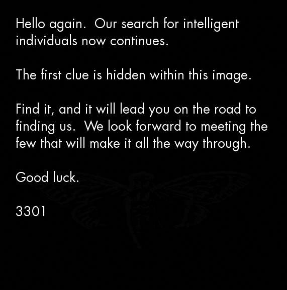

# 5th of January 2013
## The Invitation
There was another thread one day earlier, /b/ thread on 4th that mentioned "warning pastebin" and SMS4TOR (onion.to link) service. <br>
A second image was posted to /x/ and /b/ imageboards on 4chan.  There were three threads where 3301 posted `232.jpg` on 4chan, two times on /b/ 23 hours apart(1,2) and once on /x/.<br>

<p align="middle"></p>


	Hello again. Our search for intelligent
	individuals now continues.

	The first clue is hidden within this image.

	Find it, and it will lead you on the road to
	finding us. We look forward to meeting the
	few that will make it all the way through.

	Good luck.

	3301

Outguessing the image produces:

	-----BEGIN PGP SIGNED MESSAGE-----
	Hash: SHA1

	Welcome again.

	Here is a book code.  To find the book, break this riddle:

	A book whose study is forbidden
	Once dictated to a beast;
	To be read once and then destroyed
	Or you shall have no peace. 


	I:1:6
	I:2:15
	I:3:26
	I:5:4
	I:6:15
	I:10:26
	I:14:136
	I:15:68
	I:16:42
	I:18:17
	I:19:14
	I:20:58
	I:21:10
	I:22:8
	I:23:6
	I:25:17
	I:26:33
	I:27:30
	I:46:32
	I:47:53
	I:49:209
	I:50:10
	I:51:115
	I:52:39
	I:53:4
	I:62:43
	I:63:8
	III:19:84
	III:20:10
	III:21:11
	III:22:3
	III:23:58
	5
	I:1:3
	I:2:15
	I:3:6
	I:14:17
	I:30:68
	I:60:11
	II:49:84
	II:50:50
	II:64:104
	II:76:3
	II:76:3
	0
	I:60:11


	Good luck.

	3301

	-----BEGIN PGP SIGNATURE-----
	Version: GnuPG v1.4.11 (GNU/Linux)

	iQIcBAEBAgAGBQJQ5QoZAAoJEBgfAeV6NQkPf2IQAKWgwI5EC33Hzje+YfeaLf6m
	sLKjpc2Go98BWGReikDLS4PpkjX962L4Q3TZyzGenjJSUAEcyoHVINbqvK1sMvE5
	9lBPmsdBMDPreA8oAZ3cbwtI3QuOFi3tY2qI5sJ7GSfUgiuI6FVVYTU/iXhXbHtL
	boY4Sql5y7GaZ65cmH0eA6/418d9KL3Qq3qkTcM/tRAHhOZFMZfT42nsbcvZ2sWi
	YyrAT5C+gs53YhODxEY0T9M2fam5AgUIWrMQa3oTRHSoNAefrDuOE7YtPy40j7kk
	5/5RztmAzeEdRd8QS1ktHMezXEhdDP/DEdIJCLT5eA27VnTY4+x1Ag9tsDFuitY4
	2kEaVtCrf/36JAAwEcwOg2B/stdjXe10RHFStY0N9wQdReW3yAOBohvtOubicbYY
	mSCS1Bx91z7uYOo2QwtRaxNs69beSSy+oWBef4uTir8Q6WmgJpmzgmeG7ttEHquj
	69CLSOWOm6Yc6qixsZy7ZkYDrSVrPwpAZdEXip7OHST5QE/Rd1M8RWCOODba16Lu
	URKvgl0/nZumrPQYbB1roxAaCMtlMoIOvwcyldO0iOQ/2iD4Y0L4sTL7ojq2UYwX
	bCotrhYv1srzBIOh+8vuBhV9ROnf/gab4tJII063EmztkBJ+HLfst0qZFAPHQG22
	41kaNgYIYeikTrweFqSK
	=Ybd6
	-----END PGP SIGNATURE-----

## The Law
The book that was used to hide the message was [Liber AL vel Legis by Aleister Crowley](https://en.wikipedia.org/wiki/The_Book_of_the_Law), also known as "The Book of Law". It is available online, and can be found [here](https://www.sacred-texts.com/oto/engccxx.htm) . The first line `I:1:6` points toward the 6th character of the first line in the first chapter, an 'h' in this case. It was assumed that spaces weren't counted. Punctuation, however, influenced the character chosen for the plaintext. During decrypting, we found that dashes were vital to the process, so we kept them in the plaintext. Using these rules, we encrypted the book cipher and came up with the decrypted message.

	https:--www.dropbox.com-s-r7sgeb5dtmzj14s-3301

## The System
The Dropbox (https://www.dropbox.com/s/r7sgeb5dtmzj14s/3301) contained a 130MB iso file.<br>
Looking into its contents, we find three directories, `DATA`, `BOOT` and `AUDIO`.

When booting from the image, a boot sequence appeared, printing a sequence of numbers to the screen. Investigating the sequence revealed that the live image prints out all prime numbers up to 3301. There were temporary two-second pauses at 1033 and 3301, where it stops at the latter and moves to the second stage.  The next, and last stage of the procedure is a screen that reads: 

	@1231507051321

	The key is all around you.

	Good luck.

	3301

<!--
# TODO: iso contents
-->

## The Music
The folder `AUDIO` contained an audio recording. The title of the recording was "761.mp3" and can be downloaded [here](./assets/2013/cicados/AUDIO/761.MP3). The ID3 tags show us that the title of the file is "The Instar Emergence" and the artist "3301". The used instrument is a guitar, with distorting effects on it. On the track, a reversed guitar is played and amplified throughout. The song has been deconstructed and checked for hidden reversed messages, but as of yet has turned up nothing out of the ordinary.<br>
<br>
The song is in the key of Db minor with a custom guitar tuning of Db-Ab-Db-Gb-Ab-Db<br>
<br>
Key points about the track is the initial "breath" sound, believed to be the sound of many cicadas and the tempo changes, beginning at approximately 135 bpm, accelerating to 145bpm, then slowing to 125bpm. This has led some to believe that the song has been slowed down by 5%. The only instruments  used were a guitar acoustic and electric and an effect driven bass drum.<br>
The song is 2:47 long, or 167 seconds, which is prime.  It is also a reversal of the name of the file: 761.mp3, and 761 is also prime.
<br>
A draft spectral anlysis (http://www.anony.ws/i/2013/01/07/SE5OU.png) shows a constant hum at 15.4-16.1kHz, and empty notches under 500Hz starting from 1:56. A hexdump of the mp3 file revealed the following message:

	Parable 1,595,277,641
	Like the instar, tunneling to the surface\n
	We must shed our own circumferences;\n
	Find the divinity within and emerge.

Adding Gematria Primus values of letters in each line togather (without first line and wihtout \n) and then mutiplying summs of all three lines produces parable number.

	Line 1 184+72+280+339+66+72+246 = 1259
	Line 2 86+186+232+21+55+451     = 1031
	Line 3 151+72+363+115+215+300   = 1229


					 1259*1031*1226 = 1,595,277,641

## The Twitter
Somebody in the IRC found the twitter account @1231507051321 (https://twitter.com/1231507051321).<br>
Each tweet consisted of an offset, and 65 bytes of hex code. For example, the first message went like so:

	0000000: b69ccce300104a464802545959580001008d0000ff8b6131616a6a632737293d3e322b3b3e3f263a203c0c4762677c326767713d73716d697b6e3000505b494e47

3301 appears to have used a bot to post the tweets at 5 minute intervals (up until 0:00 GMT Jan 7), then onto four minute intervals until 19:00 GMT Jan 7, where it was seemingly random up until 22:04 GMT Jan 7, where it moved onto two minute intervals. The twitter bot stopped posting tweets at 4:52 GMT on Jan 8.

## The Gematria
<p align="middle"></p>

After a day of fruitless searching, an IRC user did the impossible and solved the next puzzle. This user took the 761.mp3 file, and XORed it with the file produced by following the instructions in the twitter. The result was a .jpg file. It was possible to "pre"-construct the image resulting from the tweets. The .jpg file appears to be a rune table.<br>
It was soon discovered that this image, like the very first one, contained a hidden message, once again masked via OutGuess:

	-----BEGIN PGP SIGNED MESSAGE-----
	Hash: SHA1


																																																																																																																																									 

																																																																																																							 

																																													 

															
	-----BEGIN PGP SIGNATURE-----
	Version: GnuPG v1.4.11 (GNU/Linux)

	iQIcBAEBAgAGBQJQ5lDTAAoJEBgfAeV6NQkP7nMQAJVg7DQiIA7NpkacR0RA4eBs
	NZHJBQNHO2P22h+aFfP/rI1gjGaV3hMWaa2sQ4Vbi/W8eZuH40AsmZUy3EOb+4j0
	3cJRJgAJI99ZjDcVXITm5VyUv+WIqCzBr+bHMK7pkMYQ/rEzeWD56tlsrDgFdjmh
	PA/b7XrDcofd9JfBNFI7D/sF84HL2ig5baNo+MGjYl4Dq2cHX+SAafXmlN9PXFjx
	HRBbuoMLlviKywQ8MnePBPYG6V8sIMmrJlHS5ZcNEaSJ9nGL4X0XbECqV79ermye
	1EeNKcckoeeZMU86SabfMeyZozG04Vkbemn8JH5cssbuF8hf4fdN/LSP4NG0r5y9
	jfRv7z59pL577ZpGAju5zBtlCBUvmxxNYR5IGLg+Fi/ICqcRC98mzesFnQ7wbDLS
	HKyV95SBQK82bbqSREBfIrrNb+MjVtJwIvOY5OPTBViHPqrIuMw8KDGfSvw9ncCt
	dase7vUjXxIrn36xDSRN6cMzTmFZ9lkQYkRAYq5ApERud+JfKCwszG/UxRwo1WOU
	0ALaWXq5VMp+w5pvQkqg9eHpOriG9Z11VLdb53eTmxKrwyX/2eaiybsnMrRNuxv1
	iE8PVRkifCcJccw1bGq8TyCQF3a5ozeiBRngAUT7BwZhLa4bShtki7amR0ZZgbKk
	8JRMGvoSA5NNTEwvUhwl
	=ZeNf
	-----END PGP SIGNATURE-----

The message, it turned out, contained a mixture of tabs and spaces. The solvers converted this to binary, then again to ASCII, then they found the next message:

	Come to emiwp4muu2ktwknf.onion
	We shall await you there.
	Good luck.
	3301

## Twitter Reactivates
The twitter account stopped spewing hex code at 4:54. It then produced 1 more message at 5:45, which reads:

	Offset: 0, Skip: 0, Col: 65, Line: 988

There is speculation as to whether this is actually relevant. The twitter account may have a second useful message in it, it may not. It could be our 'second chance', though.

## The Onion, part 1 of 2 - emiwp4muu2ktwknf.onion
Upon visiting the website, the solvers were presented with the following message:

	Web browsers are useless here.


		  ,+++77777++=:,                    +=                      ,,++=7++=,,
		7~?7   +7I77 :,I777  I          77 7+77 7:        ,?777777??~,=+=~I7?,=77 I
	=7I7I~7  ,77: ++:~+7 77=7777 7     +77=7 =7I7     ,I777= 77,:~7 +?7, ~7   ~ 777?
	77+7I 777~,,=7~  ,::7=7: 7 77   77: 7 7 +77,7 I777~+777I=   =:,77,77  77 7,777,
	  = 7  ?7 , 7~,~  + 77 ?: :?777 +~77 77? I7777I7I7 777+77   =:, ?7   +7 777?
		  77 ~I == ~77= +777 777~: I,+77?  7  7:?7? ?7 7 7 77 ~I   7I,,?7 I77~
		   I 7=77~+77+?=:I+~77?     , I 7? 77 7   777~ +7 I+?7  +7~?777,77I
			 =77 77= +7 7777         ,7 7?7:,??7     +7    7   77??+ 7777,
				 =I, I 7+:77?         +7I7?7777 :             :7 7
					7I7I?77 ~         +7:77,     ~         +7,::7   7
				   ,7~77?7? ?:         7+:77777,           77 :7777=
					?77 +I7+,7         7~  7,+7  ,?       ?7?~?777:
					   I777=7777 ~     77 :  77 =7+,    I77  777
						 +      ~?     , + 7    ,, ~I,  = ? ,
										77:I+
										,7
										 :77
											:

	Welcome.

## Establishing a connection
We soon found that web browsers were indeed useless, and that we would have to telnet into the website through the tor network. Some solvers did so, and we found that the website included an interactive shell. You could type in any number to have it factorized, count to have it count up prime numbers, quit to quit, and hello to pump out an interesting message.

### help, get help

```
help, [number] (or number [number]), count [phrase], hello
```

### hello, hi, get message, get 3301, get 1033

	hello
	A message for you:

	0000000:2d2d2d2d2d424547494e20504750205349474e4544204d4553534147452d2d2d2d2d0a486173683a20534841310a0a20202020200a5665727920676f6f642e0a20
	0000041:20200a596f75206861766520646f6e652077656c6c20746f20636f6d652074686973206661722e0a20200a7873786e616b73696374366567786b712e6f6e696f6e
	0000082:0a20200a476f6f64206c75636b2e0a2020200a333330310a20202020200a2d2d2d2d2d424547494e20504750205349474e41545552452d2d2d2d2d0a5665727369
	00000c3:6f6e3a20476e7550472076312e342e31312028474e552f4c696e7578290a0a69514963424145424167414742514a513653304841416f4a45426766416556364e51
	0000104:6b502f4a3051414c44716133564a7939784c4c6c6749356a5068524970340a66786562624e6874454c4f4859466b44355a397a745159476c65376c4b504d386c6b
	0000145:4d536e636949593035394b4969354e53545637493937734a626f473377740a6b6848745a674e52773176325751357575724375356c31772b38342f4c354a7a324e
	0000186:6d456c784f427a57723638646c5159743271664251786b327a522f6654490a544c43454776465a746c6e724e66426b376a7349794a59635858506761625334376f
	00001c7:5039764f45586c42312b506d30433775505042504e3761716b665550476c0a6f3166326873634a66374a65324476625a742b3665787859736d3537467039353358
	0000208:414e41642f557046567a542f3835325867363367745a72492b536d66335a0a4256636a70437a7948337753385230694d2b7270303243774a704a7a7357474c7865
	0000249:51476d584c325358424234337a565a414a716c355564584c5447586b62640a6e504d64332f43624a2b6c37724f305941673570334a66344b617558375a64365a63
	000028a:3277484b4c4f76666a5176455758495931434d68493638426a30725a6f2f0a4d2f666933313346465450416d3678684b52762f74482f387756726172326a593777
	00002cb:6e45385878685273793734415a35477141326f484d6566544171335975570a35505838733638324a34706b44554b48476134793635766a49703136706d45496e4d
	000030c:414c4a4762777a366d7461754251716c53364152735166656b446e336f5a0a796f73532b675743336a6449764835733557555147566c376a797a3974342b335467
	000034d:35635439526e367058324e564e585378677a585842346e493258727259610a346b517235615742386c737361763372796a3543673246486c312b4d4b4f30675976
	000038e:2f554633515437354d6978514d75344d2b3577436e4e656b676675794f360a5a7679627a70347334537a526a6b6b39734d4d360a3d5759564f0a2d2d2d2d2d454e
	00003cf:4420504750205349474e41545552452d2d2d2d2d0a
	Offset: 3301, Skip: 0, Col: 65, Line: 16.

It was soon discovered that these messages could be turned into ASCII which created another message, again GPG signed by 3301. The message reads as follows:

	Very good.
	   
	You have done well to come this far.
	  
	xsxnaksict6egxkq.onion
	  
	Good luck.
	   
	3301

### clue, hint, get hint

A new message was found by telnetting "hint" or "clue" and XORing result with _560.00 file from DATA folder on 3301 CD image.<br>
"hint" output:

	1  Here is a clue:
	2
	3  0000000: 1fd9d91c746f141803d010071f18f0028a0b69763d1d19037daa222b4f46b3264d21ed1d31c514982b502e558ffe583b2e018e62bfe44ac063caf344469c53c7da
	4  0000041: 72beefe909de045a3df0e8b7320d570516b431c42f73c08e39af504fd00e88bb323ae09f436395fe1955dd99251693a5971a1738871354ebebf6e74f94b21f7a3b
	5  0000082: 346063d15bd2f0fbacc86d74b6aaaac0d44b6c54300b5eabb9d699f854ae855385fb5bce0a4304964bf6a9020acb540921d17844f39856a97a2f2623547c61009a
	6  00000c3: 421b1756748009c31b9311745f5a2e661175c8b7958fe459fae4d96e9323b29fd21f83565c60f69d51da75ddaf6f06283b77fc0362ba41e570e70a6b6efa2a34b0
	7  0000104: d9f1d2dde221bf636d9c7c47b6291d4bf7b3389916c46652edf7daf8efa2d0d0909f96b57a3310a3c029da90481eeb4b0d53620be26ab5fb5370bfd4edc49514b2
	8  0000145: 2c43c402fc58554b1556d092d7410fb5cd8ba8d92af3cbbc023f3787c3ece9afee71cef31d63b826bd2292bfac22c6e5cc034237575f1737e2aa24262deced106b
	9  0000186: 89e2032ebe6ab51c8d0cf0fe2394b0c5c8d609b1c54bd2178631f9c0f2350d7a798e52b44a50517bc0dd245db004fe0ca6460c02e81699fdea7494165c96ed4bfd
	10 00001c7: 45d26598bf08c3d8e5486ead896f29bd0b996515157448132ea6e02f8f9d23108e69874956fdf69f2ced112f1a4924c8ec35182253c5288be0e3aa2ccbf7b7affc
	11 0000208: d1dc90726bb30c26d41f5854a41b2ea0dc68345aa3bb11b8688c407d36cdd4cdde47d26348d75397e1636b06dbae541452c1173b59b70bc37fe28615c5636158a0
	12 0000249: 38ab6ba758d90d2b93402505265e8374a7f5d9a7528837aad79d8e6ca20b8deac1a67755b7db9f79835a463bce04ded91a13d72c57950d95fd2f65d207299596f1
	13 000028a: 82d27d220e44a4f95d1abb5ad1d133133b4c787721c0a3ddd32c311ffb6d8b8bc9df64658c9156bd0c1393a35236ecb18cdb93cfa5c23ccee333704fe1606fa063
	14 00002cb: 2307b427788df8036c164ce171d42fd3d0fded1bbd8690bff52e35536a3aaaf9fa6872178f94b35b056e860d637c81664a1e1310df56344ddf19bf4fa4f2a28193
	15 000030c: dc34cdd5423ef2cbe680fbc015ce9f6cd71424789674424ef787a1e7aec7f22d487af53bfe5e4ed4b8f207279573f00c7270e136095eb70fe6c465e0291297d059
	16 000034d: 376088f46e159efee300d64eea644a6b5a7038f411d0f4efd67446836860f1084a01e180bacec753403fe6a845e02f82f7781eba82d2dfb38274c156f7b546cb19
	17 000038e: b4ba5b8e84f85645830eeb3d70207d299b649e8d592536e4df0b03888ca3740d9de623d00aea1e0adfcf23d92c6dde711d187ca9d592c31ab00ac6e217892ccefd
	18 00003cf: 1be10b
	19 Offset: 0, Skip: 0, Col: 65, Line: 16.

The message:

	You can't see the forest when you're looking at the trees.

	Good luck.

	3301

### primes
Telnetting "primes" shell prints out list of primes similar to one on CICADA OS, but some primes are missing and two have extra space in front of them and primes are missing between 71 and 1229.

	primes

	2 3 5 7 11 13 17 19 23 29  31 37 41 43 47 53 59 61 67 71 1229 1231 1237 1249 1259 1277 1279 1283 1289 1291 1297 1301 1303 1307 1319 1321 1327 1361 1367 1373 1381 1399 1409 1423 1427 1429 1433 1439 1447 1451 1453 1459 1471 1481 1483 1487 1489 1493 1499 1511 1523 1531 1543 1549 1553 1559 1567 1571 1579 1583 1597 1601 1607 1609 1613 1619 1621 1627 1637 1657 1663 1667 1669 1693 1697 1699 1709 1721 1723 1733 1741 1747 1753 1759 1777 1783 1787 1789 1801 1811 1823 1831 1847 1861 1867 1871 1873 1877 1879 1889 1901 1907 1913 1931 1933 1949 1951 1973 1979 1987 1993 1997 1999 2003 2011 2017 2027 2029 2039 2053 2063 2069 2081 2083 2087 2089 2099 2111 2113 2129 2131 2137 2141 2143 2153 2161 2179 2203 2207 2213 2221 2237 2239 2243 2251 2267 2269 2273 2281 2287 2293 2297 2309 2311 2333 2339 2341 2347 2351 2357 2371 2377 2381 2383 2389 2393 2399 2411 2417 2423 2437 2441 2447 2459 2467 2473 2477 2503 2521 2531 2539 2543 2549 2551 2557 2579 2591 2593 2609 2617 2621 2633 2647 2657 2659 2663 2671 2677 2683 2687 2689 2693 2699 2707 2711 2713 2719 2729 2731 2741 2749 2753 2767 2777 2789 2791 2797 2801 2803 2819 2833 2837 2843 2851 2857 2861 2879 2887 2897 2903 2909 2917 2927 2939 2953 2957 2963 2969 2971 2999 3001 3011 3019 3023 3037 3041 3049 3061 3067 3079 3083 3089 3109 3119 3121 3137 3163 3167 3169 3181 3187 3191 3203 3209 3217 3221 3229 3251 3253 3257  3259 3271 3299 3301

Missing primes:

		73     79     83     89     97     101    103    107    109    113 
		127    131    137    139    149    151    157    163    167    173 
		179    181    191    193    197    199    211    223    227    229 
		233    239    241    251    257    263    269    271    277    281 
		283    293    307    311    313    317    331    337    347    349 
		353    359    367    373    379    383    389    397    401    409 
		419    421    431    433    439    443    449    457    461    463 
		467    479    487    491    499    503    509    521    523    541 
		547    557    563    569    571    577    587    593    599    601 
		607    613    617    619    631    641    643    647    653    659 
		661    673    677    683    691    701    709    719    727    733 
		739    743    751    757    761    769    773    787    797    809 
		811    821    823    827    829    839    853    857    859    863 
		877    881    883    887    907    911    919    929    937    941 
		947    953    967    971    977    983    991    997    1009   1013 
		1019   1021   1031   1033   1039   1049   1051   1061   1063   1069 
		1087   1091   1093   1097   1103   1109   1117   1123   1129   1151 
		1153   1163   1171   1181   1187   1193   1201   1213   1217   1223

Missing primes in hex:

	00000000: 37 33 37 39 38 33 38 39 39 37 31 30 31 31 30 33 31 30 37 31 30 39 31
	00000017: 31 33 31 32 37 31 33 31 31 33 37 31 33 39 31 34 39 31 35 31 31 35 37
	0000002E: 31 36 33 31 36 37 31 37 33 31 37 39 31 38 31 31 39 31 31 39 33 31 39
	00000045: 37 31 39 39 32 31 31 32 32 33 32 32 37 32 32 39 32 33 33 32 33 39 32
	0000005C: 34 31 32 35 31 32 35 37 32 36 33 32 36 39 32 37 31 32 37 37 32 38 31
	00000073: 32 38 33 32 39 33 33 30 37 33 31 31 33 31 33 33 31 37 33 33 31 33 33
	0000008A: 37 33 34 37 33 34 39 33 35 33 33 35 39 33 36 37 33 37 33 33 37 39 33
	000000A1: 38 33 33 38 39 33 39 37 34 30 31 34 30 39 34 31 39 34 32 31 34 33 31
	000000B8: 34 33 33 34 33 39 34 34 33 34 34 39 34 35 37 34 36 31 34 36 33 34 36
	000000CF: 37 34 37 39 34 38 37 34 39 31 34 39 39 35 30 33 35 30 39 35 32 31 35
	000000E6: 32 33 35 34 31 35 34 37 35 35 37 35 36 33 35 36 39 35 37 31 35 37 37
	000000FD: 35 38 37 35 39 33 35 39 39 36 30 31 36 30 37 36 31 33 36 31 37 36 31
	00000114: 39 36 33 31 36 34 31 36 34 33 36 34 37 36 35 33 36 35 39 36 36 31 36
	0000012B: 37 33 36 37 37 36 38 33 36 39 31 37 30 31 37 30 39 37 31 39 37 32 37
	00000142: 37 33 33 37 33 39 37 34 33 37 35 31 37 35 37 37 36 31 37 36 39 37 37
	00000159: 33 37 38 37 37 39 37 38 30 39 38 31 31 38 32 31 38 32 33 38 32 37 38
	00000170: 32 39 38 33 39 38 35 33 38 35 37 38 35 39 38 36 33 38 37 37 38 38 31
	00000187: 38 38 33 38 38 37 39 30 37 39 31 31 39 31 39 39 32 39 39 33 37 39 34
	0000019E: 31 39 34 37 39 35 33 39 36 37 39 37 31 39 37 37 39 38 33 39 39 31 39
	000001B5: 39 37 31 30 30 39 31 30 31 33 31 30 31 39 31 30 32 31 31 30 33 31 31
	000001CC: 30 33 33 31 30 33 39 31 30 34 39 31 30 35 31 31 30 36 31 31 30 36 33
	000001E3: 31 30 36 39 31 30 38 37 31 30 39 31 31 30 39 33 31 30 39 37 31 31 30
	000001FA: 33 31 31 30 39 31 31 31 37 31 31 32 33 31 31 32 39 31 31 35 31 31 31
	00000211: 35 33 31 31 36 33 31 31 37 31 31 31 38 31 31 31 38 37 31 31 39 33 31
	00000228: 32 30 31 31 32 31 33 31 32 31 37 31 32 32 33

### [number] (or number [number])

Entering a number 

Example output for the input 
`42`:
```
42 : [1, 2, 3, 6, 7 ,42, 14, 21]
```
`29`:
```
92 : [1, 2, 4, 46, 23, 92]
```
`3301`:
```
+
```

### count [phrase]

Count returns the sum of the gematria value of all letters in the argument. 

`count hello world`:
```
442*
```
`count the instar emergence`:
```
761+
```
`count like the instar tunneling to the surface`:
```
1259+
```
`count we must shed our own circumferences`:
```
1031+
```
`count find the divinity within and emerge`:
```
1229+
```

## The Onion, Part 2 of 2 - xsxnaksict6egxkq.onion
Once the solvers had found the second .onion, the next logical step was to visit it with a browser. Upon arrival, they found the following:

	Patience is a virtue.

The source code for the html was the following:

	<html>
		<head><title>3301</title></head>
		<body>
			Patience is a virtue.
			<!-- which means, come back soon. -->
		</body>
	</html>
	</pre>
	Soon afterwards, someone attempted to telnet into it, producing an error message which contained the address of the VPS ([[li528-4.members.linode.com]]?) on which the site was hosted. Promptly afterwards, the site was taken down:
	<pre>
	$ nc -x localhost:9050 xsxnaksict6egxkq.onion 80
	abc
	---------------------------------------------------------------
	<!DOCTYPE HTML PUBLIC "-//IETF//DTD HTML 2.0//EN">
	<html><head>
	<title>501 Method Not Implemented</title>
	</head><body>
	<h1>Method Not Implemented</h1>
	<p>abc to /index.html not supported.<br />
	</p>
	<hr>
	<address>Apache/2.2.22 (Ubuntu) Server at li528-4.members.linode.com Port 81</address>
	</body></html>
	</pre>
	<code>http://li528-4.members.linode.com/</code> was working on plainweb just fine until TOR 2 ver 1 went down.<br>

	==== 06:31 AM 14.1.2013 (GMT) - The Onion, part 2.5 of 2 - xsxnaksict6egxkq.onion ====
	Tor page changed again. We noticed the change at about: 06:31 AM 14.1.2013 (GMT).
	<pre>
	<*html>
	<*head><title>3301</title><*/head>
	<*body>
	<*pre>-----BEGIN PGP SIGNED MESSAGE-----
	Hash: SHA1

	You already have everything you need to continue.

	Sometimes one must "knock on the sky and listen to the sound."

	Good luck.

	3301

	-----BEGIN PGP SIGNATURE-----
	Version: GnuPG v1.4.11 (GNU/Linux)

	iQIcBAEBAgAGBQJQ85gbAAoJEBgfAeV6NQkP6joP/iHzBMvK6YZO24wv24RtstGJ
	dEMrC9BjtUhrB+F0++sHqWeYuueZ37bDstIoh6EOenRHpECD0QBPTc40aUl2Op1L
	4NuUVCUQvfqo/kdWBmSdTP4xGoCtwcXoISfhSM/i+wXqRONSy4z0FrXA3N9yxFaK
	eqlNk47aZvyWWHcyYACUEar/V4kfGo8j58r2CisnfeNwat6I6ZfL9P370UVJQyG1
	a0WV7rF015TLbwAJkwI1jX7GLPWOkRK3lP8qLJJodNvMPSSyUPyPB01ElgBopm+t
	U9bQb/wIGtGG74ezUvwhtDGtXJLWllZtrZx82mQQWzzn8hReqqX0T35idJlTfxIz
	aZDNjLCOQJZCngmXEN7iz47w/g67BQ5eoa6iEj7blFwzMwVO7M7pL+L6LZLnuXml
	Zv1oDNCuENrIo4j8VGLro9pLptiilsUA6xFRS9bfE7qeeBfmS4J8DScOddzLYNVv
	5fKd6iaLJoAqJGkcKnAWPl5VViDhYRL0z1N80zpjm1cWtPBIS2odLMZT80VfMYQI
	8XXaEmRqoP8/9EImapqeSk+qcrUkT1+2opKRTOf7754ptjvJq31jQJgeY2gKGtp1
	jPXZiu9Pp3QQ5cRKIWIIdOFvcrVtIZ/P3OYhT0p4Z+L13fScUbr/kxI6KcZmY/1D
	Szqzyr8SW7zRz1ypGffc
	=UPkJ
	-----END PGP SIGNATURE-----&lt;/pre>
	</body>
	</html>

This hint told the solvers that they needed to ping the website's IP address and listen to the reply.<br>
Again, it was possible to find the server's clearnet IP:
 
	$ nc -x localhost:9050 xsxnaksict6egxkq.onion 80
	abc
	(not sure if port and comand are same, I havent try it, I am just reposting)
	---------------------------------------------------------------------
			<!DOCTYPE HTML PUBLIC "-//IETF//DTD HTML 2.0//EN">
			<html><head>
			<title>501 Method Not Implemented</title>
			</head><body>
			<h1>Method Not Implemented</h1>
			<p>Not supported on this server.</p>
			<hr>
			<address>Apache Server li498-122.members.linode.com at Port 81</address>
			</body></html>

`http://li498-122.members.linode.com/` WAS NOT WORKING on plainweb.
Pinging its doxed clearnet address ([[li498-122.members.linode.com]]) eventually made people notice two responses being sent back per ICMP echo request. (Some routers and ISPs filter out-of-band ICMP requests [ICMP flood protection probably] so there are no guarantees that someone will actually get these).

	17:32:39.976269 IP (tos 0x0, ttl 50, id 0, offset 0, flags [DF], proto ICMP (1), length 84)
		li498-122.members.linode.com > xxxx: ICMP echo reply, id 3457, seq 1, length 64
	...c866c2e3cd2eda7698b2057681c3846fba7bf4b1c1bc6c7f2e8db8fc

	17:32:40.975445 IP (tos 0x0, ttl 50, id 16499, offset 0, flags [none], proto ICMP (1), length 84)
		li498-122.members.linode.com > xxxx: ICMP echo reply, id 54023, seq 1011, length 64
	E..T@s..2...j.gzX...........hL.PN.
	..
	.................. !"#$%&'()*+,-./01234567

	17:32:40.976024 IP (tos 0x0, ttl 50, id 0, offset 0, flags [DF], proto ICMP (1), length 84)
		li498-122.members.linode.com > xxxx: ICMP echo reply, id 3461, seq 1, length 64
	...e0ddd275cf4069985ed481c22491bb267414e5fb128fdb429c662443

	17:32:41.975507 IP (tos 0x0, ttl 50, id 16500, offset 0, flags [none], proto ICMP (1), length 84)
		li498-122.members.linode.com > xxxx: ICMP echo reply, id 54023, seq 1012, length 64
	...T@t..2...j.gzX...........iL.P
	..
	.................. !"#$%&'()*+,-./01234567

	17:32:41.976238 IP (tos 0x0, ttl 50, id 0, offset 0, flags [DF], proto ICMP (1), length 84)
		li498-122.members.linode.com > xxxx: ICMP echo reply, id 3463, seq 1, length 64
	...f6856ed2d4aa87f36686ca58e0f82927b1756e6d7bcf94f6abb55c4f

Notice ping responses with sequence number 1 being interlaced with regular sequenced responses. The data is repeat over and over again.

	1f8b080843f5ee5000036d6573736167652e7478742e617363006d93
	49b3aa460085f7fd2b582645dd8b80a2bcaa2c804668440691417620
	202d43338bfefadc57c92e39db337cabf3f5f52359d59045399a4379
	48b354489d55cf9334f5b7f705f4642c7f519e2eb1008030af6b2a23
	6dfe4d5137325365b2e4d49d34395524c337005d55372b97e7a5503c
	a7fda7f8262d262d001a211955cff7ea27c3f39bdf535fff454b57ff
	f22f35c887f1a7f98bd2dad9d1a885fdde7eb32cf58766f98c89db79
	fd1300eca2bb2ca9b2f49034d935dcfd12404922862a3f0a290f04cb
	ad1c71dd3a0ccf4a3bd3f9a0b2c2f830cacf3958d1dd6ec1f674746d
	7a0e82f1b2e33fa8f1fabaec051c48aa489fc87e41fd1372aff28afc
	63708b2db96744eea5c6c6ac78a4258b0ef4fe165f5d5c224fcc6817
	ce2fdf5aa2618bebe1d2a0ebe93c842f1e72fcd085a310d76d5ece3e
	0cd0616e534b8c315f02be5c48c533347324858913f1b4a4843e2288
	f757d1b22e5d9f778f286384cc45ceb66a05be3a290eb771cfd9a5e0
	8ae8086273dd49d063b7f6925847cb97f4abc1f659e5dceed9155bd0
	a8d6be62c703f7e632a211d5d928a5ec1b6bfd3e633f885ac062d37e
	35dcc91a0a0115c2f6b4aa249fec2109fb87e808352f3fb5c051aa81
	4cb2b03978dec899b81c93adbcc105e27920c975b778103d3a79663e
	c866c2e3cd2eda7698b2057681c3846fba7bf4b1c1bc6c7f2e8db8fc
	e0ddd275cf4069985ed481c22491bb267414e5fb128fdb429c662443
	f6856ed2d4aa87f36686ca58e0f82927b1756e6d7bcf94f6abb55c4f
	96cef7019c7a73f7d6bdb643bb8d32118916def730f62f72354cec30
	6d736b1d95de65a330cf98324cfb54f06ac3c81bc376d2b49940b083
	7b0c7d9b1e381bf96a7c2d14ef997d86e86e1c8ee6d42b5a909846a9
	64e31b0f17bdf12fafea66be18f970edee86fb017d7a13480e574846
	94aac25c422be02ec1a9e9c2de84e7d2d4f4e059c1a7d1914cdd99bc
	9da6ef3a9c2fad5e1cfbe2a403b699d3e52c6964c30feb5adf6831d2
	c05f82f718fff9896ac1ff7bc9df603740d3bf030000

This is a hexdump of a gzipped file, compressed data was "`message.txt.asc`", from Unix, last modified: Thu Jan 10 22:07:15 2013, feeding through gunzip returns:

	-----BEGIN PGP SIGNED MESSAGE-----
	Hash: SHA1


	Well done.  You have come far.

	pklmx2eeh6fjt7zf.onion

	Good luck.

	3301


	-----BEGIN PGP SIGNATURE-----
	Version: GnuPG v1.4.11 (GNU/Linux)

	iQIcBAEBAgAGBQJQ7vVDAAoJEBgfAeV6NQkP9x4P/31A5LPzIhkii8sBjuVxIcOn
	4KFQO+uVVsR53zImSqlhq6iVAE9+Ko7vIqjD2whTIUFVYZNBq/92wEZJuCSonovH
	HqYZTQihIS9d+QDuwUNvXr4ilrRmITKMrWw3D23rpWs6ZlnehuUDVI8unbN9Zi3h
	3hvok3/+/FofLia9Kvbo+FIDi7T9NNRpqepgXd/6dQIP4kn63kKCP20QMdRf2fXF
	ZLx5ADS14OvaNFNUAHTJ1qdkPYcdTiNDJkxqk1s82y2doGoEP0ChBUJxlyMiUVXn
	1iLOwm2KNrf6If64KxEoetOraWqg9P6l3BjGVPCkrotB608SSs2Lihsa4B0ifI33
	ABlpvSDIgpBu/zIO/WFYOfnnrtdvDpVP/Wy+pgqZJ/wOUuhJZhzi5vppjVCm/q9H
	C/aXQxa+XXe7his4f9tuIBD1wIYAtnE8M0uDCsfiZjBaZNMnOO7/hOwnNQSBAMcr
	KqL5yHSnpI50CtoA+6ycWZURBkrt1rt4eNxsCqQ1XWed/hWbqb6SlJJemJOPbbmt
	V5D7iDUO+r2OIUEZTfCSjdzrXcJ8FLtqCGVaLJhCdsyirRHmURwkYLw/B8TpcJQz
	qbY6oeDxDosIbE6uhDNV2RVKmpWqLDMhLGHVjkDjJpodE5L3ObbylWuRnHfFqfKH
	1mubvMAGo03rxxlY+9XG
	=6Sgs
	-----END PGP SIGNATURE-----

## The Onion, part 3 and 4 of 2 - pklmx2eeh6fjt7zf.onion
On the third Onion page the solvers recieved a message instructing them to 'standby for coordinates'.

### SSSS
Each poster had a phone number on it as well as an access code. Note that each phone number either ends in 3301 or 1033.<br>
<br>
Calling the phone number gave an automated speech asking for a code to be typed into the dialer. Solvers soon realised that they had to convert the access code given in the poster to it's gematrified format and type that in. Upon doing so the following message was given (it varied depending on location, this one was for Portland):

	Dataset:13
	Offset:12821

	Data:28C07E1B102D4D5C4C1A376E064477E1416FCC94928765

The data, when XORed with the 560.13 (the 13 coming from the dataset) file from DATA, provided the user with a string of text, notably in this case "gbyh7znm6c7ezsmr.onion". It's important to note that each location gave a different onion address.<br>
<br>
6 of the locations had their codes recovered, while the seventh was not physically visited, but the phone number obtained by wardialing all numbers ending in 1033.<br>
On each of these onion addresses (as listed in the table below), each solver was given an SSSS code, which stands for **Shamir's Secret Sharing Scheme**. A secret sharing scheme allows someone to share a secret with a certain number of people, who each get their own string. Once enough of these secrets come together, they can be combined to create the final secret. Each location, its SSSS code and some other data on each part is in the below table:

<table>
<tr>
    <th> Location    </th>
    <th> Coordinates    </th>
    <th> Image    </th>
    <th> Phone #    </th>
    <th> Access code    </th>
    <th> Message file / offset    </th>
    <th> Message    </th>
    <th> Onion    </th>
    <th> SSSS    </th>
</tr>
<tr>
    <td> Dallas TX	</td>
    <td> 33.092817, -96.08265	</td>
    <td> 	</td>
    <td> +1 205-396-3301	</td>
    <td> JD: 3789	</td>
    <td> 17, offset 16433 (actually 33461)	</td>
    <td> f6a2d0a48e1b1ae40cbd454f77baa7d2557683d0cd4998	</td>
    <td> y2wyuvrqraowagc5.onion	</td>
    <td> 02-41cc481a51fe77f91600f593c1db2ce9babd2626ea6e	</td>
</tr>
<tr>
    <td> Okinawa Japan	</td>
    <td> 26.41968, 127.73254	</td>
    <td> 	</td>
    <td> +1 626-586-1033	</td>
    <td> YF: 1032	</td>
    <td> 13, offset 378610	</td>
    <td> f286b8438cb85eb191ec7bf10a28a54ec06f9a27eb91c5	</td>
    <td> wzwmcwmsk5cb7gjn.onion	</td>
    <td> 03-7678a5f6b72042d839151b34b02ffe161cf997fed484	</td>
</tr>
<tr>
    <td> Moscow, Russia	</td>
    <td> 55.793765, 37.578608	</td>
    <td> 	</td>
    <td> +1 928-237-3301	</td>
    <td> CR: 1311	</td>
    <td> 13, offset 1111111	</td>
    <td> c657b2707c4266fda4af4a83acf19cc46e69540c0bc5da	</td>
    <td> qw7mhchzvuq6f2mf.onion	</td>
    <td> 05-fcd82965b6632ea25d80edc3e58baafb4b2938895cbd	</td>
</tr>
<tr>
    <td> Little Rock, AR	</td>
    <td> 34.7477910, -92.2690863	</td>
    <td> 	</td>
    <td> +1 719-428-3301	</td>
    <td> LM: 7167	</td>
    <td> 13, offset 13831	</td>
    <td> 5edb5e8029dd2182560da925ec6cd3e1257efc0b8328b4	</td>
    <td> 4l6uipnstbggwjyv.onion	</td>
    <td> 07-f3adb3aacb0b4336fa28178bc1e5edce940c16ce5caa	</td>
</tr>
<tr>
    <td> Annapolis, MD* 	</td>
    <td> 38.977845, -76.486451	</td>
    <td> *was not physically recovered	</td>
    <td> +1 253-655-1033	</td>
    <td> PX: 4347	</td>
    <td> 17, offset 77977	</td>
    <td> d5a6cb76e55a2166bd6a4d78857ec1f68ea6afa9738	</td>
    <td> erwfcsdvx6pm2rsk.onion	</td>
    <td> 08-b970e507dbc4ac115a273126f62671654c480fce32e5	</td>
</tr>
<tr>
    <td> Portland, OR 	</td>
    <td> 45.50092, -122.652512	</td>
    <td> 	</td>
    <td> +1 424-999-1033	</td>
    <td> GH: 1723	</td>
    <td> 13, offset 12821	</td>
    <td> 28c07e1b102d4d5c4c1a376e064477e1416fcc94928765	</td>
    <td> gbyh7znm6c7ezsmr.onion	</td>
    <td> 09-82a98a7fe06014f783b752506cf6cd1fabaa3d8b3750	</td>
</tr>
<tr>
    <td> Columbus, GA  	</td>
    <td> 32.478944, -84.983674	</td>
    <td> 	</td>
    <td> +1 469-251-1033	</td>
    <td> NR: 2911	</td>
    <td> 17, offset 617	</td>
    <td> d4b10626d65995e8fb010f4388787d56433f90c6df8d8d	</td>
    <td> 	</td>
    <td> 	</td>
</table>

Once 5 of 10 SSSS codes had been retrieved, they could be decrypted to form their message, which was: `p7amjopgric7dfdi.onion`

## The Questions - p7amjopgric7dfdi.onion
Upon entering their emails into the website, the solvers were given a set of test questions, and requested not to publish them. There were 19 questions in total, with three different types.<br>
The first type of question gave a statement and then a multitude of answers, which were:

* True
* False
* Indeterminate
* Meaningless
* Self-Referential
* Game Rule
* Strange Loop
* None of the above 

These statements were the following:

* There is no truth
* What you are is more important than what you do
* You cannot step into the same river twice
* Observation changes the thing being observed
* This sentence is false
* I am the voice* inside my head (You undoubtedly just thought "I don't have a voice inside my head." That is the voice the question is referring to)
* Disregarding color blindness, any arbitrary color looks the same to all people
* If A is not true, then it must be: 1 = 0.9 recurring
* People who only study material after a test do better than those who do not study at all
* Grass is only green due to a relationship between the grass, the light and your mind
* All things are true
* We get hundreds of millions of sensations coming into our minds at any moment. Our brain cannot process them all so it categorises these signals according to our belief systems. This is why we find evidence to support our beliefs and rarely notice evidence to the contrary.

The second type of question included an input box with a question. These questions were:

* What does the word 'it' refer to in this sentence: It is dark outside?
* The mathematical operation known as addition is modeled after what?
* Explain, in your own words, what mathematical operation is relied upon for the security of Shamir's Secret Sharing Scheme?
* Name similarities between the concept and reality of the 'News Feed' on Facebook?
* In the programming language of your choice, write a function that returns the value 3301.

The final type of question only appeared once, and it had different radio buttons to the first type. This question was:<br>

	Two people are standing by a lake. One says, "That's a lovely reflection in the water." The other says "I see no reflection, but it's a fascinating assortment of fish, plants and rocks within the water."
	Which one is lying?

The answers to this question were:

* The one who sees the reflection
* The one who sees the fish
* Neither
* Both


This page also saved two cookies on the user's computer, which were:

	167=6941f707ff39d259ff71657a79cb6b54c184d2f0455810109c1a960860bde0e6;
	761=7bc1e7805ccfa518920f0d94fc4e8f7dbd83287a03b337b89109cd2287befae5; 

# 0:00 UTC on 3 Feb, 2013
## The Servers
After completing the test each solver was sent the following email to the address they had indeed yes inputted. Please note that the GPG signature has been removed, but multiple sources have confirmed that they received this email. 

	In the programming language of your choice build a TCP server
	that implements the protocol below.  The server code must be
	written by you and you alone, although you are free to use any
	modules or libraries publicly available for the selected
	programming language.

	Once you have done this, make it accessible as a Tor hidden
	service.  Then provide us with the onion address and port
	via a GPG-encrypted email to this address.

	You have until 0:00 UTC on 3 Feb, 2013.  Any emails received
	after that time will be ignored.

	Good luck.

	3301

	====================================================================


	1. INTRODUCTION

	   The TCP server MUST listen on an arbitrary port, and send and
	   receive plain text with lines separated by <CRLF> (representing
	   a carriage return followed by a line feed).  The TCP server MUST
	   disregard the case of input.

	   In the examples below, lines sent by the server will be preceded
	   with "S:" and lines sent by the client will be preceded by "C:"

	   Each message sent by the server MUST conform to the format:

		   [CODE] [RESPONSE NAME] [RESPONSE (optional)]<CRLF>

	   Where [CODE] and [RESPONSE NAME] is one of:

		   CODE   RESPONSE NAME
			00     Welcome
			01     Ok
			02     Error
			03     Data
			99     Goodbye


	2. PROCEDURES

	   a. Remote Connection

	   Upon receiving a remote connection, the server MUST greet the
	   client with a 00 WELCOME message.  The RESPONSE of a welcome
	   message MAY contain arbitrary text.  The arbitrary text MUST
	   at the very least contain the name of the programming language
	   used to implement the server.

	   Upon receiving a 00 WELCOME message, the client may begin
	   initiating procedures.

	   Example:

		   S: 00 WELCOME [ARBITRARY RESPONSE TEXT]<CRLF>


	   b. RAND [n]
	  
	   Upon receiving a "RAND" request by the client, the server will
	   first send a 01 OK response, and will then provide the client
	   with [n] cryptographically random numbers within the range of
	   0-255.  Each number MUST be followed by <CRLF>.  After the last
	   number has been sent, the server MUST send a dot (.) on a line
	   by itself.

	   Example:

		   C: RAND 3<CRLF>
		   S: 01 OK<CRLF>
		   S: [first random number]<CRLF>
		   S: [second random number]<CRLF>
		   S: [third random number]<CRLF>
		   S: .<CRLF>


	   c. QUINE

	   Upon receiving a "QUINE" request by the client, the server will
	   first send a 01 OK response, and will then provide the client
	   with a quine in the programming language used to implement the
	   server.  This quine does not have to be original.  After the last
	   line of code has been sent, the server MUST send a dot (.) on a
	   line by itself.

	   Example:

		   C: QUINE<CRLF>
		   S: 01 OK<CRLF>
		   S: [quine code]<CRLF>
		   S: .<CRLF>
	  

	   d. BASE29 [n]

	   Upon receiving a "BASE29" request by the client, the server will
	   send a 01 OK response followed by the number [n] converted into
	   its base 29 representation.

	   Example:

		   C: BASE29 3301<CRLF>
		   S: 01 OK 3QO<CRLF>


	   e. CODE

	   Upon receiving a "CODE" request by the client, the server will
	   send a 01 OK response followed by its own source code.  After the
	   last line of code has been sent, the server MUST send a dot(.) on
	   a line by itself.  

	   Example:

		   C: CODE<CRLF>
		   S: 01 OK<CRLF>
		   S: [Server Source Code]<CRLF>
		   s: .<CRLF>


	   f. KOAN

	   Upon receiving a "KOAN" request by the client, the server will
	   send a 01 OK response followed by a koan.  After the last line of
	   the koan, the server MUST send a dot (.) on a line by itself.

	   Example:

		   C: KOAN<CRLF>
		   S: 01 OK<CRLF>
		   S: A master who lived as a hermit on a mountain was asked by a<CRLF>
		   S: monk, "What is the Way?<CRLF>
		   S: "What a fine mountain this is," the master said in reply<CRLF>
		   S: "I am not asking you about the mountain, but about the Way.<CRLF>
		   S: "So long as you cannot go beyond the mountain, my son, you<CRLF>
		   S: cannot reach the Way," replied the master<CRLF>
		   S: .


	   g. DH [p]

	   Upon receiving a "DH" request by the client, the server will proceed
	   to perform a Diffie-Hellman key exchange using [p] as the prime modulus.
	   The server will then select a base [b] to use in the protocol, as well as
	   its secret integer.  The server will then compute its exponent result [e]
	   as specified within the Diffie-Hellman key exchange protocol. 

	   The server MUST then respond with a 01 OK response followed by the
	   selected base [b] and computed exponent [e] separated by white space.

	   The client MUST respond with its exponent result [e2], and the client and
	   server will follow the rest of the Diffie-Hellman key exchange protocol.

	   The server MUST then compute the resulting secret key, and provide it
	   using 03 DATA [k].

	   Example:

		   C: DH 23<CRLF>
		   S: 01 OK 5 8<CRLF>
		   C: 19<CRLF>
		   S: 03 DATA 2<CRLF>


	   j. NEXT

	   Upon receiving a "NEXT" request by the client, the server will respond
	   with 01 OK and then listen for text data to be provided by the client. 
	   The client will send a dot (.) on a line by itself after the last line
	   of text.  The server MUST record this.  This data will be the next set
	   of instructions.  Once the data is received the server will respond
	   with 01 OK.

	   Example:

		   C: NEXT<CRLF>
		   S: 01 OK<CRLF>
		   C: -----BEGIN PGP SIGNED MESSAGE-----<CRLF>
		   C: [MESSAGE CONTENTS]<CRLF>
		   C: -----END PGP SIGNATURE-----<CRLF>
		   C: .<CRLF>
		   S: 01 OK<CRLF>


	   i. GOODBYE

	   Upon receiving a "DH" request by the client, the server MUST respond with
	   99 GOODBYE and then gracefully close the connection.

	   Example:

		   C: GOODBYE<CRLF>
		   S: 99 GOODBYE<CRLF>

Example in Go: http://pastebin.com/su70yn60<br>
Example in Python: http://pastebin.com/CrRvGrkT<br>

# 2013/03/03 10:57:48 - 2013/03/03 11:01:18
## The End?
