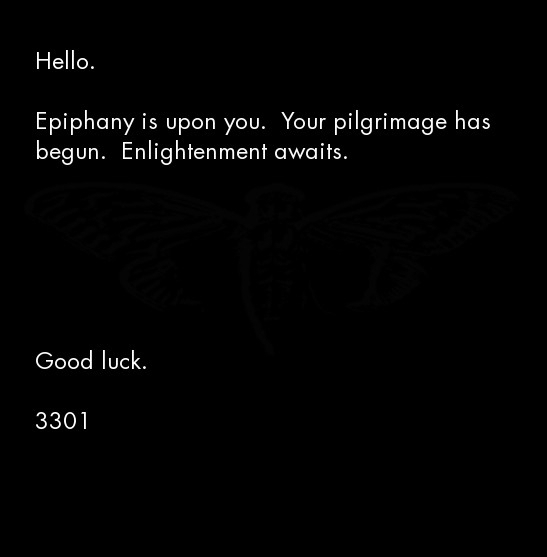

* http://the-cicada-puzzles.wikia.com/wiki/2014_Recruitment_Puzzle

# cca 07:30 GMT 6th JAN 2014

## The Beginning

Start with the tweet

	wget https://twitter.com/1231507051321/status/420087183957966849

Get the image

	wget i.imgur.com/zN4h51m.jpg 

Run outguess

	outguess -r zN4h51m.jpg zN4h51m.jpg.outguess
	Reading zN4h51m.jpg....
	Extracting usable bits:   29835 bits
	Steg retrieve: seed: 178, len: 1150

Verify signature

	gpg < zN4h51m.jpg.outguess

Outguess:

	-----BEGIN PGP SIGNED MESSAGE-----
	Hash: SHA1

	The work of a private man
	who wished to transcend,
	He trusted himself,
	to produce from within.

	1:2:3:1
	3:3:13:5
	45:5:2:3
	20:3:20:5
	8:3:8:6
	48:5:14:2
	21:13:4:1
	25:1:7:4
	15:9:3:4
	1:1:16:3
	4:3:3:1
	8:3:26:4
	47:3:3:5
	3
	13:2:5:4
	1:4:16:4
	.
	o
	n
	i
	o
	n

	Good luck.

	3301

	-----BEGIN PGP SIGNATURE-----
	Version: GnuPG v1.4.11 (GNU/Linux)

	iQIcBAEBAgAGBQJSyjguAAoJEBgfAeV6NQkPsgAP/A3tMC3lpyFNAc/sj+Izu15S
	CzUjZJMe20Gu9UMNokQ2UJabktv9w0GMyK17TrMkUcU+ZpjdzGNqKoE2ETVxLmD/
	uBZtR5PnF9EE3D08tJUPN1vSrYNkYk+9zcaUJZMPNgYNCt/CACutPwrOci9i9FDO
	7BIpnhGqT3ZruqrSwO2Y73LJI1xxUt1XUqh1NQ+fJeAFMRkJBZZazkxRlgk3GGsF
	fLrcEKrS+KBipV1EQaaKxjISc9hc2c1TfxE66evlkN+zLcoyDcYuyruNM5wiZzgM
	2uR58c+xgWQgG5UuLFClfvjDxUvDkrKt4mzEeaYSUm1MsYueuYklz4ydlg5Mf6l2
	p1WyAxO52XfXVUZASk6VmaEQ0WjODTXvLeFTxUSDoKDMkvxDVxX6wGkufS9JwakB
	nTZizZ8Ypv8GcNCuNNGd6gZ1Vk2MYntggXdX8INd0Itcd3QnLqbBnATDOinDxlOs
	5zTrtyTHNaxxDagPfAbU1jMXM0aHd7PFAzjjp7kgCTWqMyBch+8Vt80bjkdL9iw8
	Q3hxuanq8mh6nUGc+tNe0UfqKHEbE+jWIezYqgawJB0M9R5OhxWE+E+jPXtZKkXQ
	JHYndPDrrsV8q27b7p0KN0+oblTkjqsItIAuLu7FNd0B4xb1jjp1Sbh7WJdZ/rbi
	mCO0vN/obU9qK1Vfapy0
	=6Gxk
	-----END PGP SIGNATURE-----

## The Book Cipher

The riddle leads to the book Self-Reliance by Ralph Waldo Emerson (https://math.dartmouth.edu/~doyle/docs/self/self.pdf).

Applying the book code (<code>paragraph:sentence:word:letter</code>) yields: <code>auqgnxjtvdbll3pv.onion</code>

### The First Onion - auqgnxjtvdbll3pv.onion

Get onion data

	wget http://auqgnxjtvdbll3pv.onion

Get the image

	wget http://auqgnxjtvdbll3pv.onion/1033.jpg

Run outguess

	outguess -r 1033.jpg 1033.jpg.outguess

Verify signature

	gpg < 1033.jpg.outguess

<code>index.html</code>:

	<html><head><title>For Every Thing That Lives Is Holy</title><body></body></html>

Outguess of <code>1033.jpg</code>:

	-----BEGIN PGP SIGNED MESSAGE-----
	Hash: SHA1

	Welcome.

	Good luck.

	3301

	e = 65537
	n = 75579125746085351644267182920580212556413102071876330957950694457000592\
		10248050757270234679993673844203148013173091173786572116639

	- -----BEGIN COMPRESSED RSA ENCRYPTED MESSAGE-----
	Version: 1.99
	Scheme: Crypt::RSA::ES::OAEP

	eJwBswBM/zEwADE2MgBDeXBoZXJ0ZXh0LE2jxJS1EzMc80kOK+hra1GKnXgQKQgVitIy8NgA7kxn
	2u8jNQDvlu0uymNNiu6XVCCn66axGH0IZ9w4Af3K/yRgjObsfA1Q7QqpXNALJ9FFPgYl5rh07cBP
	M9kbSH6DynU/5cYgQod2KymjWcIvKx3FkjV4UOGakDnBf1eQp1uwvn3KxDVwTyzPqbMnZvOA06Ec
	AfKtyz1hEK/UBXkeMeVrnV5SQQ==
	=yTUshDMKN65aPaKAR0OU8g==
	- -----END COMPRESSED RSA ENCRYPTED MESSAGE-----

	-----BEGIN PGP SIGNATURE-----
	Version: GnuPG v1.4.11 (GNU/Linux)

	iQIcBAEBAgAGBQJSyly/AAoJEBgfAeV6NQkPHhUP/R7nuYiTMw+3sbe0xV+4rmiN
	liSDmW6ibOK4UTkZDTeAS5kAKIjxCC3DwWi0lXqBGZyabojWHM2wRwYLOhvfKvgg
	DgPnW1BSZ/R67GaUy0CM/vtZOtktBeIdntlZamk9DpW5bQ311c7N9dy6uWc8+hOM
	umkcnT7u799zESazFgCeDSOw0cFgHDiG9UTAQxbe+NsXY/NKm4N0WAtgWmdte5ym
	dU8ImpmXWg8NChdn49UtuAACi8s8tcI/lHj1Yjh+AQRbO2+Ozn9eSxUAQ1TsXSgt
	30jKmXI5ss4WHS16nYsS97BUbo4oX3NBXaCjSZb7fKO9CRJBo3gm2R8/NcIMIkEc
	GlQ/7rCQWHXA0MC+415ut5dcJf2ihwid81c1xsDyqQdfhEsWE/wVnK7Ujje+BgcO
	ybBHl8ejJzWhZkCvesHOmIo1RLEanxlGUC5jcRLqImrT7A9CrO+EVFW16EZpvzug
	Tsopo56+JbIFiIzAq+CGujHgDZnoHJFtB574utjOnZz9xzsVZ3lirQyAFOGauH+g
	K+XxjXjY8tT5lppAgmF3zWKqha7NoV+9FgFl2q2SS9ue+s4Joyn5PYKnICJeze3i
	K9BZ7gIT694s4dLEzu6kGaRyuNmx8qaoDs0kjvEB5pI+1buGuNAysHQWIDyY3DWb
	CjJ1AnBLY0ObxaMbWMR/
	=d5E8
	-----END PGP SIGNATURE-----

After decrypting the RSA encryption decrypt RSA the Tor adderss <code>cu343l33nqaekrnw.onion</code> was found.

## The Second Onion - cu343l33nqaekrnw.onion
Upon visiting the service, the following document was displayed:

	<!--Patience is a virtue-->
	634292ba49fe336edada779a34054a335c2ec12c8bbaed4b92dcc05efe98f76abffdc2389bdb9de2cf20c009acdc1945ab095a52609a5c219afd5f3b3edf10fcb25950666dfe8d8c433cd10c0b4c72efdfe12c6270d5cfde291f9cf0d73cb1211140136e4057380c963d70c76948d9cf6775960cf98fbafa435c44015c5959837a0f8d9f46e094f27c5797b7f8ab49bf28fa674d2ad2f726e197839956921dab29724cd48e1a81fc9bab3565f7513e3e368cd0327b47cf595afebb78d6b5bca92ba021cd6734f4362a0b341f359157173b53d49ea5dff5889d2c9de6b0d7e8c615286ce596bfa83f50b6eeabd153aaf50cd75f39929ba11fb0f8e8d611442846

The page appeared to be static. However, after some time, we noticed that the string was slowly growing. Every few minutes, two characters were appended to the end of the string. This process continued for approximately 23 hours. The time intervals between new bytes were found to be multiples of five. Various users recorded the minutes between updates, the time that they occurred, and the data appended at those times. 
After 23 hours, the process stopped and no more characters/bytes were appended to the string. 
 
However, about an hour after the string finished growing, at approximately 05:31:40 GMT the document changed. The old 512-character code was gone, along with the HTML comment. In its place was the following document:

	https://github.com/micheloosterhof/cicada-2014/blob/master/stage03/cu343l33nqaekrnw.onion/index.html.2

Note that the HTML comment was changed from

	<!--Patience is a virtue-->

to

	<!--761-->

We noticed that, by applying the Gematrius Primus from the 2013 puzzle to the phrase 'Patience is a virtue' and summing the result, one obtains 761. The number is also a palindromic prime. 
 
The new string was 3641299 (?) characters long. We noticed that it contained a significant amount of repeated text. 
 
Analsysis of this new string revealed that it contained three JPEG image files. This was discovered when we:
* Converted the string into its binary representation
* Flipped all the bits (i.e. 0 becomes 1, 1 becomes 0) [Note: this is equivalent to XOR 111111]
Looking at that XOR'd binary string, we noticed that the first two bytes were

	0xFF 0xD8

Wikipedia tells us that these are the first two bytes of a JPEG image. 

	torify wget http://cu343l33nqaekrnw.onion/

Final file in index.html.2

hex dump and XOR with 0xFF

	dd if=onioninvert.bin of=onion1.jpg bs=1 skip=0 count=168876
	dd if=onioninvert.bin of=onion2.jpg bs=1 skip=168876 count=1476614
	dd if=onioninvert.bin of=onion3rev.jpg bs=1 skip=1645490 count=175159

	rev < onion3rev.jpg > onion3.jpg

	cat index.html.2 | tail -n +2 | xxd -r -p > out

	outguess -r onion1.jpg onion1.outguess
	outguess -r onion2.jpg onion2.outguess
	outguess -r onion3.jpg onion3.outguess

	gpg < onion1.outguess | xxd -r -p > onion1.bin
	gpg < onion2.outguess | xxd -r -p > onion2.bin
	gpg < onion3.outguess | xxd -r -p > onion3.bin

XOR all the three files together

		make xor

		./xor -o xor.txt onion1.bin onion2.bin onion1xor2.bin

	gpg < xor.txt

The XORing produces:

	-----BEGIN PGP SIGNED MESSAGE-----
	Hash: SHA1

	IDGTK UMLOO ARWOE RTHIS UTETL HUTIA TSLLO 
	UIMNI TELNJ 7TFYV OIUAU SNOCO 5JI4M EODZZ 

	Good luck.

	3301

	-----BEGIN PGP SIGNATURE-----
	Version: GnuPG v1.4.11 (GNU/Linux)

	iQIcBAEBAgAGBQJSy23PAAoJEBgfAeV6NQkPeJwP/0IoafJ1SbmhD+KNbL5I2EdH
	jgPRnZNrKCyMpWFSIw1qs6ujuw6VnW/rfnOD+df4kpzoAwEFfZDcRnBVsvIzOJ31
	Txj9jXD22ki/CNRY88NyIzW9fjKs+iOylsa7Tx+6PBb3ndoYNEwnQwLIq3K4S3kQ
	tgMzE3LiVq2pQwqFNdN+zGqcq7POEs0GmnL1aNpqU+Wrba4gSfoWwQBWUDv3S/s8
	vY0hEqhWNd76wphig6hH6OyIaX/t1eYfcsSYhzAE5oKKahGr1E7cX1GBpHCIr1WM
	ZwNaGVArQAkyEzT++tmF01O9h218CiTUFoBM/Zxyra7vxI2UOYS/pLonuV+eXARY
	YfPHaZZxfk3bUWXcxioRukFSY2+xNdPfuBIT8rcJqa1kPJOzeZVC/IcwHA2mmG4l
	3ltiVcDnQrZgz6Im3/ugFg8bqW12qqZ6XizRP3EXm4EnyhpfKZnXKPLEOvPKCj6j
	1kYCrLmGtTTPFx79fZfryGXQIEAmipRbjVS5sVbUCfgmqUagmdU6v9VI53n6+r0J
	b2amxREA+2MflkEoVJUaLQJ1rKZLFFJ9J17zUaXKMllsDBWXJS4Mb54o2+8bkEcM
	3cP+16XV9pf2wZBkJE0AwoXI4L8JEyjNZZcGSLy8BojlAupX3Fg9KKt71XXrm9FD
	tuBhMYWo/TDz+4UzLB+I
	=57tj
	-----END PGP SIGNATURE-----

This ciphertext had been created using a simple column transposition cipher (http://tholman.com/other/transposition/). 
By arranging the ciphertext into 14 columns like so:

	0	1	2	3	4	5	6	7	8	9	10	11	12	13
	I	D	G	T	K	U	M	L	O	O	A	R	W	O
	E	R	T	H	I	S	U	T	E	T	L	H	U	T
	I	A	T	S	L	L	O	U	I	M	N	I	T	E
	L	N	J	7	T	F	Y	V	O	I	U	A	U	S
	N	O	C	O	5	J	I	4	M	E	O	D	Z	Z

And reordering the columns like so:

	2	8	9	1	12	13	11	4	5	7	3	0	6	10
	G	O	O	D	W	O	R	K	U	L	T	I	M	A
	T	E	T	R	U	T	H	I	S	T	H	E	U	L
	T	I	M	A	T	E	I	L	L	U	S	I	O	N
	J	O	I	N	U	S	A	T	F	V	7	L	Y	U
	C	M	E	O	Z	Z	D	5	J	4	O	N	I	O

A message is obtained:

	GOOD WORK
	ULTIMATE TRUTH IS THE ULTIMATE ILLUSION 
	JOIN US AT FV7LYUCMEOZZD5J4ONIO

Assuming that the final N was omitted in order to fit the bounds of the column transposition cipher, and applying proper formatting, the following Tor hidden service address is obtained: <code>fv7lyucmeozzd5j4.onion</code>

## The Third Onion - fv7lyucmeozzd5j4.onion - li676-224.members.linode.com
The first visitor to this hidden service was greeted with a blank page. The page remained blank for a short time and then changed to the following document:

	<!--1033-->
	87de5b7fa2

The string slowly grew over time, with two new characters (one byte) being added at widely varying intervals. 
Final <code>index.html</code>:

	<!--1033-->
	87de5b7fa26ab85d2256c453e7f5bc3ac7f25ee743297817febd7741ededf07ca0c7e8b1788ea4131441a8f71c63943d8b56aea6a45159e2f59f9a194af23eaabf9de0f3123c041c882d5b7e03e17ac49be67cef29fbc7786e3bda321a176498835f6198ef22e81c30d44281cd217f7a46f58c84dd7b29b941403ecd75c0c735d20266121f875aa8dec28f32fc153b1393e143fc71616945eea3c10d6820bd631cf775cf3c1f27925b4a2da655f783f7616f3359b23cff6fb5cb69bcb745c55dff439f7eb6a4094bd302b65a84360a62f94c8b010250fcc431c190d6ed8cc8a3bfce37dddb24b93f502ad83c5fa21923189d8be7a6127c4105fcf0e5275286f2

 
In the meantime, a solver ran the tool '''not''' DirBuster but maybe Nessus against the hidden service and discovered an apparent misconfiguration of the backend Apache server. The server was leaking a system status page. "Whether this was intentional is unknown. However, shortly after the page was discovered, it appears that Cicada was alerted that the status page had been discovered because the content of that page changed." ('''source?''')) 

<a href="/assets/2014/li676-224_server-status_orig.txt"><b>Server status original</b></a>

<a href="/assets/2014/li676-224_server-status_new.txt"><b>Server status new</b></a>

Interesting parts:

	##
	<dt>Current Time: Thursday, 06-Jan-2014 00:13:17 UTC</dt> # these should not
	<dt>Restart Time: Tuesday, 06-Jan-2014 00:13:17 UTC</dt>  # be equal...
	<dt>Parent Server Generation: 2</dt> # (means: Number of times you have instructed apache to re-read its configuration file and gracefully restart all child processes. )
	<dt>Server uptime:  1 days 0 hours 33 minutes 14 seconds</dt> # 1d0h33m 14s
	<dt>Total accesses: 931377 - Total Traffic: 7.2 GB</dt> # the whole index is about 3MB?
	<dt>CPU Usage: u50.58 s65.25 cu0 cs0 - .0333% CPU load</dt>
	<dt>5.09 requests/sec - 37.6 kB/second - 7.4 kB/request</dt>
	<dt>10 requests currently being processed, 40 idle workers</dt>

Appended to the end of the server status was yet another very long string. This string was found to contain two image files in a similar ordering as the RSA onion, except that there was some data between them (OOB or Out Of Bounds data):

	[0xFF 0xD8..............................] [Data in between JPGs] [..............................0xD8 0xFF]

After building the first JPG from the hex:

	xxd -p -r < server-status.hex > server-status.jpg

One obtains the image [[Liber_Primus#05.jpg|05.jpg]]. Doing the same for the reversed copy of the second JPG yields the same image as the first, except for that OOB data. 
 
Comparing the first and second images

	cmp -l server-status.jpg rev.server-status.jpg

one obtains the OOB data:

	a02373230202020202833313020202020213433302020202021333130202020202135313a06363
	330202020202939313020202020203331302020202020323330202020202028313a06323230202
	020202534323020202020202139302020202025343230202020202632323a08313020202020203
	2333020202020203331302020202029393130202020202636333a0135313020202020213331302
	02020202134333020202020283331302020202022373230a0a

Note that all of these bytes are within the printable range of ASCII characters, and many of them appear to be ASCII for digits (e.g. 0x30, 0x39). 
 
Converting this string to binary:

	xxd -b oob.hex oob.bin

and reversing that:

	xxd -r oob.bin oob-rev.bin

we obtain:

	272     138     341     131     151

	366     199     130     320     18

	226     245     91      245     226

	18      320     130     199     366

	151     131     341     138     272

Among other things, this is a magic square whose magic number is -- you guessed it -- 1033. 
Here's a nice one-liner to get that matrix from the original image:

	dd if=server-status.jpg bs=1 skip=$((0x00521e4)) count=357 status=noxfer | rev | xxd -p -r

About a day went by with little activity other than speculation on the meaning of this matrix. Then the string from the main page stopped growing. According the the HTTP header, the final update occurred on January 11 at 01:09:01 GMT. The final document was:

	<!--1033-->
	87de5b7fa26ab85d2256c453e7f5bc3ac7f25ee743297817febd7741ededf07ca0c7e8b1788ea4131441a8f71c63943d8b56aea6a45159e2f59f9a194af23eaabf9de0f3123c041c882d5b7e03e17ac49be67cef29fbc7786e3bda321a176498835f6198ef22e81c30d44281cd217f7a46f58c84dd7b29b941403ecd75c0c735d20266121f875aa8dec28f32fc153b1393e143fc71616945eea3c10d6820bd631cf775cf3c1f27925b4a2da655f783f7616f3359b23cff6fb5cb69bcb745c55dff439f7eb6a4094bd302b65a84360a62f94c8b010250fcc431c190d6ed8cc8a3bfce37dddb24b93f502ad83c5fa21923189d8be7a6127c4105fcf0e5275286f2

The final string was 512 characters (assuming hex, 256 bytes or equivalently 2048 bits). It was observed that this string matched the growing string from the previous onion. 
 
On January 11 at 10:07 UTC, the Apache server status page changed once again to display a new hexadecimal string:

	TODO: missing

This string contained the following two images ([[Liber_Primus#03.jpg|03.jpg]] and [[Liber_Primus#04.jpg|04.jpg]]) in the same style as before

	[0xFF 0xD8...............] [...............0xD8 0xFF]

The hex string from the outguess of [[Liber_Primus#03.jpg|03.jpg]] encodes a JPG image. (TODO: insert image) 
The runes on the image were encoded with a Vignere cipher. Using the key

	welcome pilgrim to the

we obtained the Vignere offsets

	22, 11, 9, 24, 26, 10, 11, 16, 19, 9, 23, 25, 19, 10, 13, 26, 27, 11

and using these offsets to decode the original runetext we obtained

	A U O W Y F X L 5 L C S F J 3 N O N IA N

which formatted as a hidden service address yields: <code>[[Cicada#The_Fourth_Onion_-_avowyfgl5lkzfj3n.onion|avowyfgl5lkzfj3n.onion]]</code>

## The Fourth Onion - avowyfgl5lkzfj3n.onion
Upon visiting the fourth onion we were greeted with the following document (yes, the opening html tag and the head are missing):

	</head><body><!--3301-->
	bf1d5574ca36efd524e6c34c26cbd628b19aa835aceb94ea7f2ca7f33d1b8f51476bc597d4bf9ad5111d8f39ef5351b3b090bce47f023002fe69928e79f6f8147f6fe051f2f159041f932f5190308d7441fc3cecead0851662d3217485827e640a4183fa5bc8cef5ff7d1473d2746a37fbc8b94318ff0d3aeb467017c0ea5cb33b3e6967453986e1450b35ad47861f679cf7db5a6c170bcfb67544983ec1e36b27ee8c5721da39d27dbfa0cdc15ba3cbaa425e8a8b96b81ab665f3ebc41563a0e9270695d3d68887cfab2c07b290718307f764afba684b17fcfd71323f64206e5fa378b4ee89e80885733080065dd34a5c838898906b8d43de9f1d8eb6922bad
	

	<address>Apache Server at 127.0.0.1 Port 5243</address>
	</body>
	</html>

This string is 512 characters (256 bytes). Shortly after the discovery of this string the onion went offline until January 29 at 00:05 GMT, when it came back online. This time it contained no HTML. The sole content of the page was a signed message. The content of the message was a hex string (with newlines):

	TODO: missing

This string began with the bytes

	0x1F 0x8B

indicating the string was a gzip file. Converting to binary

	xxd -p -r onion4.hex onion4.gz

using file to confirm type

	$ file onion4.gz
	onion4.gz: gzip compressed data, was "data.out", from Unix, last modified: Fri Jan 24 15:10:12 2014

and unzipping

	gzip -d onion4.gz

we are left with binary data containing four images 06.jpg-09.jpg. 
 
The text in the outguess of [[Liber_Primus#08.jpg|08.jpg]] was found to be encoded with a columnar transposition cipher. Period = 7, key = 1736254. 
Cleartext:

	TOBELIEVETRUTHISTODESTROYPOSSIBILITYQ4UTGDI2N4M4UIM59133

Which of course translates to

	TO BELIEVE TRUTH IS TO DESTROY POSSIBILITY Q4UTGDI2N4M4UIM59133

Formatting that last bit as an onion URL yields <code>q4utgdi2n4m4uim59133.onion</code>.

## The Fifth Onion - q4utgdi2n4m4uim59133.onion
The fifth onion contained the following (signed) message:

	Very long. Check:
	https://raw.githubusercontent.com/micheloosterhof/cicada-2014/master/stage07/q4utgdi2n4m4uim5.onion/index.html

Shortly afterwards it went offline. 
 
Converting the hex string to binary

	xxd -p -r onion5.hex onion5.bin

and checking with file

	file onion5.bin

tells us that it is an mp3 file. Renaming as such

	mv onion5.bin onion5.mp3

and reading the ID3 tags

	id3v2 -l onion5.mp3

shows

	id3v2 tag info for his5u.mp3:
	TIT2 (Title/songname/content description): Interconnectedness
	TPE1 (Lead performer(s)/Soloist(s)): 3301
	his5u.mp3: No ID3v1 tag

Translating each character of the word <code>'Interconnectedness'</code> to its corresponding numerical value with the Gematria Primus 2013 and summing yields <code>772</code>. The song itself is <code>277.133</code> seconds long. 
 
On January 31, Onion 5 came back online. This time it contained an image: 

	http://vignette1.wikia.nocookie.net/the-cicada-puzzles/images/7/7d/Onion5portrait.jpg

This painting is Portrait of Andrés del Peral by Goya y Lucientes. The significance of this is indeterminate. 
A subimposed image of a man can be seen in the upper right corner. Adjusting image filters reveals hidden information:

	http://vignette2.wikia.nocookie.net/uncovering-cicada/images/f/f5/Img_diff.jpg
	http://vignette4.wikia.nocookie.net/uncovering-cicada/images/2/26/Img_diff2.jpg

	cicada
	 logo  
			   Rasputin

	181
	7
	15
	16           966
	456          1071
	351          626
	7            204
				 434

	 =            =
	1033         3301

The man in the upper right is supposed to be Grigori Rasputin. The significance of this is indeterminate. The significance of these numbers is indeterminate. 
Applying outguess to the original portrait

	outguess -r onion5portrait.jpg onion5portrait.outguess

and checking the output with file

	file onion5portrait.outguess

indicates that the retrieved data is a bzip compressed file. Decompressing

	bzip2 -d onion5portrait.outguess

gives us a text file with a signed message:

	Quite long. Check:
	https://github.com/micheloosterhof/cicada-2014/blob/master/stage08/index

chop op 3 binaries into index.[123]

	xxd -r -p < index.1 > index.1.jpg
	xxd -r -p < index.2 > index.2.jpg
	xxd -r -p < index.3 > index.3.mp3

This yields 2 JPG images and an MP3 file.

	TODO: insert images

The equation in the first image is part of the Godel incompleteness theorem. The mp3 file is a segment of Bach's Trio Sonata in G Major (BWV 1039). The picture of the eye is a painting by M.C. Escher called 'Eye', painted in 1946. 
Gödel + Escher + Bach -> Gödel, Escher, Bach: An Eternal Golden Braid by Douglas Hofstadter 
The last bit of the signed message

	3PI:6:1:3   
	LML:1:1:1
	3
	ETOATS:19:9:1
	...AF:5:3:1
	AMO:13:10:1
	CC:8:6:1
	CBIA:3:7:2
	CFAF:5:23:6
	SPR:1:8:1
	7
	C[1]:4:5:3
	AWDV:6:2:1
	C[2]:2:17:5
	SC:3:17:1
	AOGS:2:8:1
	ONION

is a book code. 
 
The format of the code is

	<chapter>:<line>:<word>:<letter>

Applying the code to the book:

	3PI:6:1:3          Three-Part Invention 29                          (u)
	LML:1:1:1          Little Harmonic Labyrinth 103                    (t)
	3                                                                   (3)
	ETOATS:19:9:1      Edifying Thoughts of a Tobacco Smoker 480        (q)
	...AF:5:3:1        ... Ant Fugue 311                                (t)
	AMO:13:10:1        Introduction: A Musico-Logical Offering 3        (z)
	CC:8:6:1           Crab Canon 199                                   (b)
	CBIA:3:7:2         Canon by Intervallic Augmentation 153            (r)
	CFAF:5:23:6        Chromatic Fantasy, And Feud 177                  (v)
	SPR:1:8:1          Six-Part Ricercar 720                            (s)
	7                                                                   (7)
	C[1]:4:5:3         Contracrostipunctus 75                           (d)
	AWDV:6:2:1         Aria with Diverse Variations 391                 (t)
	C[2]:2:17:5        Contrafactus 633                                 (v)
	SC:3:17:1          Sloth Canon 681                                  (z)                
	AOGS:2:8:1         Air on G's String 431                            (p)
	ONION

yields

	ut3qtzbrvs7dtvzpONION

and formatting correctly yields: <code>ut3qtzbrvs7dtvzp.onion</code>.

## The Sixth Onion - ut3qtzbrvs7dtvzp.onion
The first thing found at this onion address was a large block of hex after the HTML comment. It contained four JPEG images in sequential, non-reversed order (10.jpg-13.jpg). 
 
Get the latest files

	torify wget http://ut3qtzbrvs7dtvzp.onion

Strip the headers and reverse hexdump

	tail -n +2 index.html | xxd -r -p > index.bin

Extract four JPEG files

	dd if=index.bin of=index.1.jpg bs=1 skip=0 count=754662
	dd if=index.bin of=index.2.jpg bs=1 skip=754662 count=712733
	dd if=index.bin of=index.3.jpg bs=1 skip=1467395 count=703428
	dd if=index.bin of=index.4.jpg bs=1 skip=2170823 

Run outguess on each

	outguess -r index.1.jpg  index.1.outguess
	outguess -r index.2.jpg  index.2.outguess
	outguess -r index.3.jpg  index.3.outguess
	outguess -r index.4.jpg  index.4.outguess

Verify signature

	gpgv < index.1.outguess
	gpgv < index.2.outguess
	gpgv < index.3.outguess
	gpgv < index.4.outguess

The onion went offline shortly afterwards. Six days later it came back online, sporting the following message:

	-----BEGIN PGP SIGNED MESSAGE-----
	Hash: SHA1

	Hello.  You have done well to come this far.

	Please paste the magic squares into the appropriate textareas below, then
	provide the URL to your Tor hidden service.

	The path to your CGI script which accepts uploads should be '/cgi-bin/upload'
	and the HTML form input which accepts file uploads should be named 'file'.

	Additionally, please generate a GnuPG key pair, and place the public key
	in the location '/key.asc'.

	We will contact you soon.

	Good luck.

	3301

	-----BEGIN PGP SIGNATURE-----
	Version: GnuPG v1.4.11 (GNU/Linux)

	iQIcBAEBAgAGBQJS43VRAAoJEBgfAeV6NQkPVcQP/Rnli3AdTLAj28W1SMHTD6v0
	Q67n89uGF6ZeD4U+dD2FHULAL9upNBRdzF7golqcfJCpeIKN0JYyilpGgSyTQmx+
	yJXinlq4ZY+NNN45t8FtULvpVVO+L1ztF6dcohK+ZhAWWFj5u5WwEINx0mo+TE35
	S7imfprBdk2C5B/E8ds7m35s74oWfdys8oY+vUHzOT4KB0SYFbankH6aLIe7fiTa
	STB1Effelhg9F8YjDsopFHyF/kozI+eYk9yJcDEhlO4aiIkfZdNdLhXz80SIKw9v
	ryjTCPUJfFrVpaelHxBefTOQHPfQEWnua7h6V6bx8Wiem7eiNyfXMAk1uoiu9zWW
	FbA+MIFZ711kLvzD9Sg/0YGY97Gzzt0M1e8Pl/JYYzjOzFOH5pqmgMoOTBO0bvV+
	d+QaLLiKmH0cYdTKmLv2xJ/1y7z0pakmgXCOhzIVQCDwoMxfGELLi9MNroaZFK3e
	JzeDy828EfafrWpQ/LNzovb0XHyR1p4RRLq9vqMTFo0U0U7lLDKfWJvs4Y73o2Pn
	QRNzn2+2GPQPj1CRMp5gxDFzwAMT0RBAfagkDiQu2uDxk8NZfSWkJVmsAUlLQLA9
	7Wa5zuxPNvBf8Bws6y1C241FVfyttC4tNZEp2ShtbnHkZj1gFZf5v4rbq8wsxPrJ
	Jp8kkuLi0PWCITmtfTsb
	=TwC1
	-----END PGP SIGNATURE-----

and then three text boxes where the referenced 'magic squares' had to be pasted. At the bottom was a text box for the onion url of the hidden service mentioned in the previous message. 
The page accepted any magic square that matched the criteria (e.g. first box square had to be order 5 and sum to 3301). 
Upon submitting these squares and a link to your hidden service, the following page displayed:

	< html >< head >< /head >< body >
	< p > Thank you for you submission. < /p >
	< img src="[view-source:http://ut3qtzbrvs7dtvzp.onion/107.jpg /107.jpg]" / >< br / >
	< img src="[view-source:http://ut3qtzbrvs7dtvzp.onion/167.jpg /167.jpg]" / >< br / >
	< img src="[view-source:http://ut3qtzbrvs7dtvzp.onion/229.jpg /229.jpg]" / >< br / >

Note that the <html> tag is not properly closed.

# 2014.02.05-11.
http://archive.4plebs.org/x/thread/14120949/#14131252

	 Anonymous Wed 05 Feb 2014 23:54:04 No.14131252 Report
	Quoted By: >>14131829 >>14132188 >>14135340 >>14137895
	are any of you ready for the next step? i already found the magic squares in the mp3 (hint: OpenPuff) 

	 Anonymous Thu 06 Feb 2014 01:44:25 No.14131829 Report
	Quoted By: >>14132607
	>>14131252
	what was the password?
	squares or didn't happen. 

	 Anonymous Thu 06 Feb 2014 04:07:48 No.14132607 Report
	Quoted By: >>14132696 >>14132821
	>>14131829
	seriously? it's the 3rd most obvious password possible. all numbers. and allow for the container to have the most information in it possible. 

	 Anonymous Thu 06 Feb 2014 05:13:15 No.14132917 Report
	Quoted By: >>14132943 >>14133411 >>14133551
	>>14132821

	That's like saying that because Cicada had only used art by Blake that they couldn't use art by Goya or Waterhouse.

	According to wiki:

	>The program is notable for being the first steganography tool (version 1.01 released on December 2004) that:
	lets users hide data in more than a single carrier file. When hidden data are split among a set of carrier files you get a carrier chain, with no enforced hidden data theoretical size limit (256MB, 512MB, ... depending only on the implementation) implements 3 layers of hidden data obfuscation (cryptography, whitening and encoding)
	extends deniable cryptography into deniable steganography

	That sounds exactly like something Cicada would like, and use.

	So what are the 3 most obvious passwords? The first two are super obvious. Not sure on a third.

	1. 3301
	2. 1033
	3. ? 

	 Anonymous Thu 06 Feb 2014 06:23:24 No.14133411 Report
	Quoted By: >>14133605 >>14135117
	>>14132917

	3. 33011033

	>mfw it actually works 

Download [[OpenPuff]]. In theory it should open [[Interconnectedness.mp3]] with the password <code>33011033</code>. 
Output:

	434     1311    312     278     966
	204     812     934     280     1071
	626     620     809     620     626
	1071    280     934     812     204
	966     278     312     1311    434
	 
	7       375     236     190     27      17      181
	351     223     14      47      293     98      7
	456     232     121     114     72      23      15
	16      65      270     331     270     65      16
	15      23      72      114     121     232     456
	7       98      293     47      14      223     351
	181     17      27      190     236     375     7
	 
	272     138     341     131     151
	366     199     130     320     18
	226     245     91      245     226
	18      320     130     199     366
	151     131     341     138     272

## 2014.02.11. 2am GMT - The Sixth Onion Down

# 2014.05.02. at around 10:00 GMT
On May 2nd, 2014 at around 10:00 GMT, 3301 sent out messages to all of the hidden services previously registered on The Sixth Onion. The requests made on the hidden services looked like this:

	127.0.0.1 - - [02/May/2014:10:**:** +0200] "GET /key.asc HTTP/1.1" 200 * "-" "Cicada/33.01 CicaDOS 1.033 E Edition"PP
	127.0.0.1 - - [02/May/2014:10:**:** +0200] "GET / HTTP/1.1" 200 * "-" "Cicada/33.01 CicaDOS 1.033 E Edition"
	127.0.0.1 - - [02/May/2014:11:**:** +0200] "POST /cgi-bin/upload HTTP/1.1" 200 * "-" "Cicada/33.01 Cic/DOS/ 1.033 S Edition"

They requested the public key and and the root before uploading a file named message.txt.asc to the hidden service. The file contained a valid signature and a link to a new onion (ky2khlqdf7qdznac.onion). 
'''message.txt.asc''':

	-----BEGIN PGP SIGNED MESSAGE-----
	Hash: SHA1

	Hello.  Your enlightenment awaits you.++ <----- 2 
	+++ <------------------------------------------ 3
	+++++ky2khlqdf7qdznac.onion+++++++ <----------- 5, 7
	+++++++++++ <---------------------------------- 11
	We look forward to hearing from you.
	+++++++++++++ <-------------------------------- 13
	+++++++++++++++++ <---------------------------- 17
	Good luck.+++++++++++++++++++++++ <------------ 23
	+++++++++++++++++++++++++++++ <---------------- 29
	3301
	+++++++++++++++++++++++++++++++ <-------------- 31
	+++++++++++++++++++++++++++++++++++++ <-------- 37
	-----BEGIN PGP SIGNATURE-----
	Version: GnuPG v1.4.11 (GNU/Linux)

	iQIcBAEBAgAGBQJTO88vAAoJEBgfAeV6NQkPEfsQAI0jGcmBaQr2AGGr1/ic839I
	fc58EyVNLgWs6Aox0/Dc2Tj8dXOxc0sBNWY98tICIy2T0Vbpf1VF65nFs+cVcxXI
	pXIU5X0O3XKRfxequIZQQUnt4elLIfFAIgrXbE9N7K5qkD47xg4kaYkPQh7/mDBa
	NBVHsLkw8bbLUo7lBtv5VFHTeTikSnT3m7FsoSHl5WlsY9WvITO5VcYd48jFbBSS
	P9Uk7v7cg1ohWpDB0BiYUTfOVxXYuZpnFiR6vAADP5KkY/qrFF7wrpYbhSmageId
	Qcxyc/dajUTlwK7dl+OwAJn4XRPceBPMjW9SbCr33y1C3ijCuxn06penu0KnUyge
	yYjyedXg11UPb/B6eT+hwAOPg/DLDTQ57QOQlGOX19lB56iZbHKuglQZUZ5kJq54
	dTobWhi6FBtwu+QLnJCz2SASLCuKDIWFkwSoYro/F9Zlo7b0UUO2IOkcKw7tKzq9
	uyPtBDQayCSIIHJhVjAtNiVFjNe+TcBf1VppAGY/7jfUfwxJ7Sfbv5Jwll+6MDYr
	YdsnJBZjhLuoxFyr9g4TF0OTXmxT+TyAZ4qoItu4C0bcEncBcfLJz+J74X1upsZl
	DMq7On1paQAkXvzr6ywDBpMJbDZETkl9gZbzHn1Ji+9f3fANrqU+5kZ1su2OReQf
	++CO13gAUF4WohKip4mC
	=VAo/
	-----END PGP SIGNATURE-----

The whitespaces in the message gave the following sequence: <code>2, 3, 5, 7, 11, 13, 17, 23, 29, 31, 37</code> (http://oeis.org/A194954).

# 2014.04.02. - The Seventh Onion - ky2khlqdf7qdznac.onion
The onion from the message was running a thttpd server, version 2.25b. It was modified on April 2nd 08:33:19 GMT. 
It contained LP2. 
Header:

	Server:	thttpd/2.25b 29dec2003
	Last-Modified:	Wed, 02 Apr 2014 08:33:19 GMT
	Date:	Fri, 02 May 2014 11:32:45 GMT
	Content-Type:	text/html; charset=iso-8859-1
	Connection:	close
	Accept-Ranges:	bytes

Requesting a non existent file resulted in a 404 page giving the port used by the server:

	Apache Server at 127.0.0.1 Port 5243

Trying to connect to the server with telnet resulted in the following error:

	UNKNOWN 400 BaO'[d Request
	Server: thttpd/2.25b 29dec2003
	Content-Type: text/html; charset=iso-8859-1
	Date: Fri, 02 May 2014 11:46:39 GMT
	Last-Modified: Fri, 02 May 2014 11:46:39 GMT
	Accept-Ranges: bytes
	Connection: close
	Cache-Control: no-cache,no-store

	<HTML>
		  <HEAD><TITLE>400 Bad Request</TITLE></HEAD>

	<BODY BGCOLOR="#cc9999" TEXT="#000000" LINK="#2020ff" VLINK="#4040cc">

		  < H2>400 Bad Request< /H2>
					   Your request has bad syntax or is inherently impossible to satisfy.
		  < HR>
			  <ADDRESS><A HREF="http://www.acme.com/software/thttpd/">thttpd/2.25b 29dec2003</A></ADDRESS>

	</BODY>

	</HTML>

<code>index.html</code>:

	<html>
	<head><title>133</title></head>
	<body>
	

	 
	 
	 
	 
	 
	 
	 
	 
	 
	 
	 
	 
	 
	 
	 
	 
	 
	 
	 
	 
	 
	 
	 
	 
	 
	 
	 
	 
	 
	 
	 
	 
	 
	 
	 
	 
	 
	 
	 
	 
	 
	 
	 
	 
	 
	 
	 
	 
	 
	 
	 
	 
	 
	 
	 
	 
	 
	 
	

	</body>
	</html>

# LP continued
[Liber Primus](liber_primus.md)
