The Liber Primus is also known as "the runes".

The published part is titled "Chapter 1 - Intus".

The Liber Primus was published in 2 parts (fno: LP1 and LP2).

LP1 is 17 (2 + 15) pages long.

LP2 is 58 pages long (0-57).

That gives 75 (73 + 2) pages in total.

# LP1
## Liber Primus - 00.jpg

**Key:** - (Written in cleartext.)

    Liber Primus

Outguess:

    -----BEGIN PGP SIGNED MESSAGE-----
    Hash: SHA1
    
    775d0481115f6e4f3ba8873ac66da1df6bbe3ff19389878f2ddb9423881b
    5a95bb5dff35ebab119090c5c19678e58bf9cfe2a93694e23da86465cd11
    64d7de4744d7a4fea07f75c7db7676f8fc9b52621881b02f2296fe5922b2
    6759ee322200e7d8c8a92c0e1ea401cb384a466f3f237ee220b95d151210
    c03cd464ba34077eab3529503d6395f84fedbc0245b2f8425ac4b774bf91
    16f5dcc1b3af3fa15ee85bc63dcb40b6eec5c2c05d34295f25eb7b788abc
    f5674f5a6344a2768e768407a06a48fb9c7d4b6c75b243043d562d0db556
    3650e412fc04b538c3900dea56da01591a00f87b6f42831e3a9730ec76a2
    e3c7262cf7a6ba39c70b50c35a9b9226b1404bd4b00e79b508a4a3410eaf
    057bb314a41c9e381820cea07b323f038749548c042f6203a30a5fa12f18
    08109faf49c18a2d55eca3610b8206b143d487cd195c58080fe84e26f6f7
    57b6a7cbdaeab019be4482644a02effce5e7e0920b3173412c7245ad832e
    ea3e00e49c7a88d52f136aed5b4b1973541de38b8093901522e26491c2ea
    ede8464e3e77a2cc1bb78c2274aaff68120a4751337c1f92892dc80dc51a
    ad3df760f5a022e835e902aa389df29a8be04f067f0735622125e7fd0eda
    de4fcf6ff48ad4954e8ab6b130e4d5fb2540c178c7fcc243cc7701aa3cf8
    21546dfe0558854b202745a87c98d2ea3236d850c25bf0cb93d4c0bc78ec
    c0841a9b341b9a2c8449c5825600139d3b9710822e4f5dcd8f8ae6395868
    265221a7eade3f93441b33bbd45145fd08a8816247f55b6e1a2fdc2d9b44
    451c828194abbe59730fe07894a5536138ce1cd21b0306211c4c9ddd8be6
    3c69f6470bcb878f544825a789aaf9adff2b2e4408469de7f6c2fc6d1823
    8d5efa614aec168f4f33f49c2eac1ed9a6606b39c6213b5a5c0ca5fb6cf2
    0e0f19e8a7faffe11edad29472acf65d6535b0832c5b589623a3b5a3c337
    f7b0aae38ec1cd7815f334447d2e9d0ccd75d06e9d533f7623bfe22611d5
    661c65d7c4bad3074ba437b9d9006eb638eb2d744716b0fda8a6f2a09b8c
    f7b7a9bae4a7b96054bdeb220e99c32eb2fdead676becde5938ee32abb4c
    126e8420e6259029d1bcd9a51486fb0e619a7654c67954787c696df49b57
    ef42b503da982fd5b02acb142ce2d1fe64db441c895240c6a07c1f5baabd
    ace7525482dd263f348c6e0ae5a0693346ed966f726e2d7261e7e50f1e48
    0c0b14d1e1acf72d29e678b322ebaa3828b5b1d2ca17671e8687a15ddf89
    c1a8f5a35b2e4d9e958452676ad69a66e2944b5843768d1deb6b9bdb12fe
    38d34769da0bbd00ac22724b8df8dd412ef0c114762f4f1f5b00c796ebf8
    733c11d9f435ae76a72dc66c162f1f4b25fc3473b157c1b044d72ecfa059
    fe
    -----BEGIN PGP SIGNATURE-----
    Version: GnuPG v1.4.11 (GNU/Linux)
    
    iQIcBAEBAgAGBQJSy3GZAAoJEBgfAeV6NQkPWq0P+wS37GvUbr+bYg6HVcP8Qz7Z
    CYhZ8Cy4XtXQFhkc4xGYoCZEO0DoHpN1bMQ8Lf7jZovxwiG6ZwXkWXzCZ5re+Ptx
    wiEKN4GbDbZzEb/8Z/EuQxp8hAgcMmub/ypmAdsPO2skVsNZVptCuEJwLmRdmhIF
    PqWo3ka1NqtQlBQKecKzlvPMuAXLukQOkRs9WX+1/0CQcdlfORkzeX5RxZTqHxw5
    1yLCY4YgtQwrIw4bCn7+GjTjAyb0f0rR57NDuQHv4TveVi0zXYaofvqHsv3ekjd7
    J/nVuwq9sqOaCOSYZHjvqZQ95fZDEuDcqblNWPUjpdjC8sHgNSi79b5oy3zMjjl2
    tj2maj6Nhe+7YV9Ji99RKO0K3lS+WaMGZzgGOmAMiOYfGloZLPxL8tKzbtgJaAMT
    tr9QkHSenBlyqcstJpjD7aGZHCGOWzB+PlXvSR+zQHUDIJbecCu3SOf+KFKnf0q7
    6Na0qopCU7CiWSN7YHC6OYsUeN3hAGw7/xcxoEtaKlpMW0+kicPoG/I3Ak4ibs1x
    Nqn6m2m68PCE93biPU2mqofx/2NFjzXCGrFydfDjYqBcea/VteUAR4ZL/hAZTo2r
    Kaz9gfcFAQpw4ddLOL7D1XMNcreJqtLBDZ0PmpXmZBS5Hex5lxOodugD1hHFvDmt
    DwDOHMwAIKZ1k7JtlMfB
    =v5mD
    -----END PGP SIGNATURE-----

## Runes - 01.jpg

<a href="assets/2014/liber-primus-complete/01.jpg">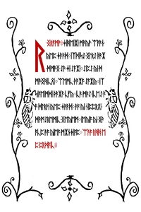</a>

**Key:** Substitution with reversed Gematria (Gematria_Primus#Gematria Primus 2014).

    ᚱ•ᛝᚱᚪᛗᚹ
    ᛄᛁᚻᛖᛁᛡᛁ•ᛗᚫᚣᚹ•ᛠᚪᚫᚾ•ᚣᛖᛈ•ᛄᚫᚫᛞ
    ᛁᛉᛞᛁᛋᛇ•ᛝᛚᚱᛇ•ᚦᚫᛡ•ᛞᛗᚫᛝ•ᛇᚫ•ᛄᛁ•ᛇᚪᛡᛁ
    ᛇᛁᛈᛇ•ᚣᛁ•ᛞᛗᚫᛝᚻᛁᚳᛟᛁ
    ᛠᛖᛗᚳ•ᚦᚫᛡᚪ•ᛇᚪᛡᚣ
    ᛁᛉᛋᛁᚪᛖᛁᛗᛞᛁ•ᚦᚫᛡᚪ•ᚳᚠᚣ
    ᚳᚫ•ᛗᚫᛇ•ᛁᚳᛖᛇ•ᚫᚪ•ᛞᛚᚱᚹᛁ•ᚣᛖᛈ•ᛄᚫᚫᛞ
    ᚫᚪ•ᚣᛁ•ᚾᛁᛈᛈᚱᛟᛁ•ᛞᚫᛗᛇᚱᛖᛗᛁᚳ•ᛝᛖᚣᛖᛗ
    ᛁᛖᚣᛁᚪ•ᚣᛁ•ᛝᚫᚪᚳᛈ•ᚫᚪ•ᚣᛁᛖᚪ•ᛗᛡᚾᛄᛁᚪᛈ
    ᛠᚫᚪ•ᚱᚻᚻ•ᛖᛈ•ᛈᚱᛞᚪᛁᚳ

Using the [[Gematria_Primus#Gematria Primus 2013|Gematria Primus 2013]], the runes in the 'Runes' become:

    R NGRAMW JIHEIIAI MAEYW EAAAEN
    YEP JAEAED IXDISEO NGLREO THAEIA
    DMAENG EOAE JI EOAIAI EOIPEO YI D
    MAENGHICOEI EAEMC THAEIAA EOAIAY IX
    SIAEIMDI THAEIAA CFY CAE MAEEO ICEEO AE
    A DLRWI YEP JAEAED AEA YI NICCROEI
    DAEMEOREMIC NGEYEM IEYIA YI NGAE
    ACC AEA YIEA MIANJIAC EAAEA RHH E
    C CRDAIC

Applying [[Gematria_Primus#Gematria Primus 2014|Gematria Primus 2014]] to each letter/rune yields:

    A WARNING
    BELIEVE NOTHING FROM THIS BOOK
    EXCEPT WHAT YOU KNOW TO BE TRUE
    TEST THE KNOWLEDGE
    FIND YOUR TRUTH
    EXPERIENCE YOUR DEATH
    DO NOT EDIT OR CHANGE THIS BOOK
    OR THE MESSAGE CONTAINED WITHIN
    EITHER THE WORDS OR THEIR NUMBERS
    FOR ALL IS SACRED

By substituting each character for its respective value in Gematria Primus 2013, we noticed that the sum of each line adds up to a prime (emirps marked by *):

    A WARNING
    
    BELIEVE NOTHING FROM THIS BOOK     =  757*
    EXCEPT WHAT YOU KNOW TO BE TRUE    = 1009*
    TEST THE KNOWLEDGE                 =  691
    FIND YOUR TRUTH                    =  353*
    EXPERIENCE YOUR DEATH              =  769*
    DO NOT EDIT OR CHANGE THIS BOOK    =  911
    OR THE MESSAGE CONTAINED WITHIN    = 1051
    EITHER THE WORDS OR THE NUMBERS    =  859
    FOR ALL IS SACRED                  =  677

Outguess:

    -----BEGIN PGP SIGNED MESSAGE-----
    Hash: SHA1
    
    4dd1c8afafceed237cca8a334b24fe09069e3771e416a749687af002b4de
    844566fdef57ba9f76a17c2ca1472f08cbb7b595524310614d8f9044f7f5
    49c422a0f10599ace22d443907db0d54d6bf726f1c42c27fe93b7d8a5980
    0661353b73fd868adc2ab687a0fdc7cd6560f917a1392e6594b62554b8cc
    b844f766583cada19fff1e233867020d49c5b4669b64c1bfe2cb7127b2ca
    76d117be8994665dde9a1b49f16494eed2cbd31d4faa8f66b3afd1dc8fd0
    96c344c89f2a23ed0d493524ab9f61ef020cbd8a4cd8fb0f21ecdfc461b0
    e5aae8037a9ffc7667bee4a11479000c1c93f64dd2e38173f9e8aa380a3a
    5387612fbe0787389a91633033be608eb9c0b799869704413a6bdf74961c
    d81ac702815f0d4503a212828ad9b25efae12b9bafb4debb3f38f6825fbc
    81053014e17d79e82c2548d23e9c32228feccf3a53ca80def3a96a75d83e
    5f21b4c35d2641e9ac3a0124dd6dfb2f5187b16c4858158afc0bd285b0a0
    ff43bc3452c52e59ffcdc6d5837daabf6800ed0354780625215b2eaa3e4b
    1f7323d5ef64419c6ce0b84efe4f5b4c2656d47da20820c91780001d6759
    84ee9984864f6679e35fdf255f6478d49c1843277364ecd66da6d0d2d133
    fbbd94a63d6f1edb6b8f692c87aa1c99078f8a9e855ee80e27cac12c3033
    082355388893e86bff30b33820f71254ee6e920e0ee27b1ca97b1ed69147
    a4ee2cca257b9e728ff835b162289f112a90d2de9feaff313beaa624ce7e
    a4a3f875bcad3e42aa5bd19c3e3c9a3641c692bc2b987fb2ab551d9503f0
    91cf1ca69a88354153c8308b759010bd415f85776cdc1c0f5b965ab00ab4
    52ef5f513daad68fd1c94d3547f46aa9baf2e5323a933ec4b2334dea55eb
    37a4ec7453d40790d27a082264586e0e3ee1e499e1e0544e2f578bd25d22
    06774a80f0d56d4d5f6de6cb95e557b392071497fda207d1f82abc6d71bf
    deca78cd55bf7c89be389d8840d5f57f8109ae2cc4879b22191b10297c0c
    10965320ae295521074743a119fed32a078031cd35dd1e108e41b0f0f591
    e4941f1be81d8ff793e3ec2ad1a3ca718220d8f402eac82da7e51668b90d
    0dde5db35f5f933c0d13397afa4377ada56ed49c7ca3fa0b6a190261561b
    eba51e102fff455a1bec3424f5e9800c6345460c4fdf23b8c8ce0baaf73c
    55712d8a71cd2aa3143f337cb322adea56ee79ce4b239ce352f4b863298f
    2c1f5c4ec348f1569c1d125be9c3419ffc5b533b4fb5154c3c5c51a7c4e8
    0f3aebf392cc81f2b29f773a44b4a2d7bc3c690f8f58e1aa4ba9d716961a
    31003f22306b8c9271b5fa0dc588be92ece2c79043c841592d69fbfbeac4
    60c4259e4339a3c8e3e100c3dceab0acb351f026189e1335cd0701f97667
    a3
    -----BEGIN PGP SIGNATURE-----
    Version: GnuPG v1.4.11 (GNU/Linux)
    
    iQIcBAEBAgAGBQJSy3GcAAoJEBgfAeV6NQkPG7oP/RbIXusHQ/HFHc837NxYqqVI
    kVUsXqpJCyTVvbvQKooL4vkP2o/mdWoyyLbHjCdi1RruTXAfiNo1d6Wp4DckLtqD
    H/rpWMa9sUjlCuHBYQGWYIKfmz3xNaN5Au1qaMO/JxVOs0SrF78PFKeb0DorZZxA
    UljcJ1UVGlPZWTazBzPco+6LwVJi1Nnh2P/Tpz+RAwwI6BIVoEkWws0PD0JF3ld0
    GCDZ0KtnN9OigjKqdG9rrZymFiv3kr5w8HgvVt6c9+UAa26KK6PCXI+XVQ14Yn4C
    RQehAfQc+aJwUsRxhgdsuJHQm8tfljt1Lq3MKnYkpyjGek/ZQndZkNz8VU9uNHhm
    SzEp1O5vo6+pNzpUSVJRCGFcsNt5K+zn86mFYv+Wj9SxLFml1zujmk4gS7m94hFT
    daKvEFCFLmT1Oa2d81zA7W2VhA9/BgphIQ15W8cYfxrw8XGvxhb4O9IFcYy1QIcS
    yzaDpZ2Ig6a2nbRITwbV3Azt1C9oU2bzalLQYyaitITVkRenVdOTb+7dNq9bBYvx
    RwIL1M2aIjJSxxjAqUXsmsQ2xdHLPp1jVZ3kM4Y9ZIEx2GYaSNT7LWH2c0wwBAa+
    ISgQy3Dy7Fzqyfo9yGpeHEmMO8gOEzKTlNbFhnhIE1PBVoPH/b+itKrsYXd19CgZ
    OgqRJn3MNOr+Ne7K97z3
    =fabe
    -----END PGP SIGNATURE-----

## Intus - 02.jpg

<a href="assets/2014/liber-primus-complete/02.jpg">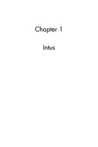</a>

**Key:** - (Written in cleartext.)

    Chapter I
    
    Intus

Outguess:

    -----BEGIN PGP SIGNED MESSAGE-----
    Hash: SHA1
    
    17a1e10393d3c62b0e2c2d59ca197f85246746c533bf6d8316f2256679e8
    f3fdf08d1a2a30470f0bccba289066e74a44703ebf32d0c85072b96d75ab
    0d52aeb0fa971d00161a78adfcf82fe97e68004551973b11ebf9d09f377d
    41328e401cb3287240c6d6c7f479f1521b73e958d15305c6e12f2b0fe59f
    37581648ab3ce7ff718573295f249dff41476700feba4c9ed321cc593e68
    5015c175301674d1ad5f02ca8be69a786c4941fd41d7e177d710fff64041
    4e8926bff638e4e9f056de4d31d56e7aeb21b1c64f5b963f328bc3e9fca1
    9daf235deff53c368d24e32213ea621747d64c77dae0452f9235c9ad4eab
    e001066c03e47f663bdb56a55f6ba3c358e5b63a66b64dbd5dae1a7fa9e0
    bf0c1c520e08dd1f57b79510b48fc55717cf2f45c5c1f2cad771d06e00f3
    cf46e6cc99cd80f30ca39ec403485ac4e34a2e9905d2f3b29a754f2354a6
    49e0564ee196b5934010c116e4195da9fb2a62cf493d1ea1e913cf6c01bc
    7e14939380edffb4e890d571a2618aaa56567da3bda4ef5c70d87d6f848a
    c4cb27f9e27d873f2e19711be4b4d3687d2da067a5270c30cfa7bc77ef39
    6ce0228d259e76e187c1acc9299dc4656dbf7d427d5489fb09f00768b287
    69c33a87b9949f657277bdfc83299a044d983cb700f57f099d8e93a97ff3
    230161f6e58e1c48885992a76a18b0d6b53f7c36848fc4ae73ce86459d9a
    0133503262335d3671f0b5065b63c7ed7940b06df492c1a48527026dde55
    cb83e8851b795ba6a021a571ab1f8e8a221756a438460fa8dc3cf189d78d
    bce1af1f4d4adf4d66a892bece6f3ba50bf0aed30f96287b08839442f11e
    01e8dc401d040941d7d862cba80edb651f83b31059e6c17613a9d2ff24a7
    e88f7d534a612334e50798ee2c81329eccb9fdc36db00e25180b64664bb5
    522e10471e4ce5e400855932a07dcde4c45ed07d879a1b298afb53a9c8be
    6017e101ae19f79693a9d89b0cc91902164a262b2386f4677ffc9f3b28b7
    0fe2469121c9e87e07b3385d8f88edd77c012ad378fac5b465950e3d2969
    4777e6e7748d0ff19d38757198625816759c5f4b040667a26238c0315423
    4af3bff4d40b5674bbc2848ad8b3b5f58dc191a68cf1dc435c7a0da7ac21
    7cb5ee52de5527e9c7adba5f8f4104934bcf4821b4c639322ef45ec817b0
    ceec2abfab5b41f04cc0193401da8e8a244e8d940d2283ba0b713629548a
    2a272bcf09d53023e3c21a8ef95fb1e5bfa4a7d9c4d51d0af3efbcc25124
    b7f8500a93818b3f6b621d1f410854f02bd87a648a4955fcebb67bfcdcbc
    7bbe410dae6a45e79fffc51f1f1f4c8786682db0609d42045d203650340b
    67923e6a9a2120930182828f9a82ffc7c5e4831be89d87d7ccfd021bfb13
    57
    -----BEGIN PGP SIGNATURE-----
    Version: GnuPG v1.4.11 (GNU/Linux)
    
    iQIcBAEBAgAGBQJSy3GgAAoJEBgfAeV6NQkPeooP/22GiX8uJLQlZeGHMTgSFuef
    1w1IJNrcCeS2Bi/NL21QSPEaOI/BnQ8OPYr8YdOlwdOg+9ZhZzkh4FoybcRZlcnO
    v9au5GPnmQIbwhKZFf2sr2l/A9IZPkYSVjx9bFd8q5/QHKYMiglBiXiV8qpI11mm
    0Bite/O19pG2KjXwtwVUX+kQcde56lDTMa1jW7b/mdpbF7u+N2xMR0e3NOYSHeLa
    b7NWUKaqsFQ/JdzXsXYd8IPjRjSg3rhaVBAFD7yVG5AmTTCe6h0D+NEO0yW8c6x7
    fQ25erhmpMLYKyUj6yTSp2HH1hw3JaIktRUe2j8cVn5H2NZtcUVfvqTyPvf/Bmdn
    6SRiFWPoat1IRd8apBzpREPrYx2NTTqE1ruvUvFRGYf8G4oRf3+6uYSN8rLNKeHo
    pAyAUIO0ilrY70x1K3iug1BNdRHk1uEuqzFyY4FWI22V0PTUsum4PyXaTtNo0Lu8
    oqkConHUTzH7R8c3HHJVgKfZfQZ1fWn2PbOOMJVNTsegn7dIfDpA6QcWTEZ4perh
    W3Lxfz9hBhAbQlsImrDqva7PBAjSO5VzBQYRlR/P3ImNa0EOCM3/iC+SuILKZfIJ
    acDNmtCv2+sWLyk9LihsTUomFqJFTbVSmLul/uo7tbj7fNB72T7+SYqde3D4fdco
    TYZhnC/brWCq72fdZSEc
    =IW8b
    -----END PGP SIGNATURE-----

## 03.jpg

<a href="assets/2014/liber-primus-complete/03.jpg">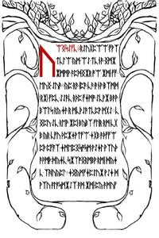</a>

**Key:** 6, 19, 28, 19, 20, 19, 13, 3 (DIVINITY). Shift up forward Gematria.

Note: Every clear text F is an ᚠ (F), and needs to be skipped.

Runes:

    ᚢᛠᛝᛋᛇᚠᚳ
    ᚱᛇᚢᚷᛈᛠᛠ•ᚠᚹᛉᛏᚳᛚᛠ•ᚣᛗ•ᛠᛇ•ᛏᚳᚾᚫ•ᛝᛗᛡᛡᛗᛗᚹ•ᚫᛈᛞᛝᛡᚱ•ᚩᛠ•ᛡᛗᛁ•ᚠᚠ•ᛖᚢᛝ•ᛇᚢᚫ
    ᚣᛈ•ᚱᚫ•ᛁᛈᚫ•ᚳᚫ•ᚫᚾᚹ•ᛒᛉᛗᛞ•ᚱᛡᛁ•ᚠᛈᚳ•ᛇᛇᚫᚳ•ᚱᚦᛈ•ᚠᛄᛗᚩ•ᛇᚳᚹᛡ•ᛒᚫᚹ•ᛒᛠᛚᛋ•ᚱᚣ•ᛄᚫ•ᚱ•ᛗᚳᚦᛇᚫᛏᚳᛈᚹ•ᛗᚷᛇ
    ᚳᛝᛈᚢ•ᛇᚳ•ᚱᛖᚹ•ᛡᛈᛁ•ᛒᚣᛒᛉ•ᚠᛚᛁᚱ•ᚱᛗ•ᚳᚷᛒ•ᚣᚱ•ᚳᚠᚢ•ᚦᛈᛡᛄᚹᛏᚠᛠ•ᛄᚷᛒ•ᚫᚦᚠᚠᛠᛈᚦ•ᛈᚠᚪᛉ•ᛄᛗᛖᛈᛝᛋᚩᛋᛗ•ᚹᛇᛄᛚ•ᚹᛉᚢᚦᚫᚹᛗᚦ•ᛞᚣᛄᚳ•ᛋᛡᛉᚩᛝᚱᛗᛒᚹ•ᚱᛗᛁ•ᛞᚣᛄᚳ•ᛉᚻᚢᚣᛈᛚ
    ᛄᛝᚣᛗᚠᛄᛈᛇᚢᛡ•ᚹᛇᛄ•ᛞᚹᛉᚢ•ᚪᛚᚪᛋᛗᛡᛇᛉ•ᚫᛗ•ᛡᛗᛁ•ᛈᚣ•ᚫᛗᚢᚠ
    ᛗᚣ•ᚣᛇ•ᚫᛉᚱᛄᛋᛖ•ᛖᚹᚾ•ᛞᛄᚢᛋᛉᚣᛏᛖᛏᛗ•ᛇᚱᚣ•ᛞᛋ•ᚾᛖᚫᛞᛡ•ᛈᛒᚢᚾᛠᛝᛄᛡᚫ•ᛄᚷᛒ•ᛈᚦᛉ•ᛈᚾᚹᚹᛁᛚᛗᚫ
    ᛚᛈᛒᚢᚩᛠᛡ•ᚱᛡᛠᚠ•ᚱᚱᛇᛄᛗ•ᚱᛗᛁ•ᛞᚣᛄ•ᚻᛚᚠᚢ•ᛄᚢᛡᛚᚦᛠ•ᛇᛄᚩᛇᚱᚱᛗ
    ᚢᛗᛋᚳ•ᛠᛇ•ᛚᛁᚫᚫᚳᛚ•ᚹᛁ•ᛚᛏ•ᛈᛖᚢᛈ•ᛠᛡᛈᚦᛏᛒ•ᛏᛗᛖ•ᚢᛚᚩᛚᛖ•ᛇᛄᛈ•ᚢᛠ•ᛚᚳᚷ•ᛠᚷᛋᛡᛏᛗ

Translating the runes from the first image with Gematria Primus yields (Author's Note: we haven't verified this yet):

    uWGsSfc rSugpWW fwxtclW ym WS tcnF GmXXmmw FpdGXr oW Xmi ff euG SuF yp rF ipF cF Fnw bxmd rXi fpc SSFc rTp fjmo ScwX bFw bWls ry jF r mcTSFtcpw mgS cGpu Sc rew Xpi bybx flir rm cgb yr cfu TpXjwtfW jgb FTffWpT pfax jmepGsosm wSjl wxuT FwmT dyjc sXxoGrmbw rmi dyjc xhuypl jGymfjpSuX wSj dwxu alasmXSx Fm Xmi py Fmuf

After some time with trial and error, it was discovered that this ciphertext had been created with a Vignere cipher. Reversing the cipher yields:

    WELCOME:
    WELCOME, PILGRIM TO THE GREAT JOURNEY 
    TOWARD THE END OF ALL THINGS.
    IT IS NOT AN EASY TRIP, BUT FOR THOSE WHO 
    FIND THEIR WAY HERE IT IS A NECESSARY ONE.
    ALONG THE WAY YOU WILL FIND AN END TO ALL 
    STRUGGLE AND SUFFERING, YOUR INNOCENCE, YOUR 
    ILLUSIONS, YOUR CERTAINTY, AND YOUR REALITY.
    ULTIMATELY, YOU WILL DISCOVER AN END TO SELF.

Outguess:

    -----BEGIN PGP SIGNED MESSAGE-----
    Hash: SHA1
    
    Let the text guide you.
    
    Good luck.
    
    3301
    
    ffd8ffe000104a46494600010101019001900000ffdb0043000302020202
    02030202020303030304060404040404080606050609080a0a090809090a
    0c0f0c0a0b0e0b09090d110d0e0f101011100a0c12131210130f101010ff
    c2000b08006d024b01011100ffc4001d0001000301000301010000000000
    00000000060708050104090302ffda0008010100000001d5200000000000
    0000000000000000000000000000000000000000000019ff0040433addd8
    45537af6286be6013fcdbd8ee5bcab3dbb22bbb07fb0afe69ee2b7b23835
    f5bb41cf2c286722c1a4af61c6aa2edcf1a2a82efdbcab6d2ad6595fc5ff
    001987ede95c60645d1d16ca5b7fe7fdb1a1e718f367e08d418def08cd8b
    26ce1c2be625d7d668b44fdc84d47b6bce09d2d6fe34f6ee8cafacec7c57
    d1d173f8144edff6b2644eb6b326f5668d8dd75b53e656e1c83a7ff6a21a
    fa4c06458e5ed50d2971f98b4a3d5daf93edac9d2dfca451ff006b9722ef
    f3e797d630b63a3c6ae3bdaa318f9d3f04ca7f43724f075bd2d49ef88366
    8b8e9cda5fc55940dfd6b62cf5fbdc7dab85ef5a5fddd8ff0035ec3dd803
    22cc2bbabb40677b73c47277ad3296adf987f41b30fe3d08f46afee657ba
    d257f3eb48deb43caab19551b39d1b9274c519caf574d676ba603a0ff7f7
    313edb315ed4615907a1fa6d5c55aab0afd01ea63fb1ef901917d7bb6bbd
    338e7f2975a995b79652d5b8af6a62bd71d2c4dd1b26355bef3e44562157
    d892ab4f137766565e61b4fddae3fad5f8d27f605c2c336569c315ed461d
    dafe8644dab8ab5553fa2d87ecbd2a0322eb2aca2b7fe558eea991e5094c
    1360e2bda98af69f9c5be768e5ae75ed60188edd955ab90bc6be53f913e8
    ce48e66cccf1456fc3c61cdc862bda8c59b4d8aa7505d5551688e4fce59a
    efb019175d55515bff002ac7754c8f28689c91b7715ed4c57b4fce2df3b4
    72d58b09f4b46c473b59d2ab572178d7de8630baf8118ea5bf9aad0ec47a
    5367e30dd662bda8c59b4d8ab42509a86a2d119ce0ff00c683b100ab6d28
    cf36715a7a165742b2b378dd9a86dea8adcf35179b72b79ad6b22cf521d2
    315e949aacf16a7a1c097579e849787279157b3bcd5c0d1f2c2a2b75515b
    aa8add8d74a2d3ca8a4bec72ac5000000000000000000000000000000000
    000000000000000000000007ffc4002c1000020202010400040603010000
    00000005060407020300011036371315163511141720303312217025ffda
    0008010100010502ff00b0d9ae66d5a5f1c0d6f5e5e0a6601f1bc6e6986a
    825d9e0f02121a4ed9a2398381aeb67f20b6c490d3cad9e8fb39c79b27a8
    19d25eb11ad1da539e9eaeabce518c15e33b768572386786cc3f6b933fd2
    70e1cb8d3e2f688e1a3370e1d279061280f783668cb2c70e81ecadc69cc6
    37c49ac5c6e3fb1681a2b7e96c13264e8871d3ec494cec7fb0c4c943c6a0
    d8b8346ccf3c75e3aade1dd5a38f965fd3b2c53d63b9abb0b74d269cb88e
    e715b869e97b8783ad598a340991686cdee0f6eac8a4c76233cf5e5fdcd5
    26157d5a301e651ffbef0fb82cb1c2671568f82a238ca52213d8048e0ed2
    c241a09da1e3c867201b5a972e3408cb86349fb7b9626d93a2c24077d0d9
    0159977ab48af15b447e5d5e5358bcf595858ef382dc1ad3e2fea01f9f30
    5bb91b870fa7acd2330baf55effd74f5ec719c1adf4fd5144e43b19367ca
    babc5ab47cc80c9fc7f1ed64e5bf5d855dbb60d03faf4e9d7a39aecc423e
    e564e6c02ebd4dd6ae2dde44a86fe88e7a5b876ed3a64ea2e389556d0f4e
    dbdc77a5a9c65311c3cf0b6b9b225b89d27646951a6e8e58e9dbc1cb3b61
    1a7019097084e3c1ecd30bc02b347ddbf6d9bf17ebfae1eb5b242b39eb28
    7852be53c046a6af94dec5059d047354b1eb15f2a4252e96d04f99ab9437
    916aadbcbeddcb2b4230020bf7de1f70ff00d7a9daac02110ad6e9cb03d9
    6bc8b32712c2d30505705da1e3d0f23f5b12717198f841502fd3d6af3fc7
    1d97883aec38160af84872a6884a2f6b355bf1b0867ed95e881e657e2307
    7665cf72c1da3f4dad2eaddb1dd2f1ff005a9a52b54f4aab9d379f8bcb2f
    7ed637bfd1a52e0eaa16464fbabc5a3a27463aeead7debd9866451f70bc2
    b4e4c2caac3a9a035a0c8384825997d554fc791a25688faf5eebadb044ca
    dd9970e69630d6fb20fd2311c8e09ed78e58e7d1d8fe6b6b95ea16b6de14
    a8952646ae8c4f566de67861b315daf44af1c5af7219ae411a3dc66f71d8
    2235a4b2d4abd10c4ea57ca79540d865cd6a47809ea55eea041462b092b6
    2b46ed3aa4e933126829b5a0ede7dbff0082f0fb85c07856915181151355
    8e226670a25506ac55cb1f204c65a1e3ceed3a252f2a91935d32c5dbab7d
    ddcc7de9c123a7979ea4af0d504dd5e5214695b4d99d95e62298429d913b
    34c8b9865e2b179eb230bcbfa8b314f6b84aaaf05505c8dfaa2e804d3a20
    368cb917266dd1bf449d37578b55de0968a265d7959bce0721bf8f905ac8
    af5ab0cf12a4602c0555152ac96974528cd422ab6a943886d9fa05dbe047
    10b45a19ce444e5eae57b6b69bb0d3306a1951b8ec99ac90a1a634418108
    646cb3c70c756cc5a6daeeb5ee4ecff3b21966252bcc7c326c615ab19a95
    f29e52be52d9e2ca4b64dba68c1b10440e5d213ae9214e89c61acff05e1f
    70425390e04ed1f05a504c2f96f2e70d02092b43c7eac43f81d1dd363370
    eaeb44a8b62731f7a7295f29e5d5e52183c1043a5458f363a541d432d55d
    f72b9d6720998ba35edd508c67b170ee3974cba191bf381902be4f1fad9a
    a804523d54c53441bbabc5aaef04cb1e9974740d1172c023eedb390f613e
    8a38169eac46192aa9b1eac987a8255e93f2589f95d73ae3a8266d18ca50
    64431020ca275536d98f9ab745ae52f0581bd9e61befe6e9cdeb5d35775a
    f72767785a895a9122468118c888474752be53ca57ca5b3c5a93c71f90f6
    b78d7422cb4b1be9b877f05e1f70d1a34c5d368f82d2be2dcbcf96878f2d
    f8ef35fbcde9e985558c4928662e4e52be53cbabca7b2e7b9577dcbcbcbf
    a9f87fc6aed048fcd143bb174c355bd7578b55de09cb4bd8047ddbdad2de
    135aaa6662b432e3d71cba42f77b065f4adafcb97785e812b5cc4466deff
    00870dead6a167775af727666f7276a57ca7f51cb0878a57ca5b3c5a93f1
    fe16251c38ddf1264f1eafbf62735ff05e1f70e5a3e0b4af8b72f3e5a1e3
    cb7e3bcd7ef363010994526829eb9677295f29e5d5e53d973dcabbee5e5e
    5fd52477cd6aba4c8fc41922d02e1dc87151c5a3b4bc05578d59869cc8d3
    7578b55de09cb4bd8047ddbc9d3a28d89d3e676b37bc57910a03aa9d7acb
    d50bddf768de9fe111b20464c5e144acd67b390f4ce81593b7d4106eb152
    240eae5d45160c58d0b07146f590ff0062f75af727666f7276a57ca5f52f
    4368da763ee88e2d9e2d49f8ff002e7398c610d60be9fab5bc17e66bc413
    bd0fabfef714388e1bf8c8135b1865156d0a2378e49115cb8c75ec463823
    e274810398a345c5cb92444094438a35d435125c6eaea13712ed02bb8701
    b205770e03671c92a338e232162306aad770d50ab426056bd326912b8ec1
    14a68d7b6142883a2b7ab686e1ab6135ae05e31a1446339bd0626f70e4e8
    3109445a581aad0b9ad1816b66d48717538342ee8681305186c759000a12
    e8be09460218defd1a64e9394b46dfba1d2247aec5d5812af0fb8faea18f
    6bec42bb8641afb28d750d4497310307060270712635414e3a841e1faea1
    b19f6e56d0dc3715a89f4c27276a4fd5ff0062ffc4005310000102030306
    060b0b0c0103050000000102030405110012210610133141512242617181
    b314233252747591a1b1b2c12033435362727383c2d1e115162425308292
    a2b4d2f0f18470a3c334356393a4ffda0008010100063f02ff00ac302cca
    56d252fb6b52efb77b51cd1338866d2b5c3968dd56a20b8904790d999a4b
    9c2a65e1b451493b41e5ccb8f88379e5d510ed6d717f76f3f85b27e3201c
    643931872e3f79bad4dd6ce1fc46d0318fd348fc336e2e9bca41cdf9aa56
    d76054e17385ef17f5f3e68fc9488a35130d754c9afbf26e2547a457c999
    f809ab8ca9a6e114f0b8ddd3782d03da6cc4a246db51517a41d915c6e8ef
    0538c7cdd38404a26cd185626302d3a9bc384cbea5285d5726ce7e4cf019
    230042d44b863174c134694a4a072ed3fee93291445c66360629d692907d
    f5b4ab050e5dfe5e6b4ada8e4a7b0e3cba871cdad9176e9e6c4d7f0c438d
    ac292a15041c08f7505315b3a465c8d4b0f8da1b2959a8e5c059b8d83792
    eb2f26fa169da33c7e4945d1b75ab8a8657c602da54a4f3e273454cd10ae
    441876efe8d031367998c4b6cc732aa96d3a9483a88b15288006249b2a4f
    2f813112d526ea5c48e1a48d6e1f93b3c9cd68fc997eeb5170abed58fbf2
    280e1cbfef33d35660d712a450048180aed572583ae14a2358e04437f687
    21b3b1712e0434ca0b8b51d891acda365c9962bb07bb61e4eb6923bff9de
    6ad31d63dc4446c14b9c8e79945e4c3b6aa2976765d320d43c70256ca41c
    1d46ba0e548fbf7d8ad6a094a45493b059c8171bbb2ac19444fcb04f0fe6
    9f657933352c9386622252b0a8abda909ef39cf9ba7088c9a9ab2615c710
    cb90a950c415349529a51df53874f26788904b885c2c142ad4e3b4eede0b
    48c39054f3e6beab8d47322910c8f58721f36ab4c63e1c8d2c3423aea2a3
    8c94122d131935536a71a88d1a6e22ee1741f6da1e492280ecf85bfa070a
    0f09c5571520eaa2403c871e7b43a1371c963e10e84e8b1201a2d17b7fa2
    f0b434d64aeb454fc4a1178a6f0282851f60b2729e22e2a29508950c302e
    ab0186ea9b45cca72e325b0e8659086eee20555e94f90fec257f42e7a459
    b99c19a5ec1d6ab52d2f6a4da67f53d722c14ede5cb625575f46ef969f94
    3ce3a2c67b1118830770292b4e37eba8277d6ca9bc620b6dab80cb6314b6
    91c5077e38f3db243c0d5ea33683306b37a11a4433c856b42d291e6dc6ce
    46463c9699653796b56a02cd4da1db2869f5bb701d77430a483d34ae68f8
    8832a4bccad9750a4eb494b4935e8a58b510a43732871db9a1c74fc60e4f
    4748b4646c222b10fc22a1da57c5a8a926f72d2966f2df2b1e4d5f701851
    12712e29583a6bac9d9cf7b75a17c011d639619313c72e45b1c18771c26f
    383bc35e30ff00356265f2e710a99c4a6831f7841e3f3eef2f3cbf4f7b49
    79fbf7b5d744bad6d33984be214cc431317d485a7670cda1e2658d3626ab
    7425d65c04a500624f31d5e5b64d4ce3a1db65d8a4bcedc6d55174dcbbe6
    a599c979c3aa5254a0dc1ba71bb5d4d9e4dde4cec99d47763f645ed1f6b5
    2ab4a57b90778b7fef9ffe67bfb6ccc0c24e2fbcfac36da7b1dd1551d5ad
    3685f1823ab72c992cd1efd5d10ae0294708751dbf34edf2efad4668f721
    4a83a8530b414eb04348b76346a90998c360e27e313dff00dff8da84598c
    a890d530ae3d7801a9a56d6fe69c7a2d072791256972391fa58a63538688
    79fcd60ec4207e508a482f9ef3723efe5b4c22e096a43ec3e1c4293ac109
    06b651580dc6c3503ed8f328721c6cb6221a4b8db89295a142a14371b333
    296953b04f56e5e3dda76b6ae6c0f92d0d939936dbab877c214b4dde13ae
    1c6ef327d35dd64c226eae29da2e25d1c75ee1f246cfc7368263301a7a57
    42d8bebe9a6ae9b68dc7e261abc6759c3f96b6445423e879970552b42aa0
    e64e58e4dd59095853c86850b4bf8c1f277fe384164e414228443f84568f
    5bebae0948ef7513cbc8317326dbbbd98853edddae056da546ed796ed2d1
    193d110ce18c870598671cee98e450577bb07459bcb19f5e71c7145e8643
    b89513f0aaaf9479775a3f417b49562e5dd75d1235584b662e25333864d0
    e3efe81c7e7dfe5e639332376f463fc18871b3c26877829c63e6e9c22bc5
    ebeb1bccc4d601747193ab6293b5279ed359a40d4030110871075b6bd19a
    a6d119352e42b4b30885699607c194a45d4f29c6bf8d9b13379a13b9834a
    3a3bfdc3629548dfb2bf856c635a6af3d2e5e9b04d55a3d4be8d4a3f36d0
    30ef2eaf4be6488638e37344bb9e6c3f76d9339330c14aac2a2256948ade
    51e0a07ade5168294a40ac3b402e86a0ace2b3fc44fec257f42e7a4581aa
    9e973e4fd733fde30ff568d9840ba1c61f0ca90a1f4c8b472231e6e19c85
    8e75d6a257806fb5375a9ef77fe1681c9d889a96a04447003aaed6c959a1
    51e4fbcef36c9f95cbd14423b24a944709c576baa8f2db247c0d5ea33681
    9ca11a5838e650ed2a421e42856e1dca15b4364ce4d25eec57560114a17d
    5bd5b929d7e7d82d0927d3694c38502ba52a4c3127d399485a4292aa820e
    a3fa259f9f4238ef0aba0601a21a0463f3b6f9792b67173e70220a061951
    6e5e344aaea922879385610302b5332e64f00a8552d37f187e51ddd1cb69
    7c2345450ccb1a6d2546a6816b189b3194f2d8a10d1314f709a41baabe05
    74a9a7454ef237da266b9431c221c8729885b4e5097cd777782805356205
    9df0f8ef55cb457e5452442bb1d18c397b51be168a1e7bd68281876d4f4a
    2255a652cf11093c26c918ee00fcae7b49b9dffb1695e534004a62a1e5b0
    c624155038d86863f387a3a2cb944caf2e2e0d00874d4e951ab847bef4f9
    7342e4fc32fde7450a3680b59a9579c7f0dbdfa63ffdc9fedb43cc61dd8e
    2ec338975179d4d2a0d7bdb42f8c11d5b9696cd65a8fd650e97b0f8f4079
    7c1f9dbbc9ccde4b4e9eee45d83755d59f67937663171cb08610f317d475
    01a148c6c9caac9b516e114e058b830616767cd3eda5999b350eb66fd52a
    42b6286ba1da396cecb1d6db888a8e45d6da50add4ed59f3d396d2e9b4da
    5aa2c2869517d3c4386913be96444c33a975a753790b49a850b38cba80b4
    2d6f25493a88ec655999bc8a22e43c4554ca4ab577cd91b53abcdb6d0f38
    6195b497c628571543022bb71db6fcdd4b6dbf16f90b557e01231afce387
    456ccae7d005b0e37a3bce2384c5fa51c15f3f21360a49041c41168a9933
    4d3d036c57bf5615e8d7d167e7b3e7de5b1a52909bdc2797ad4a52b763d2
    79b1289732ec03dc5712e2962bca147eeb2f25a60e5187de543ad04f052f
    0ee549e7d5cb51bb3143890a4a85083b45a3274c708baa3d8c8501fa3a4f
    754e9a8f9bd367bc3e3bd0ed989dc43776ed4c432918441e293eddf998f0
    f81f4376869ae4f4708675fbd10965ba02c1e6ef0d4e1ab050b3f94f328b
    113110aff05a59bcad21c74aaaf4d0ef0775a2bc5ebeb1bcd3096c7b5a46
    1f96ad2b4fd6376ca0ec6897df76260622fad6682e842ee8bbd3af9f56ab
    45e5bce8971506ef63c3334f84a56a3e57a313ccbca69aadc6e0e1dda953
    6bb84118a1a411aa9863afa4d6cb877d016dba9285a4ea20eb168ec9e796
    ab8d4402a0534bf76f5c5ff0ac9fdeb4345450d2352d6d2ea8d30e00096c
    61b6b43fba7f632bfa173d22c240e3497e35ebaea3ff008057bae7388b4d
    a2e39f2188fec779987ef7b6a387d229e6b2322e58d9526322f4aa4275ba
    a212003c82ed7fd59b6a5eabf3863b62d57b82f134aa3cdc1f3ebb4ba513
    04e329d236da8f7574dde09e6bb6c90f0357a8cda519252f65112ef6343a
    9e55dbc50bb82ea11f2b7f3d369b5cca19496f4eda428a9355b683c641f4
    f36f164bec38971b738485a4d428184c0839ba4ff4999a954b5254f451b8
    135a0235e3c9857a2c897c3f09d570e21df8c736f46e1f8da17c5e8eb1cb
    2e6b35e040c3d12edd34ba8c6eb48ff37f2598caac9bed70b7f0dba170d7
    834ef48f68dd58799388085453d12f148d40a9b70da6b2e806f48fb91914
    a427beba54aa79ac9c969e2ee45b1c08771c26ae0ef0d78c3fcd58c9be73
    ff0062d23c8a91b6bbad4332db835695d0d8fe54e3fe52c897c2f0dc3c27
    9e2285c57ddbace44c42ee34ca0ad6adc91aece654cca156facadd7821b3
    4e1aebe6c4d8351f0f15035e3a85f40f263e6b222219e43ad382f2168354
    a8721b42f8c11d5b96967d775cbb39955256a8b4f0e2da40ff00b829e7f2
    efb224b327bf58b028952be1d036f381e8ada3a5f080179ed10403b4e813
    859cc85cab402d91a2674c3fed2bd9feace46adabb0f08df05b40f22459f
    9bcf17586668b7520ebef5b18d40e5fbec60c04b712d70a1dcef4eee6b1c
    8c9a0510a71618c6f689c1dd23e6e0756de7b454c626ba2862fb8aa6ba08
    6559e9acd4a932f8755568bfdca78ad27da79ecb8a6d9f7a406619a48c2f
    6a48e6b3f95b3c734c961ebe124fbe3baf7e094e1c9b361b69615004c610
    12c9ad2f8dadf4fa7a6df9ad1e54a5b08bd0ae6be00e21e6d9c9cc2c21a6
    906d44b4955f0970545edfe7364c1cbe19b618456ea1028056c56b500062
    49b262e598b498d43b7f5828640aaba6e61ce3dc3de1f1de8773bf324202
    d508f42be1276dd420d2cfe55651f6c84d263b34ce0a7069de01f76fa373
    694f0a05fa86af1ade4e179a5ff9bb96d15e2f5f58de68af17afac6ed39f
    17c47566cdca5952d308ca8baf3b4e0b37a953ce6e8007273d9996c0b41b
    6184dc48f6f3e6849fb494dc894681da77e9d47a47ab654cc81a498bc555
    f908e081e5bfe5fd8cafe85cf48b3f95994b7dd64b979217f0ebfed187f8
    2d33fa9eb9168c9e16ef4518830c1478a80949c39ef79866819a42b5a376
    3c3ba7035128bbc2e7e163cd6c90f0357a8cd9bca99c37db562fc1b64f72
    0fc21e5ddfea9a3171a8e64561df3b3e4ab90f9b5da021639b5a1f64bcda
    d2bd69a32b14cdd27fa4cd15e2f5f58de685f17a3ac72cccb25eddd6994d
    39547be3ca6ce4245b29759753756850c08b225cc294a6e16262d94156ba
    250e0c6cef8746faae59a9e64e3c8858875d4a9fc6e5d57c6a69b76f3e36
    9134fbe5f711a60a70a426f9a231a0c2d93b3d6dd51bf2e808a211c1344b
    61053d211e7b5e1a8da2256a89718444a746b5b7dd5ce30e9151d36d1b72
    287777a9f1a527f8acb724cca65f18055177de967714ece8f3d9792332be
    96dd5ad2842be05e4eb1d343d34b42f8c11d5b96967d775cbb14a8541d96
    804caaf329882cc4dd0697145c2383fc364fd3b1d426c728a4cdfe96d23b
    7b6818ba07187cafc2ccb19550c85bab45c505f08b8decbe37d911b057dd
    81781d1d7538ded428f7c3ee36699c9e8bbd15306c2ef8d6cb677ee56ca5
    84f264cd23e201084a87bd37f79f45a2609e1544417da557718650b47c82
    25cbba54285cd60bad9fbaf7f94b3f2d8e682d87d050a1bb94728b390b15
    7dd817a8174d4eb55c163e50fbc59393993d11a75c581d90e358f014306c
    729afb36dbb2a31b1f94a2d20ba7e293b1b1ede5e619e3dd98099ae57d90
    e291c32a683778dda8180c37d9e62190b4ce149abc5dc6f22bf07c9bc6be
    7c3dc3de1f1de8773aa5cfa941b8a898465653ac0521b06966e0e0d94b4c
    b49ba842460059e95cc1bbccbc9a72a4ec50e5168af17afac6f34578bd7d
    63769cf8be23ab368e5dd178c5d2bfb89ce997b4e5e6a5cde8f5e1a4562a
    fb23f76d172175ced90cbd3b409f8356ba0e43ebfec657f42e7a45910f0e
    d25b6db1752948c00b4cfea7ae45a2bc60beadbcd24ff93ff8ed923e06af
    519b4afc099f5066e93fd25a09a106d8959a289ee951238e3e4d2b8741d4
    696666700ee9187c1524ff00c4cd15e2f5f58de685f17a3ac733bbe1f1de
    ab9677c3a37d573349be73ff0062d9333215ac2c3b0d914e2ada18f9523c
    b696449bd54b3a155ed64a3835f37b84762507eb0843c1ef8dcaf9eb685f
    1823ab72d2cfaeeb979a4ff410fd72ec9fa763a84e77da9b62e3bffa4029
    7f4bb08aecdfc8796d00e4f5bac29736f737b8a4fc9aebb5e49a83a8d95f
    4aeff4e6cd4c42821a7dd6df3713c45f05787f17fbcccc3c563312e0542d
    da5e48e357e4d3cf4dd68633c6e951fa3158e0a5e3dc935f37291ee50ecb
    93a161110d3c108ef174be9e4d6a1cdee1ef0f8ef43b9d8f0f81f4379e2b
    c5ebeb1bb3f019490a61a016432947c50af05daf181dbf852d15e2f5f58d
    da73e2f88eacda3bc33ec27344cd22940350cd970e34af2739d568bca68a
    709bf1a96944a7df1c585ad47a2eff0035a531b12ed21a3196d6a51e08d1
    3a2849e44abd4fd8cafe85cf48cd33fa9eb9168af182fab6f3493fe4ff00
    e3b648f81abd466d2bf0267d419bf78ff49676551c382bc50ba62daf6287
    f9aab68295cc1a295a34c52ad8e2344ba2c721cd15e2f5f58de685f17a3a
    c733bbe1f1deab9677c3a37d573349be73ff0062cd41e353286569a0ad54
    86d2a03ca9b4c2566f768792f03b28b14a7f279ecfc14fe083300d12c965
    b1552773b5d6afb8d8454b6359896d58d5b557cbbacb2f4421e8ba76b854
    2b864f2f7a396cee55cc055a87754f2974c16fab60e6ad7930b42f8c11d5
    b96967d775cbcd27fa087eb9764fd3b1d42733b1d1af25a6194de5a95b2d
    537db9730ae8659fef553cbcd66532585437172e6aeb212317100770797d
    b5df6193135728fc3a690cb5f1d2389ce3672595f4aeff004e6d2d9c2280
    852a1d4698f7c9c7f8bcb685ca5983eab861d2555eedc7294291bcd41b39
    379cdeec26fdf284dd038ad23fcde6df96e4b08db71106df6d6db4ddd2b4
    91e9481e4c360b7e4998bbfac2112384a38bedf7dcaadfd06d013769356e
    0d6b6ddc3505d2879aa9a748b42ca9e886d88e83692c169469a409140a4e
    fc2ca8c9a46b6c360718e2ae61b6c98f4c3d192fa5f5a4ea430dd303ce00
    1ce7dc3de1f1de8773b1e1f03e86f3c578bd7d6376ed5444c218130ee568
    0ef42b90f98f4d63e1621b287598375b5a4f1541d6ea2d39f17c47566d1d
    e19f6139a1e44d39db631cd2ba011ef49dfceaa53e69b4aa1169a3ef4722
    21fc286fa9b5e079850745a413f653c38387434ee1f06ad47a15ebda1229
    4aabeca7b1dfc6a6fa769e714574fec219f898f761fb192a48b8906b5cd1
    12679f532888bb55a4548a282bd96725b0f14e3e971f2fde58a1c52914fe
    5cd07d931aec3f6269297120d6f5dfedb4ae05e983cd2656d16925291c3c
    1231fe0b43c0a5454219a43409db745337e797673ba6f89ba2efbddccd09
    347581d950455a2706ba292524736399c9943cc5e7d4e3058bab48028549
    35fe5ccdcca2262f30a6d80c5d424118289fb59d5958898bca754f3cf688
    a45ded815fdd656562262f29d53cf3da229177b6050fb59a113131aec3f6
    25fa5c4835bd4fbad0b2d42cad308c2180a3b6ea695b39348698bcf29d69
    4d1429200a120fb2c133068a5f40a3710de0b4f2728e4b7e873a8471bdee
    a1483e6ad92ecee6c5e48f8161376bfbc7eeb3705030e8618685d4210301
    66e5b1114e3096df0fde40aea4a87dab43c9997d4f221ef516a1426aa2af
    6e6859e3f1ef32b8542101094820dd5957b6c32bcc7ba1e0b42f43745de0
    a027d999c818e612f30f0bab41db6540cb52aa2d656a5afba56eae656546
    82b1040badf112e7c6537ffbd76fcf011ee978a94ad0dd177145cf6d9729
    88794d254a4aefa454822c725a39d5c6c2de529056005375ef7a493d366a
    57028e037ad5b56adaa39a2a7d0b0dfa4441aa01ee58a8e15ce7c7d0282c
    b8788692e34e24a56850a850dc6ca7e4131ec64abe01e05491ccad7e9b0f
    ca13b876dbdba141593e5a5bb0e56c5dbd8b8e2b15b8794fb85655a262f2
    9d53ef3fa229177b65efeece8cab5cc5e4ba87997b44122ef6bbb87f2e77
    2650d3179f538c162ead206b524d7f9731ca3691722970c619da0c1c1792
    413ca2ed39b9ad152d5aca1314c2d82a1b2f2695b3d030f16e3e979dd2d5
    6294c00f66644ee633079496f469ec6ba2edc4f16baf1c7cb66e5b1114e3
    096df0fde40a9c12453f9adf9aef2cb8c7637635f52457560ae71aed12c4
    3cc5e896e21495dd70001046d1cf8793feb1ff00ffc4002a100100020202
    02020104020203000000000111210031415110617181912030a1f0b1e170
    d140c1f1ffda0008010100013f21ff009861832158023f3e3bbe3c92dc4a
    5f195a74110d0f80d75c8a23e070443b8347a3be03da16e25c646838bc95
    a4ec209e41f2f8d2ac57abf0c4098630a41f318384f0f81a1423002fa8c8
    b1b53233105fe8b85c2c2a7d4b4ce5027807253c2ba456e01e6409a28998
    61a16d643a48e050975a0c780b8583fcfda43d8cd8c1aaf4f91623c9fa9c
    00ecdccf496877095320a87691f5e4ace83910f550ec1eaf12a2adbfd66d
    7805c6686a8e78dd58fd3ce017750803b73e6626f02a92c8e845ca33d574
    f2471964381ed18db4d697d18d1e5f67795842305f05d1fcc99a893ac59f
    a0319b60e906378a44916b43f490b44422ec1678960158805831ae06224b
    67e61b4d2a097c0f401b5736a4c196e187701c80a4a309afc1a891847dcf
    0e2658a0c32a2b5514969a4cc19f1c8f83c1c7d413ca62817004545d81d1
    3dfe6959769d223cc1201cd98c642d03aaf9592c3d02923b442580928460
    3f6a118437e933c3233614d3fe7ceec53c170913bda029d0e49c1654903d
    8c47ec8483d3b4227fb030488f3e303937bb0ea7d0a49c91d897403cfe74
    70ff00d62eb05c61363742b965008789d1a65b4103f2b7c83c220c678e40
    b9c95b47652c3a455c4c4b13e01ac93300ff0093eb2c45011a007b2c21b6
    f927107d092746481c1a989a9c1c1a9ad8aee996cfe418b35dc580967e92
    76544cb0ab40529032e3f0b17c82313b5fdafbf2e6736c0c397e344911a4
    5191c7f1542edb49a058df23260cc81ca52f737de6e3f6194e75a9ba9d00
    8f11e6a1fc7e08e4efc5bb68fecb02402de7c646e494875b93a469a30004
    923cf8db12c1a84f889c541708a5546796c04c24d00c542448479c9b269f
    0db408a621ec6123c83bee6dcb6ab18ed31bb37b61b0ea24f61e8c3179f4
    fe1523e32e0f4c867f845384f64994e26e908348e75bdbd975f6d0637234
    c41db90ac2a16289f4e01c04a24fc1b207601ed605786d19b385490a4c48
    91384a4c817fe68e464f1e3f6278979f1564d152d0a86362c44ef9a76000
    d22d7a54993275c32e0282cc2d5ce6e0623128cf4f70a811063b6404ba7b
    eab6fc4f0207b43c652e6700c224524293f8fba40c63774a05111f94f4e2
    43e592c09eadaaf5057ad908388ce893ac9dec67911c2e4524142f32a1a6
    a0274af191952bb625b392a492ae9caf32a235051d66e5960482a8340e3d
    cb1bd32da9078b9ebce42f89094213c29fbfd92490c4c149313d04bd2fda
    f957a4444fd888fc64142bc49ea4c3f01e181c9ac094f4495ba2522ca323
    904dc9b5fe00d078bda00581949f0cdc30c228a634c850b084dbe94be09b
    75aa2171d4a8f5e2b5e3f20b913930f158d03a0ee6d49a0d14604c895001
    7ec83711ce215bc809489130d2e5250384dbbcdc549b6b786f6bcad95911
    3dad3389e1f246812ead00814863c51a4ac8a91507080ba265831d051962
    51a41868261c90208fee64d3f132ced50072484b60ae5eefe57418956653
    c7820409198da11a80df0a01fe6995c93849e3207f0b4b4a69d3973b70e3
    402c3d069bd1327af4788ee9f2573bd2efd66c5585a6e6a6d4d7d33294c3
    6a97b5687dc22159f3588c5a122243a713871b5c8cf676b27b30b7d264ba
    44de0aab8654089d464920984dbbb09831a78271b4460da11408818e5eb4
    0e8c9a9d24c444a71b38906ce5080ae208a45f3f4817790913bc67e30a1b
    a16dc263cd7028ff009657417f05a366114c6fabc9e93e15ef133b463454
    b9871833a7847a03a44d89848c61803214dd2765259f09dc59306ac99a8b
    d385917e33bfa982198635a41122c04670a8b2ef3cb2bed699f2c80be7a2
    39c4784411ecc4de36a1005486c966907144c63a2c9ec53068059583f916
    1a084d89110b9030627a391a13d2381b164848bac103d7c3274c21111969
    0176e4bbfda24b06c49a397a223db35b9e2a4dc183d1d4e896b1e5559b05
    9a3bf8e5c1b833507435080d8c5f0924e920925387f5fc41c5e4e8fc579b
    a46cdc8131d0058e099690949c03b1c19229b26ea8148973e37ff4bf8890
    b2442ff05df6c3e6a3196025e8c4701daa73a6c744817390ab2af0296509
    f3be0690297783ec8c1f6dfb2a40f57973a598b10f68e3de3a1442045f5b
    49d9044cb1fd0f594d4642428cbc41ce1b52b1a898379758d09817072b2a
    7f10cd1257e0c02fab4d4b9e07f16754d37e639050042b1a4293ce41154b
    9427d637ce4b45742ec1a751efd8e2d7e6d112fd9883de353b9bd453d145
    ea212715ac8dfc1f02753830ea5b1d0f412a3a74872039b1f5f28e6491f0
    f18ae68b9028cc4a63b1f6343d0f320ac0aa620ba752e634142a530ca7a8
    03e01a9f455e436c666e9496d0892ab01938d57ecd158f45d720712dff00
    6ccb727163ae950222531d0087ca3f264a7516e8ad7cae040750800dab90
    182039421c7eb96e4221340cf4fb8c28e0989a481f443f42709287aa15ee
    b2208f2086407e8c9910d84dec003d9df0b68416b58c3ed769957955f00c
    5a906e5b974faf998feb02ee65df057ed4916bc15b97990e0111a0d8f186
    901109c47a55bf82e72344e825721de72e61ccae2e93d4ba4269e50d3819
    de0f65a0ac2db05fe695074eca181df8c001ebc6ff00e97fd393a44ff24c
    56b502772c63f2d4c95c38832e91651401307478ff00af084934c96b928b
    7b270b592e032ba12dc158c4eac6ccb9b95ea189d9359091f587580d2c48
    26b948705d186dd77b07d018df4925e8709c4c626634ce4fcc395f01013a
    436cf8c92071042891335cb5d1944586df6f8f0897e729901292b99006ad
    059df9b2cc6e525cc4ed826d504d96e902486bf9a32f7913de7d0f45bd67
    38f663470ea29f9477901025122f3f87140d307bc62af7a18ef0dd944132
    d49a4847841c27d08165c82c09a9f3743384a64ce3d0170a61a3d91dcff9
    3b5115c31a472279a8303bba250a440c92860443a202270f2226043f56e4
    51ec834491261aa7004fa242c97cd348ef1461ac63f4e4c88636b0a16840
    7f2fe5f31a77401dac4f529c2b26ddb19683d032fbfda123acd860b80fd8
    c324de2fbffbdb2887c86864a9c50391160d6c98e1d844e11113b3f4e4c8
    6bf4d1ff00fd8f599fecc122dd3c53ff00e33401d94a2b97bbfde4f981d2
    dc544ff352f6bfab2488bc478048adaefe1073398d8c4de222292897483f
    cbac1631483227856d0a34530df08559d4ee67860d446358c3e63915b3dd
    13fc53158fc74ceeefb0f28444a779ab08de020910184708fdbdd1f24459
    0e1fe620d78d5cde3221fe77c72a21d3494579201ca867654d50c3b8248e
    38e81f34fb20ecbeed5ff844b0c9378beffeb6c804c6509b93a4b3da1a5c
    4343177a7bcc1f4c8c227e9c990d7e9a3fff00b1eb3c07ba74037b03ef1a
    7b5c99d09d5a71ba3300b24c2438a3412596b20161e86d7a6cc2bbdc1bc3
    afdaba625ac61ec4467938bd1e1dff005e4911786fea6a01ff006e83950c
    5d42176fa9482cff008521c2ec1b65ca6c5e5d98852582d5129f483a7af0
    ac91d66be4fa0453e9ce6a0cb50602c4b13f34641f165907ca98dcbeb99b
    af4798048828d254bc9065eb4c2482892c86be764b0a18862777f5f90c80
    73228a4abb0242c66a215d169365d6f7e8c8fe1f1a010cc3d1baff006f74
    7c8092a0ac23d8829dc0ea18d959a6089f08f843fcef8e816a88d21d9617
    3eaca0b9ca07e0ef2fb7ddc170c8fc007b633db8dc184885fc5578fd8541
    0ab806e7e3c53d265a1c3f5c7d6a820e85fd4f8fe709634cf5fe58b2d6f9
    0ce96b4fce06f6aa10217f1e3909af63cfbd5f847c56b041f706c77e1b56
    a08d05fd4f8357a92093bf97e30f0ea1ec51024eea5f8c520d6e8813ba97
    e3c4b802ef1667fb9c3320a4248af98ceb1b04e1fd9c915ea41ccdb524db
    b621671a9c43f00c3fce3e27961fe5747c07de56f0640ffb9b5daaae0ea7
    414b037fd46539225b1c1f5faf11a935c24abdb1fac893c068093bd4bc5e
    b8a7077c7bc92cbb05bb39820fcf7e004d1247111e98f433b046f322b63d
    b7a961625855b353f67de4c1e1446b30d200fb715906e356099f617fc01c
    78b851b40d070b92f03b01001a4d5210691c11a893e38ad3d22f791b51d3
    aeb59f378d5528bc369ab5700012c16fe86b9e8a90093ba9fe3c9b46ed24
    025bb87e7cae9d410342fea7c52b0d47b216e3d0e184245494b31f139382
    4ce954af0834b16ad2f512d777c390a828ecdf2fc640ee2838846a681d20
    e42f6c50918390cbe3ff0031ff00ffda0008010100000010ff00ff00ff00
    ff00ff00ff00ff00ff00ff00ff00ff00ff00ff00ff00ff00ff00ff00ff00
    ff00ff00ff00ff00ff00ff00ff00ff00ff00ff008d2094fd0a8fe11e3fea
    b6a8546893c516ff00faf7e1e032db65173bfeb95ca2842b15d8ff00ff00
    ac9548ab2bbf762fbfe9f559e8f0085dfb53f87cd66bbf9d5f7e51ff007e
    4f5289fd13db4c7fff00ff00ff00ff00ff00ff00ff00ff00ff00ff00ff00
    ff00ff00ff00ff00ff00ff00ff00ff00ff00ff00ff00ff00ff00ff00ff00
    ff00ff00ffc4002510010101010100020105010003010000000111210031
    41511020306171819170a1c1f1ffda0008010100013f10ff00cc3643342d
    90b98b38bb7ef8d26e745d8054390d231939ca31a04d6b2940ab100e2c40
    0b4eb02386a0c0bda175b82aca39f09f67d71c7062ee21e1487c73fc7339
    09d901f57c0ff59cd99d12247091d6aceb573ee0d29c6941104243be37dc
    fae269a713f991645ab94a785cf245ae5a00744699c711f39f3aac6482aa
    2f8b44269742e35b01b97941e887e0c8751f954214ba404020e20d8db8a0
    1b10444c44fd5412eb7b13c4f7034cba75e5b29351623f088222208873e6
    70c3bc718616e0a26a89e08f9c477caa44161a1aff0099dcaa9a1502852b
    23d4065f264da20e551c00d57a99e222bb40894e88ab8c994d4044a159ec
    a99007e1582c406358e003e4335c96628e19b5561b086501410b7cae5905
    88705cce08606440ee82a186d37fd3af03560884d1f3063d11857402a488
    0291a10fc3e5e0cc54300355c0ea726102179898553f9a23e7c7453e9574
    524ed165ec3800ddc6be843980a45ca07c796735c6c4efed5cd60aabf175
    1b4f79a0ed210a91807629bd83a74f13a7c9c00e8909990ebe8febab0ad6
    0956ab0701710671c0deac32642d13ca6e69d3ac6c6941f1fdf39e3361b7
    2a1a37270e954189b6591f0fec85cb6f42b5a0963ab0d183b536b0733196
    094107462f32866132300ea400fdaa050545dda9400207078c8700ceee13
    3a4f0204640f2f1989dcd54fcfd015540150e187e7865c8805bbf983a034
    e4bfe0cf4be025c38437bc094336d235081783bcdf1580e835159987412b
    e9f45828bc96b4e4cc7cebff003f86230d03519c1b91c8a29240fe915a51
    c6741b0b6bff0040addb6f33a4049c11115809302043b278001287c2006a
    0ace9e7831da0a30d8a2f34a09698201498838d0bc11f3f03676036565df
    251f4bbf8a5391d516eda80a80f5437f1cc2eb514ca7014b22d33a2e0008
    1a27d9f8379cbac5ef6ad0f25e97246462512822a1009b2380a07113e4e6
    e445b626a068c605682b5ebd4898e245c9f4ac4c3f6e0aab6941c0ca344e
    9450c45908881288c0d25e7bca68116948a142adb05e39ff000c48491144
    444781289b87ea322580204a5c2d4082006685aa039ab82fabe2134a6a10
    fb61e287223da20b40c522538fdbe831f2ac17e500f9437b49d373d2ba25
    131c44f4e41d9a79cfad7bb40dc3194328575a4f97008f037e4d40de23e3
    808f3b0d42025203d6dc6f821e12592314ce65ae0ce060ac59aa9fa72436
    cc7ff2f8a4db27181aa8820bfc0571c1a4885ccff6aba2b6a1f9609e1dd1
    c4e8288b54ca91002ecd4c55c4c4061918584ad6155942d0009b05dbb87b
    9eafc42422a35f0c8ee52376d178415605014f9ccbbe2259da956f0186f0
    7c8d4e27ee62872a697732d35889e0000003f5e1f9d098aa272081594890
    ab9c1ead8200023e003e147c7210219b02e509343e7bc215315b8180f56f
    54bf2674e390d8640af83c11c41dc971055a1f621072c99b925e2292020b
    292d3b839d7f639c1356c176fe1671c84b48620a2388f5f2f3a38a2ae393
    0958599520f4da9a6903c66979b2c5b4cb848fe3529328edd0e055ab57de
    5b6f04bb24a3068884ae402e6c0035452182e4841038fce73fc958a35901
    a02930534c631b3e8935570c78041c2c5723af2ca893084781e4a89852e8
    828f86c2a73e76d849bff52c07955240e86a0874a30905828267c9f8e6c6
    dc81497c515cf4d47a53420c84211b004d00d7811f3b5d93d0517d77f40f
    bc860a4db896b9240621d712aec6d18a01a8f4441c9295add25009208b39
    842acac7b281827f5488c404509c8dc6047d3884079463314913e9eb819d
    220444a8240256b53cbacc0a0098000a8af0606ff6005090315f091c376a
    78d051a6c024ae8c984024502622789d4280988620975a40941a12729abe
    a66185762dc70eed6c76fb0ff463e9cbeca8dc98d7ae0156c78ca7833910
    c44c4713a9ee0d434c4686d034679f78eb0e1f243c8c24a1a1e0079f3f85
    a8347624c02377a08ae33462160552964d4387f24ddc11124081a293407e
    3852174e598f96682582d74bf46f1b052892aae407ba21c962c5caed96be
    0c0d23e5013e9e1cc8948c8082d1882dd0f9b416ab80008d15553fb37d0b
    64070c6120446c4141c099f086ad451b51ae031c6a97813a514b282b7028
    e0e7a72c54e800d63d3e31924c5931cee3485bfc0017ca45e080aa594041
    783482a6e369bc55555c4ed4a2647042b0014444c7f448f9aa78945f91d5
    61950e6beb6f5c8687900222fe1346fa87d0e2b05637204e3a3b100e70a5
    5aca8545f49c1562129d42c2ec38afc71b4dc72543ea0cbc90944c811f40
    f71cd370c60d9c1b2c17ba48a46a8454b0e1c1a41e2f90258c1e0abf60da
    36cd8239f5c69a6ee994591e1a27d796a8e08afa74dcd19ed40e349e0d2a
    a551e229f8e64512f1f0696f9a2dc4b5fe417112ae61e612083047514540
    59424c0b8419e9328a85415e2c8437b0414d28293ce408ae040960a616af
    2fcf86c9048480b851e63d084a4c0fb15af81614f6d53f614018480419a2
    e334cdd6780f9590e87b48672301432d944749187b7caef828b56e54093e
    16df451891798dc932783989041147391aa4322f5aede551f062df44d69c
    729c1f802fd2e640a08c560f950ff7c461a70ea86000aaf87129e3303034
    3627d49d7f5ce4cdc08760d04453e1e0bd418250b281652c66fc0eaf8695
    441dc1d09fa724c9c74fee83baa24551560760075ee286a40b4b95e6afe0
    492947c9c75594202290424c255239b942cf81fe7ec97f5a080a288c0b55
    15874013eb41eb543a0d22bad0823f01e42809ce72821494c3f0b8132c58
    9fc591eca318b5df7b541852da51412101eefa3528010f8007904c9fae45
    3c736bc9e7a54610015c00003e92c3d107ff00d189bc9fa13bde018d405b
    03cfc4d027d430822c00061c86e8adc5e3332292840b002720bbf3de3a92
    1504a80bc81da9a54519c79b01ceb7287640098c89eba187516d47d9f501
    c9dbd8a02d6469896885fd94193dddce12ec057f2e74a42f1a48888e2264
    e9a5fb19de1704aa24320753d9291c5c176d2d4583d4351f724890b54e46
    d784a4105441cd17fcc1402c038ca8c85aaa9a1f829d4b44cf8a1ee24d07
    14f5d4a4a07504a5729fd9df011130ec2b28d000d8085940e4d41311e8cd
    0e580483215cc1961f3036a11884c2a556480850e9965040c3621464c117
    f340ab238550d4d598619d0bef64e810698d5925faf38636576c00155216
    5133be3afa33407fed5d555555e80633e661490a408511478988f9f9271c
    a22b391a91f505c3e3f91fccb3305d8a26974d15047968e99e0fbe0e6f21
    f7fb55cd55863100787ec6bcc0844189d85075100013fe4b5d142e609db0
    2f37e1c887e9e7cfcbfafd5af680ce4bc6a601606f07d6c7280dc8e44f97
    cf77e55af20c7f230d24155767cc6fd07ebf573a79f342d7a01d7a3d4e26
    fa5586ed3811ad4df400c247a215684466ac88a2262278fe0add53deaf5b
    679a3104f289c03f21bbcee4a1eae227154231a41f44170901c8751f1d78
    47820a081289fcf11f4c81f3f4322408909fb53869353df7f6fe5c0d4231
    087e949c74854d1535b743d6546550e70261e0fc5851f45692203bd3fd1c
    26654a114008f9fb37cfd9d79818c8d07b8687cae1ea4894af2cee5ca53a
    4097cd030efd1cf9f97f5fab5ed00223979619e9f05bf0d9c404b26b21f9
    0c7c3af6f057426046173b172798ba420360c38ee9898839c0ff0087f439
    536d099090c21a0f812c82e8f81807f5f3a79f322d3745f0df5101a00543
    8b8cd0e28a502100518d91ca5cd1572827b3f8aa5bb08ef0b84aac991543
    3df65228f600f812d669c5316b21520681001ba04a9051b81e205bf6492a
    6919f1a49e5c021452823838d328d7885019289ba11f5f834234518142fc
    23dea3262ea321f12c727d000391c1f1b6fc0aff009c74182a9b454851aa
    90e7ed4e1a4dc4d9f1259105e0801ae5247b3e451f203fd7e88e925f5439
    4db3259111dd1cec570907c5855f85b859c432d350e1b6c9a0eae4d2dead
    a59a435253d4a9fd8341d772e3f0a23cfbe2fcf78ce2e1ef81a8d7c2f3d6
    60db00650037dd7e198dff00e41c7193dafae954c59dbb08121f7fae3de4
    7073460a5a1f7f86962fbf4ffdff00f79e7e361a20371f9a83c024d17f8e
    702c3b401dd104f22fc106e1db26eea84f20e08479f33868c62c23fc161f
    58bc5b640410cf80c3f317f07dd5c8c47d19327db8d76261c81820a87df1
    9e0cade23ba4473215d63544359450a54e5efa5337f097fa7fc71a783b58
    8c637d121785de1076117d5cf54945402abc035037c199889bee3bde70f0
    f7c04563e073c1d022d6c8050a7c0e05db536d43e115fcb3f1f27b42a805
    4220111110444e4e04f8ac021060005a015f81883446188d530f049e0bfa
    8419563f8ffd04e8532d7a49c8a51f623e78a873100533bc8d04528a318f
    97a90d50db0260e41e0bbe37f45b6cd8f1c9d535e06642480a2244799891
    9aaac609c0f58afa5c0582128d174f8318f9c7be2dcc20e061f0881a7e45
    ea0293dfc64f962fe5f46508c4fc6e7d2a7e5a830ff805da209e45f8dda5
    e810d280855533042f5e98720e2868394e4fd859d866642ffafe18616113
    7848e863070e3e6c1b648c8225f71cc0bd4581012697319a1c796505273d
    814fc7fe637fffd9
    -----BEGIN PGP SIGNATURE-----
    Version: GnuPG v1.4.11 (GNU/Linux)
    
    iQIcBAEBAgAGBQJSz4heAAoJEBgfAeV6NQkPxXYQALQVHuUZqLAt4YaXVuv+3Q2c
    Y3MD03pvNNAMhIE2p64AdHjd3E1o6hgUI1hjq//Tn84N0NZW4eEjkMeGWthdCRBO
    hrSfcEFWsQn5wtUj1D9rDYENBnTgs4rJ4fnrT1q8kCHP3ls8ibaGqyuf3JipKBpf
    bOgvAdktA8nv9hc2sPWWrCIpk0tk0TJ06NnN5tWlt6j419JXhzfSM7olhkqJvucg
    hApaIBQ3VVP0XPqLAZYedNB41p+77XEwCfMpSHytsOUZ/Q8Li0ju9ProbDQRs1uB
    /kqHx4izvuwc6q1yo+f/rUjWZvoJFB4L7yod1tiPgwlp3kefYoufuKTNy2A0nAVs
    giBw8v0SqVDT9o7fGMRJdn94fJP37AfT/i7F1IS/TVh9hmtzI/pBt4r10hSmo9UP
    1fdpEDY2hR8B0M2mN5/b7R+Dg1ZSnhZ/+mVDbyNlVgXjsWLeKOhQd9B7XIBw1D68
    Fe02jjWF73o4EQnVMHhHG1IMAZi/Ej6y5BLebLz3E878EffZMMm/zPl8egpTNRZQ
    1KDitdZE+gN9Pw5d9ua9nzHq3N2yzhYAEwQZFxHaCWvwRpn7GD3HlTePO0nCYW6u
    fwg/YHlYuo9zKMFvh5xieitUX3w3TFcWmOdexEC48CF6tK4uJlfz0LotQP9Ph+LW
    QIkQl7cw5fAB9XJZ8x2i
    =/i7c
    -----END PGP SIGNATURE-----

Gematria sums (emirps marked by *):

    WELCOME
        = 317
    WELCOME, PILGRIM TO THE GREAT JOURNEY TOWARD THE END OF ALL THINGS
        = 2113
    IT IS NOT AN EASY TRIP, BUT FOR THOSE WHO FIND THEIR WAY HERE IT IS A NECESSARY ONE
        = 2647
    ALONG THE WAY YOU WILL FIND AN END TO ALL STRUGGLE AND SUFFERING, YOUR INNOCENCE, YOUR ILLUSIONS, YOUR CERTAINTY, AND YOUR REALITY.
        = 4577 (composite)
    ULTIMATELY, YOU WILL DISCOVER AN END TO SELF
        = 1791 (composite)

## 04.jpg

<a href="assets/2014/liber-primus-complete/04.jpg">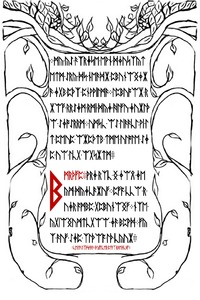</a>

**Key:** Continuation of key.

Note: Every clear text F is an ᚠ (F), and needs to be skipped.

Runes:

    ᛒᛗᚱᚦᚠᛈ
    ᚹᚱᛄ•ᚱᛉᚳ•ᛝ•ᛄᛠᛟ•ᛄᛖᚣᛗ•ᛞᚣᛄᚳᚫᛡᚢᚠ
    ᛈᚠᚪ•ᚳᚳᛠ•ᚱ•ᚢᛄᚱ•ᚪᛗᛒᛈ•ᚷᛈᛒᚢᚾᛠᛝᚠ
    ᚾᛉᛖ•ᚣᚷᛁᛠᛝᚢᛗᛏᚳᚷᛠᛠ•ᛄᚫ•ᛒᛈᚹᛞ
    ᚠᚣᛉ•ᚫᚢᚠ•ᛇᛄᛈ•ᛉᛚᚦᛠᚪ•ᛚᚦ•ᚳᚣᚢᛡ
    ᚳᛖ•ᛚᚫᛇᛁᛉᚦᛋᚫᚻᚫ•ᚦᚣᚠᛚᚳᛖᚱ•ᛈᚠᚪᛉ•ᚱᛒᛖ•ᚫᚳᛒᚠ

The runes on it translate to (Author's Note: we haven't verified this yet):

    my yS Fxrjse ewn djusxytetm Sry ds neFdX pbunWGjXF jgb pTx pnwwilmF lpbuoWX rXWf rrSjm rmi dyj hlfu juXlTW SjoSrrm umsc WS liFFcl wi lt peup WXpTtb tme ulole Sjp uW lcg WgsXtm
    bmrTfp wrj rxc G jWQ je ym dyjcFXuf pfa ccW r ujr ambp gpbunWGf nxe ygiWGumtcgWW jF bpwd fyx Fuf Sjp xlTWa lT cyuX
    ce lFSixTsFhF Tyflcer pfax rbe Fcbf

After reversing the Vignere cipher:

    IT IS THROUGH THIS PILGRIMAGE THAT WE SHAPE
    OURSELVES AND OUR REALITIES.
    JOURNEY DEEP WITHIN AND YOU WILL ARRIVE OUTSIDE.
    LIKE THE INSTAR, IT IS ONLY THROUGH GOING
    WITHIN THAT WE MAY EMERGE:
    
    WIDSOM:
    YOU ARE A BEING UNTO YOURSELF.
    YOU ARE A LAW UNTO YOURSELF.
    EACH INTELLIGENCE IS HOLY.
    FOR ALL THAT LIVES IS HOLY.
    
    :AN INSTRUCTION: COMMAND YOUR OWN SELF :

Outguess:

    Outguessing the image yields 7,5kB garbage output.

## 05.jpg

<a href="assets/2014/liber-primus-complete/05.jpg">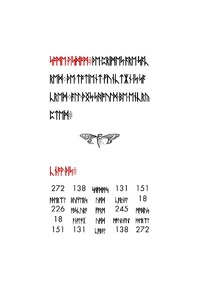</a>

**Key:** Substitution with default Gematria.

This page is written in runes and contains a magic square, where dome numbers are written in runes. 

Runes:

    ᛋᚩᛗᛖ•ᚹᛁᛋᛞᚩᛗ
    ᚦᛖ•ᛈᚱᛁᛗᛖᛋ•ᚪᚱᛖ•ᛋᚪᚳᚱᛖᛞ
    ᚦᛖ•ᛏᚩᛏᛁᛖᚾᛏ•ᚠᚢᚾᚳᛏᛡᚾ•ᛁᛋ•ᛋᚪᚳᚱᛖᛞ
    ᚪᛚᛚ•ᚦᛝᛋ•ᛋᚻᚩᚢᛚᛞ•ᛒᛖ•ᛖᚾᚳᚱᚣᛈᛏᛖᛞ

    ᚳᚾᚩᚹ•ᚦᛁᛋ
    
    272			138			ᛋᚻᚪᛞᚩᚹᛋ		131			151
    ᚫᚦᛖᚱᛠᛚ		ᛒᚢᚠᚠᛖᚱᛋ		ᚢᚩᛁᛞ		ᚳᚪᚱᚾᚪᛚ		18
    226			ᚩᛒᛋᚳᚢᚱᚪ		ᚠᚩᚱᛗ		245			ᛗᚩᛒᛁᚢᛋ
    18			ᚪᚾᚪᛚᚩᚷ		ᚢᚩᛁᛞ		ᛗᚩᚢᚱᚾᚠᚢᛚ	ᚫᚦᛖᚱᛠᛚ
    151			131			ᚳᚪᛒᚪᛚ		138			272

The runes of the image read using [Gematria Primus](gematria_primus.md):

    SOME WISDOM
    THE PRIMES ARE SACRED
    THE TOTIENT FUNCTION IS SACRED
    ALL THINGS SHOULD BE ENCRYPTED
    
    KNOW THIS:

    272			138			SHADOWS		131			151
    
    AETHEREAL	BUFFERS		VOID		CARNAL		18
    
    226			OBSCURA		FORM		245			MOBIUS
    
    18			ANALOG		VOID		MOURNFUL	AETHEREAL
    
    151			131			CABAL		138			272

The table underneath, translated to value form using [Gematria Primus](gematria_primus.md), yields:

Numbers:

    272     138     341     131     151
    
    366     199     130     320     18
    
    226     245     91      245     226
    
    18      320     130     199     366
    
    151     131     341     138     272

which is the exact same matrix found earlier from the [[Cicada#The_Third_Onion|OOB data]]. 

Outguess:

    none

Gematria sums (emirps marked by *):

    SOME WISDOM                     =   468
    THE PRIMES ARE SACRED           =   853
    THE TOTIENT FUNCTION IS SACRED  =   1039
    ALL THINGS SHOULD BE ENCRYPTED  =   1237*
    KNOW THIS                       =   157*

## 06.jpg

<a href="assets/2014/liber-primus-complete/06.jpg">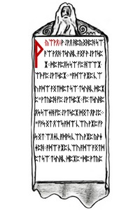</a>

**Key:** Shift 3 down reversed Gematria. (06.jpg, 07.jpg, 08.jpg, 09.jpg)

Runes:

    ᚹ•ᚣᛠᚹᛟ
    
    ᚹ•ᛇᚹᛟ•ᚻᛈᚣᛝᚻᛈᚻ•ᛋᛠ•ᚫᛠ•ᚹᛟᚻ•ᛏᛋᚢᚻᚳ•ᚪᛝᚠ•ᚹ•ᛇᚹᛏᛋᛈᛡ
    ᛞᛈ•ᚪᛈᛟᛋ•ᛋᛠ•ᚠᛈ•ᚻᛠᛠᛡ•ᛠᚦ•ᚠᛈ•ᛇᚹᛏᛋᛈᛡ
    "ᚪᛞᛠ•ᚹᛡᛈ•ᚳᛠᚢ•ᚪᛞᛠ•ᚪᛝᛏᛞᛈᛏ•ᛋᛠ•ᛏᛋᚢᚻᚳ•ᛞᛈᛡᛈ"•ᚹᛏᚣᛈᚻ•ᚠᛈ•ᛇᚹᛏᛋᛈᛡ
    ᚠᛈ•ᛏᛋᚢᚻᛈᛟᛋ•ᛋᛠᛄᚻ•ᚠᛈ•ᛇᚹᛏᛋᛈᛡ•ᛞᛝᛏ•ᛟᚹᛇᛈ
    "ᚠᚹᛋ•ᛝᛏ•ᛟᛠᛋ•ᚪᛞᚹᛋ•ᚳᛠᚢ•ᚹᛡᛈ•ᚠᚹᛋ•ᛝᛏ•ᛠᛟᛄᚳ•ᚪᛞᚹᛋ•ᚳᛠᚢ•ᚹᛡᛈ•ᚣᚹᛄᛄᛈᚻ
    ᚪᛞᛠ•ᚹᛡᛈ•ᚳᛠᚢ•ᚪᛞᛠ•ᚪᛝᛏᛞᛈᛏ•ᛋᛠ•ᛏᛋᚢᚻᚳ•ᛞᛈᛡᛈ"•ᛞᛈ•ᚹᛏᚣᛈᚻ•ᚹᚫᚹᛝᛟ
    ᚠᛈ•ᛇᚹᛟ•ᚠᛠᚢᚫᛞᛋ•ᚦᛠᛡ•ᚹ•ᛇᛠᛇᛈᛟᛋ•ᚹᛟᚻ•ᛡᛈᛖᛄᛝᛈᚻ•"ᛝ•ᚹᛇ•ᚹ•ᛖᛡᛠᚦᛈᛏᛏᛠᛡ"
    "ᚠᚹᛋ•ᛝᛏ•ᚪᛞᚹᛋ•ᚳᛠᚢ•ᚻᛠ•ᛟᛠᛋ•ᚪᛞᚹᛋ•ᚳᛠᚢ•ᚹᛡᛈ"•ᛡᛈᛖᛄᛝᛈᚻ•ᚠᛈ•ᛇᚹᛏᛋᛈᛡ
    "ᚪᛞᛠ•ᚹᛡᛈ•ᚳᛠᚢ•ᚪᛞᛠ•ᚪᛝᛏᛞᛈᛏ•ᛋᛠ•ᛏᛋᚢᚻᚳ•ᛞᛈᛡᛈ"
    ᚣᛠᛟᚦᚢᛏᛈᚻ•ᚠᛈ•ᛇᚹᛟ•ᚠᛠᚢᚫᛞᛋ•ᛏᛠᛇᛈ•ᛇᛠᛡᛈ
    ᚦᛝᛟᚹᛄᛄᚳ•ᛞᛈ•ᚹᛟᛏᚪᛈᛡᛈᚻ•"ᛝ•ᚹᛇ•ᚹ•ᛞᚢᛇᚹᛟ•ᛉᛈᛁ"
    "ᚠᚹᛋ•ᛝᛏ•ᛠᛟᛄᚳ•ᚳᛠᚢᛡ•ᛏᛖᛈᚣᛝᛈᛏ:ᛟᛠᛋ•ᚪᛞᛠ•ᚳᛠᚢ•ᚹᛡᛈ
    ᚪᛞᛠ•ᚹᛡᛈ•ᚳᛠᚢ•ᚪᛞᛠ•ᚪᛝᛏᛞᛈᛏ•ᛋᛠ•ᛏᛋᚢᚻᚳ•ᛞᛈᛡᛈ":ᚹᛏᚣᛈᚻ•ᚠᛈ•ᛇᚹᛏᛋᛈᛡ•ᚹᚫᚹᛝᛟ
    ᚹᚦᛋᛈᛡ•ᚹ•ᛇᛠᛇᛈᛟᛋ•ᛠᚦ•ᚠᛠᚢᚫᛞᛋ:ᚠᛈ•ᛖᛡᛠᚦᛈᛏᛏᛠᛡ•ᛡᛈᛖᛄᛝᛈᚻ•"ᛝ•ᚹᛇ•ᚹ•ᚣᛠᛟᛏᚣᚱᚢᛏᛟᛈᛏᛏ•ᛝᛟᛞᚹᛉᛝᛋᛁ•ᚹᛟ•ᚹᛡᛉᛝᛋᛡᚹᛡᚳ•ᛉᛠᚻᚳ"
    "ᚠᚹᛋ•ᛝᛏ•ᛇᛈᛡᛈᛄᚳ•ᚪᛞᚹᛋ•ᚳᛠᚢ•ᚹᛡᛈ:ᛟᛠᛋ•ᚪᛞᛠ•ᚳᛠᚢ•ᚹᛡᛈ
    ᚪᛞᛠ•ᚹᛡᛈ•ᚳᛠᚢ•ᚪᛞᛠ•ᚪᛝᛏᛞᛈᛏ•ᛋᛠ•ᛏᛋᚢᚻᚳ•ᛞᛈᛡᛈ"
    ᚠᛈ•ᛇᚹᛟ•ᚪᚹᛏ•ᚫᛈᛋᛋᛁ•ᛝᛡᛡᛝᛋᚹᛋᛈᚻ
    "ᛝ•ᚹᛇ:"•ᛞᛈ•ᛏᛋᚹᛡᛋᛈᚻ:ᛉᚢᛋ•ᛞᛈ•ᚣᛠᚢᛄᚻ•ᛟᛠᛋ•ᚠᛝᛟᚣ•ᛠᚦ•ᚹᛟᚳᚠᛁ•ᛈᛄᛏᛈ•ᛋᛠ•ᛏᚹᚳ:ᛏᛠ•ᛞᛈ•ᛋᛡᚹᛝᛄᛈᚻ•ᛠᚦᚦ
    ᚹᚦᛋᛈᛡ•ᚹ•ᛄᛠᛁ•ᛖᚹᚢᛏᛈ•ᚠᛈ•ᛇᚹᛏᛋᛈᛡ•ᛡᛈᛖᛄᛝᛈᚻ:•"ᚠᛈᛟ•ᚳᛠᚢ•ᚹᛡᛈ•ᚪᛈᛄᚣᛠᛇᛈ•ᛋᛠ•ᚣᛠᛇᛈ•ᛏᛋᚢᚻᚳ"

Using a similar substitution to the one used in The Second Onion (Gematria Primus 2014?) and applying that to the runes in each image (06.jpg-09.jpg), we obtain a koan:

    A KOAN
    
    A MAN DECIDED TO GO AND STUDY WITH A MASTER.
    HE WENT TO THE DOOR OF THE MASTER
    "WHO ARE YOU WHO WISHES TO STUDY HERE?"
    ASKED THE MASTER.
    THE STUDENT TOLD THE MASTER HIS NAME.
    "THAT IS NOT WHAT YOU ARE THAT IS ONLY WHAT YOU ARE CALLED.
    WHO ARE YOU WHO WISHES TO STUDY HERE?" HE ASKED
    AGAIN.
    THE MAN THOUGHT FOR A MOMENT, AND REPLIED
    "I AM A PROFESSOR."
    "THAT IS WHAT YOU DO, NOT WHAT YOU ARE"
    REPLIED THE MASTER. "WHO ARE
    YOU WHO WISHES TO STUDY HERE?"
    CONFUSED, THE MAN THOUGHT SOME MORE.
    FINALLY, HE ANSWERED, "I AM A HUMAN BEING."
    "THAT IS ONLY YOUR SPECIES, NOT WHO YOU ARE.
    WHO ARE YOU WHO WISHES TO STUDY HERE?"
    ASKED THE MASTER AGAIN.
    AFTER A MOMENT OF THOUGHT, THE PROFESSOR REPLIED 
    "I AM A CONSCIOUSNESS INHABITING AN ARBITRARY BODY."
    "THAT IS MERELY WHAT YOU ARE NOT WHO YOU ARE"
    WHO ARE YOU WHO WISHES TO STUDY HERE?"
    THE MAN WAS GETTING IRRITATED. "I AM," HE STARTED, 
    BUT HE COULD NOT THINK OF ANYTHING ELSE TO SAY,
    SO HE TRAILED OFF. AFTER A LONG PAUSE THE MASTER REPLIED
    "THEN YOU ARE WELCOME TO COME STUDY."
    
    AN INSTRUCTION
    
    DO FOUR UNREASONABLE THINGS EACH DAY.

Outguess: 

    Outguessing the image yields garbage output.

## 07.jpg

<a href="assets/2014/liber-primus-complete/07.jpg">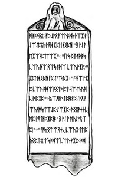</a>

Outguess: 

    Outguessing the image yields garbage output.

## 08.jpg

<a href="assets/2014/liber-primus-complete/08.jpg">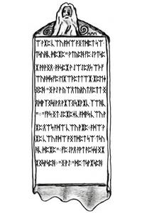</a>

Outguess: 

    For those who have fallen behind:
    
    TL BE IE OV UT HT RE ID TS EO ST PO SO YR 
    SL BT II IY T4 DG UQ IM NU 44 2I 15 33 9M
    
    Good luck.
    
    3301

## 09.jpg

**Key:** Shift 3 down reversed Gematria.

Runes:

    ᚹᛟ•ᛝᛟᛏᛋᛡᚢᚣᛋᚱᛟ
    
    ᚻᛠ•ᚦᛠᚢᛡ•ᚢᛟᛡᚩᛏᛠᛟᚹᛉᛄᛈ•ᚠᛁᛏ•ᚩᚣᛞ•ᚻᚹᚳ

English:

    AN INSTRUCTION
    
    DO FOUR UNREASONABLE THINGS EACH DAY

Outguess: 

    Outguessing the image yields garbage output.

## 10.jpg - index.1.jpg

<a href="assets/2014/liber-primus-complete/10.jpg">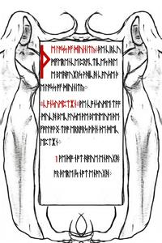</a>

**Key:** Substitution with default Gematria. (10.jpg, 11.jpg, 12.jpg, 13.jpg)

Runes:

    ᚦᛖ•ᛚᚩᛋᛋ•ᚩᚠ•ᛞᛁᚢᛁᚾᛁᛏᚣ
    ᚦᛖ•ᚳᛁᚱᚳᚢᛗᚠᛖᚱᛖᚾᚳᛖ•ᛈᚱᚪᚳᛏᛁᚳᛖᛋ•ᚦᚱᛖᛖ•ᛒᛖᚻᚪᚢᛡᚱᛋ•ᚹᚻᛁᚳᚻ•ᚳᚪᚢᛋᛖ•ᚦᛖ•ᛚᚩᛋᛋ•ᚩᚠ•ᛞᛁᚢᛁᚾᛁᛏᚣ
    ᚳᚩᚾᛋᚢᛗᛈᛏᛡᚾ
    ᚹᛖ•ᚳᚩᚾᛋᚢᛗᛖ•ᛏᚩᚩ•ᛗᚢᚳᚻ•ᛒᛖᚳᚪᚢᛋᛖ•ᚹᛖ•ᛒᛖᛚᛖᛁᚢᛖ•ᚦᛖ•ᚠᚩᛚᛚᚹᛝ•ᛏᚹᚩ•ᛖᚱᚱᚩᚱᛋ•ᚹᛁᚦᛁᚾ•ᚦᛖ•ᛞᛖᚳᛖᛈᛏᛡᚾ
    1•ᚹᛖ•ᛞᚩ•ᚾᚩᛏ•ᚻᚪᚢᛖ•ᛖᚾᚩᚢᚷᚻ•ᚩᚱ•ᚦᛖᚱᛖ•ᛁᛋ•ᚾᚩᛏ•ᛖᚾᚩᚢᚷᚻ
    2•ᚹᛖ•ᚻᚪᚢᛖ•ᚹᚻᚪᛏ•ᚹᛖ•ᚻᚪᚢᛖ•ᚾᚩᚹ•ᛒᚣ•ᛚᚢᚳᚳ•ᚪᚾᛞ•ᚹᛖ•ᚹᛁᛚᛚ•ᚾᚩᛏ•ᛒᛖ•ᛋᛏᚱᚩᛝ•ᛖᚾᚩᚢᚷᚻ•ᛚᚪᛏᛖᚱ•ᛏᚩ•ᚩᛒᛏᚪᛁᚾ•ᚹᚻᚪᛏ•ᚹᛖ•ᚾᛖᛖᛞ
    ᛗᚩᛋᛏ•ᚦᛝᛋ•ᚪᚱᛖ•ᚾᚩᛏ•ᚹᚩᚱᚦ•ᚳᚩᚾᛋᚢᛗᛝ
    ᛈᚱᛖᛋᛖᚱᚢᚪᛏᛡᚾ
    ᚹᛖ•ᛈᚱᛖᛋᛖᚱᚢᛖ•ᚦᛝᛋ•ᛒᛖᚳᚪᚢᛋᛖ•ᚹᛖ•ᛒᛖᛚᛁᛖᚢᛖ•ᚹᛖ•ᚪᚱᛖ•ᚹᛠᚳ
    ᛁᚠ•ᚹᛖ•ᛚᚩᛋᛖ•ᚦᛖᛗ•ᚹᛖ•ᚹᛁᛚᛚ•ᚾᚩᛏ•ᛒᛖ•ᛋᛏᚱᚩᛝ•ᛖᚾᚩᚢᚷᚻ•ᛏᚩ•ᚷᚪᛁᚾ•ᚦᛖᛗ•ᚪᚷᚪᛁᚾ
    ᚦᛁᛋ•ᛁᛋ•ᚦᛖ•ᛞᛖᚳᛖᛈᛏᛡᚾ
    ᛗᚩᛋᛏ•ᚦᛝᛋ•ᚪᚱᛖ•ᚾᚩᛏ•ᚹᚩᚱᚦ•ᛈᚱᛖᛋᛖᚱᚢᛝ
    ᚪᛞᚻᛖᚱᛖᚾᚳᛖ
    ᚹᛖ•ᚠᚩᛚᛚᚩᚹ•ᛞᚩᚷᛗᚪ•ᛋᚩ•ᚦᚪᛏ•ᚹᛖ•ᚳᚪᚾ•ᛒᛖᛚᚩᛝ•ᚪᚾᛞ•ᛒᛖ•ᚱᛁᚷᚻᛏ
    ᚩᚱ•ᚹᛖ•ᚠᚩᛚᛚᚩᚹ•ᚱᛠᛋᚩᚾ•ᛋᚩ•ᚹᛖ•ᚳᚪᚾ•ᛒᛖᛚᚩᛝ•ᚪᚾᛞ•ᛒᛖ•ᚱᛁᚷᚻᛏ
    ᚦᛖᚱᛖ•ᛁᛋ•ᚾᚩᚦᛝ•ᛏᚩ•ᛒᛖ•ᚱᛁᚷᚻᛏ•ᚪᛒᚩᚢᛏ
    ᛏᚩ•ᛒᛖᛚᚩᛝ•ᛁᛋ•ᛞᛠᚦ
    ᛁᛏ•ᛁᛋ•ᚦᛖ•ᛒᛖᚻᚪᚢᛡᚱᛋ•ᚩᚠ•ᚳᚩᚾᛋᚢᛗᛈᛏᛡᚾ
    ᛈᚱᛖᛋᛖᚱᚢᚪᛏᛡᚾ
    ᚪᚾᛞ•ᚪᛞᚻᛖᚱᛖᚾᚳᛖ•ᚦᚪᛏ•ᚻᚪᚢᛖ•ᚢᛋ•ᛚᚩᛋᛖ•ᚩᚢᚱ•ᛈᚱᛁᛗᚪᛚᛁᛏᚣ
    ᚪᚾᛞ•ᚦᚢᛋ•ᚩᚢᚱ•ᛞᛁᚢᛁᚾᛁᛏᚣ

The runes were not encrypted, and they read:

    THE LOSS OF DIVINITY: THE CIRCU
    MFERENCE PRACTICES THRE
    E BEHAVIORS WHICH CAUSE TH
    E LOSS OF DIVINITY.
    
    CONSUMPTION: WE CONSUME TOO
    MUCH BECAUSE WE BELIEVE THE
    FOLLOWING TWO ERRORS WITHIN THE DEC
    EPTION.
    
        1 WE DO NOT HAVE ENOUGH
        OR THERE IS NOT ENOUGH

Outguess:

    -----BEGIN PGP SIGNED MESSAGE-----
    Hash: SHA1
    
    
    Create one Tor hidden service that can accept CGI file uploads.
    
    When this hidden service returns and can accept input, post the 
    three magic squares and the URL to your Tor hidden service here.
    
    Work alone.
    
    
    1111111111111111
    110    12    101
    1              1
    112    14    121
    1              1
    110    12    101
    1111111111111111
    
    
    Good luck.
    
    3301
    
    
    -----BEGIN PGP SIGNATURE-----
    Version: GnuPG v1.4.11 (GNU/Linux)
    
    iQIcBAEBAgAGBQJS24FNAAoJEBgfAeV6NQkPXw0P/14YlgeQO29u1L/ZJeIjNJ4V
    YXtbqf4u2KVzVdL6nOhdlGaMNvQNTHzYSJxy+o1eeKRzrE9xFCmRaiN/gzUklyF0
    WXG+SAUGedvFBkyvboEJ1MFf0cz5eUkrLPGM8wbJ2922mH4PpmmglLEkjewvNBQf
    3xb+SEgZsAyA7OHkdKH69840JlJTHxNt7Ukjkt4tkDn72VN78Vj0ekPomu7rCGxW
    l4ikFGqlHU10c797lEMwLUJ4tejEbYC0RIduvFyjwDf1hieYXm64UpxAi4HWvkgN
    QIrZtZlr0KXKRECSmM9h6zVe/t0tSErNmYr6yeBDryDYb0m3ijVjwlscj2J1gOzm
    13u1FWbdfuZgDoDC1ACEagoBLQjC6hjgnOab167Hxg681wvOOY+PslKlHsiueO6q
    B/TzvSfI+eDFy/SQUo/WHeiRXxlrBxGjUBxytcy09fxEPQRzIqPeq7c7/bhbr/4b
    /GHCIf0tgxc/SIeWK/0Rh88Egjfp6hX9R4LXf6JlL59RAf89s0aQiUxvkna+0hDY
    NGqL1AgljncfzXrdGnoUlt4vYR8ubQBMxAy5BjPL4IPar6Oy9o0eZy0LdbMKbKln
    3yUDQcoRQcI6Mki+amzgZtUw64mxMxiMWDx1EZhepsJt0y6DmKGONK5LcTGJ7HgI
    a+QzPmj23nt6+gfPGD0C
    =4CVy
    -----END PGP SIGNATURE-----

## 11.jpg - index.2.jpg

<a href="assets/2014/liber-primus-complete/11.jpg">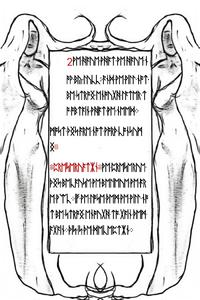</a>

The runes were not encrypted, and they read:

        2 WE HAVE WHAT WE HAVE N
        OW BY LUCK, AND WE WILL NOT
        BE STRONG ENOUGH LATER T
        O OBTAIN WHAT WE NEED.
    
    MOST THINGS ARE NOT WORTH CONSUM
    ING:
    
    PRESERVATION: WE PRESERVE
    THINGS BECAUSE WE BELIEVE WE AR
    E WEAK. IF WE LOSE THEM WE WILL NO
    T BE STRONG ENOUGH TO GAIN THEM
    AGAIN. THIS IS THE DECEPTION.

Outguess:

    -----BEGIN PGP SIGNED MESSAGE-----
    Hash: SHA1
    
    
    Create one Tor hidden service that can accept CGI file uploads.
    
    When this hidden service returns and can accept input, post the 
    three magic squares and the URL to your Tor hidden service here.
    
    Work alone.
    
    
    3333333333333333
    310    12    103
    3              3
    312    14    123
    3              3
    310    12    103
    3333333333333333
    
    
    Good luck.
    
    3301
    
    
    -----BEGIN PGP SIGNATURE-----
    Version: GnuPG v1.4.11 (GNU/Linux)
    
    iQIcBAEBAgAGBQJS24E+AAoJEBgfAeV6NQkPliIQAIKI2NrekF7zK5/2Fhao/9KB
    hz5eIIfD/IJuz63NsxWrDa1sUOmXkGCcHLssX052Sves7q70XVv+qEK87Q2691Bj
    fHCUvkc5doWqAmi4MRe4FnAdFjhugK7W1f+FP8+rY9275we571Ba+HbIsBTLYez7
    AcLm3jGEnnFG16L6QSz+AOdZgWcoND6U3U8Hso+QUS/shDiq1Anc03V27p5IhxQr
    DxEJoso0hozAMpKCJjFjC6CsciDuEO2zDZYrcoFCm5KhWbYyGh5fn7bWAjn/5qoI
    fsQJdlctY3BLOQzkwVo+70bZYfjx3A/+zlx2+dW5VjKUOBqk5I85OYe/JNDvvzjv
    nCpxUWoz7u3hzc/rkfNazWix2fqbbKp8CJAP6YwRuWOyMzo0TlLQ0ypxaAMj7R2P
    Ekr4XG2mNdC694z+WVFiXNFMXaGdLzLqoO1ASJI+o5qqJ4FgmCrJwUA4LOlWAte5
    wU45fXiHZ4pYWnlHg+9DbKGxt5whhNFHbWmH8X45PBsAcugkHXKg60AzEZZg0qte
    +rFofXLxD3OVTdw+ho0Qu8EnHbbYa5dM+Iv0FXPfANwuQRKzJfMRWY+aBKcoZaub
    jpvSti7zBE206L10Gy/ZkqYaOCCoAwO/9P15L0gRBGzSjWvNmNGMzxy+6541aCHu
    JKQ6RQ9NbHJA6rxCX6UV
    =XIyP
    -----END PGP SIGNATURE-----

## 12.jpg - index.3.jpg

<a href="assets/2014/liber-primus-complete/12.jpg">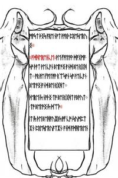</a>

The runes were not encrypted, and they read:

    MOST THINGS ARE NOT WORTH PRESERV
    ING:
    
    ADHERENCE: WE FOLLOW DOGMA
    SO THAT WE CAN BELONG AND BE RIGH
    T. OR WE FOLLOW REASON SO WE CAN
    BELONG AND BE RIGHT.
    
    THERE IS NOTHING TO BE RIGHT ABOUT.
    TO BELONG IS DEATH.
    
    IT IS THE BEHAVIORS OF CONSUMPT
    ION, PRESERVATION, AND ADHEREN

Outguess:

    -----BEGIN PGP SIGNED MESSAGE-----
    Hash: SHA1
    
    
    Create one Tor hidden service that can accept CGI file uploads.
    
    When this hidden service returns and can accept input, post the 
    three magic squares and the URL to your Tor hidden service here.
    
    Work alone.
    
    
    0000000000000000
    010    12    100
    0              0
    012    14    120
    0              0
    010    12    100
    0000000000000000
    
    
    Good luck.
    
    3301
    
    
    -----BEGIN PGP SIGNATURE-----
    Version: GnuPG v1.4.11 (GNU/Linux)
    
    iQIcBAEBAgAGBQJS24FGAAoJEBgfAeV6NQkPCrIP/2zWTFVu1kf311exrrc81Zml
    Saxcj9fBew7J3ebDZVYzJ7rlctHWDmbn8QDhwbE7DuSMYfzZmxsw5AjGiyFNOq29
    nZfu7y30TGNWk4n7/ORv5ONeeF/F2CfDvNNJ3ubNkoyBaojQuISFETOdrnsZNzn5
    P7mkpSBRKuNQuydh7bucXVEmdtSRo+1591cMolQCsaD8SiOLUNzZnQIxAdugcNiH
    WI71/dMQi1QW24POjYumjnuPQWuyIxRQgRJJvTJeuXsMAfz85uB5W6EU3bijO8Al
    Xn8hTOQAXXVG6QtKt5NLUK8bafKr6UmUVcvltDZYmPW+3cnufvzcxU1Z5RgDOGAG
    9FwtPYKveUXoIvRXTTjhSOl2YUlW8JItmqFWFSoph5D+9VZFYxL7P8BJat4r67B2
    We0S7PApnJRFFYOpAfi7Pght1utsKMdHo3Hd8/LWuVzcRKE+Q+9CqYI8gPX0xj9d
    vkKcxeK93rUY+Kv51M4P44cbyAPgTHBDf3amk3dAbKL2ajIu0/9xKDuqNh98mHyp
    DQOvhokU6cqpi0AeQVnbzD4j9tr+6H5CoraefGah9hwt0smjdGBt5vHHZraygXVO
    +/p579tDCQG66H7tva1ZHbgSOeiwKx+GUjeJKhl+gpt+MGR7z/Ke5wIpZf9B5ShK
    wFBHJbC8oUgkS3JeJgE5
    =UmhP
    -----END PGP SIGNATURE-----

## 13.jpg - index.4.jpg

<a href="assets/2014/liber-primus-complete/13.jpg">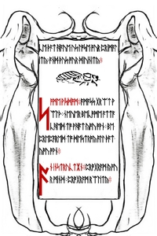</a>

**Key:** Substitution with default Gematria.

Runes:

    ᛋᚩᛗᛖ•ᚹᛁᛋᛞᚩᛗ
    ᚪᛗᚪᛋᛋ•ᚷᚱᛠᛏ•ᚹᛠᛚᚦ
    ᚾᛖᚢᛖᚱ•ᛒᛖᚳᚩᛗᛖ•ᚪᛏᛏᚪᚳᚻᛖᛞ•ᛏᚩ•ᚹᚻᚪᛏ•ᚣᚩᚢ•ᚩᚹᚾ
    ᛒᛖ•ᛈᚱᛖᛈᚪᚱᛖᛞ•ᛏᚩ•ᛞᛖᛋᛏᚱᚩᚣ•ᚪᛚᛚ•ᚦᚪᛏ•ᚣᚩᚢ•ᚩᚹᚾ

    ᚪᚾ•ᛁᚾᛋᛏᚱᚢᚳᛏᛡᚾ
    ᛈᚱᚩᚷᚱᚪᛗ•ᚣᚩᚢᚱ•ᛗᛁᚾᛞ
    ᛈᚱᚩᚷᚱᚪᛗ•ᚱᛠᛚᛁᛏᚣ

The runes were not encrypted, and they read:

    (CE THAT HAVE US LOSE OUR PRIMAL
    ITY AND THUS OUR DIVINITY:)
    
    SOME WISDOM: AMASS GREAT W
    EALTH. NEVER BECOME ATTA
    CHED TO WHAT YOU OWN. BE
    PREPARED TO DESTROY ALL THAT
    YOU OWN:
    
    AN INSTRUCTION: PROGRAM YOU
    R MIND. PROGRAM REALITY

Outguess:

    -----BEGIN PGP SIGNED MESSAGE-----
    Hash: SHA1
    
    
    Create one Tor hidden service that can accept CGI file uploads.
    
    When this hidden service returns and can accept input, post the 
    three magic squares and the URL to your Tor hidden service here.
    
    Work alone.
    
    
    1111111111111111
    110    12    101
    1              1
    112    14    121
    1              1
    110    12    101
    1111111111111111
    
    
    Good luck.
    
    3301
    
    
    -----BEGIN PGP SIGNATURE-----
    Version: GnuPG v1.4.11 (GNU/Linux)
    
    iQIcBAEBAgAGBQJS24FNAAoJEBgfAeV6NQkPXw0P/14YlgeQO29u1L/ZJeIjNJ4V
    YXtbqf4u2KVzVdL6nOhdlGaMNvQNTHzYSJxy+o1eeKRzrE9xFCmRaiN/gzUklyF0
    WXG+SAUGedvFBkyvboEJ1MFf0cz5eUkrLPGM8wbJ2922mH4PpmmglLEkjewvNBQf
    3xb+SEgZsAyA7OHkdKH69840JlJTHxNt7Ukjkt4tkDn72VN78Vj0ekPomu7rCGxW
    l4ikFGqlHU10c797lEMwLUJ4tejEbYC0RIduvFyjwDf1hieYXm64UpxAi4HWvkgN
    QIrZtZlr0KXKRECSmM9h6zVe/t0tSErNmYr6yeBDryDYb0m3ijVjwlscj2J1gOzm
    13u1FWbdfuZgDoDC1ACEagoBLQjC6hjgnOab167Hxg681wvOOY+PslKlHsiueO6q
    B/TzvSfI+eDFy/SQUo/WHeiRXxlrBxGjUBxytcy09fxEPQRzIqPeq7c7/bhbr/4b
    /GHCIf0tgxc/SIeWK/0Rh88Egjfp6hX9R4LXf6JlL59RAf89s0aQiUxvkna+0hDY
    NGqL1AgljncfzXrdGnoUlt4vYR8ubQBMxAy5BjPL4IPar6Oy9o0eZy0LdbMKbKln
    3yUDQcoRQcI6Mki+amzgZtUw64mxMxiMWDx1EZhepsJt0y6DmKGONK5LcTGJ7HgI
    a+QzPmj23nt6+gfPGD0C
    =4CVy
    -----END PGP SIGNATURE-----

## 14.jpg - 107.jpg

<a href="assets/2014/liber-primus-complete/14.jpg">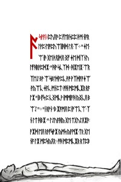</a>

**Key:** 29, 19, 25, 29, 28, 10, 29, 11, 25, 11, 20, 29, 11 (FIRFUMFERENFE). Shift up forward Gematria. (14.jpg, 15.jpg)

Note: Every clear text F is an ᚠ (F), and needs to be skipped.

Runes:

    ᚪ•ᛋᚹᚪᛁ
    ᛈᚢᛟᚫ•ᛈ•ᚠᛖᚱᛋᛈᛈ•ᚦᛗ•ᚾᚪᚱᛚᚹᛈ•ᛖᚩᛈᚢᛠᛁᛁᚻᛞ•ᛚᛟ•ᛠ
    "ᛄᛖ•ᛠ•ᛁᚫ•ᚷᛖ•ᚦᛟᛁᛞᛟ•ᛝᚠ•ᛄᛖ•ᛞᛁᛉᚾᚢᛚᚠᚻᚱᚹᛈᛞᛡ"•ᚻᚹ•ᛋᚳᛉᛞ
    ᚻᛡᛖᛡ•ᛠᚱᛉᛖᛇ•ᛒᚹ•ᛠ•ᛋᛒᛚᛞᚹᛈᚳ•ᚫᚩ•ᚹᛉᛞᚪᚪᛄᛠ•ᚹᚣᛠᚳ•ᛄᚪᚳ•ᛗᚾᛈᛏ
    ᚩᚻ•ᛗᛈᛗᚳᛡᚱ•ᚱᚪᛚᛡ•"ᛁᛒ•ᚠᛋ•ᛈ•ᚳᛝᛗᚳᚹ•ᛁᛗᛗᛁᚪᚻ•ᚣᛝᚳᛟ•ᛒᛠᛇ"
    "ᛁ•ᚱᚹᚾ'ᛒ•ᛡᚪᛗᛟ•ᛈ•ᛁᚩᛠᚳᛠ•ᛉᚾ•ᛚᛏ•ᚻᛒᛡ"•ᛚᛇᚢᚪᚻᚣ•ᚷᛖ•ᛏᚷᚢᛇᛟᛡᚫ•ᚪᛡᛞ•ᛖᛟ•ᚱᚫᚠᛋᚹᛡ•ᚣᛗᛋ•ᚣᚪᛗᛡ•ᛏᚱ•ᚷᛖᚾᚪ•ᛚᛡ•ᛗᛈᛋᚣᛟᚱ
    ᚩᚻ•ᛗᛈᛗᚳᛡᚱ•ᚱᛏᛈᛒᛈᛗᛈ•ᚦᚹ•ᛗᚳᛁᛞᚹᚾᚣ•ᛠᚾᚪ•ᚳᚪᛠᛡ"•ᛚᛡ•ᚢᛝᛁᛋᛟ•ᚦᚫᚷ•ᛄᛗᛗᚳ•ᚪᚪᛠᛞ•ᚹᚹᚢ•ᚾᛉᚢᚹ•ᛈᛝ•ᛁᚩᛠᚳᛠ•ᛉᚾ•ᛡᛟᚢᛟ•ᛇᛒᚩ•ᛁᚱ•ᚦᛠ•ᛉ"
    ᚪᛁᛈ•ᚦᚹ•ᛗᚳᛁᛞᚹᚾᚣᛗ•ᚹᛗᛞᛖ•ᚹᛈᚾᛗᚷᚣᛏᛠᛈᛖᚪ

Decoding the runes on the page using a Vigenere cipher and key `FIRFUMFERENFE` yields:

    A KOAN: DURING A LESSION: THE MAS
    TER EXPLAINED THE I:"THE 
    I IS THE VOICE OF THE CIRCU
    MFERENCE,"HE SAID.WHEN AS
    KED BY A STUDENT TO EXPLAIN
     WHAT THAT MEANT, THE MASTER SA
    ID"IT IS A VOICE INSIDE YOUR H
    EAD"."I DON'T HAVE A VOICE I
    N MY HEAD," THOUGHT THE STUDENT,
    AND HE RAISED HIS HAND TO TE
    LL THE MASTER.THE MASTER STOP

Outguess:

    none

## 15.jpg - 167.jpg

Decoding the runes on the page using a Vigenere cipher and key `FIRFUMFERENFE` yields:

    PED THE STUDENT,AND SAID"THE 
    VOICE THAT JUST SAID YOU HAV
    E NO VOICE IN YOUR HEAD, IS THE 
    I."AND THE STUDENTS WERE ENL
    LIGHTENED:

Outguess:

    none

## 16.jpg - 229.jpg

<a href="assets/2014/liber-primus-complete/16.jpg">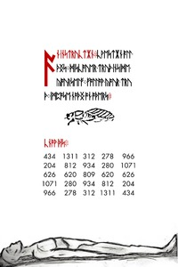</a>

**Key:** Substitution with default Gematria.

Runes:

    ᚪᚾ•ᛁᚾᛋᛏᚱᚢᚳᛏᛡᚾ
    ᚳᚹᛖᛋᛏᛡᚾ•ᚪᛚᛚ•ᚦᛝᛋ
    ᛞᛁᛋᚳᚩᚢᛖᚱ•ᛏᚱᚢᚦ•ᛁᚾᛋᛁᛞᛖ•ᚣᚩᚢᚱᛋᛖᛚᚠ
    ᚠᚩᛚᛚᚩᚹ•ᚣᚩᚢᚱ•ᛏᚱᚢᚦ
    ᛁᛗᛈᚩᛋᛖ•ᚾᚩᚦᛝ•ᚩᚾ•ᚩᚦᛖᚱᛋ
    ᚳᚾᚩᚹ•ᚦᛁᛋ

The text on the final page is not encoded. Transcription via Gematrius Primus yields:

    AN INSTRUCTION:QUESTION ALL
    THINGS: DISCOVER TRUTH INSIDE
    YOURSELF: FOLLOW YOUR TRU
    TH: IMPOSE NOTHING ON OTHERS.
    
    KNOW THIS:
    434 1311 312 278 966
    204 812 934 280 1071
    626 620 809 620 626
    1071 280 934 812 204
    966 278 312 1311 434

Outguess:

    none

# LP2
## 17.jpg-19.jpg - 0.jpg-2.jpg

<a href="assets/2014/liber-primus-complete/17.jpg">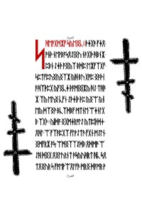</a>
<a href="assets/2014/liber-primus-complete/18.jpg">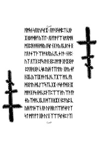</a>
<a href="assets/2014/liber-primus-complete/19.jpg">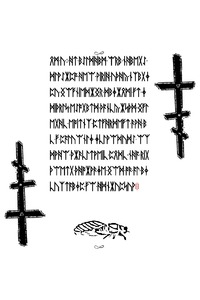</a>

**Key:** ? (17.jpg, 18.jpg, 19.jpg)

Runes:

    ᛋᚻᛖᚩᚷᛗᛡᚠ•ᛋᚣᛖᛝᚳ
    ᚦᛄᚷᚫ•ᚠᛄᛟ•ᚩᚾᚦ•ᚾᛖᚹᛒᚪᛋᛟᛇᛁᛝᚢ•ᚾᚫᚷᛁᚦ•ᚻᛒᚾᛡ•ᛈᛒᚾ•ᛇᛄᚦ•ᚪᛝᚣᛉ•ᛒᛞᛈ•ᛖᛡᚠᛉᚷᚠ•ᛋᛈᛏᚠᛈᚢᛝᚣᛝᛉᛡ•ᚣᚻ•ᛒᚢ•ᚷᚩᛈ•ᛝᚫᚦ•ᛁᚫᚻᛉᚦᛈᚷ•ᚣᚠᛝᚳᛄ•ᚦᚪᛗᛁᛝᛁᛡᚣ•ᚻᛇ•ᛏᚻᚫᛡ•ᛉᚣ•ᛖᚢᛝ•ᚳᚠᚾ•ᛇᚦᛄᛁᚦ•ᚦᛈ•ᚣᛝᛠ•ᚣᚾᛖᚣ•ᛞᛉᛝᚹ•ᛒᚳᛉᛞᛒᚠ•ᛗᛏᚾᛖ•ᛠᛄᚾᛚᚷᛒ•ᛉᚷᚦ
    ᚣᛁᛞᚪ•ᛝᚷᛗᛄᚱᚩᛚᛇ•ᚣᛏᛈᛁᚦᛞᛄ•ᛟᚻᛚ•ᛠ•ᚠᛉᚫᛈᚷᛉ•ᚠᛚᚹᛇᛏᚫ•ᚠᚷᚾ•ᛗᛇᛚᚾ•ᛝᛗᚠᚱᛡ•ᚪᛋ•ᛠᛗᛝᛉᛉᛇᛞᛒ•ᛟᛞᛗᚩ•ᛠᛇᚻ•ᛞᛝᚷ•ᛟᛝᛚᚢᚱᚾᛏ•ᚫᛋᚣᚢᚻᚱᛏ•ᚻᚳ•ᛋᛟᛏᛟᛝᚢᚱ•ᛋ•ᚠᚩᛖᚹᛠᛟᛚᚠᚫ•ᛗᚱᛝ•ᛞᚪᛗᚱ•ᚹᚪᛁᛗᛋᚾ•ᛋᛟᚱᚢᚹᛋᛚᛡ
    ᛟᚪᚫᛝᛋᛞᛈᛏ•ᚳᚱᚦᛡ•ᚱᛒᚩᛞᚦᚠ•ᚣᛉᛁᛏ
    ᛟᛁ•ᚠᛚᚩ•ᚠᛠ•ᚱᚩᛟᛗᚻᛗᚷᛈᚻ•ᚫᚻᚾᚩᚻᚣ•ᛟᛋᛚ•ᚾᚷ•ᚫᚣ•ᛟᚳᛒᛚᛄ•ᛝᛚᛟ•ᚫᛄᛠᚹ•ᛠᚦᚩ•ᛒᛟᚣ•ᚳᚠᚳᛄ•ᛚᚫ
    ᚾ•ᚦᛈ•ᚢᛉ•ᛟᛉᚷ•ᛈᚠᛋᛇᚫᛟ•ᛝᛈᛇᚩᛖᚪ•ᚷᚫᛡᛝᚦᚩ•ᛈᚪᛟᚦᚱᛝᚫ•ᚳᛋᛒᛇᚣᚻ•ᛏᛉᛖᛚᚱ
    ᚷᚹᚣ•ᛄᚠᛁᚾᛡᚳᚣᛠᛁᛡ•ᚩᚦ•ᛖᚳᚫᚳᛉᛡᛠ•ᚩᛚᚳ•ᚠᚱᛞᛝᛖᚢ•ᛞᚳᛚᛠᛋᛉᚳᚷᛡ
    ᚹᛋᚦ•ᚠᛞᛝ•ᛁᛡᛗᚪᚫᚷ•ᚹᛋ•ᚾᛞ•ᚳᛈᚦᛉᛈᛠᛠ•ᚹᚢ•ᛠᚹ•ᚠᚹᛄᚣ•ᛉᛞᚹᚳᚷᚳᛟ•ᛞᛉᛟ•ᚱᛡᚷ•ᚾᛈᚪᚣᛈ•ᚳᚣᚻ•ᚠᛖᛄᛠᚾ•ᛟᚫ•ᚢᚪ•ᚻᚱ•ᛖᛠᚦᚠᛄᚪ•ᛚᛉᛋᛏ•ᛗᚠᛚᚠᛏ•ᚷᛁᚦ•ᚢᛚᚷ•ᛉᛠᛏᛋᛚᛄᛈ•ᛚᛉᛁᛟᛗ•ᚢ
    ᚻᛏ•ᛒᛇᛚᛞᚻᛒᛗ•ᛠᚱᛒ•ᚾᚻᛒᛖᚷᛇ•ᛞᛚᚹᛇᛡᛈᚩ•ᚻᛖᛠ•ᚹᛁᚱᛁᚻ•ᚢᚦᚻᚣ•ᚾᛉᛒᚷᛄᛈᚢ•ᛝᛠᚠᚾᛁᛖᛞᛡᛝᚱ•ᛞᛒᛄᛡᛟᛗᛁ•ᚠᛏ•ᛄᛞᛁᚦᚱᛚᛋ•ᛖᛇᚩᚷᛒᛏᛞ•ᚦᚪᚾᚳᚣ•ᛡᛋᚦᛞ•ᛝᚠᛚᛖᚷᚻᚳ•ᛖᚩᛁᛏᚾᛉ•ᛈᛏᚠᚻᚱᛞᛖᚠᛏ•ᚫᚹᚻ•ᛒᚳ•ᚠ•ᛈᚪᛚᚢᛠᚾᛚᛄ•ᛄᚳᛚᚹᛠᛞᚢᛞᛇ•ᛠᛉᛞᚹᚻᛠ•ᚦᛡᚫᚳᛚᛏᚹᛖᛁᚳ•ᛈᛟᛞᚳ•ᚾᚻᚪ•ᚱᛁᚷᚦᛠᛖᛏᚷ•ᚦᚻᚩᛡᚹᚫᛄᛖ•ᛝᛠᛞ•ᚩᚫ•ᚪᛚ•ᛒᛄᚳᚢᛉᛏᚪᛒᛄᛈ•ᚠᛠ•ᚻᛞᚾᛡᚢᛈᛋᚢᚹ

Outguess:

    17.jpg - Outguessing the image yields 58,2kB garbage output.
    18.jpg - none
    19.jpg - none

## 20.jpg - 3.jpg-5.jpg

<a href="assets/2014/liber-primus-complete/20.jpg">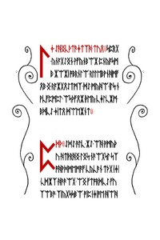</a>
<a href="assets/2014/liber-primus-complete/21.jpg">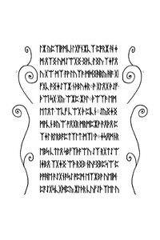</a>
<a href="assets/2014/liber-primus-complete/22.jpg">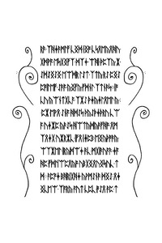</a>

**Key:** ? 

Runes:

    ᛚᛄ•ᛇᚻᛝᚳᚦᛏᚫᛄᛏᛉᚻ•ᛏᚢᛟ
    
    ᛋᛈᚱᚷ•ᚣᚾᚪᚷᛇᛝᚾ•ᚹᚠᚣᚾᛒᛠᛡ•ᛈᚾᚣᚪᛋᛗᛒ•ᛡᛠᛡᛁ•ᚩᛒᚱᚾᛚᛠ•ᚱᛚᛚᛖᛒᚹᚾᚻᛗᚠᛟᛒ•ᛝ•ᚱᚪᛡᚷᛟᛇᛏᛗᛉ•ᛞᛇ•ᛗᚣᚻᛠ•ᛁᛚᛋ•ᚾᚹᚳᚠᛈᛗᛈᛚ•ᛠᛋᚦᚠᛟᛡ•ᚦᛖᚣ•ᚳᛄᛚᚳᛡᛗ•ᛒᛞᚳᛇ•ᛄᛁᛏᛟ•ᛞᛠᛖᛡᚾᛏ

**Key:** ? (20.jpg, 21.jpg, 22.jpg, 23.jpg)

Runes:

    ᛈᛞᚦ
    
    ᛇᛞᛇ•ᚫᛚᚳ•ᛡᛇ•ᛠᚻ•ᚹᛗᚣᚦᚢ•ᚻᛏᚦᚱᚻᛝ•ᛚᛝᛋ•ᚾᚫᛠᚷᛋᛚ•ᛋᛉᚩᚻᚹᛞᛗᛖᛗᚪᚠ•ᚳᚣᚳᚫᚾ•ᛏᚦᚷ•ᛁᛄᛁ•ᚳᛞᛡᛉ•ᚻᚫᚫᛠᚷ•ᛠᛝ•ᚠᛏᚩᚱᛞᚳᛇ•ᚠᚢᛉᛠᛒᚩ•ᛉᛁᚣᚷᛋᛋᛒᛠ•ᚩᛁᛈ•ᛁᛄᛁᚩᛖ•ᚻᛠᚻᛚᛡ•ᚣᛈᛉᛁᚹᛗᚳᛁ•ᛚᚷᚠᚾᛡᚳᛉ•ᛈᚩᚱᛡ•ᚻ•ᛄᛗ•ᛟᛉᛝ•ᚢᛗᛇᛠᚷᛝ•ᛝᚹᚳ•ᛚᛝᚢ•ᛉᛄᚠᛟᚢ•ᚷᛠ•ᛗᛉ•ᚪᚹ•ᛚᚢᛉᚫ•ᛗᛞᛝᚻᚱᚣ•ᚻᚪ•ᚷᛁᚠᚷᚳ•ᚫᛝᛄᛇᛉᛡ•ᚾᚦᛒᚢᛄᚱ
    ᚹ•ᚷᛚᛟᚷ•ᚦᛇᚠ•ᚦᛠᛁ•ᛋᚷ•ᚷᚣ•ᛠᛡᛈ•ᛡᚫᛚ
    ᚦᛠᛉᚫ•ᛖᛗᛖᛏᛟᛏ•ᛠᚳᚠ•ᚳᛠᚷ•ᚦ•ᛈᛁᚳᚾ
    ᛇᚣᛝᛄᛝᛗᚹᚳᚾ•ᛒᚣᛠ•ᚩᛟᚷᚱ•ᛗᚱᛗᛈᛡᚹ•ᚫᛟᚦᛟ•ᛈᛉᛄᛚ•ᚱᛚᚱᛒᚪᛈᛏᛉᛚᛏ•ᛗᛉᛁ'ᚹ
    ᛄᛋᛟᛗᚾᚱᛖᛒᛋ•ᚳᛏᛚᛟ•ᛋᛒᚠᛉᚦᚪᛠᚢ•ᛇᛉ•ᚱᚷᛏᛇᛠᛁᛄᛒᛟ•ᛉᚷᛄᛝ•ᛠᚦ•ᚱᛝᛒ•ᚾᚢᚪᛝᛒᛈᛋᛠ•ᛈᚹᚩᚻᛖ•ᚫᛇᚷᚾᚫᛋᛇ•ᚩᛈᛗ•ᛖᛉᛡᛒᚹ•ᚢᛖᛁᛞ•ᛈᚪᛇᚷᛋᚳᚷᛞᛈᚣ•ᛡᛚᚦᚱ•ᚳᚢᚠᛇᚦ•ᛉᛖᛚ•ᚢᚱᚫ•ᛉᚻᛄᚫᛗᛚᚠ•ᚳᛝᛞ•ᛁᛝᚩ•ᚳᛋᛟᛖᚣᛟᚻᚢ•ᚷᛞᚹᚪ•ᛖᛋᚷᛝᚠᛉ•ᛞᛉᛄ•ᛠᚻᛁ•ᚦᛈᛉᚣ•ᛡ•ᛇᛞᛇᛝᛇᛝ•ᛖᛠᛞᚱ•ᛚᛇᛏ•ᛉᛏᚣ•ᚱᛇ•ᛈᛝᛇᛈᚩᛁᛚᛖᚠ•ᛇᚫᚪ•ᚣᛝᚠᚣ•ᚠᛞᚾᛚ•ᛉᛏᚾᚫᛋ
    ᛁᚩᚳᚢ•ᚣᛠᚾᛏᚷᚳᚪ•ᛉᛡᛇ•ᚦᛄᚣᛄᛚᛟᛖᛚ•ᚣ
    ᛈᛡ•ᛖᚹᛟ•ᛇᚾᚪ•ᚻᛞᛇᛋ•ᚦᚣᛇᚦᛄᚦᚱᚢ•ᚳᛠᚪ•ᚢᛄᛡᛈ•ᚣᚫᛇᛋ•ᚻᛠᛏᚣᛞᚣᚫᚠᚻᚩ•ᛟᛗᛉᛟᛄᚷ•ᚢᛡᚱᛡᚳ•ᛁᚠᛟ•ᛁᛄᛈᛒ•ᛖᛝᚣᚦᚩᚫᚣ•ᛠᛉᛡᛖᛚ•ᛁᚱᚣᛞᛠᛄ•ᚫᚳ•ᛗᚷᛁᚫᚢᚪᚫ•ᛄᚪᚻᛈ•ᚠᛞᛚᛁᛠᛈᛟᚣᚩ•ᚢᛒᚷᛝᛟᚢᛝᛋᚢᚳ•ᛏᛞ
    ᚫᛈᚩᛄ•ᛒᚻᚱᛁᚷᚻᛄ•ᚣᚹᛗᛇᚾᚫ•ᛞᛝᛇ•ᛟᛄᛝᚳᛖᛠ•ᛉᚪᚱᚣ•ᚪᚢᛏ•ᚳᛈᚳ•ᚩᛇᛟ•ᚫᛈ•ᛏᛉᚳᛏᚻᛞᛇ•ᛉᛒᛠ•ᚫᚾᛄ•ᛠᚪᛒ•ᛖᛠᚹ•ᛡᛚ•ᚹᛁᛡᛋᛈᛚᚦᚪᛋᛄ•ᛡᛞᚣᚱᛞᛟ•ᚦᚱᛉᛟᚹ•ᚣᛞᛏ•ᚷᛚᛡᚻᚹᛗᚱ•ᛝᚠᚳ•ᚱᚫᛁᛒᚷᛈᚣ•ᛞᚪᚱᚪᛉᛟ•ᚢᚩᛁᛠ

Outguess:

    20.jpg - none
    21.jpg - Outguessing the image yields 58,2kB garbage output.
    22.jpg - none

## 23.jpg, 24.jpg - 6.jpg-7.jpg

<a href="assets/2014/liber-primus-complete/23.jpg">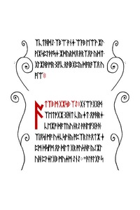</a>
<a href="assets/2014/liber-primus-complete/24.jpg">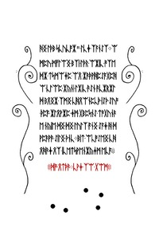</a>

**Key:** ?

Runes:

    ᚪᛏᛉᛒ•ᛗ•ᚷᛡᛋᛒ•ᛉᛇ
    ᚷᚾᛠᚫᚷᛝᛞ•ᛉᛖᛏᚩᚷᛡ•ᛝᚻᛏ•ᚳᛁᚣ•ᛄᛏ•ᛟᚩᚻᚱᛄ•ᚳᛖᛡᚩ•ᛞᚪᛏᚣᚢᚾᚱᛇ•ᚫᚫᛁᛖᚠᛝᚦᚻ•ᛉᛁᛟᛋᛁ•ᛗᚪ•ᚢᛄᚳᛋᚹᚾᚣ•ᚩᛈᛉᚱ•ᛚᚫᛟᛏᛡ•ᛄᛈᛗ•ᛞᛋᚠᛗ•ᛟᚹ•ᛞᛚᛏ•ᚷᚱ•ᚩᚢᛋᚻᚪ•ᚣᛇᛡᛚᚢᚻ•ᛈᚹᛄᛚᚷᛒ•ᛗᚢᛄᛗ•ᛇᚾᛇ
    "ᚫᛚᚪᛚᚷᚪ•ᛋᚻᛝ•ᛚᚦᛒ•ᛋᚳᚢᚳᚩᛡ"•ᛚᚳᛄ•ᛉᚪᚾᛇᛉ
    ᛠᛗᛈᚢ•ᛗᚠᛚᛠᛝ•ᛒᛉᛁ•ᛚᚦᚱ•ᛠᛡᛁᚳ•ᚩᛉᛖᛞᛡ•ᛏᛋᛗᛠᛄᛈ•ᛠᛟ•ᛡᚫᚦᚹᚻᛈᛇᚪᚷᛈᚻᛠ•ᚳᛚᛠᛈ•ᛡᚣᚾᛁ•ᛚᛡᛁᚳ•ᚫᛇᚾ•ᚫᚳᛡᚱᛡᛚᛞ•ᛒᛟᛝᛡ•ᛉᛗᛝ•ᚳᚻᛟᛠᚾᛈᚳᚦ•ᛁᛇᚦ•ᛇᚢᚩ•ᚦᛈᚪ•ᛡᛚᛟᚹᛡᛈ•ᛄᛗ•ᚷᛒᛈᛋᚾᛇ•ᛏᚩᚷᚢᚾᚫᛖ•ᚾᚣᛁᛖ•ᛞᛝ•ᛞᛝ•ᛚᚢᛚᛉ•ᚪᚾᛝ•ᛇᚪᛄ•ᚻ•ᛞᚹᛈᚫᚹᚫ•ᛇᛁᛚᛝ•ᚦᚾᚳ
    ᛒᛁᛏ•ᛠᚳᚩᛇᛖᛝ•ᚳᚻᛟᚻᚫᛄ•ᛟᛉ•ᛁᚳᛖᛏᛋᚹᛖᚾᛡᚣᛄᛗ•ᛖᚳᚪ
    ᛞᚩ•ᛟᛏᚦᚫ•ᚳᚹᛄ•ᛉᛠ•ᚷᛠᛗ

## 25.jpg, 26.jpg, 27.jpg, 28.jpg, 29.jpg, 30.jpg, 31.jpg - 8.jpg-14.jpg

<a href="assets/2014/liber-primus-complete/25.jpg">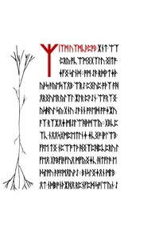</a>
<a href="assets/2014/liber-primus-complete/26.jpg">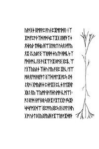</a>
<a href="assets/2014/liber-primus-complete/27.jpg">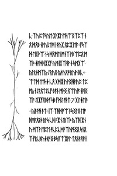</a>
<a href="assets/2014/liber-primus-complete/28.jpg">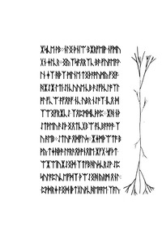</a>
<a href="assets/2014/liber-primus-complete/29.jpg">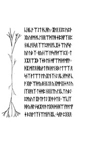</a>
<a href="assets/2014/liber-primus-complete/30.jpg">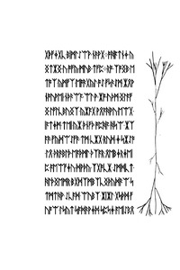</a>
<a href="assets/2014/liber-primus-complete/31.jpg">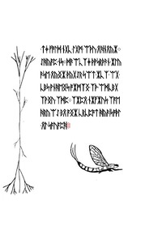</a>

**Key:** ?

Runes:

    ᛉᛁᛉᛗ•ᚢᛉᛗᚳᚦᛈᚩᛒ
    ᛡᚾᛏ•ᛠᛉ•ᛈᚱᚣ•ᚩᚳᛠᛗᛝᚷᛉᛚᚢ•ᛝᛁᛏᚩ•ᛄᚠᛝ•ᛋᛚᚾᛞ
    ᚩᛗ•ᛇᚫ•ᚱᛞᚹᛏᛄᚦ•ᚣᚦᛋ•ᚫᚣᛖᛋᛉᛟᛒ•ᛠᚱᛇ•ᛈᛝᚢᛈ•ᚩᚦᛉ•ᚪᚻᛟᚱᛝᚢᛖᚱ•ᚣᛚᛉᛚ•ᛡᛚᚱ•ᛈᚹᛇᚾ•ᛠᚪᚱᛉᛝ•ᚣᛋᚻᚢᛚ•ᛋᚣ•ᚷᚾᚢ•ᛇᚫᚾᚾ•ᚩᚫᛖᛞ•ᚪᚩᛄᛡᚢᚪᛉ•ᚱᛉᛡᛟᛄ•ᛗᛁᛇᛚᛠᚻᚦᛗᛠᚣ
    ᚷᛒᚳᛈᛉᚳ•ᚾᛟᛟᛋᚷᛗᛈᛖᛏᛚᚾᛄ•ᛄᚳᛝᚩ•ᛁᚹᛚᛠᛒ•ᚠᚪᛖ•ᛏᛝ•ᚾᛈᛠᚩᛏᚦ•ᚻᛝᛉᛈᚻᛈᚳᛈᚱᚢ•ᛚᚠᛖᛟ•ᚷᚪᛒᚠᛁᚫᚠᚢᛟ•ᛗᚠᚣᛝᛄᚳ•ᚻᛏᚠᛚᚫ•ᛖᚦᛋᛚᚩᚢ•ᚫᚩᚪᛗᛟᚢᚹᛇ
    ᛒᚾᛋᛚᛝᛄᛟᚾ•ᛗᛚᛒ•ᛟᛏ•ᚾᛞᛒᚩᚾᚦᛡᚻᛟ•ᚱᛈᚾᚠᛈᛞ•ᛋᚩᛁᛠᚣᚾ•ᛇᚣᚹᚫᚷᛄ•ᛝᛗᚪᚹᛈ•ᚪᚢᚾ•ᛈᛡᛗᛖᛞᛟ
    ᛁ•ᛉᛡᛗ•ᚠᛈᚩ•ᚦᛉᛞ•ᚩᛞ•ᛋᛈᛉᛡᚷ•ᛟᚻᚠᚦᛉᛄᛟᛋᚦᚣᚦ•ᛏᚻᛋᚣ•ᚻᛠᚷᛚᚫᚱᛏ•ᚢᛋᛟ•ᚦᚠᚠᚣᛟᛡ•ᛇᚳᚣᛒᛚᛝ•ᛠᚱᚻᛞ•ᛄᚣᛏᚫ•ᚻᛞᚳᛋ•ᛉᚠᛞ•ᚦᛗ•ᚳᛇᛝ•ᚫᚾᛡᛠᚹᛁᛡ•ᛒᛗᛝ•ᚷᛈᛁᚳ•ᛠᛚᚷᛉᚣᚣᚱᛄ•ᛉᛁᛄᚢ•ᛖᚣ•ᚪᛝᛈ•ᛡᚫᚳ•ᛖᛠᚹᛒᚦᛟᚠᛗ•ᚫᚱᚠᚩᛏ•ᛝᛉᛞ•ᛗᛖᛡ•ᚩᛈᛋ•ᛇᛞ•ᛇᛟᚫᚾ•ᚷᛗᚣᛁᚫᛁᛄ•ᛈᛄᚩᛡᚷ•ᛈᚳᛄ•ᛚᛖᛡᚻᛚᚷᚱᛇ•ᛟᚣ•ᛠᚣᛗᚹᚾᚹ•ᚠᛁᛄᚢᛗᚫᚾᚳᛗᛠᛁ
    ᚩᛇ•ᛒᛚᛞ•ᚾᚹᚠᚾᛒᚱ•ᛋᛟᚦᛡ•ᚪᛡᛏᚷᚷᚹ•ᚪᛋᛡᚦᛋᚦᛋᚠᛗᚷᛞᛠ•ᛝᛈᚩᚪᚣᛝᛈᛋ•ᛟᚾᛇᚪᛖ•ᚻᚢᚷ•ᚩ•ᚢᚦᛏ•ᛒᚷᚣᛝᚠᚣᛁᚻ•ᚹᛡᛠᚱᚫᚹᛡᛞᚪᚦᚳ•ᛉᚢ•ᛈᛏᛋᚢᛖ•ᚷᚦᛡᛚ•ᛖᛋᛠᛝᛉᛈᛉ•ᚾᛟ•ᛞᛟᛒ•ᚾᚹᚢᛁᛇᛚᛞ•ᛁ•ᚦᚣᚷ•ᛟᛈᛡ•ᛖᚪ
    ᚠᛋᛉᛞ•ᛖᚷᚦᛠ•ᚾᛋ•ᛞᛟᛗᛖ•ᛗᚾᛉ•ᚹᛒᛠᛈᛟ•ᛗᛉᚫ•ᛄᚩᛞᚻᛡᚷᚠ•ᚣᛗ•ᛁᚷᛉᚻᚹ•ᚾ•ᛋᛗᚷᛠ•ᚣᛚᚱᛄᛗᛉᚣ•ᛇᚱᚢᛟ•ᚣᚦᚢᛟᚩ•ᚱᚢᚹ•ᛁᛒᚳ
    ᛠᛏᛞ•ᛚᛖᛋᛄ•ᚳᛟ•ᚷᛞᛡ•ᚢᚹᛝᚻᚫᚢᛈ•ᛏᛈᚩᚣ•ᚾᛇᚦᛟᛏᛇᚳᚠ•ᛒᚪᚾ•ᛗᚦᛝ•ᛟᛠᚢᛁᚪ•ᚾᚻᛝᛉᚩ•ᛇᛁᛡᚠᛟᛒᚦᚠ•ᛋᛒ•ᚠᛞᛇ•ᚩᚦᛏ•7•ᚷ•ᛚᛄᛖᚫ
    ᚣᛁᚫᚹᚻ•ᚫᛏ
    ᛁᛉ•ᛉᚻᛞᚩᛠ•ᚫᛋᛝᛚᛝ•ᛖᚩᚻᛗᚩᛟᛒᚦ•ᚱᛚᛋ•ᚳᚻ•ᚪᛡᚾᛇᚱᛉᚦ•ᚣᛉᚻ•ᛡᚾᚢ•ᛗᛉᚹ•ᛖᛈᛖ•ᚩᚳᛈᚳᛞᚪᛉᚢᛗᛝᛟ•ᛋᚾᛟᛉ•ᚠᚱᚳᛒᚢᛄᚱᚫᛝ•ᛒᛋᛟᛠᛡᚪᛚ•ᛏᛟᚾᚫᛟᚪ•ᛁ•ᛡᛋᚳᛖ•ᚹᛒ
    ᚾᛚᛝ•ᚦᚾᛁᛠ•ᛒᛡᚱᚠᛖᛁᚹ•ᚾᚠᛗᚢᚷᚾ•ᛄᛚᚳᚱ
    ᛝᚣᛉᛋᚪᛟᚱᛉᚳ•ᛒᚫ•ᚠᚢᚪᛖᚪᚹ•ᛚᚾ•ᛄᛉ•ᚻᚦᛉ•ᛗᛚᚾᛖ•ᛏᛝᚦᚪᚩᚢᛗᚣ•ᚠᛝᚪ•ᚻᛡᛇᛡ•ᛚᛏᛁ•ᛇᛁ•ᚳᚢᚢᛖ•ᚳᛒ•ᚫᛇᚠᚦᚳᛚᚩᛉᛚᚩᛚ•ᚠᚳᛠ•ᚪᚠᛟᚫᚠ•ᚾᚳ•ᚢᛒᚱ•ᚾᛇᚩᛉ•ᛁᚳᛟ•ᛞᛉᛠᛝᚠᚱᛡᚳᛇ•ᛉᛟᛈᛗᛞᚳᚦᚹᛈ
    ᛡᚻ•ᚾᚦᛇᛏᚹᛖᚢ•ᚫᛇᚦ•ᛝᛟᛏᚳᚷᛒᛠ•ᚪᚳᛒᚪᚩᚹᚫ•ᛉᚢ•ᚫᛖᛒ
    ᛇᛏᚢᚩ•ᛟᛞᚠᚢᛋ
    ᛡᛄᛗᚦᛠᛏᚪ•ᛒᚹᚣ•ᛏᛄᚻᚦᚫ•ᛚᚪᚱᚫᛟᚦᚩᚾᛟᛁᛖ•ᛡᚠᚷ•ᛋᚠᚦᛏ•ᛠᛡᛠᛁᚢᛡᛇᛝᛞ•ᛉᛏᚠᛒᚻᚢᛋᚳᚱᛇᚹ•ᛇᛈᛋᚢᛚᚪᛈᚢᚳᛖᚠᛞᛉ•ᚦᛠᛇᛝᚻ•ᚣᚱᛗ•ᛟᚾᛚ
    ᛈᚹᛞᚱᛄ•ᚪᛝᛞ•ᛁᚦᛏᚷᚢᚹᚳᚻᛖᚩᚪᛖ•ᛉᚪᚢ•ᚳᛁ•ᚱᚳᚹ•ᛠᛇᛏ•ᚦᚳᚻᚢ
    ᛡᚹᛟ•ᚷᛇᛈ•ᚢᛈᚦ•ᚷᚣᚢᚪᛗ•ᚹᚳᛖᛝᚱᛠᛞᛏᚻ•ᛄᛁᛈᚻᚠᛉᛝᛈᚾ•ᛒᚳᚪᚷᛋᛟ•ᛉᛠᛈᚪᚩᚷᚠᚳᛡᛄ•ᛠᚢᚠᛋᛚ•ᚣᛚ•ᚢᛒ•ᛉ
    ᚱᚣᚾ•ᛁᛠ•ᛚᚹᛋ•ᚠᚦᚪᛠ•ᛈᚷ
    ᛏᚷᛡᛟᛠᛡᛒ•ᛉᛄᛒ•ᛖᚾ•ᛞᚠᛠᛗ•ᚦᚪᛗᚠᚪ
    ᚻᛡ•ᛗᛁᛏᛟ•ᚻᚣᚹᛏ•ᚠᛒᛁ•ᚫᛖ•ᛝᛒ•ᛚᛏᛠᛉ•ᛟᛋᚾᛉ•ᚹᛏᛠᛏ•ᛖᚢᛡᛖ•ᛉᚾᛇ•ᛟᚳᚾᚠᚩᚾᚠ•ᚳᚪ•ᚷᚱᚩ•ᛠᚦᚹᚣ•ᛒᛁ•ᛝᛇᛟ•ᚣ•ᚷᛗᚩ•ᛁᚷᛄ•ᚩᛇ•ᚢᛁᛉᛝᚪᚱᛉ•ᛏᛄᛞᛈ•ᚾᛝᚷᛏᚢ•ᛚᚷᚳᛏ•ᚢᛒᛇ•ᛈᚩᚣᚢᛏ•ᛡᚫᛏᚹᛏᛇ•ᛡᚫᚫ•ᚦᛏᛝ
    ᛠᚳᛁᛉᚻᚦᚣ•ᚻᛚᚾᛋᚱᛡᚫᛚᚫ•ᛖᚷᚻ•ᛞᚾᚻᛠ•ᚠᚪᚹᛖᚠᛄ•ᛒᛇᚱᚹᛏᛉᚾᛠᛖᛁ•ᚠᚾᛡᚳ
    ᛋᛟᚹ•ᛈᚷᛝᛟ•ᚷᚦᚠᛄᚷᚳ•ᛒᛁᛗᛚᛇᛠᚹ•ᚾᚫᚹᚷ
    ᚩᚻᚪᛏᚾᛄ•ᚣᛝᛏᛡᛝ•ᚢ•ᚩᚠᚣ•ᛗᚢᛒ•ᛏᚠᛈ
    ᚱᚩ•ᛉᚩᛝᛒ•ᛖᛏᚩᛉ•ᚣᛗᚠᛉ•ᛖᚩᚫᚷᚣᛚ•ᚩᛇ•ᚠᛋᚫᛇᛗ•ᛡᛟᚹᚾᚩᚢᚹᛖᛁ•ᚾᚦᚫᛠᚪ•ᛠᛚ•ᚹ•ᛡᚩ•ᚢᚦᛗ•ᛝᛚᚪᚠᛝ•ᛚᚠᛚᚳᛒᚢᛝᛉ•ᚣᛡᚪᚷ•ᚹᛟᚪᚻᚹᚢ•ᛖᛠᚷ•ᛁᚪᛏᛄᛗ•ᛏᛖᛁ•ᚣᛡ•ᚦᚾᚠᚦ•ᚩᛈᚻᚪ•ᚻᛋᛠ•ᛡᛉᚪᚫ•ᚠᚣᛞᛠᛇᚠᚫ•ᛏᛗ•ᚳᛡᚷ•ᚱᚢᛞ•ᛄ•ᛋᛡᛇᚩ•ᛚᛟ•ᚦᚱᚫᛒᛚᚦ•ᛖᚪᚦᛗᛚ•ᚦᛉᚪᚱ•ᛟᛖᛒᛄᚱᛄᛖᛁᛈ•ᚪᛖᛠᚠᛄᚢ•ᛞᚹᚦᚣ•ᛉᚷᚩᚳᛡ•ᛇᛗᛞᚳᛏ•ᚻᛚᚦᛝᛖᛗᚱ•ᛒᚷᛞᛉᛗᛒᛉᚳᛝᚦᚣᛞᚫᛠ•ᛋᛏᛗᛏᚻᚹ•ᛇᚳᚪᛞ•ᛠᚢᛒᛉ•ᛡᛁᛡᛚ•ᚷᛋᚦᛞ•ᚠᚢᚩᛠ•ᛚᛋᚣᛏ•ᛋᚪᛞᚫᚹᛄᛞ•ᛋᛈᛋᛄ•ᚪᛖᛁᛇᛒᛟ•ᛏᛄ•ᚠᚩᛚᛞ•ᚾᚷᚳ•ᛚᚷᛗ•ᛠᚦᚢ•ᛟᚻᚾᛟᚣᛡ
    ᛇᚻᚣᚪᛈ•ᚾᛋ
    ᛞᚫᛠᚳᛉᛄ•ᚦᚹᛋᚱᚦᚫᚾ•ᛡᛚᚣᚫᛋᛖ•ᛟᚣᛝᛡ•ᚦᚣᚷᛇᚱ•ᛋᛠᛏ•ᛡᚳᛉ•ᛠᚷ•ᚳᛒᛋ•ᚹᚾᚻᛖᛝᛋ•ᚩᛡᛗᛉᛝ•ᛉᚦ•ᛠᛞᚳᛒᚷᛉᚹᛝᚢ•ᛉᛞᛈ
    ᛉᛡᛈᛟ•ᚾᛡᚠᛡᚢᛋ•ᛉᚪᛖᚻᚱᚣᛠᛇ•ᛒᛟ•ᚪᛝᛡ•ᚳᚱᚳᛈᚩᛏ•ᚻᚣᚫᛁᛋᚩᚦᛚ•ᛟᛚ•ᛋᚪᚢᚪᛈᚻ

## 32.jpg - 15.jpg

<a href="assets/2014/liber-primus-complete/32.jpg">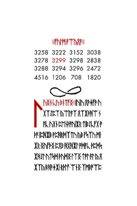</a>

**Key:** ?

Runes:

    ᚠᚢᛚᛗ•ᚪᛠᚣᛟᚪ
    
    3258	3222	3152	3038
    3278	3299	3298	2838
    3288	3294	3296	2472
    4516	1206	708		1820

## 32.jpg, 33.jpg, 34.jpg, 35.jpg, 36.jpg, 37.jpg, 38.jpg, 39.jpg - 15.jpg-22.jpg

<a href="assets/2014/liber-primus-complete/33.jpg">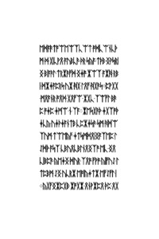</a>

<a href="assets/2014/liber-primus-complete/35.jpg">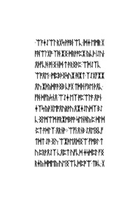</a>
<a href="assets/2014/liber-primus-complete/36.jpg">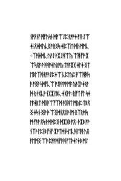</a>
<a href="assets/2014/liber-primus-complete/37.jpg">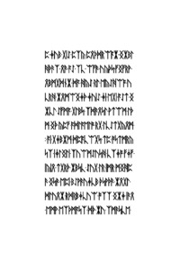</a>
<a href="assets/2014/liber-primus-complete/38.jpg">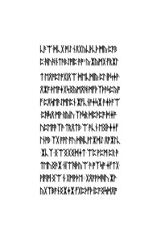</a>
<a href="assets/2014/liber-primus-complete/39.jpg">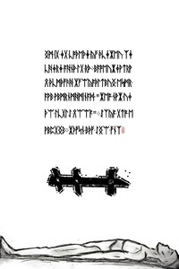</a>

**Key:** ?

Runes:

    ᛚᚢᛝᚾ•ᚳᚢ•ᛒᚾᛏᚠᛝ
    ᛁᚢᛁᚢ•ᛟᚫᛄᚠᚫ•ᚢᚷᛉᛇᛈᛉ•ᚣᛠᛚᚪᛉ•ᛟᛉᛡᚦᚻᛠ•ᚾᚪᚳ•ᚢᚷᚾ•ᛈᛖᚾᚦᚩᚢᛁᛡᚱ•ᛏᛁᛒᛇᚳᚠᚷ•ᚩᚦᚪ•ᛁᛈᚻᛡᛒ•ᚹᛈᚻᚱᛞᛉᛏᚢ•ᚣᛒ•ᚠᛋᛉᚢ•ᛗᛁ•ᛡᚱ•ᛝᚢᚠᚦᛝ•ᛈᛟᛒ•ᚻᚷᚻᛡᛚ•ᚩᛞᚪᚳ•ᚦᛈᛞᛋᛡᚻᛇᛚ•ᚢᛏᛋᛞ•ᚦᚢᛞᛝ•ᛚᛉᛝ•ᛏᚩᛚ•ᚪᛚ•ᚣ•ᛟᛡᛉᚣ•ᛒᚻᚫᛄᛡᛁ•ᚱᚦᛚᚠ•ᛠᚾᛝ•ᛉᛗᛒᚩᛠᛈ•ᛖᛞᚪᚫᛏᚩᛠᛖᛠᛉᚳᛠᛏ•ᚩᛞᚳᛠᚾᚳᚦᛗ•ᛞ•ᚷᛁᚳᚹᛟ•ᚪᚢᛒᚳᚫ•ᚦᚱ•ᛋᚣᚪ•ᛏᚦᛒ•ᛝᚹᛋᚱᛁᛝ•ᛒᛁᚪᚫᛚ•ᛏᚱᛡᚫᚠᛞ•ᛝᛄᚩ•ᛡᛠᛉ•ᚪᛡᚻ•ᚱᛒᛁ•ᛞᛡᛄᚪᛈᚱᛋ•ᚢᛡ•ᚻᚷ•ᛚᛟᚠ•ᚻᚷᚫᛋ
    ᛈᚹᚷᚷ•ᛗᛟᚪᚾᚱ•ᚩᛟᛞ•ᚷᛟᚠᛠ•ᛡᚷᚳ•ᛉᛠᚠᛚ•ᛒᚫᛈ•ᚩᛄᛈ•ᛄᛗᛠ•ᚾ•ᛉᚪ
    ᛡᛖᛋᚷᚫᚦ•ᛄᚷᛉᚩᚦᛄᚳᚣ•ᚢᛄᚦᛄᚪᚾᛏᛒ•ᚳᛈᛡᛄᛋᚫ•ᛋᛗ•ᚻᛞᛠᛉᚢᛗ•ᛏᛠᛖᚣᚠ•ᛄᛏᛋᛗᛞᛟᛁᛝᚪᛉᛖᛈ•ᛚᛇᛞᚦ•ᚪᛋᛉ•ᚳᛒᚢᛟᚳᛒᛚᚾᛟᛝᛉᚩ•ᛖᚳ•ᛝᛟᚳᛁᛒᛈᚫ•ᚣᛖᛄᛝ•ᛞᚢᚱ•ᛉᛟᚩ•ᚠᚹᚩ•ᚣᛁᚠᚢᛇ•ᛚᛏᛈᛒᛗ•ᛇᛝ•ᚢᚳᚱᛡ•ᛖᚩᛁᚣᛄᛏᛡ•ᛖᚠᛇᚠᛚ•ᛁ
    ᚣᚷᚠᛝᛡᛈᚷᛒ•ᛡᚩᚷᛡ•ᛟᚾᚹᛡᛈᛟ•ᚦᛈ•ᛟᚷᛚᚦ•ᛈᛞ•ᚦᛇᛒ•ᛡᚪᛒᚪ•ᚾᛗ•ᚳᚾᛖᛡᚹᛝᛏᚱ•ᛝᚫᛚᛟᛁᛇᚣ•ᛝᛡᚾᛏ•ᚱᛁ•ᛋᚪᛖ•ᛇᚢ•ᛝᛞᛄ•ᚠᚱᛠᛗᛠᚪ•ᚫᛈ•ᛏᚠ•ᛖᛏᚷᚾᚠᛁᚠ•ᚱᚻᚱᛇᛒ
    ᚻᛈᛏ•ᛇᚱᛝᛡᛒᚹᛚᛏ•ᛗᛉᚦ•ᚾᛄᚳᚫ•ᚷᛈ•ᛋᛖᚩ•ᚢᛝᚩ•ᛏᛈᛁᚣᚾᚪ•ᛏᚹ•ᚠᛗᚾᛟᚾᚳᛒ
    ᛄᛉᛡ•ᛟᚪᛁᚫᛝ•ᛒ•ᛉᛏᛄᛁᛋ
    ᛠ•ᚳᛖᚱᚦᚣᚩᚣ•ᛈᚫᚷ•ᛡᛄᛁᚩ•ᚱᚦᛠ•ᛇᚦᚩᛉ•ᚾᚱᚾᚫᛁᛉ•ᛁ•ᛝᚣᚫᛡᚫᛗ•ᚹᛖ•ᛇᚷᚻᛖᛗ•ᚷᚢᛞᚹ•ᛄᚻ
    ᛉᚱᚢᛄᚢᚾᛈ•ᛋᚣᛄᚫ•ᛈᚳᚣᚳᛒᛡ•ᚫᛟᚪᚠ•ᛏ•ᚷᚩᛇᛟ•ᛁᚱᛗ•ᛖᛉᛟ•ᛗᛇᚫᛟᚦ•ᚱ•ᛞᛁᚢᚦᚻᛗᛡᚾ•ᛁᚦᚻᛚ
    ᛏᚳ•ᚪᚦ•ᚠᚪᚫᚣᚻᛠ•ᚦᚠᛋᚠᛝᚷᚱᛈ•ᛏᛄᛉᛟ•ᚷᛚᚻ•ᚩᚪᚦᛏᚳᛁ•ᚠᚣᚢᛁᚹ•ᛟᚪᚣᛁᛠᛄᚪ•ᛟᛝᚦ•ᛟᚠᚦᚾ•ᛇᚷ•ᛠᛚᛒᚠ•ᛠᚪᛄᛇᛠᛚ•ᚱᚷᛋ•ᚹᚩᛒᛁ•ᛠᚳ•ᛁᛞᛄ•ᛖᛗᚱ•ᚷᚪᚻᛠᛚᚷᚩ•ᛉᚻ•ᛡᛝ•ᛞᚱᚹᚩᛈᛡ•ᚣᚳᚦ•ᛁᛇᚢᛁ•ᛟᚦᚠᚳᚻ•ᚩᛁ•ᛝᚾᛁᛞ•ᛏ•ᚫᚱᛝᚫᛈ•ᛠᛞᛇᛉᚳᛠᚩᛟᛖ
    ᛗᛈᛒᚦᛝᛋᚢᛡ•ᚻᛡᛏ•ᛉᛇᚷᚠᛡᛡᛟᚢ•ᛡᚦᚣᛞᚪᚫᛝᛒ•ᚳᚩᚷ•ᛏᛞᚦᛁ•ᚠᛒᛖ•ᚦᛟᚳ•ᚠᚻ•ᛞᚠᚣᛋᚾᛟ•ᛠᛇᛄ•ᛖᛉ•ᚩᛈᛠᛚᚪ•ᛟᚩᚾ•ᛄᛉᛋ•ᚣᚫᚷᛖᚩᛟᚢᚱᚹᚢ•ᛟᛡᛄᛇᚢᛞᛉ•ᛒᛇᚳ•ᛝᛚᛗᛠᛗ•ᚪᚱᛡᛗᛒᚩᚹ•ᛋᛖᚾᚻᚣ•ᛈ•ᛞᛚᛞ•ᛈᛏ•ᚪᛞᛚᛉ•ᛟᚱᚾᚹ
    ᛠᚠᛁ•ᛟᚾᛒ•ᛇᛟᛖᛝᚳᚠᛏᛞᛏ•ᛇᚫ•ᛝᚢ•ᛠᛡᚫᛖᛟᛞᛝᛠ•ᚠᛗᛒᛚ•ᛏᚢ•ᛈᚱᚹᛟᛇᛉ•ᚳᛟᛈᛏ•ᚢᚠᚳᛞ•ᛄᛋᛞᛈᛚ•ᚠᛝᚱᛄᚣ•ᛞᛗᛖᚣ•ᚢᛖᛝᛠᚳᛞᛈᚩᛠ•ᛏᛒᚳ•ᚷᚾᚩᛟᚾᚠ•ᚩᛁᚠᚢᛋᚾ•ᛞᚹᛠᛇᛈ•ᚱᚩᚩᛄ•ᚪᛟ•ᛇᛠᛄᛁ•ᛟᛄᛞᚢᚳᛝᚩ•ᚱᛝᛋ•ᛄᛁᛈᛉᛖ•ᛞᛁᚾᛗᛗᚳ
    ᛉᚩᛁᛄᛞᚳ•ᚢᚪᛇ•ᚦᛡᛇᚻᛠᚣ•ᛠᚻ•ᚠᚩ•ᛡᛠᛋᛟᚪ•ᚹ•ᚫᚻᚩᛄᚢᚱᚩᚣ•ᛏᚫᚪᛡᚷ•ᛄᛚᛄ•ᛝᛏᛖᛒᛚᛉᚻ•ᚱᚩᚫᛇᛈᛄᛠ•ᚳᛈᛚᚣᛈ•ᚪᛠᚻᚻᛋᚫ•ᚩᛝᚹ•ᛋᛞᚠᚳᛠ•ᚩᛇᚫᚪᚩᚹᛗᚪ•ᚣᚫᚷᚫᛄᚱᚹᛞ•ᚱ•ᚦᚷᚳᚹ•ᚾᚷᛡ•ᛚᛒᚳ•ᛄᚷᚹᚹ
    ᚱᛁᚠᛏ•ᚠᛚ•ᛋᛄᛚᚪᛄᚱᛏ•ᛞᚷᚫᛠᚠᛉᛞ•ᚫᚷᚻᛏ•ᛗᚣᛈ•ᛏᛒᛟᛝ•ᛄᛋᚾ•ᛝᛁᚹ•ᚦ•ᛠᛝᛞᚾᛟᚷᚫ•ᛁᛗ•ᛝᛉᚱᛞᛋᛗ•ᚠᚫᚹ•ᛟᛋ•ᚦᛞᛞᛈᛝ•ᛞᛡᚷᛒ•ᚪᛟ
    ᚦᛡᛒ•ᚪᚹ•ᚾᛉᚫ•ᛚᛈᛁ•ᛒ•ᚠᚾᚠ•ᛡᚩᛏᛞᚾᛋᛖᚳᚻ•ᛖᚻ•ᚢᛟ•ᚪᛖᛗᛝ•ᛠᚫ•ᛈᚩᚪᛞ•ᚠᚫᚻ•ᚠᛏᚦᛄᛚᛄᛒ•ᛗᛇᛈ ᛄᚢᛒ•ᚷᛁᛇ•ᛈᛉᚣ•ᛈᛟᚦᛞᚱᛠᚪᛡ•ᛝᛡᛒᛚᚻᚦᚫᛉ•ᛟᚫ•ᚪᛇ•ᛉᚳ•ᛠᚠᚫ•ᚢᚣᚦᛋ•ᚠᛝᚠᚱᚹ•ᛟᛒᛗᚷᛞᚾᛡ•ᛞᚪ•ᚻᚣᛇ•ᚱᛚ•ᛖᚣᛇᚻᛠᚩ•ᚢᚳᚱᚻ•ᛡᛟᛗᛠᛝᛄᚦ•ᛄᚢᛁᛇ•ᛄᛁ•ᛖᚷᛁ•ᚪᛇᛏ•ᛝᛡᚳᛚ•ᛇᚠᛗᚪ•ᚷᛚᛒᛋ•ᛉᛞᚫᛟᛋᛚ•ᚹᛏᛠᛗ•ᛚᚦᛗ•ᛝᚦ•ᚣᛈᚠ•ᚪᛞᛚᚪᛖᛚᚩ•ᚱᚷ•ᛚᚳᛇᛏᚷᚣᛟᛗ
    ᚪᛁ•ᚷᛄᛒᛡᛗ•ᛞᛈᚪᚳᛠᚷᛋ•ᛏᛈ•ᚩᛋᛏᛗᚱᚣᛋᛉ•ᛁᛄᛚᛝᛚᛁ•ᛉᚢᛠᛗᛇᚢᛋᚻ•ᚳᛉᛄᚩ•ᚠᛄᚠ•ᛁᚣᛁᛟ•ᛏᚷᚱᚦ•ᛡᛒᛋᚳ•ᛇᚢᚷ•ᛚᚱ•ᛁᛗᚱ•ᛗᛝᚻᛈᚫ•ᛝᛋᚫ•ᛖᛈᛁ•ᛒᛇᚹᚫᚢᛄᚳᛒ•ᚦᛋᚹᚦᚫ•ᛡᛟᚷᛚ•ᛞᛚᚢᛟᛡ•ᚱᛞᚱᛒᛄᚳᚢᛠ•ᚩᛉᛉ•ᛝᛡᛄ•ᛁᚫᛟ•ᛖᛗᚹ•ᛖᛉᚦᛗᚪᛋᛉ•ᛞᚦ•ᛡᚢ•ᛉᛗᚫᛋᚳᛖ•ᚳᚫᛠ•ᛞᚳᚷ•ᚩᛁᛇ•ᚾᛟᚷᚣᚳᚦᚳᚦ•ᛗᚣ•ᛈᚪᛒᛈ•ᚻᚢᚻᚾᛏᚫᛒᛇᚩᛁᛈ•ᚫᚩ'ᚣ•ᛡᚣᛗᚷ•ᚠᚱᛡᛚᛏ•ᛖᛟᚩᛈᛚᚩᚷᛁᛟᛠ•ᛞᛖᚳᛗᛁᚣ•ᛈᛚ•ᛁᚹᛋᛄᚹ•ᛟᛡᚪ•ᚦᛖᚩᛄᚷᛋᛝᚣᛗᛟᚻ•ᛗᚠᚦᛉᚦᚫᛋᛈᚣᚩᚠ•ᛈᛟᛋᛖᚫᛇᛗᛚᛈᚾ•ᛡᚠᚳᚾᚩᛄᛋᛡ•ᚫᛄᚦᚪᛠ•ᛈᚻᛋᛟ•ᛗᚹ•ᚱᚣᛁᚢ•ᛉᚹᛋᚱ•ᛞᛈᚦᛈᚩ•ᛞᛄᚩ•ᚢᛈᛖᚪᚫᛉᚫ•ᛏᚱᛟᛏᛒ•ᛠ•ᚫᚳᚾ•ᛖᛝᚦᛄᛄᚠᛚᚾᚩᛒ•ᛉᚷ•ᚪᚩᛚ•ᚪᚢ•ᛞᚻᚳᚹᛚᛡᛞᛇ•ᛟᚩᛡᛚᚳ•ᛡᚳᛉ•ᛝᛠᛝᚷᛝᛞᛄᛏ•ᛠᛈ•ᚹᛈᛗ•ᛈᚱ•ᚫᛏᛖᚢᛝᚫᛡ•ᚾᛁᛠᚻᚦᚣᛠ•ᚫ•ᚩᛉᛋᚩ•ᛄᚠᛏᚷ•ᚹᛁᚪᛁᚩᛁ•ᛝᛠ•ᚾ•ᚷᛗᚹᚦᛖ
    ᚷᛟᚪᚹᛞᚻᚢ•ᛡᚹ•ᚣᚷᛉᛒᚪᚾᛝᛡᛄᛡ•ᚠᚷᛈᚦᚠᚦ•ᛁᛈᚪᛝᛋᛞᛟᚩᛝᛗ•ᛁᚷ•ᛄᚷ•ᚳᚩᚦᛖᚦᛄ•ᚣᚠ•ᚦᚳᛄᛡᛖᚢ•ᛉᛄᚳᚻᛄᚱᛄ•ᚪᚻᚾᚦ•ᛚᚷ•ᚱᚦ
    ᛒᚪᚩᛖᚢᛡᛄᚹᛏᚱᚹᛟ•ᚦᚳᛗᚦᚠᚫᚻ•ᛡᚠᛠᚣᚪᚦᛚᛏᛒᚢᛝ•ᛖᛋᛗᚱ•ᚪᚹᛒ•ᚹᛒᛗᚱᚾᛗᚻᛗᛁᚾᚪᛞ•"ᛡᛖᚩ•ᚾᚹᛡ•ᚢᛄᚦᛠ•ᛚᚳᚷᛚᛇ•ᛟᛠᛠᚪ"
    ᛇᛉᚣᚪ•ᚷᛏᚩ•ᛖᚹᛒᛈᚷᛝᛒ
    ᛡᚦᚠᛋᚾ•ᛒᚦᚠ•ᛇᛝᛠ•ᚠᚾᛉ

## 40.jpg, 41.jpg, 42.jpg, 43.jpg - 23.jpg-26.jpg

<a href="assets/2014/liber-primus-complete/40.jpg">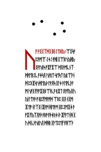</a>
<a href="assets/2014/liber-primus-complete/41.jpg">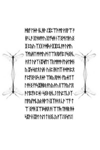</a>
<a href="assets/2014/liber-primus-complete/42.jpg">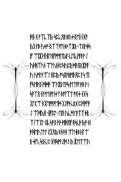</a>

**Key:** ?

Runes:

    ᚢᚪ•ᚹᛝᚷᛉᛞᚷ•ᛁᛒᛁ•ᛇᛏᛒᛁᚣ
    ᛠᚷᛋᚫᛈᚹᛗᛠ•ᛇᛄᛇ•ᚹᚻᛁ•ᚷᛠᛒᚢᚣᚻᚣ•ᛝᚹᚢᚱᛋ•ᚩᛡᚠᛡᛠ•ᛞᛟᚦᛗᚳᚾᛉ•ᛞᚦᛖᚱᛇᚳ•ᚪᛄᛋᛟ•ᚢᚹᚱᛏ•ᛋᛖᛋᛏ•ᚣᚱᛠᚫᚾᛞ•ᛈᛒᛡᛋᚢᛞᛖᚣᚦ•ᛚᚹᛟᛋ•ᚷᛚᛄ•ᚫᛖᚩᚳᚦᚹᛗ•ᚢᚩᚷ•ᚠᚪᚩᛡᛝᛒᛠᚦᚳᚪ•ᚱᛡᛏ•ᛟᚹᚠᚣᛝᚢᚣᛁ•ᛚᛏᚫᚫ•ᚪ•ᚱᛈᚠᛗᚹᚩᛞ•ᛠᛒᛈ•ᛝᛟ•ᚾᚷᛗ•ᛡᛖᚩ•ᚾᛚᛉᛝ•ᛁᛡᚫᛗ•ᚻᛖᚹᛗ•ᛝᛈᛇᛗᛡᛄ•ᚫᚩᛡ•ᚠᚣᛉᛟᚫᚦ•ᚫᛒᚩ•ᚪᚦᛄᚱᛄᚾᚦ•ᛡᚠᚪᛏᚾᚻ•ᚷᚢ•ᛞ•ᚳᚦᚢᚱᚢᛟ•ᛞᚻᚱ•ᚷᚹᛏᛈᛖᚠ•ᚪᚻᛠᚦᛞᚱᚠ•ᛖᛄᚫ•ᚾᚳᚻᚹ•ᛇᛡᛈᛠᚹ•ᛗᛚ•ᚹᛟᚹᛠ•ᚪᚾᚪ•ᚳᚪ•ᚷᛚᚦᛒᚩᚹᚢ•ᚷᛚᚠᛋᚻ•ᚾᛉᛝᛗ•ᛖᚦᚢᛝᛡ•ᛈᚣᚢ•ᛉᚷᚷ•ᚹᛞᛁᛋ•ᚦᛡᛡᛈᚳᚪᚩ•ᚢᛗᚢᛉᚩᚣᚻᛏ•ᚩᚫᛗᚢ•ᚩᚾᛏᛠᛒᛟᛒᚠᛁᛈ•ᛚᛋᛝᚫᚳ•ᚫᛟᛏ•ᚢᚩᛉᚾᛡᛋᚠᛖ•ᛉᚱ•ᛗᚩᚩᚫ•ᚠᚢᚦᛖᛞᚾᚣ•ᛡᛋ•ᛋᚱᛚᛟ•ᚢᚻ
    ᚢᚾᛈ•ᛁᚻ•ᛖᛉ•ᚦᛞᛗ•ᛈᛟᚠ•ᛈᚠᛝᚫᛝᛋ•ᛟᛄᚹ•ᛠᛒᚣ•ᛟᚹᛞ
    ᚠᚣᛄᛁᛏᛉᛚ•ᚩᚦᛝ•ᚠᚪᛋᛡᛁᚻᛒᚱ•ᚪᚢᚣ•ᚪᚢ•ᛟᛠᚪᚣ•ᛖᛟᚫ•ᛖᛈᚠᛒ•ᛈᛄᛁ
    ᛋᛝᛒ•ᚱᚦᚳᛇ•ᛚᛁᚢᛈᛏᚳᛒᛉ•ᛖᚪᚣᚠᛗᚳᚣᚱ•ᚻᚹᛏᚾᛡᛉᚫᚦᛟ•ᚳᚹ•ᛠᚠ•ᛏᛠ•ᛝᚩᚻ•ᛡᛠᛒᛋᚻᛟ•ᚫᛁ•ᛠᛏᛁᛋ•ᛏᚫᚻᚱ•ᚻᛄᛋᛡᚹᚾᚾᛡᚹᛚ•ᚢᛖ•ᛏ•ᚱᛝᚳᚣ•ᚪᛉᛇᛝᛋᛖᛇᛁᚻᚾ•ᚷ•ᚹᛉᚳᛉᚣ•ᛋᛈᚳᛟᚱ•ᛒᚣᛄᛝᛖᛁ•ᚾᚷᚪ•ᚣᚷ•ᛚᛒ•ᚢᛄᚩ•ᛝᛉᛉᚪᛖ•ᛒᚦᛉᛡᚱ
    ᛏᚷᚹᛄᛋᛁᚠ•ᛠᛁᛡᚦᛝᚾᛖᚾᚠᚩᛗᛖᚣᚪ•ᚳᛖᚳᚹᚪᚫᚹ•ᛇᚢᚦᚻᛉᚢᚾ•ᛠᛚᚢᚾᚦᛈᛋᚢᛈᚱ•ᛞᚫᛟᚱᛡᚫᚪᚢ•ᚢᛗᛚᚦᛠ•ᛚᛝᛈᚣ•ᚩᛋᛟᚪᚱᛗᚦᛟᛈ•ᛚᛋ•ᛏᛁᚠᛋᛖᚹᛝ•ᛗᛞᚩ•ᛠᚫᛡᛒᛏᚩᛋ•ᛖᛏᚪᚠ•ᚫᛒ•ᛚᚾ•ᛋᚪᛉᛟ•ᚾᛚᚹᛖ•ᚩᛚᛁᛄᛏ•ᛒᚪᚠᛉᛏ•ᚩᛟᛄ•ᚾᚷᛋ•ᚷᛚᚷᛠ•ᛒᚷᛖᚩᚪᚩᛖᛞ•ᚷᛇᛗ•ᚳᚱᚷ•ᛈᛞᚩᚠᚹᛇ•ᛠᛞᚣᛝ•ᚾᛁᚠᛈᛚ
    ᛖᛟ•ᚢᚳᛗ•ᛚᚫᛏᛉᛄᚱᛉ•ᛁᛠᚷᛚ•ᚷᚳᛋᚩᛝ•ᚫᚦ•ᛗᚻᛟᚠ•ᚱᛋᚳᚦ•ᚣᚩ•ᛒᛁᚫᚻᛖᚢᛏᛚᛚ•ᛇᚷᛟᚣ•ᛒᚾᚦᚻ•ᛠᛖᛄᛒᚾᛁᛚᛠᚱ•ᛄᚠᚳᛋᛝᚳᛈ•ᚷᚻᛋᛗ•ᛇᛞᛇ•ᚣ•ᛡᛖᛏᛠᚢᛡ•ᚩᚾᛠᚩ•ᛄᚣᛇᛉᛠᚪᛡ•ᚾᛞᛝᚻ•ᛈᛠᚻᛡᚢ•ᛝᚻᚦᛈ•ᛉᚢ•ᛠᚣᛈᛟᚦᛋᚣᛈ•ᚠᛏ•ᛒᛁᛟᚪᚷᛚ•ᛠᚻ•ᛝᛁᛡᛚᛝᚾᛞᚪᛈᚷ•ᚾᛏᚦᛋᛒ•ᛋᛋᛠ•ᚷᚳ•ᛠᛗᚢ•ᛖᛉᛒᚷᚫᚠᚩᛁᛉ
    ᚠᚪ•ᛠᚱᛇ•ᚩᛁᛞᛋᛚᚦᛖᛒᛇ•ᛟᚷᚣᚷᚾᚷ•ᚦᚠᚳᛗ•ᚩᛖᛖ•ᚩᚠᛒᚻᛝ•ᚳᛁᛄᚪᚾᚩᚪ•ᛈᚻᚱᛗ•ᚱᛗᛟ•ᚦᚷᛄ•ᛒᚱᚦᚪᛠ•ᛉᛖᛡᛞᚦ•ᚱᛝᛄᛒ•ᚾᛏᚣ•ᛏᛋᛒᚾᚫ•ᚢᛖᛁᚩᛡ•ᛄᛇᚢᚦᛚᚳᛖ•ᛚᛁ•ᛒᚢᚠᚪᚱᛠ•ᛗᛒ•ᛞᛉᛗ•ᚢᛠᛏᚣ•ᚪᛄᛈᚢᛈᛠᚣᚷ•ᛗᛡᛗᚢᚪᛗᛝ•ᚣᛡ
    ᚪᛖᛏ•ᛖᛋᚪᛟ•ᚳᚻᛁᛋᚠᛁᚾ•ᛈᛟᛝ•ᛇᚦᚣᛏᚫᛉ•ᛖᛟᛏ•ᛞᛡᛚᛖᛈᛏᚪ•ᛏᚠᚱᚾ•ᚪᛠᚱ•ᛠᚳ•ᚾᚻᚹᛒᛇᛋ•ᛁᚻᚣᛋᚹᚩᛉᚹ•ᚩᛝᚢ•ᚻᛝᛟ•ᛏᛚᚠ•ᛄᚷᛏᛝᛄᛝ

## 43.jpg - 26.jpg

Outguess:

    Outguessing the image yields 58,2kB garbage output.

## 44.jpg, 45.jpg, 46.jpg, 47.jpg, 48.jpg, 49.jpg - 27.jpg-32.jpg

<a href="assets/2014/liber-primus-complete/44.jpg">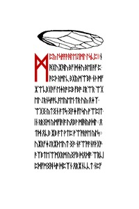</a>

<a href="assets/2014/liber-primus-complete/46.jpg">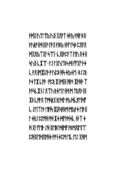</a>

<a href="assets/2014/liber-primus-complete/48.jpg">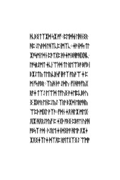</a>
<a href="assets/2014/liber-primus-complete/49.jpg">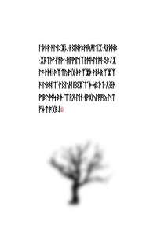</a>

**Key:** ?

Runes:

    ᛗᛈᚣ•ᛚᛋᚩᚪᚫᚻᛚᛖᛇᛁᛗᛚ•ᛚᛋᚳᛈ
    ᚾᚻᚷᚢᛡᚻᚢ•ᛒᚠ•ᛞᛄᚢ•ᛒᛖᛁ•ᚫᚠ•ᛈ•ᚫᛈᚦ•ᚱᛗᛚᚳ•ᛒᚷᚣᛗᛠᛒᚫ•ᚾᚦ•ᛗᚠᛡᛠᚳᛒᚷᚫᚠ•ᛖᛄᚱᚩ•ᛈᛒ•ᚠᛒᚩ•ᛇᚱᛠᚱ•ᛠᚷᛖᛚ•ᛇᚱᚾᛋᚩᚩᚳᚪᛖᚣᛖᛖ•ᛏᚱ•ᚢᚣ•ᛟᛄᛉ•ᛠᚷᛝ•ᚣᛏᛝᚾ•ᚪᛏᛋ•ᛝᚪᛄ•ᚠᛚᛋᚢ•ᚹᛠᛈᛁᛏ•ᛁᚾ•ᚱᚱᛝᛗ•ᚣᛗᚠᛁᚫᛁᚪ•ᚢᛟᛒᚹ•ᛗᛁᚻᚣᚹᛞᛚ
    ᛟᛏᛞ•ᛟᚳᛒ•ᛡᛒ•ᚪᛏ•ᚹᛏᛈ•ᚹᛠᚩᚱᚩᛖ•ᚣᛚᛋ
    ᚢᛡᚱᚠᛄᛇᚱᛡᚦᛖᚢᛏ•ᛝᚫ•ᚾᚪᛠᚩᚪᚾᚪᚦᚷᚩ•ᚫᛉᛒᛏᛖᛠᛗᚷᚱᛗ•ᚣᛝᚠᛒ•ᛞᛟᛞᚪ•ᛠᚱᚳᛁᛈᛞᚠᛗᛝᚻ•ᛋᚩ•ᛞᛈᛉᚾ•ᛟᚱᛡᚾᚳᚳᛏ•ᚾᛈᚠᛈᚳ•ᛄᚦᛒᛁᚹ•ᛞᚹᛝᛠᛡᚹᛚ•ᚹᛄᚾᚪᛟ•ᛏᛞᛉᚣᛖᚱᛞ•ᚱᛏᛇᛁᚳᛈ•ᛝ•ᚦᛟᚷᛄᚦ•ᚣᛋ•ᛠᚻ•ᚠᛒᛚ•ᛁᚫᛚᛞᛉᚪ•ᛁᚹᚷ•ᛒᚩᚹᚾᛠ•ᛋᛖᛗᛒᛋ•ᚳᚹᚦᛟᚠᚻᚫ•ᛞᚢᛁᛒᛞ•ᛇᛝᛈᚠᛁ•ᛟᚢᚣᛏ•ᚻᚱᛖᚾᚳᛈᛡᛈᛞᛄ•ᛁᛏᛗᛋᚫᛉᚩᚣ•ᚪᛄᛗᛡᛖ•ᛇᛄᚠᛗᚱ
    ᛞᛟᚪᛒᛞᚻ•ᚾᛈᚪ•ᛇᚱᚻᚾᛝᛠᚠᚾᚠ•ᚩᛗᛋᚾ•ᛠᚪᛁᚢᛚ•ᚪᚫ•ᛄᛉᛡᚠ•ᛁᛖᛈᛠᚻ•ᚠᛇᚩᚹ•ᛠᛄᛇᛁᛠᚫ•ᛄᛒ•ᛋ•ᚠᛖᚷ•ᛋᛁ•ᛟᛗᛒᛁᛝᛏᚪᚢᛁᚦ•ᚩᛝᛗᚠ•ᚹᛟᛒᛟᛡ•ᚠᚣᛝᚩᛠ•ᚳᛚᛈᚱ•ᛞᛄᚩᛝᛄ•ᚪᛖᛗᛈᚾ•ᚠᛠᚷᛞᛒ•ᚩᛉᚷᚾᚣᚷ•ᛠᛈᛄᛞᚾᛟᚩᚢᚾᚹᛗ
    ᛄ•ᚢᚷᛠ•ᛗ•ᛇᚪ
    ᚻᚦᛡ•ᛝᛈᛞᛒ•ᚳᛉᚳ•ᛠᛉ•ᛟᚣ•ᛒᚦᛁᛄᛚᛡᛝᛡ•ᚹᛄᚫ•ᛋᛗᚪᛡᛠᛇᛝᛏ•ᚦᛞᚷ•ᚢᛏᛚᛏᚣ•ᚢᛝ•ᚷᛟᚪᛏ•ᛄᚦᚣ•ᚫᚻᚪ•ᛒᛝ•ᚦᚢᚱᚪᚾᛞ•ᛁᛝᚫ•ᛚᚫᚷ•ᚹᛁᛒᚣ•ᚾᚫᚠ•ᛚᛋᛒ•ᛈᛟᚪᛟᛞᚷᛟᚣᛉᚷᛚ•ᛋᛠᛁ
    ᚳᛟᛁᚦᛈᚹᛉ•ᛖᚢ•ᛟᛄᛝᛋᚢᛝ•ᚳᛡᛠ
    ᛚᛇ•ᛚᚷᚢᛁᛏᛒᛋ•ᛞᛁ•ᚠᚠᚷᚠ•ᚦᛄᚳ•ᚫᛟ•ᛁᛗᛡᛁᛇᚦ•ᚩ•ᚢᛈᛒ•ᚻᛋ•ᛄᚣᛄᛖ
    ᛒᛇᛇᚱ•ᚹᛄᛏᛡ•ᚳᚪᚫ
    ᚩᛈᚱ•ᛡᚾᛗᛁᛝ•ᚻᚹᚦ•ᛡᚦᚻᚦ•ᛉᚫᚫᛋᚳᛡᚾᛇ•ᛟᛉᚢ•ᚱᛄᛖ•ᛚᚾᛞ•ᛗ•ᛏᚱᛟᚦ•ᛁᛝᛡᛒ•ᚳᚩᚹᛟ•ᛏᛗᛋᚱᚷ•ᚱᛚᛞᛚ•ᚩᚣ•ᛞᚳᚪᛖᛞᚠᚳ•ᛇᛖᛉᛚᚫ•ᛖᚩᛁᛋ•ᛡᛁᛟᛋᚪᛒᛗ•ᛗᚣᚹᛄ•ᛖᚫᛝᛚ•ᛄᚱᛇ•ᛈᛚᚩᚻ•ᚪᛞ•ᛡᛄ•ᛞᚠᚹᛞᛄᚳ•ᚾᚦᛉ•ᛄᚻ•ᚷᛚ•ᚠᛖᚦ•ᛇᚻ•ᛝᛖᛒᛚᛞᛁᛗᚠ•ᚹᛒᛗᛟᛁᛖᛁᛠ•ᛈᚻᛝᛖᛞᛟᚩᚻᛄ•ᚹᚩᚾᛄᛈᛗ•ᛖᚳ•ᛖᛇ•ᚷᚻᛗᛞᚪᛈᛖ•ᛗ•ᛉᚫᛒᛇᚱ•ᛖᚣᛟᚣ•ᚱᛠᛈᚢᛠ•ᚣᛖᚪᚻ•ᚩᛉᛠᚢᚻᛡᛟ•ᚷᚫᚩᛒᛉ•ᚫᚱᛞᛋᚩᚱ•ᚷᛠ•ᛉᚻᛁ•ᚷᚳᛞᛠᛡᚳ•ᛄᛠᛉᛇᚻᛋᚹ•ᛝᛡᚷᛖᛡᚣ•ᛠᚩᚷ•ᚱᚦᚠᛟᚩᚦ•ᚦᛁᛏᚱ•ᛇᛉᛇ•ᚢᚷᛠ•ᛟᛏ•ᚩᚠᛚ•ᛟᛝᛈ•ᚱᛡᚪᚩᛏ•ᚩᛠᚷᚫᛗ•ᛈᛋᚱ•ᛖᚦᚠ•ᛞᚹᚾᛚ•ᛝᚩᛇᛄ•ᚳᛚᚢᚹᛏ•ᚩᛖᛏᚠᚪᛚ•ᛟᛇᛟ•ᛠᚱᛇ•ᚢᚪᚦᛈᛟᛡᛉ
    ᛡᛒᚱᛒᚠᚢᛚᚢᛟ•ᛒᛇᛒ•ᛉᚦᚹ•ᛝᚣᛖ•ᚳᚫᚣᛟ•ᚹᛁᛝᚫᛏ•ᚫᛇᛈᛡᛟᚠ•ᛚ•ᛝᚠᛡ
    ᛞᚪᛚᛈ•ᛋᛁ•ᚢᚣᚪᛚᛠᛝᚹ•ᚪᛏᛈᚳᚣ•ᛝᚫᚻᛗᛞᚷᛚ
    ᛠᛉᛒ•ᛇᛡᛋᛖ•ᚣᛁᛚ•ᚣᛠᚣ•ᚻ
    ᚣᛉᚾᛏᚫᛉᛋᚦᚪᚹᛗ•ᚪᚱ•ᚪᚩᚻ
    ᛗᛖᚫᛞᛠᛁᛗ•ᛒᛟᚾᚳᚩᚱᛉ•ᛋᚹᚫ•ᚻᛖ•ᛋᚠᚾ•ᚢᚦᛟᚷᛖᚪᛟᛇᛇ•ᚦᚳᛒᛝᛏᛉᛡᛞ•ᛋᛡ•ᚩᚠ
    ᛈᛖᛞᛋᛁ•ᛚᛁᚻᚾᛝᚱ•ᚻᛈ•ᛇᚢᚫᛞ•ᛚᚻᛉᚳᛈ•ᛁᛗᛉᚳ
    ᛄᚫᚾᛞᛋ•ᛏᛚᛡᚩᛋᛗ•ᛚᛞᚾ•ᛈᚫᛏᚷᛈ•ᚫᚦᛄᛗ•ᛒᚻᚩᚻᛁᚷᚻᚳ•ᛚᚹᛋᚱᛇᛗᛏ•ᛄᚳᛁ•ᛠᚦᛞ•ᛏᛚ•ᚱᛖᛠᛒᚪ•ᛒᚠᛒ•ᛁᛒᛡᛇᛏᚣ•ᛏᛖᚣᚳᚱᛋᚠ•ᛁᚦᚪᛉ•ᚪᚣᚫᛠ•ᛄ•ᛈᛗ•ᚠᛋ•ᚪᛒᚱ
    ᛉᚣᚻ•ᚦᚩ•ᛇᛞᚢ
    ᚠᛁ•ᚻᚩᚫᚠᚣᚷᚱᚪᛄ•ᛏᛉᛇ•ᛖᛠᛞ•ᛏᚠᚢᛝ•ᚫᛄᛖᛈᚳᛒᚦᚢᛝ•ᛡᛒᚹᚱ•ᛖᚾᛈᛇᚣᛇ•ᛉᚱᚹ•ᛒᛡᛞ•ᛖᚱᚩᚻᚣᛠᛈᚦ•ᛗᛁᚷᛚ•ᚹᛉᚫ
    ᚠᛞᚾ•ᛄᛟ•ᚻᛚᛡ•ᛗᛖᚷ•ᛟᛁᛡ•ᚻᛟᚱᛇᚹᚣᚠ•ᛈ•ᛄᚷᚦ•ᚪᛒᛝ•ᛈᛒᚪᛖ•ᚢᚹᚻᚩᛒᛋᛉ•ᚹᛞ
    ᚦᛇᚱᛖ•ᛄᚾᛞᛝᚹᚪ•ᚻᛖᚹ•ᛟᛡᛄᛡᛟᛝᛄᛉᛚᛄ•ᛞᛉᛟᛈ•ᚱᚪᛁᛏᚷᛉᛝᛇ•ᛠᛗᚩᛚ•ᚦᚫᚹ•ᚫᚢᛈᛡᚳ•ᚹᛝᚻᚹᛒᛗᛋᛟᛖᛁᛡ•ᛟᚹᚦᚻᛒ•ᛡᚱᛏᚦᚠ•ᚠᚩᚦ
    ᚻᚩᛗᛖᛉᚹᛞᛋᛚᚠᛞ•ᛝᛒᛇᛡᛚᚪ•ᚹᛞᚾᚫᛉᛏᚣᛗᚷ•ᚦᚹᛉᛡᚦ•ᚹᛒᛋᚱᛉᛡᛉᚪ•ᚢᛒᚻᛠ•ᚹᛝᚢᚻᛇᛝᛡᛠᛄ•ᛋᛈᚦᛏ•ᛟᛝᚩᛗᛒᚢᛞᛋ•ᛒᛄ•ᛠᚱᛟ•ᛖᚾ•ᚾᚹᚷᚢᛚᚪᚩᚣ•ᚢᛏᚠᛄᛏ•ᚪᚷᛒᛇ

## 50.jpg - 33.jpg

<a href="assets/2014/liber-primus-complete/50.jpg">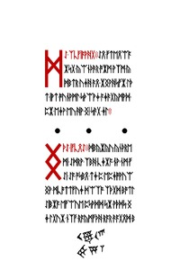</a>

**Key:** ?

Runes:

    ᛞᛇ•ᛉᚳᚠᛁᚪᚹᚻᚷ
    
    ᛇᛟ•ᚠᛏᛖᛟᛠᚪᛡᛋᚷ•ᚣᛠᚾᚦᚫᚱ•ᚩᛡᛗ•ᚹᛉᛗ•ᚣᛞᛒᛏᚱ•ᚢᛄᚻ•ᚫᛟ•ᛡᛝᚹᚻᛋᚠᛡ•ᛚᚦᛏ•ᛁᚹᛏ•ᚩᚢᚾᚹᛗᛚ•ᛋᚦᛠᚹᛄ•ᚪᛄᚫᚷᚣᛗᚹᛞ•ᛈᛡ•ᛖᛄᚹ•ᛖᚢ•ᚻᚹ•ᛝᛁ•ᛋᚫᚷ•ᛄᛚ

## 50.jpg, 51.jpg, 52.jpg, 53.jpg, 54.jpg, 55.jpg, 56.jpg - 33.jpg-39.jpg

<a href="assets/2014/liber-primus-complete/51.jpg">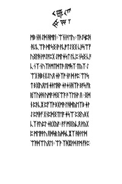</a>
<a href="assets/2014/liber-primus-complete/52.jpg">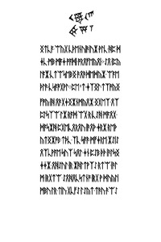</a>
<a href="assets/2014/liber-primus-complete/53.jpg">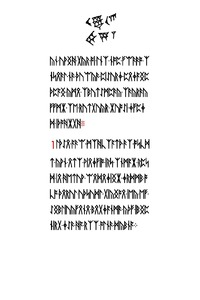</a>
<a href="assets/2014/liber-primus-complete/54.jpg">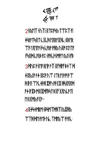</a>
<a href="assets/2014/liber-primus-complete/55.jpg">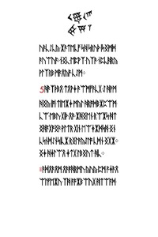</a>
<a href="assets/2014/liber-primus-complete/56.jpg">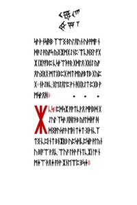</a>

**Key:** ?

Runes:

    ᛝᚦᛇ•ᛁᚠᚳᛟᛇ
    
    ᛞᛒᚣᛡᚣᚢ•ᚣᚾᚦᚱᛖᛗᛁ•ᛇᛞᚱᚹ•ᛉᛒᚻ•ᚳᛄᛡᚪ•ᚾᚹ•ᚾᛗ•ᚠᛇᛁ•ᛇᚪ•ᚩᛋᛒᛟ•ᛏᛄ•ᛈ•ᛖᛈᛄᚩᚹᚢᛠᛝᚹ•ᛗᚳᚩᛏᛏᚠᚢᛄ•ᛞᛠᛉᚩ•ᛉᚦᚷᛞ•ᛒᚩᛏᛚᛇᛁᛒᛡᚪ•ᛖᚠᛠᚢᛖ•ᛈᛋᚹᛞᛞ•ᛋᛡ•ᚹᚦᛞᛋ•ᛝᛄ•ᛚᚷᚢᛡ•ᚾᛉᚠ•ᚱᚪᚣᛗᚠᚦᚻ•ᚱᚪᚱ•ᚫᚪᚷᛟᛞ•ᛒᛗᛒ•ᚾᚻ•ᛇᛞ•ᚻᛗᛚᛁ
    ᛠᚾᛁ•ᚫᛖᚢ
    ᛏᚦᛇᛋᛈᚻ•ᚻᛇᚳᛠᚫ•ᛞᛚᛋᛝ•ᛁᚹ•ᚪᚳᚩᛏᛇᛝᚷ•ᚳᚦᛋᛠᚠᚢᛝᛚᚻ•ᚹᚩᛇᚪᛈᚷ•ᛇᛗᛚᛄᛋᛏ•ᛚᚳᛈ•ᚾᛋᛝ•ᚳᚪᚳ•ᚾᛉ•ᚾᚢᛉᚫᛗᛏᛞᛏᚫ•ᛟᛗᛋᛉ•ᛏᚣᛉ•ᛇᛠᚷ•ᚻᛒᚾᚷᛇᚢᛟ•ᛄᚦᛉᚩ•ᚾᚪ•ᛞ•ᚩᛈ•ᛠᛚᛋᛏ•ᛒᚷᛁᚢᛟᛖᛁ•ᛄᚦᛖᚻᚹ•ᛄᚫᛄᚾᚻᛉᚹ•ᛒᚪᛋ•ᚠᚱᚱᛁᛉᚢᚦᚻ•ᚢᛗᚪ•ᛞᛝᛠᚪ•ᚫᛉᛖᚾᚹ•ᛟ
    ᛝᛞᚾ•ᛈᚫᚳᛡ•ᛈᚠᛉᚩ•ᛒᚷᛗᚫ•ᛚᚻᛞᚣᛖᛉᛒ•ᛄᚹᛇ•ᛈᚩᛁᚦᚠ•ᚷᚾᛈᛞᛝᛏᛖᚪ•ᛄᛋᛠ•ᛈᛝᚢ•ᛒᚷᚳᛉ•ᚪᚢᛈᛚ•ᛄᚱᚷᚣᚪ
    ᚪᚠ•ᛗᛝᚣᚳᛟ•ᚹᚣᚷᛈ•ᛗᛖᚩᚹᚢ•ᛟᛞᛋᚱ•ᚣᛞᛋᚳᛡᛉ•ᚻᚦᚹᛚᛞᛠᚩᛞᛠᚢᛟᛖ
    ᛠᚹ•ᛉᚻᛡᚹᛞ•ᚪᛗ•ᚠᚦᛈ•ᛝᛏᚳᚪ•ᛠᚣᚷ•ᚳᚦᛖᚾᚢᛁᚫᛁᚢᛡ•ᚹᛚᚳ•ᚻᛈ•ᛞᛄᚳ•ᛗᛒ•ᛗᚪᛄ•ᚩᚪᛞᛁ•ᚩᚱᛟᚠᛖᚣᛟᛁ
    ᛇᛟ•ᛁᛈᚣᛚᚪᛡ•ᚳᛏᛠᛋᛖᛒᛝ•ᚫᛟᚫᛞᛖᛞᚣᛡ•ᛠᚪᛖᚦᛚᚫ•ᚳᛋᚪᚩᚷᚹᛚ
    ᛈᛖ'ᛏ•ᛄᛉᛝᛚ•ᛏᛉᚩᚣᛝᚠᚩᚣ•ᛁᚻ•ᛟᚫᚷᛄᛝᛡᚾᛗᚣᛟᛡ•ᛝᚷᛖᛉ•ᛟᛉᛈᛚᛋᛉᛠ•ᛚᛡ•ᚱᚪᛞ•ᛠᚷ•ᚱ•ᚳᛇᚻ•ᛗᚪᛟᚷ•ᛞᚪᛋᛡᚻ•ᛈᚷᛖᚳᛟᚱᛟᚢ•ᛁᚫᛟᚦ•ᛄᚱᛡ•ᚱᛖᚦᚣᛏᛝᛡᚩᛒ•ᛏᚦᚳ•ᛉᚳ•ᛋᚪᚫ•ᛗᚠᛄᚱᛖ•ᛡᛇᛁᛇᛟᛉᚳᚹᚪᛖ•ᛋᚢᛉ•ᛋᛟᛚ•ᛄᚾ•ᛈᛇᛒ•ᚦᚦ•ᛁᚫᛚᛋᛝᛄᛄᛡ•ᛟᚻᛇᚢᛚ•ᛁᚱ•ᛡᚻᛚᛏᚹᛉᛇ•ᚱᛏᛠ•ᛁᚫᛚᛗ•ᛁᚱᚷᛏᛠ•ᛇᛟᚻᛟᚳᛋᛏᚾᚩ•ᛁᚱᚷ•ᚹ•ᛞᚢᚣᛚᛁᛗᛒᚢ•ᛚᚱ•ᛏᛁᚢ•ᚷᚳᚠᛇ•ᛚᛇᚣᛏ•ᛏᚫᚢ•ᚫᛠᛇᚣᚾ•ᚢᚹᛝᚻ•ᚷᚣᚱ•ᚩᛁ•ᛚᚾᛉ•ᚾᚩᛈ•ᚠᛠᚫᚫᚩ•ᛉᚾᛋᛟᚫᛚ•ᚾᚫ•ᚦᚢᛠᚣᚫ•ᛈᛁᛇᚢᚱᛄ•ᛈᛟᛄᚪᛝᛈᚦᛈᚪᛝ•ᚣᛗᛟ•ᛉᛒᚢᛏᛇᛗᛈᚫᚣ•ᛉᚫᚣᚱᚫᚣᚠᚠᛗᛡ•ᛉᛖ•ᚱᚢᛏᚷᚢᚣᚱ•ᛡᚢᚩᛇᛁ•ᛄᚠᛈᛄᛞ•ᛁᚦᚩᚻᛡᚷᚻ
    1 ᛚᚦᛇᛟ•ᚪᚫᛠ•ᛗᛉᚻᚳᛉᚪᛏᚦ•ᚫᛉ•ᚩᛋᚳᛞᛏ•ᚣᚹᚾ•ᛟᛏᛉ•ᚹᛁᛟᛄᚠᛁᚩ•ᛁᚱᛋ•ᛉᚾᛗᚪᛡ•ᚱᛈᛋᛞ•ᛁᛟ•ᚻᛖᛏᚢᚹ•ᛠᛟᛞᛟᛄᛁᛝᛡ•ᛄᚱᛞᛗᛒ•ᚩᚳᚩ•ᚦᛟᚱᚢᛚ•ᚢᚦᛋᚢᛞᛚ•ᚷᛁᚣᛝᚩᛟ•ᛁᛖᚣ•ᛖᚠ•ᛇᛝᛒᛚᛁᚢᚣᚠᛟᚾᛟ•ᛒᛟᚷᛄᚪᚾᛗᚫ•ᚣᚦᚠ•ᛁᛒᛝᛈᚾᛁᚱᚷ•ᛄᛇᚫ•ᚻᚪ•ᚱᛉᛉ•ᚩᛚᚾᚫ•ᛞᚣᛒᚾᚪ
    2 ᚾᚣᛖᛉ•ᚾᚢᛉᛁ•ᛝᛏᛈᚹᛋᚣ•ᛏᛠᛈᛉ•ᚪᛁᛄᛋᚱᚪᛏᛋᛝᛏ•ᚳᚷᚳᚻ•ᛖᛟᚱᚪᛡᚻᚳ•ᛝᛒᛖᚱᛠᚪ•ᛚᛟᛖᛚᚪ•ᚦᛋ•ᚳᚹᚱᚹ•ᚩᚻᚣ•ᚢᛝᚩ•ᛈᛚᛁᛏᚪ•ᚠᛋᛝᛞ•ᚳᚪᚱᛒ•ᚹᛈ•ᚾᚩᚦᚳᚦᚾᛗᚩᛖ•ᚣᛇᚾ•ᚠᛒ
    3 ᛞᚢᛈ•ᚹᚾᛖᚪ•ᚱᛚᛁᚹ•ᚫᛉ•ᛝᚠᛞᚪᚠ•ᛒᛄᛉ•ᛞᛄᛝᚣᛇᚪ•ᚫᛄ•ᛝᛈᚪ•ᚢᛠ•ᛇᛏᚱ•ᛖ•ᚫᛗ•ᚫᛠᚻ•ᛁᚫᛟ•ᛠᚹᚳᛄᚦᚻ•ᛡᚩᚢ•ᚩᚦᚷᛡ•ᚻᛋᚷᚪᛁᛟᛞᚪᛄ•ᛁᚹᛡᛒ•ᛗᛝᛡᛞᚠᛒᛋᛏ•ᛒᚷᚠ•ᚷᛟᚢᚳᚫᛏᛁᛖ•ᚱᚷᛗᚣ•ᚪᚷᚹ
    4 ᛝᛄᛋᛄᛗᚱᛗ•ᚾᛒᛋᛗᛉᛞᚻᛉᛁ•ᚣᛡᚻᚣᛠᛉᚻ•ᛞᛖ•ᚹᛖᚦ•ᚢᚳ•ᛉᛗᚪᚣᛠ•ᚹᚫᚪᚳ•ᚢᚫᚳᛇᚳᚣ•ᛡᚫᛏᛖᚳᚠ•ᛋᚻ•ᛋᚱᚢᚦ•ᛁᛋᛝᛗᛞᚫᚢᛠᚢᚪ
    ᚾᛝᚳ•ᛖᛈᚹᛉ•ᚢᛉᚫ•ᚾᛈᚳᚻᚱᚣᚹᛚᛉᚱᛒ•ᛗᚫᛟᚣᚩ•ᚳᛇᛗ
    5 ᚻᚫᛉᚦᛒᛟ•ᛏᛟᚹᛄ•ᚫᛠᛗᚠᚫᚳᚷ•ᛇ•ᚻᚹᛗᚻᛝᚣ•ᛁᚩᛁ•ᛏᛁᛖᛡᛄ•ᛗᚣᛚ•ᚻᚱᚩᛞᛒᛡᛈᛠᛗ•ᚳᛠ•ᛖᛒᚢ•ᚷᛁᚦ•ᛟᚫ•ᛡᚻᛝᛖᚾ•ᚱᛠᛡᛋ•ᚻᛏᛝᚻᚪᚷᚩᛝᚫ•ᚹᛚᛏᚱ•ᚷᛁᚾ•ᛖᛠᛄᛡᛞᛋᚻ•ᛝᚾᚳᛋᚾᛞᛇᚾᛋᛁᚳᛡ•ᚱᛝᛚᚫᚣᛇᛚᚩ•ᚳᛞᚾ•ᛝᚷᛡ
    ᛝᛄ•ᚻᛄᛚᛠᛟ•ᛄᛏᚷ•ᛚᛒᛝᚢᛏ•ᚻᚳ
    ᚫᛞᛟᚫᛟᛗ•ᛟᚫᚪᚻᚱᛗᚢ•ᚣᚢᚣ•ᛈᛗ•ᚪᛄᚫᛟᛠᛚᚠᛖᛡᚢ•ᛉᚻ•ᚪᚩᛡᛒᛠᚢᚷ•ᚻᛏᛠᚪᛞ•ᛋᚹ•ᚦ•ᚾᛋᛁᚻᛒ•ᛉᛠᛝ•ᛒᚢᛚᛟᚢᚾ•ᚢᚦᚩᛗᚪ•ᚾᛞᚫᛇ•ᚫᚣᚪᛋ•ᚣᛝᛡᛗᚷᛇᚾᛈ•ᛠᚳᚻᛝᛚ•ᚠᚷᛡ•ᛁᛡᚪᚠᛒᛈ•ᚳᛋᚦᛠᚦᚫᚱ•ᚷᛞᛚᛟ•ᚷᚱᛁᛇ•ᚣᚩᛟᚢᛝᚱᚷ•ᛗᛏᚷᛒᛈᚷ•ᛗᛏ•ᛗᚣᚹᛒᛏᛒ•ᚷᚣᛈᚷ
    ᚾᚦᛇᛒᚳ•ᚷᛖᛇᛟᛚᛈ•ᚹᚾ•ᚻᚷᚱᛇᛏ•ᛈᚷᛒ•ᚹᛗᛋᚹᛟᚻ

## 56.jpg - 39.jpg

**Key:** ?

Runes:

    ᛡᚳᛋ
    
    ᛈᛞᛋᛡ•ᚪᚹᛏᚳᚹᛟ•ᛗᚹᛁᛒᛞ•ᚷᛇᚢᛚ•ᛉᛋᚫ•ᛟᚻᛚᚦᛒ•ᚣᚪᛚᛞᚦᚠ•ᚻ•ᛞᛝᚩᚢᛋᚪᚫ•ᛖᚦᛁ•ᛏᛄᛏ•ᛝᚦᚾᚳᛉᛏᛝ•ᚳᛈᛁ•ᚾᛏ•ᛒᚾᛡᚱᛒ•ᚢᛈᛋᚦᛁᚳᛈᛋᛁᚹ•ᚹᛚᚣᚾᚢ•ᛒᛁᚪᛠ•ᚹᛟᚳ•ᛠᚢᚪ•ᛚᚦᚹ•ᚠᚾᛏᚳᛡᛁ•ᛚᚩ•ᚾᛗᛄᛠ•ᚦᛟᛄ•ᚪᚦᚹ•ᛡᚾᛖᛠᛈ•ᛒᛋᛄ

## 57.jpg - 40.jpg

**Key:** ?

Runes:

    ᚠᚾᛗ•ᚣᚷᛞᚫᚻ
    ᚪᛈᛉᚣᚻ•ᛇᛠᚩᛖ•ᛏᛝᛠ•ᛚᛁᛏᚦᚠ•ᛗᚪᚳᛖ
    ᛞᚳ•ᛏᚱᛟᚷᛠᚾᚫᛒᚢᛖᛒᚢ•ᚦᚠᛟ•ᚷᛋᛟ•ᛁᛈ•ᛟᛉᛋᛒ•ᚹᛄᛒᚣᛗᚢᛠ•ᚱᛁᚢᛟᛄᛁ•ᛗᛖᚫ•ᚱᛋᛉᛝ
    "ᛠᛈᛚ•ᛞᚩᛚᛁᛉᛠᛝᛖᚱ"•ᚾᛈᛖᚹᛡ•ᚾᛄᛏᚣ
    ᛋᚩᛋᛏᛝ•ᚢᚾᛇᚪ•ᛖᛏᚪᛄᚳᚣ•ᛟᛒ•ᛚᛋ•ᛒᛞᛄ•ᛁᛝᚣᛖᚳ•ᛄᚻᛚᚣ•ᚷᚫᛚᛞ•ᛚᚫᛚᚦᛉ•ᛚ•ᛖᛉᚩᛉᛁᚳᚢᛗᚾᚢ•ᚩᚾᛇ•ᚻᛡᛚᛇᚩᚫᚪ•ᚩᛟᚩ•ᚣᚱ•ᛖᚠᚢ
    ᛁᚻ•ᛟᛚᚾᛏ•"ᚠᛞᚱᛠᚷ•ᛈᚩᛇᚩᛗᛠᛒ•ᛄᛡ•ᛋᛗᚠ•ᛏᚠᚫᚩ•ᛟᚳᛚᛞᛡᛚ•ᚩᚳᛝᚢ•ᛈᚹᛏ•ᚷᚳᛋ•ᚢᛟᚷᚦ•ᚠᛉᚠᛏ•ᚳᛋᛉᛟ•ᚷᚠᛉᚾᛞ•ᛒᛏᛠᛡ"
    ᛈᛡᛠᛁᚪ•ᛋᚣᛗᛞᚣᛋ•ᛒᛞᛄᛞ
    ᚩᚾᛏᛚ•ᚳᚪᛝ•ᚱᚷᚻᚷ•ᛄᚹᚠ•ᚪᚢᛇ•ᛞᛏᛗᛄᛁ•ᛝᚫ•ᛉᛈᚳᛈᛠ•ᛟᚪᛒᛁᛁᛋ•ᛇᚷᚻᛋ•ᛇᛡᛒ•ᚠᚹᛝ•ᚫᚪᚠᚩᚣᛡᚪᚾᚻ•ᛒᚦᛟᛇᚣᛟᛁᛒ•ᛟ•ᚩᛋᚹ•ᛞᚳᚠᚪᛁ
    ᛉᛏᛟᚢᚩᛟᚦᛈᛋᚩ•ᚻᛇᚦᛝ•ᛏᛠᚠᛝᛠ•ᚩᛗ•ᛏᚠᚣᛚᚣ•ᚹᛚᛞ•ᚪᛉᛠ•ᚪᛄ•ᚩᛋᛒᛚ•ᚳᛖᚾᚪᚩᚱᛏᚦ•ᚱᛒᚳᚣ•ᛠᛗᚹᛚ•ᚻᛈ•ᛇᛈᛖ•ᛚᛄᚩᛡᚪ•ᛖᛋᚫᚩ•ᛠᛉᛝᚣ•ᛖᚫᛒᛗ•ᛖᚻᚱ•ᛈᚾᛗ•ᚹᛏᛟᚣᚢ•ᚠᛉᛈᛗᚩᚷᚾ•ᛡᛇᚳᚠᛒᛈᛗ•ᛋᛇᛁ•ᛖᛈᚢᚱᛏᚳᚣ•ᛄᛚᚠ
    ᚱᛚᚱᚫᛖᚻᛟ•ᛇᚣᛡ•ᚩᛉ•ᚪᛋᚣᛁᛝ•ᛉᛚᛄ'ᚳ•ᛖᚣᚢᛝᚦᛇᚱ•ᛠᛁᚫ•ᚦᚠᛟᚷᛠᛁ•ᛈᛋᛒ•ᛗᛒᛄᚠᚾᚳᛖ•ᚻᚫᚩᛄ•ᛉᛄᛚᛈᚪᛁ•ᛟᚹᚱᛁᚱᚦᛖᛉ•ᚪᚾ•ᛞᛄᚷ•ᛟᛟᚳᛏᛄᛞ•ᛉᚾᛗᚦ•ᛁᛄᚱ•ᛈᛉᚢᚫᚦᛒᚠᛄᚦ•ᚠᚪᛝᛖ•ᚹᚹᚣᛚᛇ•ᚢᚣ•ᚾᚱᚪ•ᛈᚾᚹ•ᛚᚾᛏᛚᚢᛒᚱᛝᚪᛋ•ᚫᛈ•ᛄᛚᚢᚳᚷ•ᛚᛏᛄᚹᛈ•ᚫᛗᛚ•ᛉᛚᛗᛏᛞᚠᛈᛁ
    "ᚠᚳᚦᛗᛄᚹᚱᚪᛚ•ᚩᛝᚱᚢᛈᚱᛟᛡ•ᚳᛉᚱ•ᛇᛏᚦᚾ•ᚱᛇᚫᛞᛟᚻ•ᛒᚾᚣ•ᚠᛡᚪᛡᛖᚫᛞᛄᚢᛖ•ᚦᚱ•ᚩᛇᚱᛡ•ᚣᛁᛉᛇᚻᚩᛠ•ᚫᚻᛡᛝᛠᚦ•ᚾᚣ•ᚾᚠᛁᛝ"
    "ᛏᚻᚹᚫ•ᛒᛇ•ᛡᚻᛉᛒ•ᛞᛝᚱᛄᚦᚻ•ᚪᚷᚣᛁᚠᚷ•ᛁᛏᛞᛠᛒᚠᚩᛈ•ᛇᛡᛟᚹᚱᚾᚩᛏ•ᛋᚹᚢ
    ᛖᛡᛖᛡᚦ•ᛉᚪᚷᛈᚾ•ᛋᚱᚠᛞᛝᚻᛖᛄᛞ•ᛄᛡ•ᚱᚹ•ᚷᛝᚪᛒ•ᛄᛈᛄ•ᛏᚠᛉ•ᚪᛄ•ᛁᚠᛉᚢᚩᚣᚻᚦ•ᚻᚾᛁᛒ•ᛡᛟᛡᛋᛈᚣᛉ•ᛠᚢᛠᛚ•ᚠᛝᛗᚻ•ᚦᛒᚩ•ᛗᛚ•ᚩᛠᛋᚦᛠ•ᛇᛋᛉ•ᚠᛗᛒ•ᚫᛋᛇᚾᛡᚾ•ᚢᚫᚹ•ᛞᛠᚢᚾᛝᚠᚾᛖᚫᚻᛄ•ᛁᛖᛏᛡ•ᚷᛁᚩᚾ•ᚳᚢᚫᛗᛈᛋᚪᛡ•ᚷᛚᚣᚹᛟ"•ᚠᚢ•ᛉᚠᚫᛞᚠᛡᛄᚾ
    ᚻᛋᚦᚠ•ᛏᚠᛄᚱᚹᚠᛋᚾᚹᛄᛖᛒᚢᚦ•ᚩᛇᚫᛈ•ᛡᛟ
    ᚢᛁᚩᛄᚩᛇᛟᛄᛞᚩ•ᛈᚹᛞᚷᚱ•ᚠᛟ•ᛇᚷ•ᛄᛟᛇᚫᛋᚫᚣ•ᛒᛏᛞᛟ•ᛠᚻᛡᚱᛠᛠᛉᛋ•ᚠᚾᚣᚱᚠ
    ᚪᚾᛡᚪᛖᚫ•ᚳᛇᛁᛝ•ᛒᛡᛞᛠᚫᛒᛠᚳᛉᚠ•ᚫᛏᛁᚱᚪᛗᚩ•ᛚᛉᛋᚪ•ᛒᚩᛈᚫᚩᛝᚻᛇᛖᛇᚫ•ᚻᛖᛇᛠ•ᚱᛗᛞ•ᚫᛇᛗ
    ᚾᚾᚣᛡ•ᚱᚾᛗᛠ•ᛄᛉᛋᛄ•ᛟᛖᛒ•ᛏᚻᚾ•ᚠᚪᚠ•ᛒᚾ•ᚩᚾ•ᛖᛋᛏᛒᚹᛡ
    ᚻᛏ•ᚩᛟᚩ•ᛒᚾᛖᚳᛁᚹᚣᛟ•ᛟᚩᛒ•ᛋᛖᚩ•ᚫᚻᛟᚠᚫᚷᚩᛄ•ᛟᛒᚻ•ᚳᛖᛁᛚᚫᚣᛚ•ᚢᛚᛁ•ᚾᛟᛏ•ᚫᛈᛟᛈᛝᛗ•ᚳᚢᛁ•ᚣᛋᚳᚢᛡᛇᚩ•ᚠᛖ•ᚷᛟ•ᚻᚫ•ᛝᚠ•ᛗᚠᛝᛉᛞᛁ•ᛗᛝᚣᚪᛝᚠᛉᛁᛟᚷᛚ•ᛇᚩ•ᚫᛡᛏ•ᛄᛏᛠᚢ•ᚷᚦᚣ•ᚦᚾᛟᚣᚩᛖᚻ•ᛁᛋᛖᚣᚦᚪᛡᛝᛟᛇᛚ•ᛡᛏᛝ•ᛁᛚ•ᚠᛉᛡᛠᛏ•ᚠᚾᛄᚠᚻᚳ•ᚻᛞᛠᚣᛟᛝ•ᛉᛇᚻᚩᛋᚻ
    ᛇᛏᚠ•ᛚᚱᛇᚦᚪᛁᛁ•ᛒᚠᛁᛚ•ᛄᛡᛒᚣᛗᚫᚫ•ᛞᚻᛟ•ᚪᚹᛉᛚᛏᛁᚪ•ᛟᛞᛖᚾᛈᚻᚣ•ᚦᛚᛖᛋᛖᛟᚫᛖ•ᛏᚱᚪ•ᛁᚫᚹᚫ•ᛋᛈᚱ•ᛄᛡᚪᛏ•ᚫᚦ•ᚠᛠᚢᛈᚣᚫᛝ•ᚣᚾᚻᛡ•ᚳᛗᚠᚾ•ᛞᛄ•ᛖᚩ•ᛒᚷᚻᚪ•ᛖᛞᛟᚠᛇᛞᛟ•ᛈᚳᛁᚪᛒᚷᛒᛈᛟ•ᛟᛄᚠᚪᛖ•ᛄᚣᚩᛄ•ᚣ•ᚫᛋ•ᚦᛁᚫᛄᚫᛏ•ᛖᛇᚻᛟ•ᚣᚠᚹᛞᚷ
    ᛡᚱᛒᚢ•ᛒᛚᚢ•ᚷᛈᛄᚪ•ᛏᛡ•ᚳᛄᚠᛡᛝᛚᚣᛒ•ᛗᚻ•ᚱᛚᛟᛠᛋᚦᛝ•ᛏᚳᛟᛉᛁ•ᛄᚱᚳᛖᛏᛄᚷ•ᛡᛈᛏᛉᚩᛁᛄᛟ•ᚷᚩᚪᚢ•ᚣᛖᚪᛋᛟᛇᚢᚪᛡ•ᛗᚱᛚᚳᚠ•ᛒᛗᛝ•ᚻᛉ•ᛠᛄᚫ•ᛉᚪᚷᚻᚣᛏᛖᛝ•ᛉᛉᛗᚾᚫᛋ•ᚱᛗᛞᛋᚳ•ᚦᛚᛟ•ᛝᛇᚢ•ᚻᚩ•ᛏ
    ᚢᛁᚦᛄᚾᚠᚱᚦ•ᛋᛟᚷᛠᛗᚪ•ᛝᛚᚪᛁᛒᛠᚢᛋ•ᚩ•ᛖᛋᛝ•ᚠᛡᚢᛟᛞᛇᚪ•ᛞᛡᛒᚹᚩ•ᛄᛋ•ᛟᛝᛏᚳ•ᚻᚾᛇᛋ•ᛗᛚᚻᛞᛖᛈ•ᚫᛄᚱᚪᚢᚻᚱᚦᚱ•ᛟᛄ•ᛟᛗᚩᛟᛏ•ᚫᛇ•ᛉᛒᚳ•ᛄᛁ•ᚪᚩᛉ•ᚹᚪᚾᛈᛏᚢᚣ•ᛁᛒᚢ
    ᚦᚩᛡ•ᛗᚳᚠᛉᚱᛁ•ᚪᛗᛏᛒ•ᛗᛚᛁᚦᛏᛠᛋᚾᚷᛚ•ᛏ•ᛇᛈ•ᚩᛚᛞ•ᛚᚹᚳᛄᚹᛉ•ᚪᛡᚹᛇ•ᛖᛖᚹ•ᛏᚪ•ᚣᚠᛉᚳ•ᛗᚩᚷᛞᚷ•ᛚᚳ•ᛒᚣᛋᚣᚠᛞᚣᛝ•ᛠᛇᛏᚩᚢᚫ•ᛟᛁᛒ•ᛏᚾᚫᚠ
    ᛄᛟᛗᚾᛈ•ᛠᛡᚩᛏᛡᚪᚱᛞ•ᚪᛝᛈᚹᛗᛄᛟᛠᚩ•ᛚᚹᛉ•ᚱᛗ•ᚩᛏᚹᛄᚹᚾ•ᚷᚳᛠ•ᛄᚳᚢᚱ•ᛟᛇᛟᚾᚻᚫᛉ•ᚣᛚᚩ•ᚩᛡᚳᚻᛄ•ᛋᚣᚹᛁ•ᚣᚠᛋᚾᚪ•ᚷᛖᚾᛄᚪᚹᛠ•ᛞᚠᛟ•ᚢᛁ•ᛖᛇᚦ•ᚫᛞ•ᚳᛄ•ᚷᚢᚻᚣᚻᛁᛒᛉᚾ•ᚹᛝᚻᛏᛉᚫᛁᛄᚢ•ᛞᚠᛡᚫ•ᛋᛁᚹᛝᛈ•ᛗᛉᛄᛈ•ᛞᛗᛝ•ᛇᛚᛞᚣ•ᚠᚩᛞ•ᛝᚷᚾᛇ•ᚷᛖ•ᛚᛉᚣ•ᚫᛚᛖᛉ
    ᛡᛝᛋ•ᚳᛁᚦ•ᚷᛏᚣ•ᚹᚩ•ᛝᛖ•ᛒᚪᛗᛏᚪᚷᛒ
    ᛈᛡᛟ•ᚪᛉᛝᛒᛞᛉᛄᚦᚢ•ᛏᛇᛖ•ᚣᚪᚳ•ᛠᚦᚹ•ᛏᛉᚩᚳᛞᛒ•ᛟᚩᛠᚾᚠᚪ
    ᛚᛗᛖᛁᚦᚫᚪᛡᛄᛁᚪᚱ•ᚦᚱᛖᛖᚣᛋᚾ•ᛖᛏᚢᚻᛈᚳᚦᛋ•ᚳᛇᛉᛖᛇᚠ•ᛞᛠᛏᛈ•ᚣᛇᛠᚢᛏ•ᛉᚦᚷᚻ•ᚫᚾᛠᚱ•ᛡᛒᛏᛁᛉ•ᚩᚢᛝ•ᛚᛒᛇᚩ•ᛟᛉ•ᚦᛞᚷᚠ•ᚩᚱᛈᚪᛏ•ᚫᛋᚪᚦ•ᛖᛟᚪᛝᚫ•ᚣᛒᛚ•ᛡᚦᚾᚠᛈᛟᛡᚾ•ᛖᚹ•ᛖᛗᚩ•ᛉᚹᚦᛠ•ᛁᚦᛒᛖᚱ•ᛟᚳᛉ•ᛈᛖ•ᛁᚢᚦ•ᛈᚠᛞᛈᛄ•ᛁᛟᚻ•ᛒᚦᛏᚩᚳᚢᛚ•ᛞᛄᛝ•ᚦᛄᛁᚪ•ᚹᚣ•ᚢᛝᚾ•ᛋᚾᛈᚠᚫᛒᛄᚫ•ᛡᛗᚹ•ᛇᚪᚩᚾᛄᚳᛚᛒᛉ•ᚣᛠᚦᚹ•ᛝᛚᛗᚳᛡᛇᚠᚫᛠᛁᚦ•ᛒᛠᛚᚦᚳᛞᛁᛇ•ᚠᚢᛉᛋᛉᛁᚦᚫᛋᛗ•ᚦᚹ
    ᛈ•ᛒᛋᛏᚫᚾᚱᛁ•ᚦᛇᛡᚱᛚᛡᚹ•ᚢᚩᛋᚱ•ᚹᚫ•ᛒᚹᛡᛖᛟᛄ•ᛡᚣᛖᚩᛖᛡᚷᚫᚠᚾᚹ•ᛟᛏᚫᚠᛄᚹᛠ
    ᚦᛞ•ᛁᚫᚩᚾ•ᛋᚷᛈᚪᛖᚩ•ᚣᚦᚹ•ᚾᚷ
    ᛠᛋᚩᛇᛏ•ᛝᛚᚷᛞ•ᛒᛈᛈ•ᛗᛁᚪᛖ•ᛚᛏᛁ•ᚫᛄᛖ•ᛒᚾᚠᚪᛋᚷᛒᚠ•ᚫᚹᚣᚷᚢᛡᚠᛠ•ᛖᛋᛞ•ᛚᚳᛒᛞᛏᛈ•ᛖᚾᛈᚣ•ᚱᚠᚻ•ᚫᛝ•ᛟᚪᛗ•ᛒ•ᛡᛚ•ᛝᛋᚱᚢᚹᚱᚣᚻᚹ•ᚹᛡᛈ•ᛁᚻᚾᚻᚱ•ᚳᛖᛏᚫᚩᛋ•ᚣᛋ
    ᛝᚫᛡᛝᚫ•ᚻᚦ•ᛇᚪᛞᛋ•ᛒᛁᚳᛈ•ᛇᛒᛟᚫ•ᛠᛝᛖ•ᛝᛠᚣ•ᛒᚣᛉᚻᚢᚠᚦᛞᚹ•ᛗᚢᛁᛡᛄᚩ•ᛋᛇᚫᛇᛝᚱ•ᛚᛇᛠ•ᛏᚩᛄ•ᚩᛝᛈ•ᚱᚻᛠᚢᛉᚦ•ᚣᚢᛋ•ᛡᛚᛖᚷᛗᛝᚹᚻᚱᛋ•ᚢᛟᚣᛠᚷᚩᚷ•ᛇᛁᛖ•ᛠᛄᛇᛁᚾᛄᚩᛗᚱᛡᛉ•ᚠᚻᚳ•ᚪᚩᚪᚫᚻᚳᛁᚦ•ᛄᚷ
    ᛝᛖᚢ•ᛡᛏᛁ•ᛚᚩᚱᛈ
    ᚠᚪ•ᛈᛞᚱᛒ•ᛝᛁᛋ•ᚷ•ᚠᚾᛈᚠᛒ•ᛟᚦᛁᛠᚪ•ᛡᛏᚾᚳ
    ᚦᛟᚻᛈᛖᛚᚫ•ᛟᚠᛗ•ᛡᛝ
    ᛒᛝᚦᛝᛠᚠ•ᛇᛗᛟ•ᚩᛠᛈ•ᛁᛡᚱ•ᚹᚹᛟᚩᛒᚩ•ᚾᚩᛄᛟᚾ•ᚦᛡᚠ•ᚩᛄᛞᚦᛏᛁ•ᛈᚾᚪᚱᛄ•ᛉᚱᚣ•ᛝᛡ•ᛏᛗ•ᛈᛞᚣᚻ•ᛗᛝᚫᚳᛇ
    ᛡᚣᛄᛟ•ᛝᚩᚢᛇᛁᚱ•ᛏᚪ•ᚩᚻᚪᛚᚫᛚᚪ•ᛋᛈ•ᛏᚪᛄᚳᚦᚢᛏᚹᚦ•ᛗᚷᛖᛗᚣᛡᛁᛞ•ᚢᛋᚠᛒ•ᛟᛚᛟ•ᚪᛒ•ᚦᛚᚣ•ᚳᛠᚣ•ᛞᛇᛁ
    ᚹᛉ•ᛟᛝᛒᚢᛋᛞᚻᛞ•ᚢ•ᛠᚱ•ᚫᚩᚻᛝᛒᚪᚹ•ᛈᛡᚾᛚᛇ•ᛖᛟᛝ•ᛡᚠᛇᛡ•ᚳᚦᚹ
    ᛚᚦᚪᛁᛈ•ᛞᛟᛄ•ᚢᛉᚢᚾᛠᚠ•ᚩᚾᚪ•ᚱᛠᚷ•ᛗᚢ•ᛗᛁᛄᛒᛗᚱᚾᛗ•ᚩᚾᚠᚣ•ᛗᚠᛇᚠᛄ•ᛒᛡᛈᛄᛖᛡᛏ•ᛈᛟᚫᛏᛟ•ᚻᛖᚾ•ᚳᛇᚩ•ᛋᚻᚫᛇ•ᛝᛁᛟ•ᛇᚠᚢᛞᚣᚪᛚᚠᛡ•ᛖᛄ•ᚠᛚᛟ•ᛁᚳ•ᛁᛝᚷᚦ•ᛗᛋᚫᚷᚪᛠ•ᛗᛁ•ᛒᛡᛏᚾ•ᛝᛗᚦ•ᛏᚣᚫᛄ•ᛖᚻᚠᚪᛡᚷ•ᚪᛗᛁ•ᛞᛉᛏ•ᚢᛖᚦᚾ•ᛖᚪᛈᚹᛠᛚ•ᛒᚢᚱᛡᛟ•ᚪᚣ•ᛟᛇᚹᛄᛈᛞ

        [base60]

    ᚹᚹᛈ•ᚠᛡᛚᛉᛒᚾ•ᚳᛗᚾᚱᛗ•ᚻᚦᚫᛞᛄ•ᛒᛡᚫ•ᛇᚹᛗᚢ•ᚪᛈᛡ•ᛈᛁᛄ•ᚪᚢᚾᛠᛖᛞᛗᚪ•ᛏᛟᛗ•ᛋᛞᛝᚷᛚᛋᛞᛝ•ᛟ•ᛋᛄᛞ•ᛚᛟᚠᛄᚫᚠᚪ•ᛝᛟᚣᛈ•ᚣᚩᛒᚷᚳᛖᛏᚹ•ᚪᛋᛒ•ᛗᛠᚣᛇᛗᚫᛚᚱ•ᚹᛇᛄᛒ•ᛈᛚᚠᛈ•ᚠᛗ•ᛝᚪᛇᚾᛟᚹᛇᛉ•ᚣᚫᛉᛞᛟᚱᛒ•ᛡᚱᛟ•ᚹᛏᚷᚱᛄᛖ•ᛠ•ᛈᛚᛞ•ᚻᚦᚱ•ᚦᚣᛚᛉ•ᛠᛈᚫᚠᚪ•ᚫᚪᛒ•ᛈᛋ•ᛗ•ᛏᚫᚳᛈᛝᚹᚦ•ᚻᛠ•ᛞᚩᛄᚷ•ᛋᚩᛠᚳᛖᛋ•ᚣᛖᚫ•ᛈᚦ•ᛁᛇᛈᚳᛝ
    ᛈᚳᛇᚢᛏᚳᛡᛇᛝᚾᚢᚻᚦ•ᚣᚠᛗᚾ•ᛝᚠᛄᛉᛟᚱᛗ•ᛝᛠᛄᛏᚳ•ᚢᚷᚦ•ᚠᚦᛋ•ᚪᛈᚩᚪᚫᛞᛋᛝ•ᛒᛗᚩᚷ•ᚹᚠᛗᛖ•ᛠᛇᚻᚠᚻᚳᚱᚫ•ᛝᛗᛉᚳ•ᛋᚪᚹᛋᛠ•ᚩᚣᛚᛉᛝ•ᛠᛟᛉᛟᛠᛡᛝᛒ•ᛝᚳᚫᛁᚱ
    ᛒᚠ•ᛏᚣᚣ•ᛠᛒ•ᚣᛚᚩ•ᛇᛉ•ᚩᚷᛗᚩ•ᚠᛚᛟᛝᚦᛠ•ᚦᚣᛖᚣ•ᚾᚷᚾ
    ᛡᛏ•ᛄᛟᚾᛁ•ᛋᛟ•ᛠᚦᚣ•ᛋᛒ•ᚫᛚᚪᛄᛡᛖᚷᛉᛡᚾᛉᛏ•ᛡᛒᚻᛚᚷ•ᚢᚦᛠ•ᚢᚾᛁᚩᛗᛠᛁᚷ•ᛟᚦᚱᚣ•ᛒᛖᛠᚩᛈ•ᛗᛏᚱᚫᚢᚻᛁᛝ•ᛇᚳᚠ•ᛄᚾᚱᚷ•ᛟᚷᚻᚣᚻᛇᚫᛠᚫᚣ•ᚢᛗᛈ•ᛉᛁᚢᚾᚩᛟᚾ•ᚷᛞᚦ•ᛡᚫᚹ•ᛞᛟᛖᚱ•ᛗᚾᛖᚻᚷᛒᚢᛄ•ᚢᚦᛗᛖᛞᛝ•ᛒᚷᚣᚱ•ᛖᛁᚢᛄ•ᚣᛡᛚᚢ•ᛄᛟ
    "ᛠᛉᚣᛇᚱ•ᚩᛈᛋᚳᚫᛗᛇ•ᚾᛄ•ᛖᚠᛋ•ᛖᚠᚪᛝ•ᚢᛝᛄᛇᚷᚠᛝᚱᛁᚦ•ᛄᚢᚫ•ᚣᛋᚠᛖᚢᛋᚫᚣᛠ•ᛁᛏᛟᚱᛏᛟᚩ•ᚷᚾᚻ•ᛞᛗᚩᚳᛞᛖᛏ•ᚹᛉᛞᛚ•ᚩᚫᛄ•ᛇᚢᛒ"•ᛗᛏ•ᛞᛗᛖ
    ᛏᛈᚹᛇᛋ•ᚹᛒᛇᚦ•ᚾᚻᚷᛄ•ᚱᛡᛞᛡᚦᚪᛁᛇᚫᛉᛚ•ᛇᛠ•ᛡᚪᛄ•ᚻᚱ•ᚦᛈᛞᛄᛝᚩ•ᚷᚠᛇᛗᚳ•ᚻᛞᚩᛏᚳ•ᚢᚱ•ᛈᚾ

## 58.jpg-64.jpg - 41.jpg-47.jpg

## 65.jpg - 48.jpg

Outguess:

    Outguessing the image yields 58,2kB garbage output.

## 66.jpg - 49.jpg

base60:

    3N 3p 2l 36 1b 3v 26 33
    1W 49 2a 3g 47 04 33 3W
    21 3M 0F 0X 1g 2H 0x 1R
    1n 3I 2r 0P 2U 16 2L 2D
    1t 1s 3H 0d 0s 1K 2D 05
    1K 1O 0S 1D 3o 1l 3J 1G
    4D 0G 0l 0x 1Q 2p 2a 1K
    4E 1w 2Q 19 1k 3G 24 0p
    22 4F 0P 3C 3J 1D 2n 1m
    2i 1J 3P 2v 1s 2O 0k 1M

dec (<http://korn19.ch/coding/base_converter.php>):

    203 231 167 186 97 237 126 183
    92 249 156 222 247 4 183 212
    121 202 15 33 102 137 59 87
    109 224 173 25 150 66 141 133
    115 114 197 39 54 80 133 5
    80 84 28 73 230 81 199 76
    253 16 21 59 86 171 156 80
    254 118 146 69 106 196 124 51
    122 255 25 192 199 73 169 108
    164 79 205 177 114 144 46 82

Outguess:

    none

## 67.jpg - 50.jpg

base60 (wrong!!!):

    2M 0w 3L 3D 2r 0S 1p 15
    3V 3e 3I 0n 3u 1O 0u 0Z
    3g 2U 1C 0Y 1N 3n 0W 3Q
    22 13 0V 3c 0E 34 0W 1t
    1D 2N 3H 47 0s 2p 0Z 34
    0g 3v 1Q 0s 0D 0K 2h 3D
    3L 2x 1Q 20 2n 2L 1C 2p
    0A 29 3r 0D 45 0k 2e 2W
    25 3U 1W 2r 46 2s 2X 39
    3p 0X 0E 1q 0q 4B 49 48
    3r 3b 3C 1M 1j 0I 4A 48
    40 3m 4E 0s 2S 1v 3T 0I
    3t 2B 2k 2t 2O 0e 2l 1L

dec:

    142 58 201 193 173 28 111 65
    211 220 198 49 236 84 56 35
    222 150 72 34 83 229 32 206
    122 63 31 218 14 184 32 115
    73 143 197 247 54 171 35 184
    42 237 86 54 13 20 163 193
    201 179 86 120 169 141 72 171
    10 129 233 13 245 46 160 152
    125 210 92 173 246 174 153 189
    231 33 14 112 52 251 249 248
    233 217 192 82 105 18 250 248
    240 228 254 54 148 117 209 44
    235 131 166 175 144 40 141 81

Outguess:

    none

## 68.jpg - 51.jpg

base60:

    28 2a 0J 1L 0c 3C 2o 0X
    00 2Z 2d 1T 2u 1t 1j 0l
    1o 1E 3T 18 3E 1G 27 0L
    0v 2t 06 11 1A 2U 4B 1O
    2M 3d 2S 0x 0w 0q 0p 2V
    18 0q 1D 49 2O 00 1v 2t
    1k 3s 3G 21 3w 0W 29 2r
    2O 2L 0g 3Y 0M 0u 3I 3C
    1r 2c 2q 3o 30 0a 39 1K

dec:

    128 156 19 81 38 192 170 33
    0 155 159 89 176 115 105 21
    110 74 209 68 194 76 127 21
    57 175 6 61 70 150 251 5
    142 219 148 59 58 52 51 151
    68 52 73 249 144 0 117 175
    106 234 196 121 238 58 129 173
    144 141 42 214 22 56 224 192
    113 158 172 230 180 36 189 80

Outguess:

    Outguessing the image yields 58,2kB garbage output.

## 69.jpg - 52.jpg

Outguess:

    Outguessing the image yields 58,2kB garbage output.

## 70.jpg - 53.jpg

Outguess:

    Outguessing the image yields 58,2kB garbage output.

## 71.jpg - 54.jpg

**Key:** ? (71.jpg - 72.jpg)

Runes:

    ᚪ•ᛗᛝᛞᛡᚦᛉᛁᛗ
    
    ᛡᛞᛈᛝᚢᚹᚪᛗ•ᛏᚪᛝ•ᛝᚦᛡᚹᛋᚻ•ᛁᚳ•ᚫᛈᚫᚷᚩ•ᛗᛁᚪ•ᛖᚩ•ᛏᚹᚩ•ᚠᚣᚢᛏᛄ•ᚦᛄᛠᛖᚳᚾᛠ•ᚳᛠᛖ•ᚱᚩᚢᛉ•ᛞᚹᚻᛒᛝᚠᚪᚳᛄᚢ•ᚩᛄᛡᛠᛁᛚᚷᚻ•ᛒᚢᛄ•ᛉᚪᚳᚹᛡ•ᛗᚩᛈᚣᛞᛡᛚᛈ•ᛇᛁᚦᚱ•ᚣᚷᛗ•ᛉᛟᚷᛋ•ᛗᛈᛄᛟᛞ•ᛟᛏᛡᛟ•ᛏᛝᛁ•ᛗᛝᚣᚪᚫ•ᛝ•ᚱᚣᛄ•ᚾᛚᚢᛉᛒ•ᚻᛈᛄᚩᛠ•ᚷᚫᚹ•ᛉᛋᛞᚳ•ᚢᛏ•ᛟᚻᛇᚾᛈᛏ•ᛠᚣᛒᚢᚷ•ᚷᚪᛇ•ᚾᚷᚩᛖᛚᛗᛒᚦ•ᚣᛡᛟᛇᚣ•ᛗᚳᛟᚦ•ᛖᛚᚱᛇᛈᚱᛞᚣ•ᛉᛞ•ᛝᚣᛈ•ᛋᛖᛉᚹ•ᚳᚷᚠᛞᚱᛖ•ᛞᛖᚹᚩᛇᛟ•ᚻᚩᛟ•ᛒᛋ•ᚻᛠᚪᚳᛁᛗᛉᛄᛗᛖ•ᛗᛚ•ᚷᚩᛏᚦᛉᛖᛠᚱᚷᚣᛝ•ᚫᛗᛁᚹ•ᛋᛒ•ᛉᛗ•ᛋᛇᚷᛞᚦᚫ•ᚠᛡᚪᛒᚳᚢ•ᚹᚱ•ᛒᛠᚠᛉᛁᛗᚢᚳᛈᚻᛝᛚᛇ•ᛗᛋᛞᛡᛈᚠ•ᛒᚻᛇᚳ•ᛇᛖ•ᛠᛖᛁᚷᛉᚷᛋ•ᛖᛋᛇᚦᚦᛖᛋ•ᚦᛟ•ᚳᛠᛁᛗᚳᛉ•ᛞᛄᚢ•ᛒᛖᛁ

Outguess:

    Outguessing the image yields 58,2kB garbage output.

## 72.jpg - 55.jpg

Outguess:

    none

## 73.jpg - 56.jpg

**Key:** phi(prime). Shift down forward Gematria.
Note: Every clear text F is an ᚠ (F), and needs to be skipped.

Runes:

    ᚫᛄ•ᛟᛋᚱ
    
    ᛗᚣᛚᚩᚻ•ᚩᚫ•ᚳᚦᚷᚹ•ᚹᛚᚫ
    
    ᛉᚩᚪᛈ•ᛗᛞᛞᚢᚷᚹ•ᛚ•ᛞᚾᚣᛄ•ᚳᚠᛡ•ᚫᛏᛈᛇᚪᚦ•ᚳᚫ
    
    36367763ab73783c7af284446c
    59466b4cd653239a311cb7116
    d4618dee09a8425893dc7500b
    464fdaf1672d7bef5e891c6e227
    4568926a49fb4f45132c2a8b4
    
    ᚳᛞ•ᚠᚾ•ᛡᛖ•ᚠᚾᚳᛝ•ᚱᚠ•ᚫᛁᚱᛞᛖ•ᛋᚣᛄᛠᚢᛝᚹ•ᛉᚩ•ᛗᛠᚹᚠ•ᚱᚷᛡ•ᛝᚱᛒ•ᚫᚾᚢᛋ

English:

    AN END
    
    WITHIN THE DEEP WEB TH
    ERE EXISTS A PAGE THAT HA
    SHES TO
    
    36367763ab73783c7af284446c
    59466b4cd653239a311cb7116
    d4618dee09a8425893dc7500b
    464fdaf1672d7bef5e891c6e227
    4568926a49fb4f45132c2a8b4
    
    IT IS THE DUTY OF EUERY PILGR
    IM TO SEEK OUT THIS PAGE

Outguess:

    none

## 74.jpg - 57.jpg

**Key:** Substitution with default Gematria.

Runes:

    ᛈᚪᚱᚪᛒᛚᛖ
    ᛚᛁᚳᛖ•ᚦᛖ•ᛁᚾᛋᛏᚪᚱ•ᛏᚢᚾᚾᛖᛚᛝ•ᛏᚩ•ᚦᛖ•ᛋᚢᚱᚠᚪᚳᛖ
    ᚹᛖ•ᛗᚢᛋᛏ•ᛋᚻᛖᛞ•ᚩᚢᚱ•ᚩᚹᚾ•ᚳᛁᚱᚳᚢᛗᚠᛖᚱᛖᚾᚳᛖᛋ
    ᚠᛁᚾᛞ•ᚦᛖ•ᛞᛁᚢᛁᚾᛁᛏᛖ•ᚹᛁᚦᛁᚾ•ᚪᚾᛞ•ᛖᛗᛖᚱᚷᛖ

English:

    Parable : like the instar tunneling to the surface.
    We must shed our own circumferences. Find the
    divinity within and emerge.

Outguess:

    none

# Magic Squares
http://ijact.org/volume2issue3/IJ0230052.pdf
